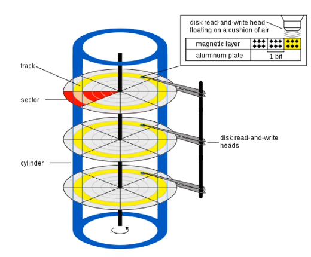
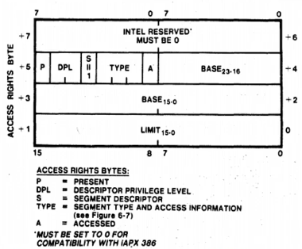
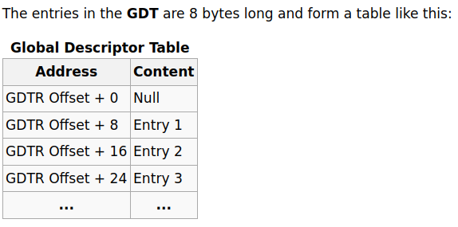

% Kernel Development

This is based on a [course](https://dragonzap.com/course/developing-a-multithreaded-kernel-from-scratch?coupon=YOUTUBEKERNEL2022) which guides the reader through the development of a full OS kernel, from a Hello World Bootloader to a multitasking kernel with a FAT16 file system. The first 11 lessons are available for free on [YouTube](https://www.youtube.com/watch?v=HNIg3TXfdX8&list=PLrGN1Qi7t67V-9uXzj4VSQCffntfvn42v)

## What is memory?

<div class="tufte-section">
<div class="main-text">

Memory is a piece of hardware that allows computers to store information. Programs can read and write to _Random Access Memory_ (RAM). It's only used for temporary storage, such as for variable storage of the programs you write. RAM is wiped when you shut down the computer. _Read Only Memory_ (ROM) does _not_ vanish when you shut down the computer. But as the name suggests, you can't write to it. In a home PC, the BIOS program is stored in ROM.

Memory is generally accessed in a linear fashion. The data is stored in order. The way your processor accesses memory abstracts this.

</div>
<div class="sidenotes">
</div>
</div>

## The Boot Process

<div class="tufte-section">
<div class="main-text">

The boot process has three steps:

1. The BIOS<sup>1</sup> program is executed from ROM/BIOS Chip
2. The BIOS loads the _Bootloader_ into memory address `0x7C00`
3. The Bootloader loads the Kernel

When the computer is switched on, the CPU will read from the BIOS ROM and start executing instructions it finds there. The BIOS usually loads itself into RAM for performance reasons and will continue to execute from there. The BIOS also identifies and initializes the computer's hardware, such as disk drivers.

The final thing the BIOS does is try to find a Bootloader. It searches all available storage mediums - USB drives, hard disks - for the magic boot signature `0x55AA`. It will look in the last bytes of the first sector<sup>2</sup>, and if the signature is found, it will load that sector into address `0x7C00`, and the CPU will start to execute from that address.

When a computer first boots, it does so in _"Real Mode"_. This is a very limited 'compatibility' mode, with access to only 1Mb of memory, and it can only execute 16 bit code. The Bootloader is a small program whose job is to put the computer into _"Protected Mode"_, which allows 32 bit code and access to 4Gb of memory, and then to load the kernel of an operating system.

The BIOS contains routines that the bootloader uses to boot the kernel. The interfaces of BIOS routines are generic and standardized across manufacturers.

</div>
<div class="sidenotes">
<sup>1</sup> Basic Input Output System


<sup>2</sup> A sector is a block of storage. For example, a hard disk is made up of 512 byte sectors. The BIOS will look in the byte addresses 511 and 512 of the sector.
</div>
</div>

## Getting setup for Kernel development

<div class="tufte-section">
<div class="main-text">
All development will be done on Ubuntu Linux. First, make sure your repositories are up to date. Then, install nasm<sup>1</sup>. Finally, we will use the QEmu emulator to run our bootloader and kernel. Test that it runs using the below commands. A new window will pop up, but since there are no disks attached it won't be able to boot.

```
sudo apt update
sudo apt install nasm

sudo apt install qemu-system-x86
qemu-system-x86_64
```

</div>
<div class="sidenotes">
<sup>1</sup> NASM is the "Netwide Assembler", and assembler for the x86 CPU architecture, compatible with nearly every modern platform. https://nasm.us
</div>
</div>

## Assembly language

<div class="tufte-section">
<div class="main-text">

This is a short refresher on what assembly language is. Or, for me, basically an introduction to it, since I've never written it before.

Your processor has an _instruction set_, or machine codes. Assembly language gets passed through an _assembler_, and machine codes your processor understands come out the other side. Use [Emu8086](https://emu8086-microprocessor-emulator.en.softonic.com/) to easily test assembly programs.<sup>2</sup>

Write the following program in your emulator:

```assembly
mov ah, 0eh
mov al, 'A'
int 10h
```

This is a program that outputs 'A' to the screen. `mov X Y` moves data Y to register<sup>3</sup> X. `ah` ("Accumulator High") and `al` ("Accumulator Low") are registers storing one byte. So here we move `0eh`<sup>4</sup>  into `ah`, and the character 'A' (65) into `al`. `int X` means _"interrupt with code X"_. The code `10h` outputs things to the screen<sup>5</sup>.

So we have a program that outputs a _character_ to a screen. Now we need to output multiple characters. Here is our next program.

```assembly
jmp main

message: db 'Hello World!', 0

print:
    mov ah, 0eh
._loop:
    lodsb
    cmp al, 0
    je .done
    int 10h
    jmp ._loop
.done:
    ret

main:
    mov si, message
    call print
```

The first thing to point out is that assembly always executes top-to-bottom unless you specifically tell it to jump to somewhere else. This is done with _labels_. These are the words that end with colons, like `main:`. For example `print` is a subroutine, and when it is called with `call print`, the program will start executing at this point.

The line `message: db 'Hello World!', 0`, puts a block of data representing the bytes 'Hello World!' at the starting memory location (`db` mean data bytes I think). The zero at the end is the 'null' terminator. We have to put `jmp main` above that, otherwise the processor will try to execute the data, which it will think are instructions.

Main has been changed to move register `si` ("Source index", used as a data pointer) to the address of our message. The it calls `print`. The `print` subroutine is an elaboration on the "print character" code. The first instructions are the `lodsb` ("load string byte"), which loads the character at `si` into `al`, and increments `si`, moving it to the address of the next character. `cmp` "compares" the value in `al` to 0, and if it is 0 (meaning we are at the end of the string), it jumps to done and returns. Otherwise it jumps back to the loop label

</div>
<div class="sidenotes">
<sup>2</sup> For linux users, it works fine with Wine.

<sup>3</sup> A register is a storage location in the processor.

<sup>4</sup> `0e` in hex, 14 in decimal

<sup>5</sup> Specifically, 10h is a _BIOS routine_: A function that is defined in the BIOs, and can only be used in compatibility mode.

</div>
</div>

## Real Mode

<div class="tufte-section">
<div class="main-text">

### Turning our hello world program into a hello world bootloader

Next we will turn our "hello world" program into a bootloader. That is, the program will be loaded by the BIOS and, when we boot the machine, it will show "Hello World!" on the screen.

Create a new folder / project _PeachOS_. Make a new file _boot.asm_, and add the following code:

```assembly
ORG 0x7c00
BITS 16

start:
    mov si, message
    call print
    jmp $

print:
    mov bx, 0
.loop:
    lodsb
    cmp al, 0
    je .done
    call print_char
    jmp .loop
.done:
    ret

print_char:
    mov ah, 0eh
    int 0x10
    ret

message: db 'Hello World!', 0

times 510-($ - $$) db 0 ; Pad to 510th byte
dw 0xAA55 ; dw=define word. Puts bootloader signal
```

This is very similar to our non-bootloader code. There are a couple of organizational changes (`print_char` has been extracted into a subroutine, things have been moved around a bit), and a couple that are required to make this function as a bootloader. `ORG 0x7C00`  sets the 'origin' or 'starting location' where your program is loaded into memory. Bootloaders are always loaded to `0x7C00`. `BITS 16` tells the processor that it should interpret the program in 16bit mode ("Real Mode", or "Compatibility Mode"). The last two lines pad out the program with zeros, and then put the value `0x55AA` (the 'signal' that this is a bootloader) to the last 2 bytes of the sector.<sup>1</sup>

Assemble your bootloader and boot it with

```bash
nasm -f bin ./boot.asm -o ./boot.bin
ndisasm boot.bin #look at the machine code
qemu-system-x86_64 -hda ./boot.bin
```

</div>
<div class="sidenotes">
<sup>1</sup> Note that we say `0xAA55` in the code. This is because bytes are loaded 'backwards', with `55h` being loaded first.
</div>
</div>

### Working with the Segmentation Memory Model

<div class="tufte-section">
<div class="main-text">

We have seen that the pointer registers in the processor are 2 bytes. That means your instruction pointer for example, which is 2 bytes, can point to memory locations _(addresses)_ between bytes number 0 and (2^16) 65,535. However we've seen that in real mode, the processor has access to 1Mb of memory, or 1,048,576 bytes. How can we get our pointers to point to values above 65,535?

The answer is the _Segmentation Memory Model_. Memory is accessed by the combination of a _segment_ and an _offset_. This is what the _segment registers_ are for. There are 4 in the 8086: Code segment `cs`, Data segment `ds`, Extra segment `es` and Stack segment `ss`. The segment and offset can be combined to calculate the _absolute offset_ (the actual memory location in RAM) by multiplying the segment by 16 (A left shift in hex) and adding the offset<sup>1</sup>. For example, if your segment is `0x7C0` and your offset (instruction pointer) and origin are both zero. The absolute memory address your program will start executing at is `0x7C0 * 16 = 0x7C00`. If your offset is `0xFF`, the absolute address will be `0x7CFF`. If segment is `0xF000` and offset is `0xFFFF`, the absolute memory address is `FFFFF`, or 1,048,575. This is how you address a megabyte of memory using two 16bit registers. Note that this model means that you can get to an address in multiple ways. For example, if your segment is `0x7CF` and offset is `0x0F`, the absolute address is also `0x7CFF`.

Different instructions in the processor's instruction set use different combinations of registers to determine which absolute address to look at. For example, `lodsb` which we've already seen uses the data segment register and the source index register (shorthanded to `ds:si`).

Segment registers can be used in source using the following convention:

```assembly
mov byte al, [es:32]
```

This will move the byte located in `es:32` into `al`.

One thing we need to do with our bootloader is to make sure all the segment registered are initialized to the values we want. The BIOS and interrupts can sometimes mess with these. Change the origin to 0. Give a `jmp` instruction to `0x7c0`, which changes the instruction pointer. Change data and extra segments to `0x7c0`. Change the stack segment to `0x00` and the stack _pointer_ to `0x7c00`.

```assembly
ORG 0
BITS 16

jmp 0x7c0:start

start:
    cli ; clear interrupts
    mov ax, 0x7C0
    mov ds, ax
    mov es, ax
    mov ax, 0x00
    mov ss, ax
    mov sp, 0x7c00
    sti ; enables interrupts again
    mov si, message
    call print
```

To reiterate what our code is now doing:

1. The CPU (running the BIOS) finds the value `0x55AA` in our binary 'hard drive'
2. It loads that sector (0-512 bytes) into RAM starting at address `0x7c00`, and starts executing
3. The first instruction jumps to `0x7c0:start`<sup>2</sup>

</div>
<div class="sidenotes">

<sup>1</sup> Note that `ORG` or origin is also factored in.

<sup>2</sup> Frankly I don't get why - isn't this redundant?

</div>
</div>

### Interrupts and the Interrupt Vector Table

<div class="tufte-section">
<div class="main-text">

Interrupts are like subroutines that you call through 'interrupt numbers' rather than memory addresses. There are interrupts in the BIOS - we saw `10h 0eh` prints a character to the screen - or they can be set up by the programmer. Interrupts are special because they halt the processor, save the current state (meaning what? the registers?) to the stack, execute the interrupt, then restore the pre-interrupt state. 

The code for these interrupts are stored in RAM. The locations of the code are stored in the _interrupt vector table_<sup>1</sup>, which starts right at the beginning of RAM at address `0x00`. There are 256 entries in numerical order, `0x00` to `0xFF`, and each contains a 4 bytes: a 2 byte OFFSET and a 2 byte SEGMENT. This means you can calculate the location in the IVT of any interrupt code with `code * 0x04`. Interrupt `0x13` is at `0x46`.

The processor can throw exceptions with interrupts. For example, if you try to divide by zero in an Intel processor, it will call interrupt 0.<sup>2</sup>

In the following code, we _replace_ interrupt 0 with our own subroutine, by replacing the entries in the IVT to point to the subroutine in memory. Running our bootloader in this state will cause the screen to show `AHello World!A` - the first `A` comes from our manual call to the `int 0`, and the second comes from our attempt to divide by zero, which causes the processor to run interrupt 0.

```assembly
start:
    ; snip
    mov word[ss:0x00], handle_zero ; Set offset to handle_word address
    mov word[ss:0x02], 0x07C0      ; set segment to 0x07c0 

    int 0 ; call interupt 0

    mov si, message
    call print

    mov ax, 0x00
    div ax ; try to divide by 0

    jmp $

handle_zero:
    mov ah, 0eh
    mov al, 'A'
    mov bx, 0x00
    int 0x10
    iret

; snip
```


</div>
<div class="sidenotes">


<sup>1</sup> All of this only applies to Real Mode. In Protected Mode, an "Interrupt Descriptor Table" is used instead. More on this later

<sup>2</sup> wiki.osdev.org/exceptions is a great resource for learning more

</div>
</div>

### Reading from disk

<div class="tufte-section">
<div class="main-text">

Next we will see how we can read data from a hard disk. Note that we're not talking about accessing _files_. Files and the file system are implemented in the Kernel. Or to be more specific, the disk is 'formatted' with a particular file system data structure (FAT, EXT4 etc.), and the kernel has drivers which are able to interpret that data structure as files. As far as we are concerned, the disk consists of blocks of data called _sectors_<sup>1</sup>. A sector consists of 512 contiguous bytes. These sectors are read and written in sector blocks, not by accessing individual bytes.

The old way of addressing disk sectors is the _Cylinder Head Sector_ (CHS) system. This is from when disks were spinning magnetic plates arranged in cylinders. You need to specify the cylinder, head, sector and track you want to read from. This was pretty complicated, and it is no longer really used. The modern way is called _Logical Block Address_ (LBA). In LBA you just specify the sector number you want to get. LBA 0 is the first sector on the disk, etc.<sup>2</sup>

### Some housekeeping before we actually read from the disk

First create a text file and put in it whatever you want. This is going to be the thing that gets read from the disk. Create a _Makefile_<sup>3</sup>.

```make
all:
	nasm -f bin ./boot.asm -o ./boot.bin
	dd if=./message.txt >> ./boot.bin
	dd if=/dev/zero bs=512 count=1 >> ./boot.bin
```

The first line is same assemble command we've already been using. The second line puts the content of _message.txt_ onto the end of our binary, and the third pads the binary out with null characters until it's 512 bytes, and therefore a valid sector. You can type `make` at the command line to compile the project. You can see the content of the binary with `hexdump -C ./boot.bin > hex.txt`, and opening the text file.

### Time to actually read from the disk

We'll be using interrupt `13h/02h`: "Disk - Read Sectors into Memory". Looking at the expected register values that [Ralph Brown](http://www.ctyme.com/intr/rb-0607.htm) provides<sup>4</sup> we can get to the follow code:

```assembly
    mov ah, 02h
    mov al, 1
    mov ch, 0
    mov dh, 0
    mov cl, 2
    mov bx, buffer
    int 0x13
    jc error ; if carry flag is set, meaning load failed

    mov si, buffer
    call print

; snip to end of file

error_message: db 'Failed to load sector', 0

times 510-($ - $$) db 0 ; Pad to 510th byte
dw 0xAA55 ; dw=define word. Puts bootloader signal

buffer:
```

Here we set up the registers as they need to be to read our message from the 2nd sector (`cl`) of the disk into the `buffer` label in memory<sup>5</sup>. Then we call the interrupt `0x13`. `jc` handles the error condition.

</div>
<div class="sidenotes">

<sup>1</sup> We already encountered sectors when talking about how the bootloader is loaded.



<sup>2</sup> Since you can only read in sectors, to calculate a specific place on the disk using LBA you need to calculate the sector and the offset. This is simply a matter of getting the quotient and the modulus. So to get to byte 58376 you calculate the LBA sector by `58376/512=114`, and the offset as `58376%512=8`

<sup>3</sup> Make is a language unto itself, intended to simplify the compilation of project with multiple files.

<sup>4</sup> `AH` = 02h, `AL` = number of sectors to read, `CH` = cylinder number, `CL` = sector number, `DH` = head number, `ES:BX` -> data buffer. Return: `CF` set on error

<sup>5</sup> Note that the data is put into `ES:BX`, the Extra Segment. We have set this to `0x7c0`, which is the right place.
</div>
</div>

## Protected Mode

<div class="tufte-section">
<div class="main-text">

Up to now we have been working in "Real Mode" or "Compatibility Mode". This is a very limited mode which the processor initially boots into. It executes 16 bit instructions and registers, can only address 1Mb of RAM, and has no memory protection.

Our next step will be to change into _"Protected Mode"_. We move to 32bit instructions and registers, and have 4Gb address space. Most importantly it significantly changes the memory model, and _protects_ that memory, limiting how programs can access memory and hardware. _Ring 0_ is the most privileged, and is where the kernel operates. There are few limits imposed here. You put the processor into _Ring 3_ when running user applications, limiting them to changing memory in their own 'block', preventing them from accessing hardware directly, and limiting the instructions they can run, such as IO.

User programs communicate with the kernel by causing an interrupt. The interrupt will pass control to the kernel, which will switch back to Ring 0, do what it has to do, then pass control back to the user application after switching back to Ring 3.

### Memory schemes change when you are in Protected Mode

In Real Mode, our memory scheme was the Segmentation Model, using the 16bit segment registers to address memory. Protected Mode uses the _Paging Model_. The paging model is an abstraction on top of physical memory. You work with 'virtual' blocks (pages) of memory that map back to different physical locations in RAM. As a result, different programs can 'believe' they are loaded at the same address, so they don't need to think about where other programs are, because they can't see or access them. Programs are effectively sandboxed to the memory space that the kernel has assigned them.<sup>1</sup>

We also switching from using segment registers to _selector_ registers for addressing memory. Each selector points to a data structure which describes a memory range and the permissions of that range.


</div>
<div class="sidenotes">




<sup>1</sup> Any virtual and physical address need to be divisible by 4,096, which is the basic block size.


</div>
</div>

### Switching to Protected Mode

<div class="tufte-section">
<div class="main-text">


We will use the instructions per the [OSDev wiki](https://wiki.osdev.org/Protected_Mode). The instruction called `lgdt` is the critical one. This stands for "Load Global Descriptor Table".

```assembly
cli            ; disable interrupts
lgdt [gdtr]    ; load GDT register with start address of Global Descriptor Table
mov eax, cr0 
or al, 1       ; set PE (Protection Enable) bit in CR0 (Control Register 0)
mov cr0, eax
 
; Perform far jump to selector 08h (offset into GDT, pointing at a 32bit PM code segment descriptor) 
; to load CS with proper PM32 descriptor)
jmp 08h:PModeMain
 
PModeMain:
; load DS, ES, FS, GS, SS, ESP
```
The [_Global Descriptor Table_](https://wiki.osdev.org/Global_Descriptor_Table) (GDT) contains entries telling the CPU about memory Segments. The GDT contains pointers to GDT Entries - the descriptors themselves. The GDT entries describe the memory and the access rights. While we will need to set this up, we're going gloss over a lot of the detail and use default values, because our kernel is going to use paging, meaning after a point this will no longer be relevant. The following is the relevant code, which starts after the `start` block.

```assembly
.load_protected:
    cli
    lgdt[gdt_descriptor]
    mov eax, cr0
    or eax, 0x1
    mov cr0, eax
    jmp CODE_SEG:load32 ; we'll define what CODE_SEG is later

gdt_start:
gdt_null:
    dd 0x0
    dd 0x0

; offset 0x8
gdt_code:     ; CS should point to this
    dw 0xFFFF ; Seg Limit first 0-15 bits
    dw 0      ; base first 0-15 bits
    db 0      ; base 16-23 bits
    db 0x9a   ; access byte
    db 11001111b ; hi+lo 4bit flags
    db 0

; offset 0x10
gdt_data:     ; DS/SS/ES/FS/GS
    dw 0xFFFF ; Seg Limit first 0-15 bits
    dw 0      ; base first 0-15 bits
    db 0      ; base 16-23 bits
    db 0x92   ; access byte
    db 11001111b ; hi+lo 4bit flags
    db 0

gdt_end:
gdt_descriptor:
    dw gdt_end - gdt_start-1
    dd gdt_start
```

Starting from the `gdt_start` label: The first entry in the GDT is `NULL`. The two `dd 0x0` creates  a "null segment" 8 bytes/64bits of nulls. From `gdt_code` we create our entry, which is the selector which will link to our _Code Segment_. Again, don't worry too much about what these are for now, they are basically default values. The access byte is a bitmask containing flags. We put in another entry, `gdt_data`, which will be linked to all of our other Segments: Data, Stack, Extra, and two General Segments, G and F. It's identical with the exception of the access byte. 

Next we provide some descriptors, firstly the size of our GDT, and secondly the location of the GDT in the program. These will be used by `lgdt`. Finally we set up our `load_protected` block. This loads the GDT, defaults the control register `cr0` to `0x1` if null, and jumps to `CODE_SEG:load32`.

Before actually writing `load32` we need to do a couple of things. One thing we need to change is our origin, which is our offset. Currently this is set to 0. Previously this was fine, since we jumped straight to where the code was being loaded in memory: segment `0x7c0`. Now, however, our GDT descriptor will point to `0:gdt_descriptor`. So change the ORG to `0x7C00`. A couple of other things will need to change in sympathy. We also want to define `CODE_SEG` and `DATA_SEG`, which will point to entries in our GDT.

```assembly
ORG 0x7C00 ; changed from 0
BITS 16

CODE_SEG equ gdt_code - gdt_start ; defines CODE_SEG as the offset from GDT start
DATA_SEG equ gdt_data - gdt_start ; same for DATA_SEG

jmp 0:start ; absolute 0x7c0 (start is at 0x7c05)

; since our origin is now 0x7c00, our segments need to 0x00 (???)
start: 
    cli 
    mov ax, 0x00
    mov ds, ax
    mov es, ax
    mov ss, ax
    mov sp, 0x7c00
    sti 
```

Now for `load32`. First, change into 32bit mode. Here we mostly just setup registers (Code segment register is already set by the origin?). We also point the stack frame/stack pointer registers `ebp` and `esp`.

```assembly
[BITS 32]
load32:
    mov ax, DATA_SEG
    mov ds, ax
    mov es, ax
    mov fs, ax
    mov gs, ax
    mov ss, ax
    mov ebp, 0x00200000
    mov esp, ebp
    jmp $
```

### Testing

We can test this with the GNU Debugger, gdp. You might need to install it.

```bash
$ gdb
(gdb) target remote | qemu-system-x86_64 -hda ./bin/boot.bin -S -gbd stdio
```

Enter `c` to continue, your `qemu` should boot. Send a `SIGINT` with `Ctrl+c`. You should see: `Program received signal SIGINT, Interrupt. 0x0000000000007c5b in ?? ()`. This indicates the program is currently executing at RAM location `0x7c5b`. If you type `layout asm`, you can see the value in memory at `0x7c5b`, and see that it is the infinite jump `jmp $` at the end of our load routine. You can also type `info registers` and see that your code segment register is set to 8, and the other ones to 16 (`0x10`).

You are now in protected / 32 bit mode! Note that this means you can't talk to the BIOS directly anymore.

### Enabling A20 Line

The [A20 Line](https://wiki.osdev.org/A20_Line) is necessary to access the 21st bit (bit 20) of any 32bit/4byte block. The reason that this is disabled by default is some obscure compatibility issue, which isn't important. You can read more about it at the above link if you want. The method for doing this is very simple: 3 instructions in the `load32` section. The `in` and `out` instructions read and write to processor bus respectively. Test this with gdb.

```assemly
    ;snip
    mov esp, ebp

    ; enable A20 line
    in al, 0x92
    or al, 2
    out 0x92, al

    jmp $
```

</div>
<div class="sidenotes">



</div>
</div>

## Building a C Compiler

<div class="tufte-section">
<div class="main-text">

Assembly is all well and good, but it's a pain to write an OS using it. Ideally we want to write it in C. To do this, we need a C compiler, which will turn C into Assembly and then into machine code. We will be compiling the GCC compiler. We can't use GCC directly, because it's compiled for linux. What we need is a [_cross compiler_](https://wiki.osdev.org/GCC_Cross-Compiler). That page has a full guide, and the video goes through the steps, so I won't replicate it here, but bear in mind it takes a **long time**, like 1 hour plus.

Next we need to write a build script that will make working with C directly easier by setting the path variable. Create a `build.sh`, and add the following, and make it executable with `chmod +x build.sh`.

```bash
#/bin/bash
export PREFIX="$HOME/opt/cross"
export TARGET=i686-elf
export PATH="$PREFIX/bin:$PATH"

make all
```

The rest of this section is going to revolve around breaking out our kernel into it's own file. We'll end up with a `boot.asm` and `kernel.asm`, and then we will combine the output binaries of these two into an `os.bin`, which will be our final image, with the bootloader being the first sector and the kernel being the remainder, with the booloader loading the kernel into memory.


```ld
ENTRY(_start)
OUTPUT_FORMAT(binary)
SECTIONS
{
  . = 1M;
  .text : 
  {
    *(.text)
  }

  .rodata :
  {
    *(.rodata)
  }

  .data :
  {
    *(.data)
  }

  .bss :
  {
    *(COMMON)
    *(.bss)
  }
}
```

Don't worry too much about what all this does for now, but in summary we are saying that our sections (and therefore our kernel) will start at memory address `1M`: address at 1Mb, 1,048,576 in decimal or 100,000 hex.

Next we modify our makefile so it builds the whole project:

```make
FILES = ./build/kernel.asm.o

all: ./bin/boot.bin ./bin/kernel.bin
	rm -f ./bin/os.bin
	dd if=./bin/boot.bin >> ./bin/os.bin
	dd if=./bin/kernel.bin >> ./bin/os.bin
	dd if=/dev/zero bs=512 count=100 >> ./bin/os.bin

./bin/kernel.bin: $(FILES)
	i686-elf-ld -g -relocatable $(FILES) -o ./build/kernelfull.o
	i686-elf-gcc -T ./src/linker.ld -o ./bin/kernel.bin -ffreestanding -O0 -nostdlib ./build/kernelfull.o

./bin/boot.bin: ./src/boot/boot.asm
	nasm -f bin ./src/boot/boot.asm -o ./bin/boot.bin

./build/kernel.asm.o: ./src/kernel.asm
	nasm -f elf -g ./src/kernel.asm -o ./build/kernel.asm.o

clean:
	rm -f ./bin/boot.bin
	rm -f ./bin/kernel.bin
	rm -f $(FILES)
	rm -f ./build/kernelfull.o
```

Again, the details of how make works are not in scope of this course, but in summary we are building the kernel asm into an `asm.o` (an "object file"), building that into a `kernel.bin` using gcc and our linker, building `boot.bin` and finally combining those two bins into `os.bin`. Note in particular the `-g` flag that is used a couple of times. This will allow us to use debugging symbols later on. Note also the padding of nulls we add to the end of `os.bin`: out to 100 sectors of 512 bytes. This will allow our kernel to grow without us having to change anything.

Back in `kernel.asm`, there is a reference to `DATA_SEG`, but this is no longer defined. So add it in. Recall that the addresses correspond to the entries in the Global Descriptor Table. The `global _start` corresponds to our `ENTRY(_start)` in the linker:

```asm
[BITS 32]
global _start
CODE_SEG equ 0x08
DATA_SEG equ 0x10

_start:
    mov ax, DATA_SEG
    ; snip
```

### Next we need to write a driver and load the Kernel into memory

We need to load the Kernel into memory. Given we are now in protected mode, we can't access the BIOS function like we did earlier, so we need to write a quick disk driver, which will tell our bootloader how to interact with the ATA Protocol disk controller by spitting data onto the processor bus. Add the following to your `boot.asm`. Don't worry too much about the detail beyond the comments

```asm
[BITS 32]
load32:
    mov eax, 1         ; LBA: starting sector we want to load from disk, 1
    mov ecx, 100       ; sector we want to load to, because we wrote 100 sectors of nulls in make
    mov edi, 0x0100000 ; 1Mb in hex, where we want to load our Kernel into RAM 
    call ata_lba_read  ; load the kernel to memory
    jmp CODE_SEG:0x0100000 ; jump to the memory address to where we loaded the kernel

; this is like a 'dummy disk driver' to load our kernel. We'll write a proper one in C later
ata_lba_read:
    mov ebx, eax ; backup LBA
    ; Send highest 8 bits of LBA to hard disk controller
    shr eax, 24   ; shift eax 24 bits to the right
    or eax, 0xE0  ; selects the master drive
    mov dx, 0x1F6 ; port on the Hard Disk
    out dx, al

    ; Send total sectors
    mov eax, ecx
    mov dx, 0x1F2
    out dx, al

    ; send some more bits to the disk controller
    mov eax, ebx ; restore backup LBA
    mov dx, 0x1F3
    out dx, al

    mov eax, ebx
    mov dx, 0x1F4
    shr eax, 8
    out dx, al

    ; send upper 16 bits of LBA
    mov eax, ebx
    mov dx, 0x1F5
    shr eax, 16
    out dx, al

    mov dx, 0x1f7
    mov al, 0x20
    out dx, al

    ; read sectors
.next_sector:
    push ecx

    ;checking if we need to read
.try_again:
    mov dx, 0x1f7
    in al, dx
    test al, 8
    jz .try_again

    ; read 256 words at a time
    mov ecx, 256
    mov dx, 0x1F0
    rep insw ; input word from port per DX into memloc ES:EDI - we've set EDI to 1Mb
    pop ecx
    loop .next_sector
    ; end of reading sectors into memory
    ret
```

### Alignment and solving alignment issues with C code and ASM.

</div>
<div class="sidenotes">
</div>
</div>


<div class="tufte-section">
<div class="main-text">
</div>
<div class="sidenotes">
</div>
</div>


<div class="tufte-section">
<div class="main-text">
</div>
<div class="sidenotes">
</div>
</div>


<div class="tufte-section">
<div class="main-text">
</div>
<div class="sidenotes">
</div>
</div>


<div class="tufte-section">
<div class="main-text">
</div>
<div class="sidenotes">
</div>
</div>


<div class="tufte-section">
<div class="main-text">
</div>
<div class="sidenotes">
</div>
</div>


<div class="tufte-section">
<div class="main-text">
</div>
<div class="sidenotes">
</div>
</div>

## Bits, byte, binary and hex

* A bit is a single binary digit 0 or 1.
* 2 binary digits can represent 4 unique values: `00`, `01`, `10`, `11`
* n binary digits can represent 2^n unique values.
* 4 binary digits can represent 2^4 = 16 unique values
* 8 binary digits can represent 2^8 = 256 values.
* 8 bits, represented by an 8 digit binary, is a byte, which can take one of 256 values.
* A hex digit can take the values `0-F`, or 16 possible values
* A single hex digit is equivalent to 4 binary digits
* Two hex digits (`00` to `FF`) represent 16^2 = 256 values. Therefore 2 hex digits represents one byte.
* 4 hex digits (`0000` to `FFFF`) represent 2 bytes, or 16 bits.
* Each memory location can hold a single byte, or 2 digit hex number.
