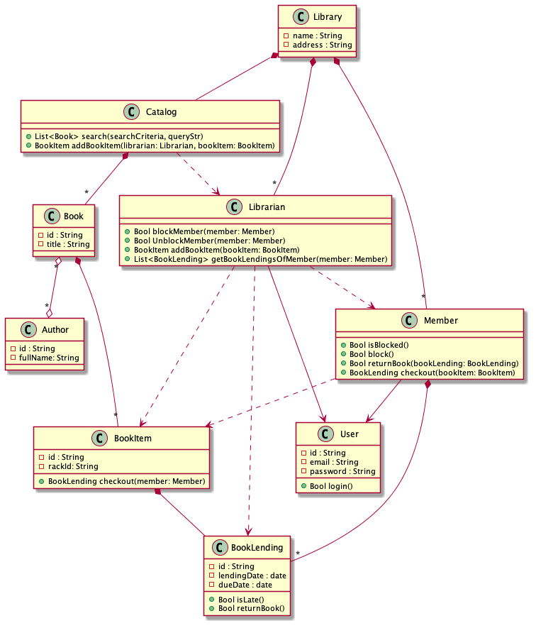
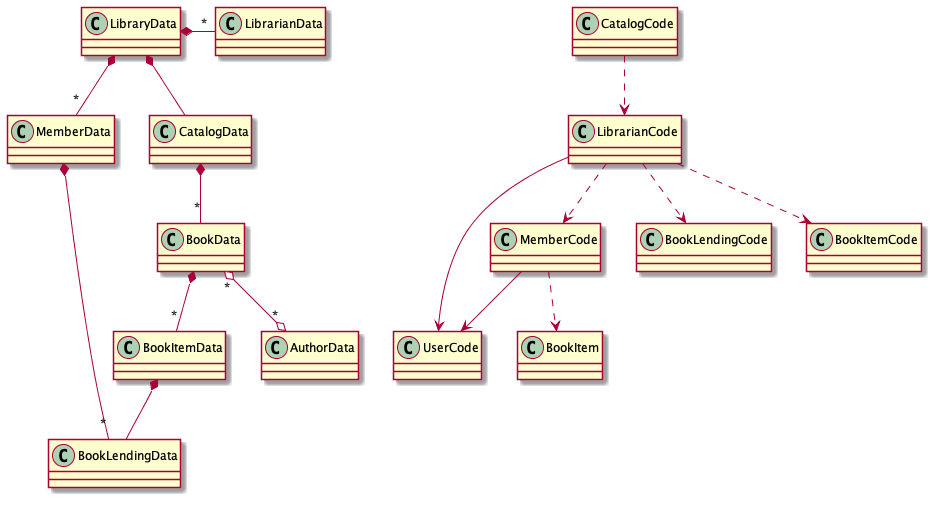

= Notes on Data Oriented Programming, by Yehonathan Sharvit

https://blog.klipse.tech/data-oriented-programming-book.html

== What is DOP?

[quote]
Tao that can be spoken of is not the Tao.

the purpose of our book is to illustrate what is DO. After reading the book, you will know what is DO without the need for an abstract definition of it.

=== OO vs DO

OO: 
* Domain modelled with objects/classes
* state with methods to access/modify state
* methods can only be used on those objects (_specific_)

DOP: 
* Domain modelled with generic collections of immutable values
* Functions are also generic - work on those generic data structures
* Avoids mutability
* Avoids coupling of data and code

=== Benefits of DO over OO

. Immutable data, so no need to 'guard' mutation
. Immutable data, so easy to parallelize
. Generic/open collections are easier to compose/grow
. Generic structures are more transparent
. Generic structures (and functions that act on them) are more reusable
. No 'blueprint' (class) required for every aggregation of data
. untangles value from identity
. Easy serialization/deserialization for storage/wire transfer

=== FP vs DO

Common ground in immutability, lack of objects/methods, first-class functions.

FP rebels against OO idea that behavior should be encapsulated in objects.

DO rebels against OO idea that you need to specify blueprints for data structures in advance. (Haskell, OCAML etc. don't do this).

=== DO in OO

* Model with open collections
* Model with immutable values
* Write static methods

== Complexity of OO

.OO and complexity impact
|===
|OO Feature |Complexity impact

|Mixed code/data
|Mutability
|Mutability
|Data locked in objects
|Code locked in classes

|Many relations
|Hard to reason about state
|Hard to parallelize
|Hard to serialize
|Hierarchies
|===

OO langs mitigate with features and frameworks. 

=== Library example

Model the following in OO paradigm:

. Two kinds of users: library members and librarians
. Users log in to the system via email and password.
. Members can borrow books
. Members and librarians can search books by title or by author
. Librarians can block and unblock members (e.g. when they are late in returning a book)
. Librarians can list the books currently lent by a member
. There could be several copies of a book

Notes about this design:

* distinguishes between association and composition. 
  * With composition (solid diamonds), when one object dies, the other one dies also (e.g. When a _Library_ dies, it's _Catalog_ dies). AKA 'owns'
  * while in an association relation (hollow diamonds), each object has an independent life (e.g. when a _Book_ dies, it's _Author_ lives on).
* distinguishes between usage relations (dashed lines, e.g. _Librarian->Member_) and Inheritance (solid lines, e.g. _Member->User_)
* From the top:
  * _Library_ has no behavior of its own 
  * _Library_ owns multiple _Members_ and _Librarians_, and one _Catalog_
  * _Member_ and _Librarian_ both inherit from _User_, with a `login()` method
  * _Member_ can `checkout(BookItem)`, `returnBook(BookLending)`
    * Owns multiple _BookLendings_
    * Uses _BookItem_
  * _Librarian_ can `blockMember(Member)`, `unblockMember(Member)`, `addBookItem(BookItem)`, `getBookLendingsOfMember(Member)`
    * Uses _Member_
    * Uses _BookLending_
  * _Catalog_ is responsible for book management. Can `search()`, `addBookItem(Librarian, BookItem)`.
    * Uses _Librarian_
    * Owns multiple _Books_
  * _Book_ has no behavior
    * Associated with _Author_
    * Owns multiple _BookItems_ (i.e. copies of the books). 
  * _BookItems_ can `checkout(Member)`
    * Owns multiple _BookLendings_

==== Code and Data

Just much more complicated than it needs to be. Look at all those relations. You don't need to do it.

Look at _Member_

* Data relation 1: _Library_ owns _Members_
* Data relation 2: _Member_ owns _BookLendings_
* Code relation 1: _Member_ extends _User_
* Code relation 2: _Librarian_ uses _Member_
* Code relation 3: _Member_ uses _BookItem_

What if we split it out? Simpler. What if we split everything out?

We end up with two simpler, orthogonal parts.

(Is this actually true? Doesn't the code need to know the data it operates on and returns in a statically type-checked context?)

==== Mutability

Does this code print the same thing twice?

[source,java]
----
class Member {
      Bool member;

      void displayBlockedStatusTwice() {
         isBlocked = this.isBlocked()
         System.Print(isBlocked);
         System.Print(isBlocked);
    }
}
----

Yes.

What about this?

[source,java]
----
class Member {
      Bool member;

      void displayBlockedStatusTwice() {
        System.Print(this.isBlocked);
        System.Print(this.isBlocked);
    }
}
----

Maybe. It's not guaranteed. Something could have changed it. 

https://blog.klipse.tech/databook/2020/09/25/data-book-chap1-part4.html[Next]