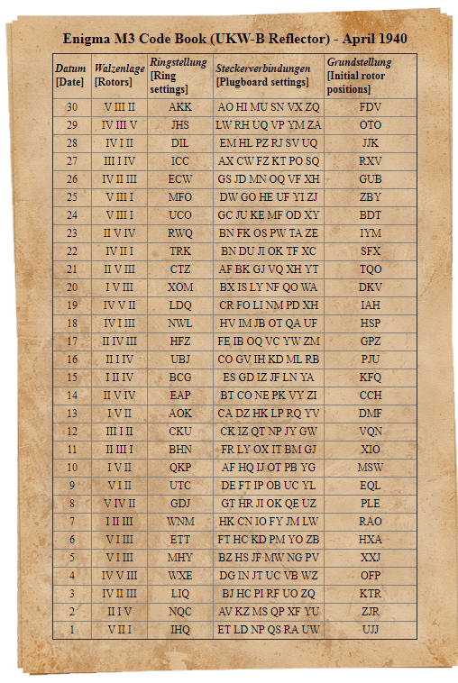
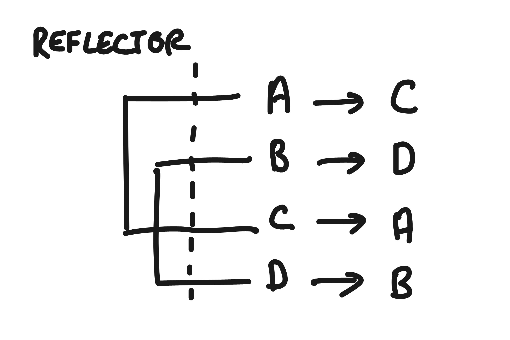
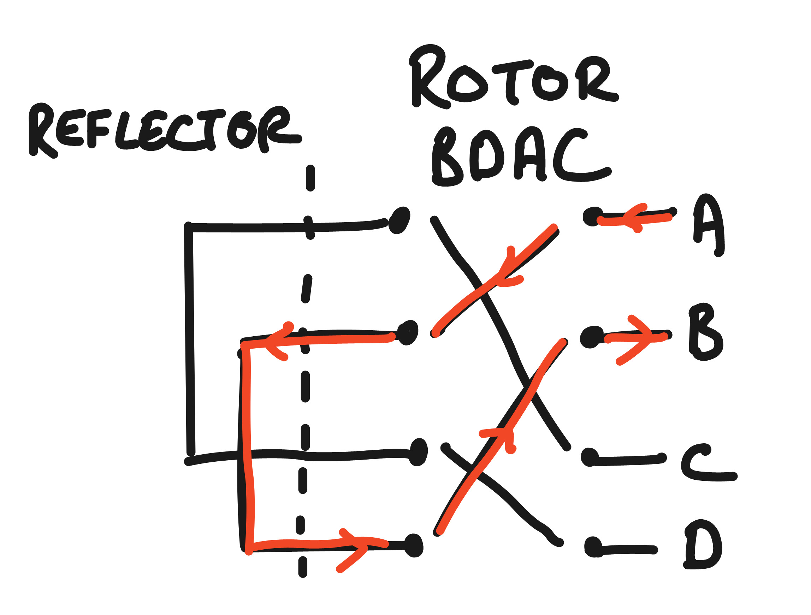
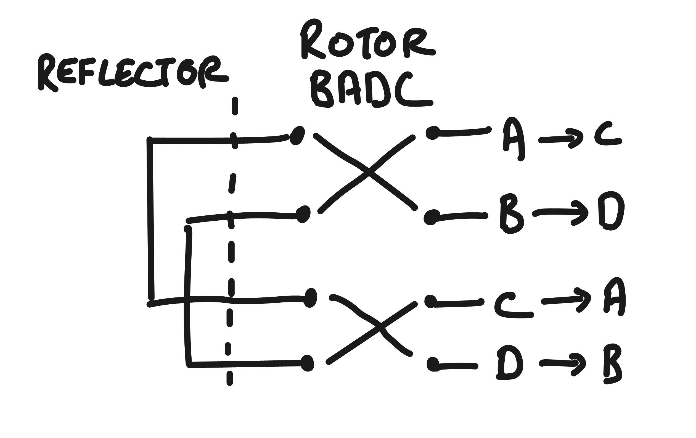
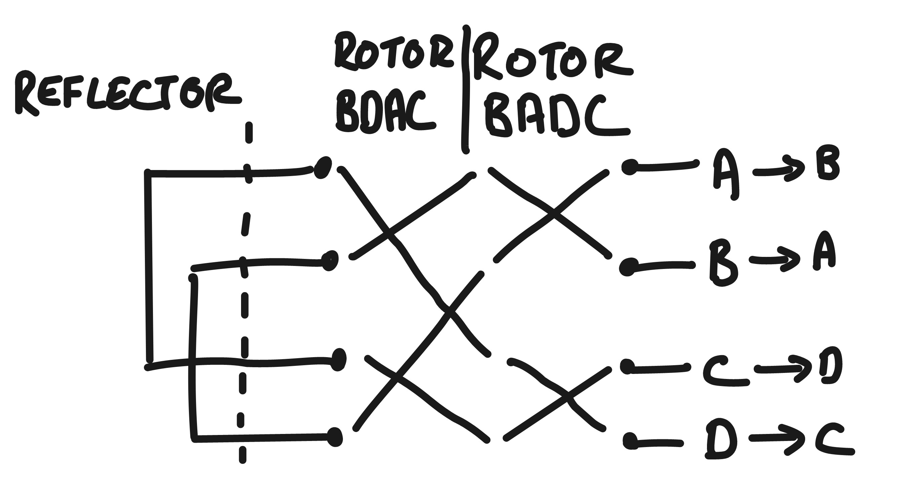
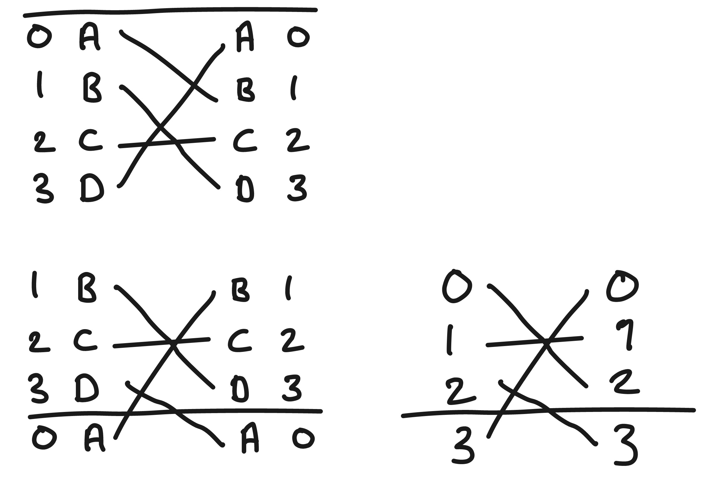
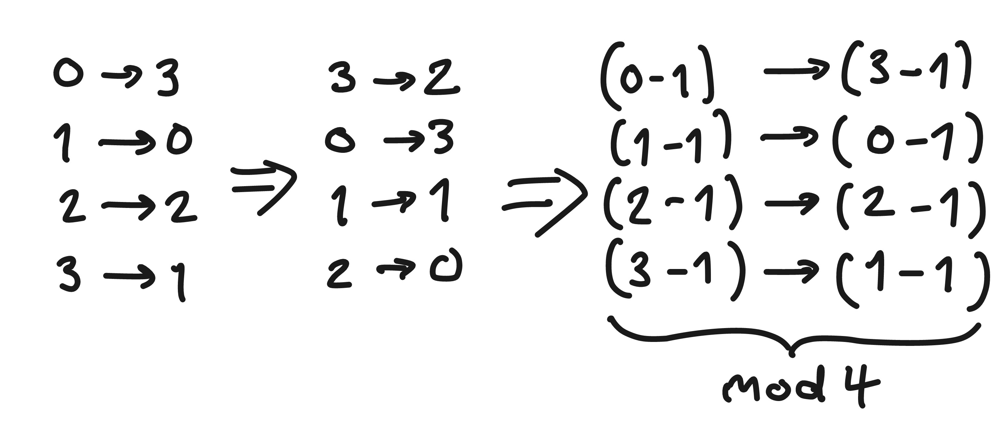
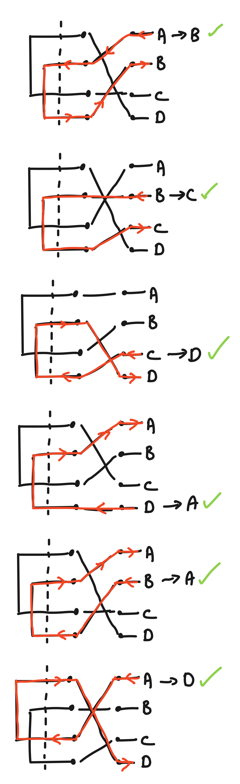

= Let's make an Enigma machine

The story of the enigma machine is famous for it's association with the work of Bletchley Park and Alan Turing in _breaking_ the enigma. Genius mathematicians with the aid of groundbreaking computers achieved the seemingly impossible, enabling the Allies to read the German codes and aiding in the winning of the war.

I want to understand how the Enigma machines actually worked, by building a model of the machine in code.

NOTE: I can't get my enigma to replicate the results of the one https://cryptii.com/pipes/enigma-machine[here]. I assume there's something subtly wrong with my implementation, but I think the overall pieces are correct.

== Operation of the Enigma machine

The enigma machine allows you to encode a message (called *plaintext*) so that no-one can read it except a person who also has an enigma machine and knows what settings you used to encode it. Or unless you can crack the code.

The actual enigma machine looked like a big typewriter, with a keyboard at the front, and, just above that, a set of lights that mirror the keyboard layout, called the *lamp board*. When someone types a letter on the keyboard, a light on the lamp board illuminates, and that tells you what the encoded letter is.

image::../images/enigma/1_1_enigma.jpg[]

The writer sets up the enigma machine in a particular way, types in the plaintext, and writes down letter-by-letter the encoded message. They then transmit that encoded message to the reader. The reader, using _their_ enigma machine, types in the encoded message, and provided they set up the machine in _exactly the same way as the writer_, they will get back the original plaintext message.

How did the writer and reader know which settings to use? The most common way of doing this was the code book. Sent out monthly, it contained for each day in that month the settings to be used.  

== Components of the machine

The machine works by scrambling letters using ever more elaborate mechanisms. We're going to build up our model piece by piece in the following steps, explaining each as we go:

. The reflector
. The rotors
. The window setting of the rotors
. The Notch positions
. Ring settings
. The Plugboard

We are also going to work with a very truncated alphabet of A through D (4 letters), to make the mechanics more comprehensible: a minigma, if you like.

== Setting up our minigma model

Clearly, we want a nice simple top-level function for encoding or decoding our message. Something like `encode : plaintext, machine-settings -> encoded-message`.

What are the machine settings that are necessary here? The settings sheet above suggests we need the following:

. The rotors to be used
. The ring settings of those rotors
. The initial rotor positions (or window values)
. The plugboard settings 

However, since we don't really know what any of that means yet, we don't need to decide on how we want to represent them. In fact we're going to ignore the machine settings altogether for now.

Letters are encoded one-by-one as the writer types, and you stop when you have no more letters to encode. So our top level function will reflect this by calling `encode-letter` on the first letter of the plaintext until there is nothing left to encode.

Stubbing out an `encode-letter` function we get something like this:

[source,clojure]
----
(def encode-letter identity)

(defn encode [encoded plaintext]
  (if (empty? plaintext) encoded
      (recur (conj encoded (encode-letter (first plaintext)))
             (rest plaintext))))

(apply str (encode [] "HELLOWORLD"))
;; => "HELLOWORLD"
----

Before we start we should think about representation a bit. Letters are awkward to deal with, so we'll use numbers 0-25 in the actual encode function, and provide a couple of functions to get from and to the letter notation at the start and end of each encoding:

[source,clojure]
----
(def alpha (zipmap "ABCDEFGHIJKLMNOPQRSTUVWXYZ" (range)))
(defn str->num [string] (mapv alpha string))
(defn num->str [nums] (apply str (map (map-invert alpha) nums)))

(str->num "HELLOWORLD")
;; => [7 4 11 11 14 22 14 17 11 3]
(num->str [7 4 11 11 14 22 14 17 11 3])
;; => "HELLOWORLD"

(->> "HELLOWORLD"
     str->num
     (encode [])
     num->str)
;; => "HELLOWORLD"
----

That's as much setup as we need, let's get on to actually modelling the machine

== The Reflector

The first piece of puzzle is the reflector. This takes the letter signal from the keyboard, and wires it up to another letter. For our simple reflector, we're going to say A is wired to C, and B is wired to D, 

Drawing this up, you can trace the path of each input letter, through the reflector to the output. If you type A on the keyboard, the C on the lamp board will light up. And if you type C, A will light up.

The first property to notice that this is _reciprocal_ (A->C and C->A). This is a critical property because it's what allows the decoding. Putting the encoded message back into the machine will give you back the plaintext.

The second property to notice is that you _can never have a letter that comes back as itself_. You will never have a letter that goes in as an A and comes back as an A. This was a weakness of the machine that was exploited at Bletchley Park.

Since this is a simple mapping, we can represent it as a simple map:

[source,clojure]
----
(def simple-reflector
  (zipmap (str->num "ABCD")
          (str->num "CDAB")))

simple-reflector
;; => {0 2, 1 3, 2 0, 3 1}
----

Now for each letter that gets passed into `encode-letter`, we need to move it through the reflector. In this case `encode-letter` _is_ the map. 

[source,clojure]
----
(def encode-letter simple-reflector)

(->> "ABCD"
     str->num
     (map encode-letter)
     num->str)
;; => "CDAB"
----

Let's also change our `encode` fn to make it a bit less fussy, and take and return a string:

[source,clojure]
----
(defn encode
  ([plaintext] (encode [] (str->num plaintext)))
  ([encoded plaintext]
   (if (empty? plaintext) (num->str encoded)
       (recur (conj encoded (encode-letter (first plaintext)))
              (rest plaintext)))))

(encode "ABCDBBB")
;; => "CDABDDD"
(encode "CDABDDD")
;; => "ABCDBBB"
----

Notice the reciprocal property: Running the encoded message back through the machine gives the plaintext.

== The Rotors

The enigma machine had a slot for three rotors. A rotor takes a signal in (a letter or 0-26 number), and through fixed wiring, outputs it as a different number.

So this adds three additional layers of scrambling. Initially there were three rotors for the three slots, though they could be put in in any order. New rotors were added over time, until eventually the Navy used eight, denoted in roman numerals I-VIII, from which any three could be used in the machine in any order.

We'll start off super simple, with a single rotor, which has 4 inputs and outputs, one for each of ABCD. Let's say this rotor maps A to B, B to D, C to A, and D to C. This sounds pretty much like the reflector, so we could represent it the same way, as a map.

[source,clojure]
----
(def simple-rotor1
  (zipmap (str->num "ABCD")
          (str->num "BDAC")))
----

We do have to be a bit careful here in using a map, because this is not a _complete_ description of a rotor. We know from the settings and a description of the components that a rotor also has a notch, a ring _setting_, and an initial position. It's likely we will need a richer data structure to represent a rotor, so lets make a simple initial abstraction on top of that.

First, we've written `(zipmap (str->num "ABCD") (str->num y))` to get from ABCD to a permutation of ABCD, a couple of times already, and we'll certainly need it again, so lets make a function for that:

[source,clojure]
----
(defn alpha-mapping [string]
  (zipmap (str->num "ABCDEFGHIJKLMNOPQRSTUVWXYZ")
          (str->num string)))

(def simple-reflector (alpha-mapping "CDAB"))
(def simple-rotor1 (alpha-mapping "BDAC"))

simple-reflector
;; => {0 2, 1 3, 2 0, 3 1}
simple-rotor1
;; => {0 1, 1 3, 2 0, 3 2}
----

Next, we'll make a constructor for a rotor

[source,clojure]
----
(defn rotor [string] {:mapping (alpha-mapping string)})

(rotor "BDAC")
;; => {:mapping {0 1, 1 3, 2 0, 3 2}}
----

This isn't very good and will almost certainly need to change as we write the code, but it's probably good enough for now, and will require less change than just representing a rotor as a straight map.

It also allows us a neat unique notation for a rotor. If we want a rotor that maps ABCD BDAC, that's just denoted as `(rotor "BDAC")`. Nice and clean. 

Now lets look at how the rotor works. Plugging the rotor into our machine, we can now trace a path for each letter through the rotor, through the reflector, and back through the rotor, and we end up with a different letter. 

We expect to get back:

* A -> B
* B -> A
* C -> D
* D -> C

This is going to complicate our `encode-letter` a bit. First, the rotors are not fixed, so they need to be passed into the function as an argument. (the reflector, in this model of enigma at least, is fixed).

[source,clojure]
----
(defn encode-letter [letter rotors]
  (simple-reflector letter))
----

Next, we need to make a design decision. We know that in the _actual_ enigma machine, there are always exactly 3 rotors. So we could have a signature like `encode-letter : letter r1 r2 r3 -> letter`. But if we do this it could get quite hard to change. And it might be nice to be able to have a number of rotors other than 3. 

* First, right now we only have one rotor, so tying ourselves to 3 means we'll have to create more, or reuse the existing one. 
* Second, for testing and generally for comprehensibility, it might be nicer to use less than three. It's just easier for us to see what's going on. 
* And third, if we want to make a machine that has _more_ than 3 rotors in the future, this would make it harder. 

There's no right answer here, but I'm going to code it in a way that allows variable numbers of rotors, since I don't think it will increase complexity much. 

To encode the letter we want our procedure to be something like:

----
letter
|> run through rotors
|> run through reflector
|> run though rotors again, but in reverse*
----

(* reversed both the order of the rotors, and the rotors themselves)

So let's just do that:

[source,clojure]
----
(defn run-through-rotors [letter rotor-mappings]
  (if (empty? rotor-mappings)
    letter
    (recur ((first rotor-mappings) letter)
           (rest rotor-mappings))))

(defn encode-letter [letter rotor-mappings]
  (-> letter
      (run-through-rotors rotor-mappings)
      simple-reflector
      (run-through-rotors (reverse (map map-invert rotor-mappings)))))

(num->str (map #(run-through-rotors % [(:mapping (rotor "BDAC"))]) (str->num "ABCD")))
;; => "BDAC", i.e. how we specified the rotor

(num->str (map #(encode-letter % [(:mapping (rotor "BDAC"))]) (str->num "ABCD")))
;; => "BADC"
;; matching the diagram of the rotor + reflector
----

Note that I've passed in the _rotor-mappings_ here, rather than the rotors themselves. This might not be a good idea. But we'll see.

Finally, update the encode, passing in the rotors:

[source,clojure]
----
(defn encode
  ([plaintext rotors] (encode [] (str->num plaintext) rotors))
  ([encoded plaintext rotors]
   (if (empty? plaintext) (num->str encoded)
       (recur (conj encoded (encode-letter (first plaintext) (map :mapping rotors)))
              (rest plaintext)
              rotors))))

(encode "ABCDBBB" [(rotor "BDAC")])
;; => "BADCAAA"
(encode "BADCAAA" [(rotor "BDAC")])
;; => "ABCDBBB"
----

Let's add another simple rotor and make sure our answers still make sense. We'll add a rotor with mapping "BADC". If we diagram this out, if that's the only rotor, we would expect this to to encode ABCD as CDAB.

If used in combination with our other rotor (BDAC), we expect to encode ABCD as BADC. 

Let's check if it works:

[source,clojure]
----
(encode "ABCD" [(rotor "BADC")])
;; => "CDAB"
(encode "CDAB" [(rotor "BADC")])
;; => "ABCD"

(encode "ABCD" [(rotor "BADC") (rotor "BDAC")])
;; => "BADC"
(encode "BADC" [(rotor "BADC") (rotor "BDAC")])
;; => "ABCD"
----

Success!

Before moving on, let's check that we can handle the full alphabet. From this https://en.wikipedia.org/wiki/Enigma_rotor_details#Rotor_wiring_tables[wiki page], we can see that first 3 rotors on the actual enigma1 were:

* I:   EKMFLGDQVZNTOWYHXUSPAIBRCJ
* II:  AJDKSIRUXBLHWTMCQGZNPYFVOE
* III: BDFHJLCPRTXVZNYEIWGAKMUSQO

So we should be able to just plug these in:

[source,clojure]
----
(encode "HELLOWORLD" [(rotor "EKMFLGDQVZNTOWYHXUSPAIBRCJ")
                      (rotor "AJDKSIRUXBLHWTMCQGZNPYFVOE")
                      (rotor "BDFHJLCPRTXVZNYEIWGAKMUSQO")])
;; => ""
----

Ah, no good. Thinking about it, we still have our _simple-reflector_ plugged in, which only deals with ABCD. We need to replace it with a proper reflector. I actually had a bit of trouble tracking down the actual reflector wiring on the enigma I. I found _a_ reflector setting from the 'Swiss-K' model, so I'm just going to use that:

[source,clojure]
----
(def reflector (alpha-mapping "IMETCGFRAYSQBZXWLHKDVUPOJN"))
;; also changed encode-letter to use the full reflector

(encode "HELLOWORLD" [(rotor "EKMFLGDQVZNTOWYHXUSPAIBRCJ")
                      (rotor "AJDKSIRUXBLHWTMCQGZNPYFVOE")
                      (rotor "BDFHJLCPRTXVZNYEIWGAKMUSQO")])
;; => "KFMMJZJXMY"
(encode "KFMMJZJXMY" [(rotor "EKMFLGDQVZNTOWYHXUSPAIBRCJ")
                      (rotor "AJDKSIRUXBLHWTMCQGZNPYFVOE")
                      (rotor "BDFHJLCPRTXVZNYEIWGAKMUSQO")])
;; => "HELLOWORLD"
----

Nice! I'm going to switch the machine back to the simple reflector for now. You could argue that it should be being passed in as a parameter, but I don't think it's necessary.

Now we're at a bit under 30 lines of code, and have a few examples, it's probably best to write some tests. Not _too_ many, because we haven't fully modelled our rotors, so "HELLOWORLD" isn't going to encode to "KFMMJZJXMY" when we implement that behaviour. But we can do a few things.

[source,clojure]
----
(deftest degen-identity
  (is (= "" (encode "" [])))
  (is (= "" (encode "" [(rotor "DABC") (rotor "ABDC")])))
  ;; If rotors are 'identity' rotors, i.e. everything maps to itself,
  ;; then it should be the same as running through with no rotors at all
  (is (= (encode "ABCD" [])
         (encode "ABCD" [(rotor "ABCD")])
         (encode "ABCD" [(rotor "ABCD") (rotor "ABCD")])
         (encode "ABCD" [(rotor "ABCD") (rotor "ABCD") (rotor "ABCD")]))))

(deftest these-will-break
  (is (= "CDAB" (encode "ABCD" [(rotor "BADC")])))
  (is (= "ABCD" (encode "CDAB" [(rotor "BADC")])))
  (is (= "BADC" (encode "ABCD" [(rotor "BADC") (rotor "BDAC")])))
  (is (= "ABCD" (encode "BADC" [(rotor "BADC") (rotor "BDAC")])))
  (is (= "CDAB" (encode "ABCD" [(rotor "ABCD") (rotor "ABCD")]))))

(deftest reflection
  (let [rotors [(rotor "BADC") (rotor "ACDB") (rotor "BDAC")]]
    (are [input] (= input (-> input (encode rotors) (encode rotors)))
      "ABCD"
      "BCAD"
      "CADB")))
----

This would be a great use case for property based testing, but it's quite a heavy lift for this small thing.

== Window numbers and initial rotor positions

So far our cipher is pretty primitive. The rotors are fixed, though you can use them in any order. So with 3 rotors available, you have 3!, or 6 possible combinations. With 8 rotors available you have 8p3 = 336 possibilities. If an attacker had a machine, they would have to try at most 336 possibilities to crack the code. Not great.

One way to introduce more complexity is allow the users to 'rotate' the rotors (as the name suggests!). For each rotor, then, you'll be able to set it in any one of _n_ positions, where _n_ is the number of letters. So 26 for a full one, and 4 for our minigma. If we have chosen three rotors, we can set each in 26^3 ways. So an 8 rotor enigma will have 336*26^3, about 6m, possible settings. Which is much better!

The way the enigma is built, the rotors have a ring of letters, or numbers, round the edge, and when they are slotted into the machine, there is a window which shows one value. This 'window value' is how you set the rotation, or *initial rotor position*. 

So, how do we model this. In particular, is the window value a property of the rotor itself, or of the machine? I'm a bit torn on this. 

The properties of the rotor are

* the mapping of the rotors themselves, e.g. A maps to B etc.
* The window setting of the rotors
* The Notch positions
* Ring settings

The first one we've covered.

The second we've touched on, but a complication is that the rotors themselves are not fixed, ultimately they are going to rotate as you write. i.e. the window value is going to increase as you write. The right most rotor is going rotate by one each time you hit a letter. The middle is going to rotate once every 26 letters. The leftmost is going to rotate every (26*26) 676 times. This is achieved by the rotors _notch positions_. If you have a rightmost rotor where the notch position is R, then every time the rotor moves from Q to R, the middle rotor will rotate one notch.

One added complication is that some rotors can have multiple notches.

Finally, the mapping itself is not fixed. You can take a rotor and shift the internal wiring. So if A mapped to G, and B maps to R you can shift the internal wiring by one notch, so _B_ maps to G, and _C_ maps to R. We're not going to model this explicitly yet, but we should try to factor it into our modelling decision.

Let's look at our options and try to decide

=== Modelling the window value as a property of the rotor

In this case, all of the initial rotor settings would be passed into the constructor, something like `(rotor mapping notch ring-setting init-pos)`, or `(rotor "BDAC" "B" "D" "A")`

The notch and ring setting are fixed for a given encoding, so don't need to be changed. The ring setting will change the initial mapping. The notch will remain unchanged for the construction.

The position will potentially change every time you hit a letter, so we'll need a function like `(rotate rotor)` which will in effect shift the mapping and the notch by 1 position, as both rotate.

And we'll need a function `(step rotors)` which, for every button press, will rotate the rightmost rotor, rotate the middle one if the left rotor notch positions are passed, and rotate the leftmost rotor if the _middle_ rotor passes one of it's notch positions.

The main benefit here is that everything is nicely self-contained.

----
(recur (encode-letter (first plaintext) rotors)
       (rest plaintext)
       (progress rotors)))
----

=== Modelling the window value as a property of the machine

This would imply an `encode` signature of something like `(encode plaintext window-values rotors)`. Our recursion in the encode function would be something like

----
(recur (encode-letter (first plaintext) window-values rotors)
       (rest plaintext)
       (increment window-values rotors)
       rotors))
----

This is a little messier perhaps, but I am probably not thinking through all the implications here.

The main benefit is that it separates what is fixed from what changes over the course of an encoding. Once you've set the notch and ring settings at the start of the encoding, they don't change over the course of the encoding, whereas the window value does.

It also fits nicely with the physical process that is being modelled. You close up the rotors, and then the rotor part of the problem is done. It's only when you insert them into the machine that the window position starts to come into play.

Ultimately the best way to figure out what the best way is is to write the code. I am going to go with the self contained method and make everything part of the rotors, since my gut tells me that will be better. But who knows.

=== Modelling

All that being said, we're going to ignore the notch and ring setting for now, and focus on the window. One way to do this is to maintain the window as a value in the rotor object:

[source,clojure]
----
(defn rotor [mapping init-pos] 
  {:mapping (alpha-mapping mapping)
   :window (alpha (first init-pos))})
----

But I think there's a potentially better way. To see, let's dig into what's happening when we shift the window:

However, this is completely equivalent to writing the end result of the transformation as an effectively new mapping that can be expressed using modulo arithmetic:

In general, rotating the rotor i times is equivalent to a new mapping, where over every value of the map, you apply the transformation `(x-i mod n)` (where n is the number of letters in the rotor.)

This suggests you don't need to store the window at all, only the result of the transformation.

[source,clojure]
----
(defn rotate [rotor steps]
  (letfn [(f [v] (mod (- v steps) (count (:mapping rotor))))]
    (-> rotor
        (assoc :mapping (into {} (map (fn [[k v]] [(f k) (f v)]) (:mapping rotor)))))))

(defn rotor [mapping init-pos] 
  (-> {:mapping (alpha-mapping mapping)}
      (rotate (alpha (first init-pos)))))

(->> (rotor "BDAC" "A")
     :mapping)
;; => {0 1, 1 3, 2 0, 3 2}

(->> (rotor "BDAC" "B")
     :mapping)
;; => {3 0, 0 2, 1 3, 2 1}
----

Of course, since we changed our rotor construction signature we broke all our tests. But it won't be the last time we do that, so no problem, we'll just add in A for the init-pos param.

== Stepping

Now we have the multiple starting positions for our rotors, but they remain static through the encoding. This is a problem, because it produces very weak codes. To see why, look at what happens when you encode AAAA:

[source,clojure]
----
(encode "AAAA" [(rotor "BCAD" "A")])
;; => "DDDD"
----

This is obviously super easy to crack, since even if you don't use statistical methods to look at how frequently letters appear, there is a pretty limited set of possibilities.

What you need to do is make A map to a different letter each time you use it. This is what we get by rotating the rotors when you hit a letter on the keyboard.

First, let's change our `rotate` function a bit. Rotating by 1 is going to be very common, so we can make a nice 1 arity function for it.

[source,clojure]
----
(defn rotate 
  ([rotor] (rotate rotor 1))
  ([rotor steps]
   (letfn [(f [v] (mod (- v steps) (count (:mapping rotor))))]
     (-> rotor
         (assoc :mapping (into {} (map (fn [[k v]] [(f k) (f v)]) (:mapping rotor))))))))
----

Next, let's try to get one rotor rotating one notch after each character. Happily, we can do this with a single line of code:

[source,clojure]
----
(defn encode
  ([plaintext rotors] (encode [] (str->num plaintext) rotors))
  ([encoded plaintext rotors]
   (if (empty? plaintext) (num->str encoded)
       (recur (conj encoded (encode-letter (first plaintext) (map :mapping rotors)))
              (rest plaintext)
              (map rotate rotors)))))
----

NOTE: this rotates _all_ the rotors, so trying this with multiple rotors might yield weird results.

Now if we try encoding AAAA again, we get this:

[source,clojure]
----
(encode "AAAA" [(rotor "BCAD" "A")])
;; => "DBDB"
----

NOTE: This non-similarity is not guaranteed. 
`(encode "AAAA" [(rotor "BADC" "A")]) ;; => "CCCC"`

This again breaks a few of our "these-will-break" tests, which we'll fix, but none of the others, which is good.

We'll put in a non-similarity test too, checking that whatever output we get from AAAA, BBBB, CCCC, DDDD, they are not all the same letter.

[source,clojure]
----
(deftest non-similarity
  (let [rotors [(rotor "BADC" "A") (rotor "ACDB" "A") (rotor "BDAC" "A")]]
    (are [input] (not (apply = (encode input rotors)))
      "AAAA"
      "BBBB"
      "CCCC"
      "DDDD")))
----

=== Worked example

I want to make sure that I can replicate my results with pen and paper while it's still simple enough to do so! So let's work through the example.

[source,clojure]
----
(encode "ABCDBA" [(rotor "BDCA" "A")])
;; => "BCDAAD"
----

(recall the simple-reflector we have in place is A< - >C, B< - >D)

I'll add this as a test as-well, since this shouldn't change anymore.

[source,clojure]
----
(deftest these-shouldnt-break
  (is (= "BCDAAD" (encode "ABCDBA" [(rotor "BDCA" "A" "A")]))))
----

== Notches

OK, so we have one rotor moving, next we need to make that rotor move all the others when the notch is passed.

First we need to model the notch in our constructor: `(rotor mapping notch init-pos)`
[source,clojure]
----
(defn rotor [mapping notches init-pos]
  (-> {:mapping (alpha-mapping mapping)
       :notches (mapv alpha notches)}
      (rotate (alpha (first init-pos)))))

(rotor "BCAD" "C" "A")
;; => {:mapping {0 1, 1 2, 2 0, 3 3}, :notches [2]}
(rotor "BCAD" "CA" "A")
;; => {:mapping {0 1, 1 2, 2 0, 3 3}, :notches [2 0]}
----

I don't think I'm going to do much on rotors with multiple notches, but it should be easy enough to implement.

Next, we need to thing about what the impact of rotation on notches is.

*diagram*

Pretty simple, it moves up one each time, and its number decreases. This is nice, because it means that the rotor to the left of this rotor will rotate if this rotors notch setting is 0.

So we can update our rotate function thus:

[source,clojure]
----

(defn rotate
  ([rotor] (rotate rotor 1))
  ([rotor steps]
   (letfn [(f [v] (mod (- v steps) (count (:mapping rotor))))]
     (-> rotor
         (assoc :mapping (into {} (map (fn [[k v]] [(f k) (f v)]) (:mapping rotor))))
         (update :notches #(mapv f %))))))

(defn rotor [mapping notches init-pos]
  (-> {:mapping (alpha-mapping mapping)
       :notches (mapv alpha notches)}
      (rotate (alpha (first init-pos)))))

(rotor "BCAD" "C" "A")
;; => {:mapping {0 1, 1 2, 2 0, 3 3}, :notches [2]}
(rotor "BCAD" "CA" "A")
;; => {:mapping {0 1, 1 2, 2 0, 3 3}, :notches [2 0]}

(map #(rotor "BCAD" "C" %) ["A" "B" "C" "D"])
;; => ({:mapping {0 1, 1 2, 2 0, 3 3}, :notches [2]}
;;     {:mapping {3 0, 0 1, 1 3, 2 2}, :notches [1]}
;;     {:mapping {2 3, 3 0, 0 2, 1 1}, :notches [0]}
;;     {:mapping {1 2, 2 3, 3 1, 0 0}, :notches [3]})
----

Completely by accident, I can reuse the 'f' function I defined inline, which was nice.

Next I need a function that takes a seq of rotors, and returns a new set of rotors which makes sure the notches are factored.

[source,clojure]
----
(defn notch-passed? [rotor] (some zero? (:notches rotor)))

(defn step [notch? rotors]
  (if (empty? rotors) nil
      (cons
       (if notch? (rotate (first rotors)) (first rotors))
       (step (notch-passed? (first rotors)) (rest rotors)))))

(step true [(rotor "BCAD" "A" "A") (rotor "ACDB" "A" "A")])
;; => ({:mapping {3 0, 0 1, 1 3, 2 2}, :notches [3]} 
;;     {:mapping {3 3, 0 1, 1 2, 2 0}, :notches [3]})

(step true [(rotor "BCAD" "B" "A") (rotor "ACDB" "A" "A")])
;; => ({:mapping {3 0, 0 1, 1 3, 2 2}, :notches [0]} 
;;     {:mapping {0 0, 1 2, 2 3, 3 1}, :notches [0]})
----

A little ugly with that nested if. Slightly nicer is

[source,clojure]
----
(defn step [notch? rotors]
  (if (empty? rotors) nil
      (cons
       (cond-> (first rotors) notch? rotate)
       (step (notch-passed? (first rotors)) (rest rotors)))))
----

Encode simply has the last line updated: 

[source,clojure]
----
(defn encode
  ([plaintext rotors] (encode [] (str->num plaintext) rotors))
  ([encoded plaintext rotors]
   (if (empty? plaintext) (num->str encoded)
       (recur (conj encoded (encode-letter (first plaintext) (map :mapping rotors)))
              (rest plaintext)
              (step true rotors)))))
----

I've changed the rotor constructor again, so obviously all the tests broke. But once I fixed the constructors, the only things which broke were things in the 'these will break' test.

=== Another worked example

[source,clojure]
----
(encode "ABCDCADB" [(rotor "ACDB" "C" "A") (rotor "BDCA" "B" "A")])
;; => "DDBCABBD"
----

== A pause

After all of this we have nearly 50 lines of code if you include blank lines! A massive program to be sure. Plus about 30 lines of tests.

Let's look back at our initial list of concepts to see what's left

. The reflector *DONE*
. The rotors *DONE*
. The window setting of the rotors *DONE*
. The Notch positions *DONE*
. Ring settings
. The Plugboard

So only the ring settings and the plugboard to go.

== Ring settings
