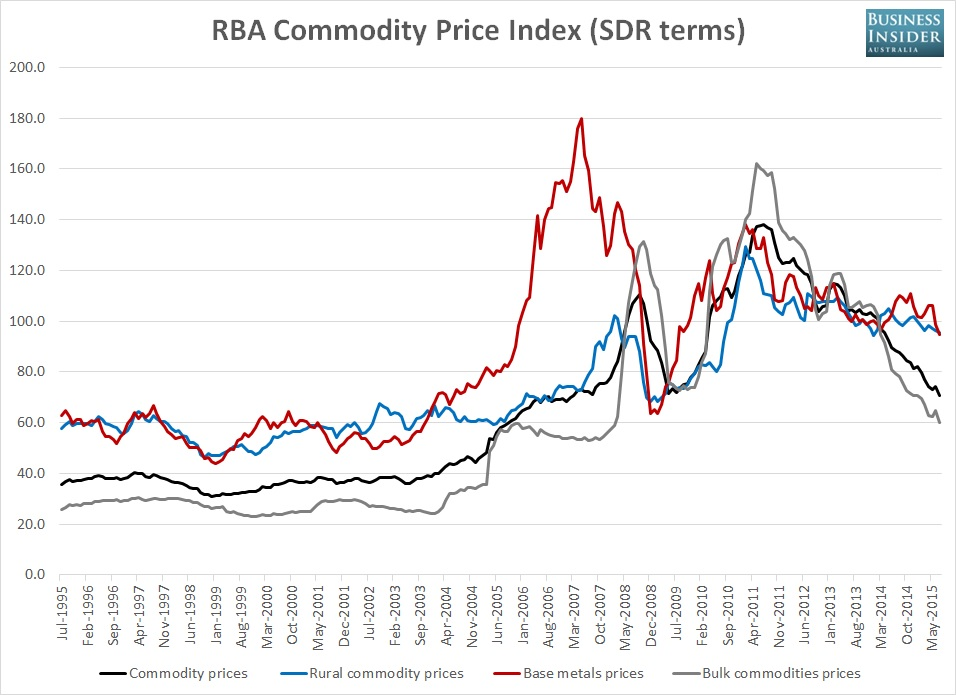
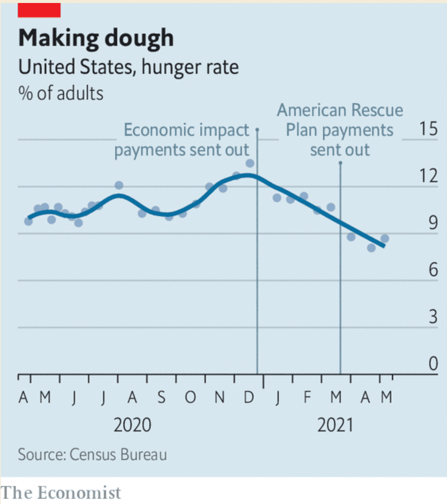

= Economist June 5th 2021

== Leaders

=== The geopolitics of global business

In 2001, the dotcom bubble had burst, and Enron had collapsed. China was struggling to privatize. Europe, with its new single currency, was the bright hope. Today things look different. America and China are ascendent, with 76 of the most 100 valuable firms. The US, with 24% of GDP, accounts for 48% of business activity.

Why did this happen, and can it last?

In Europe, political meddling and the 2010-2012 debt crises stalled the integration that was the basis of hopes of growth. There was a failure to anticipate the shift towards the intangible economy.

US and China have:

* a vast home market for goods and services to scale quickly
* deep capital markets
* top universities churn out startups
* a culture that exalts the entrepreneur
* politics supports creative destruction (yes, China too)

The erosion of this political consensus is one reason the dominance might fade. In the US low wages and monopolies could lead to protectionism, taxes on capital. In China, the party can't let private firms amass too much power, and has been cracking down. Private firms are pressured to further government goals.

A two-nation dominance is bad, but it would be worse if even they turned away from permitting creative destruction.

=== Netanyahu and Bennett

On June 2nd, Naftali Bennet and Yair Lapid agreed to form a government that excludes Netanyahu. Netanyahu could yet sabotage it.

In his 12 years, Netanyahu has:

* overseen a growing, high tech economy
* rolled out a great C19 vaccine program
* made peace with several arab states

But he has also sowed division in order to win elections. He held on to power after being charged with corruption.

If he goes, he will remain a force. Likud is still the largest in the Knesset.

The new coalition don't agree on much. They are setting expectations low. A budget, which Israel hasn't had in 2 years, is a priority.

They should also target reforms:

* governance, in particular not letting someone under indictment serve as PM
* depoliticising the police
* Splitting the AG role, so they are not the gov's legal counsel
* reform of the supreme court to make it more accountable
* getting ultra-Orthodox policies out of the law book (because most Israelis favour it)

Despite the new Coalition including an Arab party, little should be expected on Palestine. Bennett is an settlement hard-liner.

=== Paying for empty office space

Firms differ on whether people should be forced back to the office. GS says yes, Citi say no. There is a general consensus that workers should be allowed to work from home.

This poses challenges to office landlords and financiers. Some have their heads in the sand. Bulls argue that disruptions are temporary, and corporate tenants continued to pay rent through the pandemic. Developers report a rise in viewings and lettings. They also say people _want_ to come back to the office. They expect that the new normal will be more square foot per employee, and more amenities are expected, meaning more space is required.

The optimism is misplaced, or at least premature. The market is too noisy with government help, lenient banks and cheap credit to guess what will happen. Small drops in long-run occupancy rates will have large effects on prices.

=== Violent crime in American cities

Violent crime is rising in US cities. It was up 30% between 2019 and 2020, and the trend looks to be continuing. In Atlanta the murder rate has spiked 59% in May compared to the same period in 2020.

This undoes the "great crime decline" of 1990-2010. It threatens liberal reforms of prisons and policing. If reformers have no story to tell about tackling crime, they will not be elected. Voters prefer safety.

What are the causes? Unclear. Probably a mix of

* pandemic stresses to civilians and police (though rates were rising before then)
* rising gun sales
* police pull backs after the Floyd protests
* police diverted to deal with an increase in protests
* reduced trust (and therefore cooperation with) the police
* the cycle of violence - murders can trigger other, retaliatory murders

The link between incarceration rates and crime rates is weak. But more imprisonment may be coming anyway.

=== Brazil in a ditch

Brazil reported a strong Q1, but it has

* 14.7% unemployment (a record)
* violent favelas
* full hospitals
* a smaller economy now than in 2011
* one of the worst C19 death tolls

What went wrong? Governments made 3 mistakes:

Policy was short term, with economic reforms and investment put off. When commodity prices fell, Brazil was exposed.

The Lava Jato corruption probe has caused politicians to resist reform to shield themselves.

The political system is a problem. Elections are expensive, there is a huge number of parties, and politicians back white elephants to get elected. They get legal protection and a big pot of money to keep them in power. Brazilians despise them.

Bolsonaro took advantage of that, presenting himself as an authentic outsider. Though he vowed to crack down on corruption, crime, and rescue the economy, he has done none of these.

After a 2019 pension revamp, liberal reforms have been abandoned. He has protected corruption, not prosecuted it. In doing so he has shut down the Lava Jato task-force and threatened the supreme court.

He is a threat to democracy. He has said that "only God" will remove him. Congress could technically do it, but probably don't have the political power. The next election is in 2022.

Whoever replaces Bolsonaro, they have a hard job. The rot goes deeper than one man.

== USA

=== Federal spending on scientific research

The National Science Foundation (NSF) was born in 1950, largely following the principle that government should fund research but not direct it. That should be left to the scientists themselves.

Congress will probably pass the $4bn US Innovation and Competition Act this year. It seeks to provide more direction to research areas, laying out 10 focus areas for funding including AI, biotech and materials science. Its goal is to enhance the US competitive advantage.

Federal spending on research has fallen from 1.2% of GDP in 1976 to 0.8% today. At peak (1960), it was 12% of the federal budget, against 3% today. The act doesn't reverse the slide, but it does give the NSF 27% more money in 2022 than 2021, and 100% more in 2026 than 2021.

Science doesn't just want more funding though: it wants better institutions to manage the funding. 40% of researchers time can be taken on admin tasks. Grant evaluations are inconsistent and subjective. The current infrastructure has been criticised as risk-averse and having a compliance culture. This is a problem, because the big payoffs come from the rare, risky breakthroughs. All the value is in the long tail. Proposals for fixing this include experimenting with grant lotteries.

=== Fewer Americans are going hungry

Hunger rates have dropped 43% since the start of the year. The number of people 'living in hunger' hovered around 10% over the course of the pandemic, peaking at 13.7% over Christmas. Since then it has rapidly dropped to 8.7% 

The Whitehouse claims this is due to Biden's American Rescue Plan signed in March, but the timings don't line up with that.

What are the other possibilities?

* shrinking unemployment - From 15% in April 2020 to 6% now? The hunger reduction lags the unemployment reduction significantly enough to question the causality here
* Reopening schools giving access to subsidised food? Again, the timings don't match. Schools reopened well after hunger began its fall
* The December 2020 $600 stimmy cheques (the bill also increased food stamp benefits)? This looks much more likely to be the catalyst.

That's not to say the American Rescue plan didn't achieve it's goals. But sustaining an already present trend is less of a headline.

=== The January 6th Commission and the Filibuster

On May 28th the Senate rejected a bill to set up a commission to investigate the storming of the Capitol building in January. 54 senators voted yes, and only 35 no. So why was it rejected? Because 60 votes are required to avoid a filibuster. Two conclusions: Congress can be hamstrung by a minority, and Republicans can't shake off Trumpism.

==== The Filibuster

The filibuster is really an enshrining of the right to unlimited debate. If a Senator wants to debate a bill, it takes 60% of her peers to stop her.

Here, the problem is that 60% of Senators present _did_ vote for the bill. And far from wanting to have more debate in the spirit of the rule, the Republicans are using it to _silence_ debate.

Could this be the straw that breaks the back of the filibuster? The rules have been weakened over the last few decades. Presidential nominations, including supreme court judges, need a simple majority. The Dems could use upcoming votes on voting reforms to exempt civil rights bills too.

Changing the rules needs only a simple majority. Dems do have that, but 2 conservative Democrats are against it. Both seem unlikely to budge.

==== Trumpism in the Republican party

Immediately after the January attacks, Republican leadership condemned it, and strongly criticized Trump. They've since walked back. Trumpists are incentivised to keep talking about election fraud. Opponents have little incentive to speak up. 

McConnell and McCarthy, both initially critical of the President, whipped against and voted against the bill. The Party has dumped Liz Cheney from a leadership post for not being on the Trump bandwagon.

Trump remains the party's de facto leader, and plans to run again in 2024. Even post Trump, the anti-democratic playbook has been demonstrated to be successful and acceptable to the party, inviting successors.

== Britain

=== Refocusing on Resilience

Johnson wants to build a more muscular, interventionalist state. Previously the focus has been on efficiency, trimming fat.

C19 and China are factors, Brexit and the resulting increase in uncertainty another. The government wants PPE to be made in Britain, and is opening a state vaccine factory.

Security and self sufficiency are higher priorities. Foreign investment rules are being tightened in the name of security against hostile states. The official secrets act will be modernized, and a register of lobbyists for foreign interests maintained.

These are merely plans. The siloed and stuffy culture of Whitehall doesn't encourage crises planning. Pressure from the PM is required to overcome inertia.

All of this will be expensive, and the economic future is uncertain. Sunak has already pencilled in further cuts. Johnson has competing priorities, such as "leveling up" northern towns. Restriction on foreign investment will mean lower tax revenues. Austerity cut the slack in the system, leaving public services less able to handle C19.

The old idea of the state that fears the worst and attends to the just-in-case.

=== Interest rates

During the pandemic year, state borrowing was 14% of GDP, the highest in 70 years. The Debt/GDP ratio went from 80% to 100%. This has not been as costly as feared. Interest costs were 1.1% of GDP, down from 1.7% on the year.

Rishi Sunak is afraid that a rate rise will push this up drastically. QE has exposed the government to interest rate risk. Against this are the efforts of the Debt Management Office, over decades but especially since 2010, to lengthen the maturity profiles of government debt, which insulates against this risk. Britain has a far better average maturity than other rich countries. In addition, a rate risk is usually the consequence of economic growth, meaning that tax receipts would increase.

=== Catching up for lost learning 

Sir Kevan Collins was appointed in February to advise how to help children 'catch-up' on lost learning. On June 2nd, he resigned because of lack of ministerial support, hours after the government announced its plans.

These consist of GBP 1.4bn (in addition to 1.7bn already set aside) to provide tutors for struggling students and training courses for teachers. Collins' proposed GBP 15bn, and included 100 hours of additional schooling per year (30 mins per day).

Britain has spent GBP 310 per child, vs 1600 and 2500 in the US an Netherlands respectively.

=== British museums and government pressure

The government is interfering more in British museums. In February it blocked the reappointment of a Labour supporting trustee who advocated decolonizing the history curriculum. Another trustee was asked to "explicitly express support" for government policy on removal of historical objects.

After the pandemic crashed revenues, museums are vulnerable to pressure. Ministers are using this to try to reshape the institutions to their tastes: patriotic and working class.

Oliver Dowden, the culture secretary has rebuked museum leaders for individual decisions (moving a bust of Hans Sloane, the founder of the British Museum and slave owner), and told them that they should notify the government of planned statements on controversial issues or risk their funding.

The independence of museums is written into a law of 1753, and it has largely been upheld. This interference is a breach of this historical independence.

=== MPs worry that remote parliament has ceded power to ministers

650 MPs return to parliament on June 21st. Many are keen to return, worrying that remote working has weakened the power of the Commons relative to the executive.

Early experiments in remote voting via app were abandoned in favor of proxy voting - mainly in the hands of party whips. Proxies must vote as instructed, but the worry is that pressure to vote as the whips want will be harder to resist.

Spontaneous interventions to question ministers are harder to do over Zoom. The Coronavirus Act allowed the executive to legislate via statutory instrument (e.g. to impose lockdowns) - normally the role of primary legislation by parliament. Informal influence (buttonholing people in hallways) isn't possible. WhatsApp can't replace it - it leaves a paper trail.

MPs are discontent. They say ministers are growing complacent and see the need to consult parliament as a chore. As members return, this could be dangerous to the government.

=== More London council homes

London councils built the majority of new homes in the capital in the 60s and 70s. The mayor promises 10k new homes by 2023. Last year 3k were started, up from around 500 in 2015 - the fastest rate since the early 80's.

Lack of land is a problem. 85% is already occupied, and the remainder is largely protected by the green belt. Unused parts of existing estates - parks, garages, ballcourts - are the easiest option, but NIMBYs object.

=== Bagehot:

Ed Husain's book "Among the Mosques" examines the relationship of Britain's Muslims with the wider society.

He finds that Britain has absorbed a large Muslim population better than France. Several politicians, including the mayor of London, represent the modern face of Islam.

On the other hand there are regions, particularly in the North, where integration has not happened. Some Muslim communities are separating themselves and adopting stricter versions of the faith. The old mill towns of Yorkshire and Lancashire now contain "parallel societies" where there is little to no mixing. Regressive Islamic norms are visible in everyday life (gender segregation in restaurants, mosques running schools). Clerics dominate these societies. Funding for mosques and scholarships comes from Saudi Wahhabis. 

The Deobandis, an Islamic revivalist movement from India, is surprisingly well represented. More than half the country's mosques belong to it. Dewsbury is the European seat of Tableeghi Jamaat, it's evangelic arm.

Is this reason for liberals to worry? Isn't one womans "parallel society" another womans "flourishing subculture"? 

The first concern is around the paradox of toleration. How much should a liberal society based on free speech tolerate those who advocate intolerance and extreme consequences to those it doesn't tolerate? 

The second concern is around the foundations of the liberal welfare state. For it to be accepted it depends on the people funding it feeling a common identity with those who benefit from it.

The third is the mistakes the state has made in dealing with the 'struggle for the soul of Islam' that is happening in Britain. It has mistaken hardline beliefs for authenticity, and thus repeatedly found itself on the side of reaction instead of enlightenment. It has failed to make a compelling argument for Britishness which might encourage integration. 