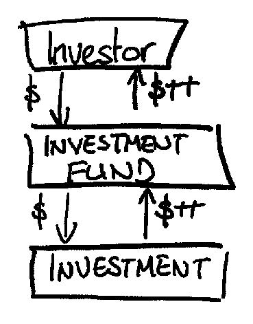
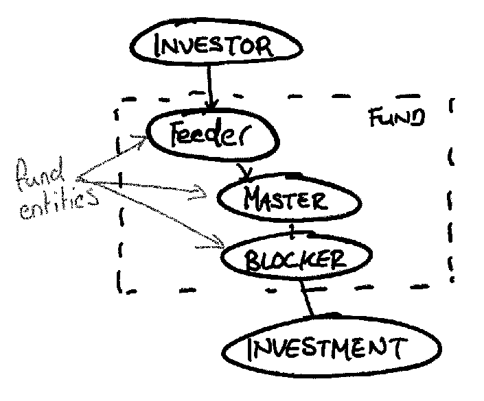
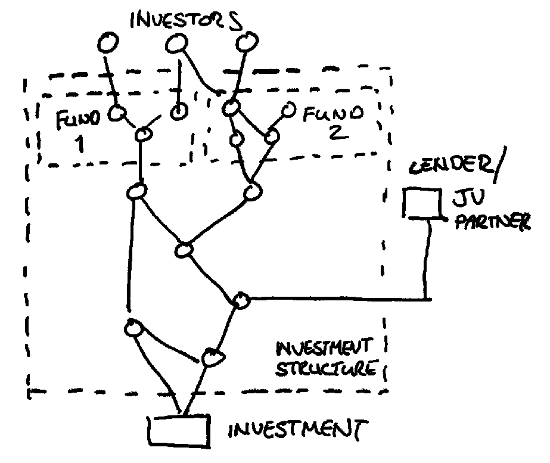

= Thoughts on the design of a structured transactor system

== Introduction

In asset management the main motivation is the connection of investor cash to deals. Investors provide capital to the *investment fund* of the asset manager. The investment fund sends that cash out into the world to (hopefully) generate a return. As those return dollars come back in over time, they flow back to the investment funds, then eventually back to investors.

This is a simplification in a couple of ways.

The "investment funds" that investors put their cash into ("_ABC Opportunity Fund 3_") are a fairly abstract concept - they don't 'exist' in a very concrete way. The 'real world' implementation of these funds is via incorporated entities or partnerships - referred to here as *fund entities*. One "investment fund" may be implemented with multiple entities: Master/Feeder structures, blockers, as well as GPs etc. These are largely irrelevant to the investors and to the high level management of the asset manager, but the details are crucial to the actual operation of the funds, since the entities, financial instruments and transactions, as well as the accounting for all of these, are all at the level of the entity. Thus, when an Investor invests in _ABC Opportunity Fund 3_, they are signing a contract with _ABC OpFund 3 Feeder C LP_, and they are paying their money into that entity, which itself subscribes to Class C shares of _ABC OpFund 3 Master Fund Cayman Ltd_.

When _ABC Opportunity Fund 3_ is said to invest its capital, this is another simplification. It is a legal entity like _ABC OpFund 3 Master Fund Cayman Ltd._ which is holding the shares of the investee company.

It may be the case that a fund entity holds shares (or other financial instruments) issued by the investee directly, but more commonly there are other, intermediate entities, between the fund entity and the investee. That is, _ABC OpFund 3 Master Fund Cayman Ltd._ will hold shares in _ABC Blocker 16 Ltd._ which will hold shares in the investee company. This is the simplest possible form of such a investment structure, but they can get very large indeed, with a dozen or more entities in a single structure.

There are several overlapping reasons for creating these structures:

* to pool the capital of several funds into a single entity
* to ring fence parts of the investment to different investors, including joint venture partners and co-investors
* to 'securitise' or otherwise structure the returns on an investment (tranche-ing etc.)
* to utilize the tax benefits that some types of entities offer
* To create a structure for management - for example permit a board of directors who will be managing the underlying investment
* To provide bankruptcy protection for the funds
* To avoid the publicity of having the funds name associated with the investment (though with the spread of beneficial ownership registers this is diminishing)
* To provide an entity which can issue loans or bonds to leverage the investment

So what we tend to end up with at even a modestly sized asset manager is the obligation to manage several of these structures, potentially totalling hundreds of entities, potentially interacting in non-trivial ways. This imposes a significant administration burden. Moving cash up and down these structures can become a real chore, figuring out how to route the cash, requiring hundreds of pages legal documentation, coordination across continents. Often the process takes weeks or even months.

The traditional approach to this by investment management firms, particularly private investment firms has the same as it's approach to nearly all problems: throw bodies at it, by hiring if you have to, by outsourcing if you can. This raises obvious concerns about scalability, which would be essentially linear in this model.

== How much of this work can be automated?

The aim of this post is to explore to what extent this process of navigating and transacting with these structures can be automated. The focus will be on automating the generation of transactions - that is, starting with a *goal* ("we want $x at this entity from funds a, b and c in these proportions, to make an investment.") and automatically answering the question "What transactions do we need to make this happen?". This does ignore the part of the process where most of the admin work tends time to be, which is:

* making payments
* drafting and signing documents
* recording transactions in the books of record of each of the entities.

However once you have the transactions this process can be largely deterministic, or even generic, since there's plenty of off-the-shelf software to help you do all of these things. The "Deciding what transactions you need" part of it is the starting point for all of this, and once you have a methodology for automatically generating transactions for a structure from a stated 'goal' it can be intuited how all of these actions can also be automated to a greater or lesser degree.

The ultimate aim is that the effort of administering these structures becomes trivial, with the human interaction limited to stating the goal (this, too, can be automated). In this way the incremental cost in time of a transaction becomes minimal, and the investment manager can scale to hundreds of structures without significantly increasing the resources needed to implement them.

== Goals of a structural transaction engine

To reiterate, we start with a *structure*: effectively a directed acyclic graph (DAG) of legal entities (the nodes) connected by positions in financial instruments (the edges). At the top of the graph are the fund entities that directly face the investors. At the bottom are the investee entities. Here I'll define the investee entities as the first entities in the structure which are outside of the direct control of the asset manager, though there could be several alternatives.

Here are several goals which can be implemented via transactions on the financial instruments of a structure:

. We want to put $x into an investee company, with the cash coming ultimately from a set of funds. While doing this, each of the entities in the structure through which the cash will pass should be allowed to deduct an amount before passing it on, as a 'float' to meet its operating costs. The combined floats should be factored in so the full $x reaches the investee company. However any excess cash in the structure should be used where possible. 
. An portfolio company is going to pay a dividend. We want to flow this cash up the structure to the funds (referred to in the jargon as a _waterfall_).
. An entity in the structure issues publicly held bonds, which have an upcoming interest payment. We want to pay the interest by utilising the free cash flow of the investee entity to the extent possible
. An entity in the structure has an upcoming legal fee to pay. Move sufficient cash into that entity, preferably without drawing cash from the funds

On its face this is not a especially complex problem. Each entity is proportionally owned by its parents via the financial instruments it issues to them, and whenever cash is moved it should be done in proportion to those ownerships. The devil, however, is in the detail. There is another layer of complexity in how the instruments are set up to be operated and their order of precedence. For example

. An entity might issue debt and equity to its parents. When paying cash upwards it should first pay accrued interest on its debt, then dividend of declared profit, then pay down debt principal.
. An entity might draw 99% of its capital via the issuance of debt and 1% via issuance of shares.
. A waterfall can reflect a complex arrangement between owners, lenders and service providers, with service fees being paid before interest, interest being paid before loan principal (itself the result of complicated formula), and the residual being paid by to the owners.

This implies the existence of *rules*, which can exist at the level of the structure, the entity or the instrument. The application of and interaction between these rules is where I expect most of the complexity of this program to be.

== Goals of the program

. The creation and manipulation of objects representing the investment structures described above, comprised of entities, financial instruments and positions. 
. Given a structure and a goal, the generation of a sequence of transactions representing flows of cash on financial instruments which will achieve that goal.
. The application of transactions to structures to provide the subsequent state of the structure.
. The transactions generated are emitted and available for downstream processes to use for administration (instruction of payments, preparation of legal documents).

== A simple API

From the above we can state a simple public API for a program intended to generate transactions:

[source,clojure]
----
(generate-transactions goal structure) ;;=> transactions
----

This assumes that the current state of the structure (current cash positions etc.), as well as the _rules_ for precedence at an entity and instrument level are encoded into the structure itself.

We'll need an API for creating and manipulating structures. We'll keep it to the very simple `add-position` for now, though I expect we'll outgrow this very quickly.

[source,clojure]
----
(add-position structure from-entity to-entity instrument) ;;=> structure
----

We will need a function which applies transactions to a structure.

[source,clojure]
----
(apply-transactions structure transactions) ;;=> structure
----

== Domain explorations and Layers of the system

The program has the following layers of abstraction, from highest to lowest:

* Level 1 is interested in the interaction of goals, structures and rules, and the generation of transactions. This layer represents the business logic of the program.
* Level 2 is interested in the structures as a whole.
* Level 3 is interested in the representation and manipulation of our core elements: entities, instruments, positions and transactions. This will provide the language in which levels 1 and 2 are expressed. This is core domain logic. It has a clear real-world corollary (the international language of financial legal agreements). It will be slow-changing. 

=== A model for financial instruments

The slow-changing core of the system we are building is around entities, instruments, positions and transactions. Let's spend some time exploring and defining this model.

An *entity* is a legal entity - a corporation or limited partnership. It is an independent entity which has ownership, can enter into contracts, can issue financial instruments and can hold positions in financial instruments issued by other entities. Entities can have many attributes, but we will limit ourselves to those relevant to the goals of the program (for instance we will not be interested in the board of directors of a company). 

An *instrument* is a legal contract that promises the exchange of cash at a future date. It can be *securitized*, meaning it is unitized into securities representing fractional units of that instrument (examples are shares or bonds), or *principal-based*, meaning that the whole of the instrument is represented by a monetary amount, with holders of that instrument owning fractions of that principal (e.g. a loan, a limited partnership interest). The unit of these types of instrument can be thought of as one unit of the monetary amount. All instruments are *issued* by an entity.

A *position* is a fractional holding that one entity has in an instrument, denominated in units of that instrument - a number of securities for securitised instruments, or a principal amount for a principal-based instrument. Entity A can have a position of 100 shares of an instrument issued by entity B.

To formalize the language, we will say an entity (the _issuer_) *issues* a *financial instrument*, then another entity (the _holder_) can *hold* a *position* in that financial instrument.

A *transaction* is a notional or real exchange of value between the issuer and holder of an instrument. When Entity B pays a dividend on an instrument to Entity A which holds a position in that instrument, that is a transaction, whereby an obligation is extinguished by the payment of cash. A drawdown on a loan facility is a transaction whereby Entity A pays cash to Entity B in exchange for the promise of future cash flows from B to A, represented by an increase in the principal balance of the instrument.

A *trade* is an exchange of notional or real value between entities that doesn't involve the issuer of an instrument. The most common forms are the buying and selling of securities between entities.

A transaction or trade can be applied to a structure, modifying the instrument, position and entities.

[source,clojure]
----
(apply-transaction structure transaction) ;; => structure
----

For example, the application of a loan drawdown transaction on an instrument issued by Entity A, in which Entities B and C have positions, would have the following effects on the state of the structure:

* The cash positions of B and C is reduced
* The cash position of A is increased
* The overall principal amount of the instrument is increased
* The principal amounts of the positions of B and C would be increased

How would we describe this transaction and its impact on the structure?

[source,clojure]
----
;; structure before
{:entities    [{:name "Entity A" :cash-position 0}
               {:name "Entity B" :cash-position 500}
               {:name "Entity C" :cash-position 200}]
 :instruments [{:name "Entity A Term Loan" :principal 100}]
 :positions   [{:instrument "Entity A Term Loan" :issuer "Entity A" :holder "Entity B" :amount 75}
               {:instrument "Entity A Term Loan" :issuer "Entity A" :holder "Entity C" :amount 25}]]}

;; transaction
{:instrument "Entity A Term Loan"
 :action     :loan-drawdown
 :amount     100}

;; structure after
{:entities    [{:name "Entity A" :cash-position 100} ;; cash increase 100
               {:name "Entity B" :cash-position 425} ;; cash decrease 75
               {:name "Entity C" :cash-position 175}] ;; cash decrease 25
 :instruments [{:name "Entity A Term Loan" :principal 200}] ;; principal increase 100
 :positions   [{:instrument "Entity A Term Loan" :issuer "Entity A" :holder "Entity B" :amount 150} ;; amount increase 75
               {:instrument "Entity A Term Loan" :issuer "Entity A" :holder "Entity C" :amount 50}]]} ;; amount increase 25
----

We can see that a single transaction can impact entities, instruments and positions. Notice as well that there was some implicit logic in the application: the transaction states that the drawdown amount is 100, and the application process figured out that 75 of that should come from Entity B and 25 from Entity C. We probably want to avoid that in favour of having this fact explicitly stated in the transaction.

[source,clojure]
----
;; transaction
{:instrument "Entity A Term Loan"
 :action     :loan-drawdown
 :amount     100
 :holders {"Entity B" 75 "Entity C" 25}}
----

For an API we'll stick with the simple `(apply-transaction x transaction)`, where x is the entity, instrument or position.

=== Structures