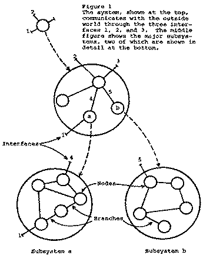

= How Do Committees Invent? (Conway’s Law)
A summary of the Melvin E. Conway 1968 paper

http://www.melconway.com/Home/pdf/committees.pdf[The original paper]

== The Title

The paper is called 'How Do Committees Invent?' but curiously, the word 'Committee' is only used once in the entire document, and the work 'Invent' not at all. These terms in the title seem to broadly be synonyms for 'Design Organizations' and 'Design'. So matching the terminology of the paper, the paper might be better titled 'How do Organizations Design?'.

== Summary

The thesis of the paper is: "Organizations which design systems are constrained to produce designs which are copies of the communication structures of these organizations". This came to be known as 'Conway’s Law'.

The paper presents a 'proof' of this, and goes on to explore the key problem the law poses for designing systems.

The thread of logic goes like this: By Conway’s law, system design must follow the communication (i.e. team) structures of the designing organization. This 'feedback loop' between organization and system creates a circular logic:

. We need to design a system
. By Conway’s law, our system design will match the team structure of our organization
. To get a good design, we should structure our teams in line with the desired design.
. To do that, we need to know what the design of the system is. Goto 1.

There is only one way to break this cycle: Before you set up your teams prior to commencing the design activities, you have to take an initial guess at what the system design is. If this decision - taken at the moment of least knowledge - is wrong, you can screw up the whole thing, especially if you aren’t able to change it later.

The conclusion is that, since this initial guess is unavoidable, design organizations should focus on staying lean and flexible so that if this initial design is wrong the organization can change the team organization (and so the system design) without breaking everything.

The second major consequence of Conway’s law relates to the design of large, complex systems. Since it is large, you will have to break it down into very many pieces, and have a large number of teams tasked with designing those pieces. Since it is complex, there will be a very large number of interactions between those pieces, and so also a lot of co-ordination required between the teams. This will very quickly get to the point where the teams and their co-ordination become impossible to manage, so you end up with a broken organization. And, by Conway’s Law, a broken organization means a broken system.

== Terms used

* *The System*: the intellectual activity which creates a useful whole from its diverse parts. For example, the creation of a specification for a major weapon system, the formation of a recommendation to meet a social challenge, the creation of a computer program, and investigation into an air crash.
* *The System Design*: The documentable, coherently structured body of information describing the system. For example, a proposed legislation, a document resulting from the investigation into an air crash, an industrial product plan.
* *The Design Organization*: the group of people responsible for producing the system design (though not necessarily its construction or implementation).
* *Design Teams*: sub-groups within the organization.
* *Design Activity*: any activity which is in service of producing the system design.

=== A System

Before starting on this paper, it’s important to understand what Conway means by a system. He uses it in a very broad sense. In the introduction he defines it as 'an intellectual activity', which is rather hard to grasp.

The best way to comprehend his meaning I found is to look at his description of a system design and work backwards through the examples he gives.

> A description of a system, if it is to describe what goes on inside that system, must describe the system’s connections to the outside world, and it must delineate each of the subsystems and how they are interconnected. Dropping down one level, we can say the same for each of the subsystems, viewing it as a system. This reduction in scope can continue until we are down to a system which is simple enough to be understood without further subdivision. — Melvin Conway

So a system is something that

* Has connections to the outside world - it receives objects or information and outputs them.
* Does something with the things it receives from the outside world, transforms them in some way.
* Has a boundary, so that there is a clear line between the system and the outside world.
* Is itself made up of subsystems, each of which also have the above properties.

Defining a system as anything that can be so described, we can give the following examples at different levels of abstraction:

* the design of a public transportation system, containing subsystems for buses, trains, trams, planes etc., where planes have their own subsystems of structure, propulsion, communication.
* A theory is a system, where the inputs are observations about the world and the output is the conclusion. The subsystems are sub-theories which relate to each other and have their own inputs and outputs.

> For example, the investigation of an airplane crash attempts to produce a theory explaining a complex event. It can consist of subtheories describing the path of the aircraft, its radio communications, the manner of its damage, and its relationship to nearby objects at the time of the event. Each of these, in turn, is a story in itself which can be further broken down into finer detail down to the level of individual units of evidence. — Melvin Conway

=== The Design Organization

This is the second entity which this paper examines. It’s a simpler definition to get your head around - essentially it’s a group of people tasked with designing a system. These people are usually divided into teams, each of which can be assigned work. In particular they are delegated the task of coming up with designs for parts of the system.

Based on the expansive definition of 'System', the definition of what constitutes a 'Design Organization' must be similarly broad.

In large part, the paper is about the interaction between these two entities: the System and the Organization which designs it, and the constraints they impose on each other through the design process.

== The Paper

=== Stages of design

The stages of design are:

. Drawing of boundaries / scoping.
. Choice of preliminary system concept.
. Organization of teams within the design organization and delegation of sub-designs to those teams.
. Coordination between teams (via a coordinator).
. Consolidation of sub-designs into a single design.

Points 1-3 relate to the structure of the design activity itself. This requires an understanding of the scope and boundaries of both the design activity and the system design, as determined by the sponsor of the effort and by reality. Then as a precondition to design work taking place, a preliminary organization of the system has to be arrived at to allow meaningful division of labor and assignment of tasks.

Notice by point 2, design decisions have already been made. The act of division and delegation guides and constrains future design decisions, since the scope of those delegated tasks is the product of the design.

This is not to say the preliminary design can’t be abandoned in favor of a better one, but the pain of doing this, general inertia, and the desire of the design organization not to look like they don’t know what they’re doing are all strong disincentives to doing this.

=== The Linear Graph as the description of system and design organization

Systems are composed of connected subsystems. A system design must describe the inputs and outputs to the system, as well has the arrangement and connection of subsystems within it. This is also recursive, since subsystems can themselves contain sub-subsystems.

The system can be described using a nested linear graph of branches and nodes, where nodes correspond to subsystems and branches to interactions between subsystems.

Notice that the linear graph can equally well describe the design organization, with the graph being the organization, the nodes being the teams, and the branches being channels of communications between teams. As with systems, organizations can have nested nodes: subteams within teams - think of the federal government.

=== Systems correspond to their designing organizations: Conway’s thesis and proof

The primary thesis of this paper is that not only can the system and the organization which designed it be thought of using the same linear graph abstraction, but in practice the graph of the system design must closely follow the graph of the organization, so you could put them on transparencies and lay them on top of each other and they would look the same.

Here is the proof of this that Conway presents:

Pick a system and the organization that designed it. Draw a linear graph of the system, and pick an arbitrary subsystem x represented by a node on the linear graph. That subsystem must have been designed by a given team (or sub-team) y. That team can then also be placed as a node in the linear graph of the organization. By the recursive nature of both system and organization, this logic can be extended in both directions: subsystems of x must have been designed by sub-teams of y, and the (sub)system that x belongs to must have been designed by a team to which y belongs. Therefore the linear graphs of the system and the organization can be drawn in such a way that they exactly, or nearly exactly, correspond.

The logic can also be extended to the branches which connect nodes: if a subsystem x1 (designed by team y1) interacts with a subsystem x2 (designed by team y2), then team y1 must have had a communication channel with team y2 so that they could agree the contract of exchange between the subsystems. Both the interactions of subsystems and the communication channels of teams are represented as branches on the linear graph. Conversely, if there is no interaction between x1 and x2, there is no need for y1 and y2 to communicate, no need to have a communication channel between the two teams, and there will no branch between the node on the linear graph of the organization.

It is a truism among those with experience with system design that there is no single correct design, in the sense that a design will never be perfect, particularly if the system requirements evolve over time. At any point a design which is better than the existing one can be discovered.

Stated another way, whenever we are tasked which choosing a design to meet a requirement, we are choosing one from a set of designs (possibly infinite) within a design family.

The consequence of Conway’s Law is that the structure of our design organization effectively filters that set of designs to those which correspond to the possible structures our organization can take.

=== System Management and the disintegration of large system structures

Large system designs tend to disintegrate - lose structure - during the development process. This, according to Conway, results from the following logical chain:

. Since the system is expected to be large, the design effort is allocated resources beyond the organizations ability to effectively coordinate those resources.
. The impact of this is that communications channels between design teams break down.
. Since Conway’s law says that the system design mirrors the organization design, a broken organization results in a broken design.

You have to break the project down into pieces small enough to be comprehended, therefore you must have enough resources to make a roughly 1:1 correspondence between resource and comprehensible piece. If the number of comprehensible pieces exceeds the number of resources that can be effectively be coordinated, you have a catch-22: either you assign teams parts of the system so large as to not be comprehensible, or you have to break down into so many teams that you can’t co-ordinate them.

The 'original sin' here is the over-resourcing. But the psychology is understandable in practice. Firstly, if a manager has failed to meet a schedule, and had free resources he could have assigned to the project, he will be yelled at. It’s safer for him to over-staff.

Secondly, managers tend to want to expand the number of resources they have so as to increase their power, so will always argue for more.

Notice the tendency to over-resource is based on the simplistic, but very common fallacy about the relationship between resources and productivity - that there’s an essentially linear relationship between them. What Conway calls the 'conventional accounting theory', also known as the 'Mythical Man Month'.