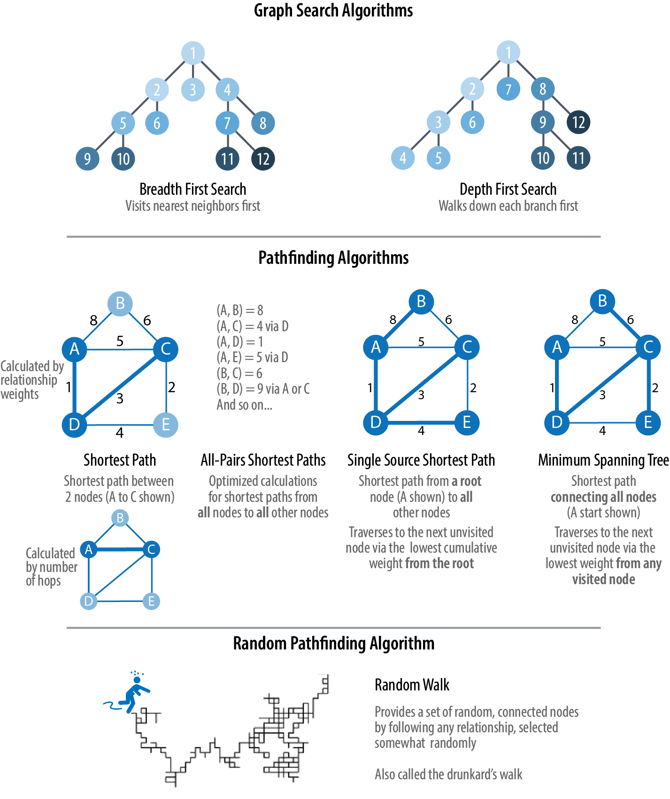

= Graph Algorithms, by By Mark Needham, Amy E. Hodler

https://learning.oreilly.com/library/view/graph-algorithms/9781492047674/[oreilly link]

== Content

Part 1: What are graphs? Why should I care?

Part 2: Theory and concepts, types and structures, types of algorithm

Part 3: Platforms and processing, Apache Spark

Part 4: Pathfinding and Search Algorithms, BFS, DFS, Shortest Path, Min Spanning Tree, random walk

Part 5: Centrality algorithms. Degree centrality, Closeness centrality, Wasserman, Faust, Harmonic, Betweenness, PageRank

Part 6: Community Detection algorithms

Part 7: Graph algorithms in practice

Part 8: Graph Algorithms and ML

== Brief notes

1736, Leonhard Euler and the “Seven Bridges of Königsberg” problem

The objects that make up a graph are called nodes or vertices and the links between them are known as relationships, links, or edges.

* Simple graph: node pairs can have only one relationship between them
* Multi graph: node pairs can have multiple relationships between them
* (Psuedo) graph: multigraph, but nodes can be connected to themeselves
* A graph where there is a path between any given pair of nodes is *connected*
* in *directed* graphs, each edge has a start and end.
* an *acyclic* graph is one where you can't navigate back to a node
* Undirected Acyclic graph is a *tree* (rooted, binary, spanning trees)

Types of graph algorithms

* Pathfinding. e.g. shortest path
* Centrality. What nodes are most important? 
* Community detection: How connected are the nodes?

=== Pathfinding and search

Graph search algorithms explore a graph, either for general discovery or explicitly. There is no expectation of optimality. The two big ones are Breadth First Search (BFS) and Depth First Search (DFS).

Pathfinding algorithms are build on top of search. They are used to find optimal routes.

* Shortest path (A*, Yens, All Pairs, Single Source)
* Minimum spanning - for finding a connected tree structure with the smallest cost for visiting all nodes

BFS traverses a tree structure by fanning out to explore the starting nodes neighbours, then explores their neighbours 

DFS walks a tree by exploring down each path as far as possible, then backtracking when it reaches the end.

A*/Yens calculates the shortest path between 2 given nodes

All Pairs calculates the shortest path between _every_ pair of nodes

Single point calculates the shortest path from a root node to every other node

Min spanning tree calculates a path with the smallest cost to visit every node.