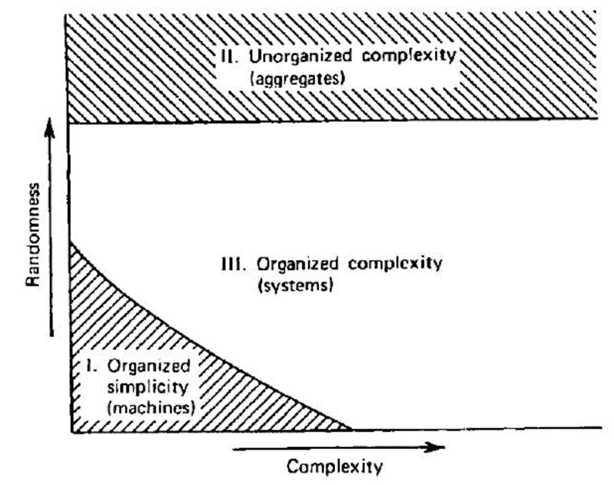

= An introduction to general systems thinking, by Gerald M Weinberg

== Book in outline

* 1. The problem
** The complexity of the world
** Mechanism and mechanics
** The square law of computation
** The simplification of science and the science of simplification
** Statistical mechanics and the law of large numbers
** The law of medium numbers
* 2. The approach
** Organism, Analogy and Vitalism
** The scientist and her categories
** The main article of general systems faith
** The nature of general systems law
** Varieties of systems thinking
* 3. Systems and illusion
** A system is a way of looking at the world
** A system is a set
** Observers and observations
** The principle of indifference
* 4. Interpreting observations
** States
** The eye-brain law
** The generalized Thermodynamic law
** Functional notation and reductionist thought
** Incompleteness and overcompleteness
** The generalized law of complementarity
* 5. Breaking down observations
** The metaphors of science
** Boundaries and things
** Qualities and the principle of invariance
** Partitions
** The strong connection law
* 6. Describing behavior
** Simulation: the white box
** State spaces
** Time as a standard of behavior
** Behavior
** The principle of indeterminability
* 7. Some systems questions
** The systems triumvirate
** Stability
** Survival
** Identity
** Regulation and adaptation
** The used car law

== Laws and principles

* *The law of medium Numbers*: For medium number systems, we can expect that large fluctuations, irregularities, and discrepancy with any theory will occur more or less regularly. 
* *The main article of general systems faith*: That the order of the empirical world itself has an order which might be called order of the second degree
* *The law of conservation of laws*: Then the facts contradict the law, reject the facts of change the terms, but never throw away the law.
* *The law of happy particularities*: Any general law must have at least two specific applications.
* *The law of unhappy particularities*: Any general law is bound to have at least two exceptions.
* *Composition law*: The whole is more than the sum of it's parts
* *Decomposition law*: The part is more than a fraction of the whole
* *The banana principle*: Heuristic devices don't tell you when to stop
* *The principle of indifference*: Laws should not depend on a particular choice of notation
* *Principle of difference*: Laws should not depend on a particular choice of symbols, but they usually do
* *The Eye-Brain law*: To a certain extent, mental power can compensate for observational weakness.
* *The Brain-Eye law*: To a certain extent, observational power can compensate for mental weakness.
* *The General Thermodynamic law*: More probably states are more likely to be observed than less probable states, unless specific constraints exist to keep them from occurring.
* *The Lump Law*: If we want to learn anything, we mustn't try to learn everything.
* *The General Law of Complementarity*: Any two points of view are complementary
* *The Axiom of Experience*: The future will be like the past, because, in the past, the future was like the past. Ot, Two things are alike if one in the present can be substituted for one in the past
* *The Invariance Principle*: With respect to any given property, there are those transformation that preserve is and those that do not preserve it. Or, With respect to a given transformation, there are those properties that are preserved by it and those that are not. Or, We understand change only by observing what remains invariant, and permanence only by what is transformed.
* *The Perfect Systems Law*: True systems properties cannot be investigated
* *The Strong Connection Law*: Systems, on the average, are more tightly connected than the average. Or, A system is a collection of parts, no one of which can be changed. Or, In systems, all other things are rarely equal
* *The picture principle*: When speaking about a dimensional reduction, insert the words "a picture of" in whatever you were about to say.
* *The Synchronic Principle*: If two systems occupy the same position in the state space at the same time, then the space is under-dimensioned, that is, the view is incomplete.
* *The Count to Three Principle*: If you cannot think of three ways of abusing a tool, you do not understand how to use it.
* *The first law of simpledynamics*: Endigitry cannot be created nor destroyed
* *The second law of simpledynamics*: Eventropy can never decrease
* *The Principle of Indeterminability*: We cannot with certainty attribute observed constraint either to system or environment
* *The Systems Triumverate*
.. Why do I see what I see?
.. Why do things stay the same?
.. Why do things change?
* *The law of effect*: Small changes in structure usually lead to small changes in behaviour. Or, Small changes in behaviour will usually be found to result from small changes in Structure.
* *The used car law*: A system that is doing a good job of regulation need not adapt. Or, A system may adapt in order to simplify its job of regulating. 

== Terms

* System
* Observation
* State
** State Space
* Dimension
* Invariant
* Constraint
* Endigitry
* Eventropy
* Quality
* Attribute
* Identity
* Stability
* Regulation
* Adaptation
* Regulation
* Science
* complementarity
* Incompleteness / Overcompleteness
* Partition
* White Box / Black Box
* *Mechanics*: The study of those systems for which the approximations of mechanics work successfully. 
* General Laws:
* Analogy
* Category System
* Absolute and relative thinking
* *Arbitrary System* Systems about which nothing general can be said, except that "nothing general can be said"
* Primitives

== Chapter 1: The problem

A confession of ignorance.

Science has been successful - but also full of failure. When things get too complex, science struggles. The method of observation and experiment produces bad results. The General Systems Approach is born out sciences failures in these situations, by generalizing the ideas of observation and experiment in a wider context.

We consider the number of objects involved in a system as a rough measure of simplicity-complexity. Fewer objects make a system simpler. More, more complex.

=== Machines, Analytical Treatment, Organized Simplicity

We start with mechanical systems - machines. These are simple, in the sense they have few identifiable parts: 2, 10, maybe 30 for a complex one. Any more than that, and the equations aren't solvable. These formal methods, then, are limited. We can either simplify, and reduce the number of parts involved, or we can look outside formal methods to informal ones.

For example, the Solar System contains thousands of bodies, but when computing the gravitational effect these bodies have on each other using the Newtonian method, we must ignore nearly all of them. In this case, things work rather well. But it assumes a correlation between size and significance, which doesn't hold more generally - consider the tiny pineal gland in the brain.

Further, the Newtonian method requires that you can isolate and model parts of the system, then combine the isolated results. You can study bodies A and B, A and C, and B and C. Then when extending the model to all three bodies, the system can be composed from the pairwise models. Contrast that to a psychologist studying a family of 3: It's not possible to predict the behavior of the father, mother and child when they are together by studying how the father and mother act when together.    

The square law of computation states that, unless simplifications can be made, the amount of computation increases at least as fast as the square of the number of equations.  

How do we know a problem is a soluble in the space of mechanics? Because when we try the simplified model, the results broadly match the observational data. But note that these observations are from outside the mechanical system. Mechanics by itself doesn't tell us which systems are mechanical.

=== Aggregates, Statistical Treatment, Unorganized Complexity, Law of Large-Numbers

Reducing the number of objects of interest and how they interact is one method of dealing with complexity. Another is to deal with the average properties objects, rather than the exact properties of individual objects - to deal with _aggregates_. Consider the study of air molecules in a container. There are 10^23 molecules, but given their homogeneity, it isn't possible to ignore some of them as 'insignificant', nor to study 10 molecules in isolation. Instead, science in this area deals with average behavior of the molecules, relying on the fact that the large number of them will make the average behavior representative on the whole. This is the statistical approach.

What is the scope of the statistical approach? A requirement is that the population is large, and that behavior is sufficiently random. Randomness is the property that makes statistical calculations come out right.

=== Machines, Aggregates, Systems

Consider an attempt to model infection rates in a flu epidemic. If our population is large, and approximately randomly distributed (say, in a city), the analytical approach will likely not be possible, but the statistical one will. In the countryside, by contrast, the population is small, but is not randomly distributed - instead it's clustered in pockets. Any attempt to model using aggregates is therefore bound to fail.

We can consider the general case here: systems with low randomness and low complexity (number of objects) can be treated by the analytical approach, and those with high randomness and (by the law of large numbers) high complexity can be treated with the statistical approach.

This leaves us wth a significant gap: the region of medium to high complexity and low to medium randomness: Organized Complexity. Too complex for analysis and too organized for statistics. This is the area that systems thinking targets. 

=== The Law of Medium Numbers

*For medium number systems, we can expect that large fluctuations, irregularities, and discrepancy with any theory will occur more or less regularly.* Or, *Anything that can happen, will happen.*

Medium number systems are pervasive, but they are the systems we are least able to cope with using the tool of science. (This is not sciences _fault_ - only the user can be blamed for the application of an unsuitable tool).

== Chapter 2: The approach: A loose outline

Finding general laws to aid in thinking about medium number systems.

=== Analogy

> Every model is ultimately the expression of one thing we think hope to understand in terms of another thing we think we understand.

Science is fundamentally reductionist: it claims every phenomenon can be reduced to primitives of physics. Compare this to the argument of the organismists, which argues by analogy to the organism,identifying a 'life force' or 'vital essence'. This viewpoint has gone into retreat as the mechanists start to explain these too in terms of the primitives of physics and chemistry. This is not the end of the conversation though: there are plenty of medium-number systems which cannot yet be reduced to physical primitives. The baby of organismic thinking shouldn't be thrown out with the bathwater of vital essence.

Organismic though is in essence an argument from analogy. We continue to refine the analogy, rendering it into a precise, explicit, predictive model. That analogy should be to known mathematical characteristics.

We want to understand the ways in which thinkers use analogies, and convert them into models. This will raise the epistemological question "How do we come to hold the ideas we hold as knowledge?"

=== Category Systems

To understand and function within a system, you need to understand the categories of that system. In the land of the blind, the one eyed man is not king. He can't even function. The Anthropologist "Participant Observer" has skill, not within in a particular system, but in understanding and living within the category systems of others. There is a paradigm here, but it is one which exists at a higher level, an abstraction under which the specific systems in its umbrella seem similar. A *generalist* is one who has this higher level category system, and applies it to several disciplines.

A paradox is that progress in a discipline relies on knowledge of, and faith in, the category system. But that knowledge and faith also acts as a straightjacket, preventing the kind of progress which relies on _changing_ that category system.

=== Generality, and second-degree order

The main article of general systems faith: the order of the empirical world itself has an order which might be called order of the second degree.

[quote,Boulding]
If he delights to find a law he is ecstatic when he finds a law about laws. If laws in his eyes are good, laws about laws are delicious and are most praiseworthy objects of search.

General laws permit us to draw conclusions about cases not yet observed.

To discover general systems laws, the generalist starts with the laws of different disciplines, searches for similarities among them, and induces from them a law about laws.

This approach has the weaknesses of induction: induction doesn't always work, so these conclusions will not always be right. The generalist must accept this, and always be ready to be wrong. You will find out that you are wrong soon enough, and the errors will serve to refine the general laws.

> To be a successful generalist, one must study the art of ignoring data and of seeing only the "mere outlines" of things.

=== The nature of laws

The pattern of a scientific assertion conditional: "If so ... then so". The condition is often dropped for brevity, but it is essential. The first law of thermodynamics is usually stated as "total energy in a system is constant". But the true law is more like:

> If we have a system to which energy is neither added nor removed, and if we measure the energy of the system without affecting that energy, then every measurement will give us the same value.

If, in our observation, we don't see that behaviour, we will conclude that either the law doesn't hold for this system, or one of the conditions is not met.

Laws play many different roles:

* They prescribe guides to measurement
* They define terms
* They remind us to look for things they haven't noticed
* They predict behaviour
* They provide a focal point for us to discuss all of the above

It's sometimes said that a quality of the scientific method is that a single negative observation will lead to a law being disgarded. This is untrue. The law is the last thing to change - the terms or conditions will always be adjusted to fit the law. This suggests the *law of conservation of laws*: When the facts contradict the law, reject the facts of change the terms, but never throw away the law.

All of this suggests the obvious: laws can be stated in many different ways for different purposes.

=== Avoiding errors in general system laws

A general law risks _overgenerality_. To prevent this, we state the *law of happy particularities*: any general law must have at least two specific applications.

However we also risk not being bold enough in our generalization, and so missing valuable insight. To counter this we state the *law of unhappy particularities*: any general law must have at least two _exceptions_.

These two address the pitfalls of generality. To address the pitfalls of systems, we state the complementary (and seemingly contradictory) laws:

* The *Composition law*: The whole is more than the sum of it's parts
* The *Decomposition law*: The part is more than a fraction of the whole

=== Varieties of systems thinking

The contribution of the general systems approach to thinking is in how new subjects are approached by the generalist. By bringing general laws, you don't have to start from scratch, but can recognize specific laws of the discipline as particular instances of general laws. From the perspective of the particular discipline, the amount of specific utility of the general law might be small, but it is nonetheless an advantage. There is a mapping of existing general knowledge onto the specific cases. And from the general model, "sharp questions" can be posed quickly, which themselves contribute to quick uptake of the subject.

== Chapter 3: System and illusion

=== Independent Reality and Relational Thinking

> A system is a way of looking at the world... a point of view

This might worry scientists, who would like to consider their observations as objective. But a point of view is the best we can do, none more 'true' than another. The concept of observer-independent truth is the ultimate egocentrism.

"Belief in an external world independent of the percipient subject" is an heuristic - and one that is very useful. But all heuristics have the attribute that they can't tell you when they stop being applicable. Such information is by definition outside the model encoded by the heuristic. Call this the *Banana Principle*, after the boy who was taught how to spell banana, but wasn't taught when to stop: _heuristic devices don't tell you when to stop_.

We do have labels for heuristics which can give you an indication of when to stop. In ascending order: idea, concept, rule, principle, law, reality, truth. But even at the furthest extreme we must remember that these are just devices.

The independent reality heuristic, or absolute thinking, is both convenient and pervasive. We couldn't stop using it if we wanted to. The alternative is relational thinking.

Consider the passages: 

* _General motors exists to put out cars, not metal scraps, although it extrudes both._. 
* _Beavers exist to control floods, not to produce piles of wood chips_
* _Universities exist to produce educated persons and scholars, not retired professors or academic failures_
* _Oceans exist to produce fresh fish, not mud deposits or dead whales washed ashore_

In the two cases where the system is man made (GM and Universities), the statements seem incontrovertible. In the two 'natural' cases, ridiculous. 

In the man made case, we refer to a more-or-less 'official' purpose. But systems serve many purposes to many people. A scrap metal dealer will have a different view of GM, as will a university professor of a university. In each case, man-made and natural, there is no independent reason for the systems existence. There is only the relation of the system to those who participate in it.

Complex systems are often described to have 'emergent behavior'. That is, the system as a whole exhibits behavior that couldn't be predicted from looking at its individual parts. This will often be contradicted by those who, after observing the unpredicted behavior, will go back and illustrate that it _could_ have been been predicted, and say emergent behaviour is a myth. 

Both of these viewpoints based on absolute thinking. Relative thinking would say that "emergence" can't be treated as "stuff" in the system. It should be treated as a relationship between system and observer. Behavior is emergent to one observer precisely because she didn't predict it, whereas the same behavior would not be emergent to another observer who _did_ predict it.

The order that permits the specification of the system can come either from 'the world', or it can come from the observer. From the above can intuit that the system cannot help but be defined except relative to the observer. The first error in system specification (in the sense of a system as sets of objects with relationships connecting them) is the assumption of absolute principle: the role of observer is ignored.

=== A system is a set

Set theory comes with it's own notation, which we can leverage. A set of objects X,Y,Z (or more properly a set of symbols or names representing the 'things') is represented as `{X Y Z}`. This is set-building by enumeration.

The first challenge is in the complexity inherent in naming. The name might point to a displayable thing ("Eiffel Tower" as a symbol standing in for the actual Eiffel Tower), a or a non-displayable thing ("a Proof of Fermat's last Theorem"), or even things that do not exist but whose existence we accept ("Piltdown Man").

Enumeration of the members of a set is usually not possible. Often we will use 'derived methods', or predicates for determining membership of a set. This can introduce a lot of ambiguity, for example the 'typical member' (aka 'Ideal Type', or 'Platonic form') sets. For example the set of 'Tables' contains all objects that are 'close' to the typical member, the platonic form of the table. This presumes a universality of the form, when in fact the ideal type is usually just the particular observers version of that ideal type, and can vary from observer to observer.

Often we will use 'example members' to indicate the predicate being used. But this is problematic too. Consider the set `{Browning, Black, Byron ...}`. What is the predicate for this set? English poets? Great poets? Surnames beginning with B? The examples provided do not narrow the scope of possible predicates enough.

We can specify predicative rules to specify set membership. But outside of mathematics (e.g. the set of even numbers `{x ⊂ ℕ | ∃ b ⊂ ℕ ST x=2b}`) these rules are often prohibitively difficult or impossible to specify with precision. This is particularly the case when language is involved, because the interpretation of the meaning of words is always much more complex that it first appears. "Time flies like an arrow" and "Fruit flies like a banana" have identical surface syntactic structure, but the meaning typically assigned to them is totally different. We are sloppy grammarians.

Another issue with set building by derivation is the 'choice' or 'precursor' set. If a predicate is applied to determine a set's membership, what is it being applied _to_? Again, this can be relatively simple in mathematics (in the above example of even number, `x ⊂ ℕ` is explicitly stated as the precursor set), but once you're outside of that it gets much more complicated.

Our simplest mental acts are not simple. They are neither completely rational nor entirely arbitrary, but somewhere in the middle. And the ambiguity is almost always invisible to us.

=== Observers and observations

We said above that the set underlying a system is a set of 'objects'. What does that mean? You'll often hear them described as 'parts', 'elements', 'attributes', 'components', or 'variables', but that just begs the question. No-one really knows what a system is a set of. These primitives of the general system set are so abstract, and can take such a broad range of concrete forms, that nothing useful can be said of them.

Who then says what comprises a Thing within a system? Only the observer. An observer may be characterised by the observations that she can make.

