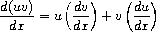

= Structure and interpretation of computer programs

== Building Abstractions with procedures

*Computational process*: abstract being that inhabits a computer. Manipulate *data*. Directed by *programs*.

Well designed programs are designed in a modular manner, so the parts can be constructed, replaced and debugged separately.

=== The elements of programming

Languages have three mechanisms for combining simple ideas into more complex ones.

* *primitive expressions*
* *means of combination*, where compound elements are built from simpler ones
* *means of abstraction*, where compound elements can be named and manipulated

*Data* is the stuff that is manipulated by *procedures*.

An expression is something that can be evaluated. Expressions can be grouped in parens, forming _combinations_. In prefix notation, the leftmost expression is the _operator_, and the other are the _operands_. The operator is applied to the operands.

Names can refer to computational objects. The name is the _variable_ and the object is the _value_. The variable is _defined_ as referring to the object. Definition is the simplest form of abstraction.

Definition can be repeated to build ever more complex things from simpler things, creating a tower of abstraction. This has the benefit of modularity: the ability to build complex things step by step from small procedures.

name/value pairs are maintained in the _global environment_.

To evaluate a combination:

. evaluate its subexpressions and substitute them for their values
. apply the operator to the operands

Note this is recursive.

Evaluation can take place in different orders. Namely, applicative order is the 'evaluate the arguments and then apply' model, whereas normal order is 'fully expand and then reduce'.

A *predicate* is a procedure that returns true or false.

Procedures are analogous to mathematical functions, with one addition: they must be effective. Consider a mathematical function `sqrt x = y ST y>=0 and y^2 = x`. This is not enough to make a procedure, because it doesn't tell you _how_ to get to y. A procedure must be executable. A procedure must be imperative.

A method for calculating square roots is using a specific case of Newton's method for successive approximations.

. Guess y
. If y is good enough, stop
. otherwise, average y with x/y to get the next guess

In code:

[source,clojure]
----
(defn good-enough? [guess x] (< (Math/abs (double (- (* guess guess) x))) 0.001))

(defn improve [guess x] (/ (+ guess (/ x guess)) 2))

(defn sqrt-iter [guess x]
  (if (good-enough? guess x)
    guess
    (sqrt-iter (improve guess x) x)))
----

Computing square roots like this breaks up into a number of sub-problems, each having a procedure. Any program can be divided into parts in many ways. The point is to divide it such that each part accomplishes an identifiable and independently meaningful task. In this way, we may treat each subcomponent as a black box. When I am developing `sqrt-iter`, I don't _need_ to know how George is implementing `improve`, only that it returns an improved guess. The detail is suppressed. From this perspective, it is a *procedural abstraction*.

The procedure `(defn square [x] (* x x))` has the name `x` that is local to its scope. It is a *bound variable* - the procedure definition _binds_ its formal parameters. If a variable is not bound, it is *free*. In `(defn sum-of-squares [x y] (+ (square x) (square y)))`, `square` is a free variable.

We can take advantage of *lexical scoping* to simplify (and limit the scope of) our procedures. Note in the following how `good-enough?` and `improve` now take a single input: guess, since `x` is bound in the lexical scope of the block that these functions exist in, it can be a free variable in those definitions.

[source,clojure]
----
(defn sqrt [x]
  (letfn [(good-enough? [guess] (< (Math/abs (double (- (* guess guess) x))) 0.001))
          (improve [guess] (/ (+ guess (/ x guess)) 2))
          (sqrt-iter [guess x] (if (good-enough? guess) guess (sqrt-iter (improve guess) x)))]
    (sqrt-iter 1 x)))
----

=== Procedures and the processes they generate

A procedure describes the local evolution of a process. Learning to visualize the evolution is crucial to being a good programmer.

Processes, as they evolve, take up time and space.

Consider the factorial function `n! = n * (n-1) * (n-2) ... 3 * 2 * 1`, and observe that `n!=n*(n-1)!`. In other words, this can be defined recursively.

[source,clojure]
(defn factorial [n] (if (= n 1) 1 (* n (factorial (dec n)))))

We can, by substitution, see that this will evolve thus:

image::../images/book_sicp/1_2_1_linear_recursive.gif[]

And you can see it's O(N) in both time (vertical) and space (horizontal)

If you define factorial differently, like

[source,clojure]
(defn factorial
  ([n] (factorial 1 1 n))
  ([acc i n] (if (= n i) (* acc i) (factorial (* acc i) (inc i) n))))

The process evolves differently:

image::../images/book_sicp/1_2_2_iterative.gif[]

Still O(N) in time, but now only O(1) in space.

In the first case, the process builds up a chain of _deferred operations_.

The first case is called a *linear recursive process*, the second an *linear iterative process*. (not to be confused with a *recursive procedure*, which is just a procedure which calls itself.)

In addition to the difference in space, note that the iterative process the variables contain the complete state of the process at all times. That's not true with the recursive case.

A third common pattern is *tree recursion*. Consider the fibonacci procedure:

[source,clojure]
(defn fib [n] (if (< n 2) n (+ (fib (- n 1)) (fib (- n 2)))))

This process evolves like this

image::../images/book_sicp/1_2_3_tree_rec.gif[]

Because each call to `fib` calls itself twice, the result is a tree of recursive calls. Note that this is extremely inefficient, because there are redundant calculations: `(fib 3)` is recalculated twice completely independently.

One can create a more efficient, linearly iterative implementation of fib:

[source,clojure]
(defn fib-iter [a b count] (if (zero? count) b (fib-iter (+ a b) a (dec count))))

Consider the problem of computing the exponential of a given number. This can be computed recursively or iteratively

[source,clojure]
----
(defn expt [b n] (if (zero? n) 1 (* b (expt b (dec n)))))

(defn expt-iter [b counter product]
  (if (zero? counter) product (expt-iter b (dec counter) (* b product))))
----

These are both O(n) in time. We can reduce this to O(log n) in time _and_ space by using successive squaring:

[source,clojure]
(defn fast-exp [b n]
  (cond (zero? n) 1
        (even? n) (square (fast-exp b (/ n 2)))
        :else (* b (fast-exp b (- n 1)))))

But this is again recursive. Making this iterative is tough (and an exercise).

=== Formulating abstractions with higher order functions

We've seen that procedures are abstractions of compound operations.

A limitation of what we've seen so far is that you can only create abstractions across data inputs. To take it to the next level, you want to be able to construct procedures that accept and apply _other procedures_. Such things are called *higher order procedures*.

Consider the two functions

[source,clojure]
(defn sum-integers [a b] (if (> a b) 0 (+ a (sum-integers (+ a 1) b))))
(defn sum-cubes    [a b] (if (> a b) 0 (+ (cube a) (sum-cubes (+ a 1) b))))
(defn pi-sum       [a b] (if (> a b) 0 (+ (/ 1 (* a (+ a 2))) (pi-sum (+ a 4) b))))

Clearly these share a lot of similarity. They all follow the pattern 

`(defn name [a b] (if (> a b) 0 (+ (term a) (name (next a) b))))`

This indicates an underlying pattern worthy of higher level abstraction - and indeed, this is the expression of the 'summation of a series', or sigma notation. `Σf(n)`. This allows mathematicians to express the concept of summation independent of what is actually being summed. We can do the same thing using higher order functions. In the following, term and next are procedures.

[source,clojure]
(defn sum [term a next b] (if (> a b) 0 (+ (term a) (pi-sum (next a) b))))
(sum identity 5 inc 10) ;; equivalent to sum-integers
(defn sum-cubes [a b] (sum cube a inc b))

This is a little clumsy, because we're required to define (and name) the term and next function each time we want to use it. We can get around that by using *anonymous functions*, or *lambdas*.

[source,clojure]
(defn pi-sum [a b] (sum (fn [x] (/ 1 (* x (+ x 2))) a (fn [x] (+ x 4) b))))

Passing in functions as arguments means we can use procedures to express general method of computation, like we did with `sum`. Here are a couple of more elaborate examples.

The half-interval method find roots of equations. If `f(a)<0<f(b)`, then f must have a root in the interval a b. By averaging a and b we can recursively narrow on to that root

[source,clojure]
----
(defn close-enough? [a b]
  (< (Math/abs (- a b)) 0.001))

(defn search [f a b]
  (let [mid (average a b)]
    (if (close-enough? a b)
      mid
      (let [test (f mid)]
        (cond (pos? test) (search f a mid)
              (neg? test) (search f mid b)
              :else mid)))))

(defn half-interval [f a b]
  (let [fa (f a) fb (f b)]
    (cond (< fa 0 fb) (search f a b)
          (< fb 0 fa) (search f b a)
          :else "Error: values are not of opposite sign")))

(half-interval #(Math/sin %) 2.0 4.0)
;; => 3.14111328125
(half-interval #(- (cube %) (* 2 %) 3) 1.0 2.0)
;; => 1.89306640625
----

Finding the fixed point of a function (where `f(x)=x`) can be done in a similar way.

[source,clojure]
----
(defn fixed-point [f first-guess]
  (letfn [(close-enough? [v1 v2] (< (Math/abs (- v1 v2)) 0.00001))
          (try* [guess] (let [next (f guess)] (if (close-enough? guess next) next (try* next))))]
    (try* first-guess)))

(fixed-point #(Math/cos %) 1.0)
;; => 1.0
(fixed-point #(+ (Math/sin %) (Math/cos %)) 1.0)
;; => 1.2587315962971173
----

This is effectively an abstraction on the method for finding square roots we looked at earlier, and we can create a sqrt fn like `(defn sqrt [x] (fixed-point (fn [y] (/ x y)) 1.0))`. However note that this would fail to converge because guesses would repeat. Hence we need to define f to be `(average y (/ x y))` - exactly as we did above. This pattern of preventing the guesses from changing too much is called *average damping*

We saw how allowing procedures to be passed as arguments we can make our procedures more expressive and general. We can further enhance this by allowing functions to be _returned_ from procedures. Take the average damping process mentioned above. A 1-arity function can be transformed to an average damped version like `(defn average-damp [f] (fn [x] (average x (f x))))`. Our sqrt function can now be defined as `(defn sqrt [x] (fixed-point (average-damp (fn [y] (/ x y))) 1.0))`.

Note now that the 3 ideas that comprise the method of squaring are _totally explicit_: fixed-point search, average damping, and the function `x/y`. The outcome, and even the way the process evolves is identical to our original sqrt function, but the _idea_ of what it is doing is so much clearer. In addition, the individual ideas can now be reused in other contexts. An experienced programmer can express her ideas in this clear and modular way.

=== Newtons Method

We've been playing with Newton's method for a while without expressing exactly what it is. It is the use of the fixed point method to approximate a solution of an equation. If `g(x)` is a differentiable function, then the solution of the equation `g(x)=0` is the fixed point of `f(x)` (i.e. `f(x)=x`), where `f(x)=x - g(x)/Dg(x)`, where `Dg(x)` is the derivative of g evaluated at x.

We can express the idea of a 'derivative' as `Dg(x) = (g(x+dx)-g(x)) / dx`.

So we can express this idea with a procedure, and use it to calculate the derivative of `g(x)=x^3` at `x=5`, which computationally we know is `3^x2`, or 75 at x=5.

[source,clojure]
(def dx 0.00001)
(defn deriv [g] (fn [x] (/ (- (g (+ x dx)) (g x)) dx)))
((deriv cube) 5)
;; => 75.00014999664018

Now we can express Newton's method more generally, and use it in an even more explicit version of sqrt:

[souce,clojure]
(defn newton-transform [g]
  (fn [x] (- x (/ (g x) ((deriv g) x)))))
(defn newtons-method [g guess]
  (fixed-point (newton-transform g) guess))
(defn sqrt [x] (newtons-method #(- (square %) x) 1.0))
(sqrt 2)
;; => 1.4142135623822438

> As programmers, we should be alert to opportunities to identify the underlying abstractions in our programs and to build upon them and generalize them to create more powerful abstractions. This is not to say that one should always write programs in the most abstract way possible; expert programmers know how to choose the level of abstraction appropriate to their task. But it is important to be able to think in terms of these abstractions, so that we can be ready to apply them in new contexts. The significance of higher-order procedures is that they enable us to represent these abstractions explicitly as elements in our programming language, so that they can be handled just like other computational elements.

== Building abstractions with data

So far we've looked at procedural abstractions operating on numerical data. Usually, we'll need to build more complex abstractions on data types themselves. In particular, _compound data types_. Similarly to procedural abstractions, this will allow us to elevate the conceptual level at which we can design our programs.

Consider rational numbers (i.e. those that can be expressed as x/y, where x and y are integers). We could design a program where we we deal with and track numerators and denominators separately. But it would be better if we could 'glue together' the two numbers, and deal with them as a single thing, and we can separate how we deal with rational numbers from their concrete representation, such separation forming an *abstraction barrier* between different parts of a program.

=== Introduction to data abstraction

A data abstraction is when you use compound data objects so that they operate on abstract data. The concrete data representation is defined independently from the programs that use the data. We use *selectors* and *constructors* to interface between the two thing.

Consider an API for a rational numbers abstraction:

[source,clojure]
----
(make-rat <n> <d>)
(numer <x>)
(denom <x>)
----

This is an example of the *wishful thinking* strategy. We haven't talked about how this will be implemented, only the operations we would like to use to interact with rationals. Using these, we can trivially implement higher level operations on rationals:

[source,clojure]
----
(defn add-r [x y] 
  (make-rat (+ (* (numer x1) (denom x2)) (* (numer x2) (denom x1))) 
            (* (denom x1) (denom x2))))
----

We can implement a data structure for rationals with a pair: 

[source,clojure]
----
(defn pair [a b] [a b])
(defn make-rat [n d] (pair n d)) 
(defn numer [x] (first x)) 
(defn denom [x] (second x)) 
----

Note that make-rat doesn't reduce its arguments to the gcd, but can be made to do so trivially.

We can envision this schema as a series of abstraction barriers, where at each level separated by a barrier, the level doesn't need to know how the implementation below it works. This makes programs easier to maintain and modify, since provided we don't change the API, we can change how lower level procedures are implemented without breaking the client.

----
=== Programs that use rational number ===
    Rational numbers in problem domain
========= add-rat, sub-rat etc. =========
    Rational numbers as numer / denom
======= make-rat, numer, denom ==========
       Rational numbers as pairs
========= pair, first, second ===========
    Language implementation of pair
----

It is worth pausing to consider what we mean by data. We implemented rationals with `pair` `first` and `second` above, but we don't know how the language implements them. We assume there is some underlying 'stuff' which allows us to glue together two numbers and then later retrieve them. In fact we can easily implement these without any such underlying data, using only procedures:

[source,clojure]
----
(defn pair [x y]
  (fn [m]
    (cond (= m 0) x
          (= m 1) y
          :else (throw (ex-info "Argument not 0 or 1" [x y m])))))

(defn first [z] (z 0))
(defn second [z] (z 1))
----

=== Hierarchical data and the closure property

We've seen pairs are primitive glue we can use to make compound data.

image::../images/book_sicp/2_2_box1.gif[]

We can extend this to create more complicated things by having pairs of _pairs_. 

image::../images/book_sicp/2_2_box2.gif[]

This permits the creation of _hierarchical_ data structures: structures made up of parts which are themselves made up of parts.

The two most important structures we can create with nested pairs are *sequences* and *trees*.

==== Sequences

A sequence can be represented as a chain of pairs, where the first element is your data, and the second element is a pair, the first element of which is your data, the second element is a pair...etc.

image::../images/book_sicp/2_4_sequence.gif[]

This would be constructed using like

[source,clojure]
----
(pair 1
      (pair 2
            (pair 3
                  (pair 4 nil))))
;; => [1 [2 [3 [4 nil]]]]
----

Not the use of `nil` (from _nihil_, meaning "nothing") to terminate the list.

This sequence is call a _list_, or linked list. Clojure has a built in primitive `list` to help in constructing lists. The above can be described `(list 1 2 3 4)`

Note that in Clojure, lists are _not_ represented as a chain of pairs. So in SICP `cdr` can be equivalent to `second` or `rest` depending on the data structure.

We can manipulate lists by successively " `rest` ing down" the list. For example, to get the nth element of the list:

[source,clojure]
----
(defn list-ref [items n]
  (if (= n 0) (first items)
      (list-ref (rest items) (- n 1))))

(list-ref (list 1 4 9 16 25) 3) ;;=> 16
----

Sometimes you'll want to traverse the whole list, so you need to know when you're finished - which is signalled by the call to `rest` returning the empty list

[source,clojure]
----
(defn length [items]
  (if (empty? items) 0
      (+ 1 (length (rest items)))))

(length (list 1 3 5 7))
----

Another convention is to " `cons` up" an result list while `rest` ing down another one:

[source,clojure]
----
(defn append [list1 list2]
  (if (empty? list1) list2
      (cons (first list1) (append (rest list1) list2))))

(append (list 1 4 9 16 25) (list 1 3 5 7)) ;; => (1 4 9 16 25 1 3 5 7)
(append (list 1 3 5 7) (list 1 4 9 16 25)) ;; => (1 3 5 7 1 4 9 16 25)
----

(note: in Clojure, `cons` _is_ the right fn to use here, even though it hasn't been up to now. This is due to the differing implementations of lists in Scheme and Clojure).

Often we want to apply a transform to each element in a list. 

[source,clojure]
----
(defn scale-list [items factor]
  (if (empty? items) nil
      (cons (* (first items) factor)
            (scale-list (rest items) factor))))

(scale-list (list 1 2 3 4 5) 10)
----

This idea is useful enough that it can be abstracted into a higher order function called `map`

[source,clojure]
----
(defn map' [f items]
  (if (empty? items) nil
      (cons (f (first items))
            (map' f (rest items)))))

(map' (fn [item] (* item 10)) (list 1 2 3 4 5))

(defn scale-list [items factor]
  (map' (fn [x] (* x factor) items)))
----

(Note: though `map'` is defined here, for future examples, Clojure's built in `map` will be used)

`map` represents an important pattern, because it allows us to deal with lists at a higher level. In the original `scale-list` it was very explicit how we were looping through the sequence. `map` suppresses that detail. We are allowed to _think_ about the operation differently. `map` is a way of erecting an abstraction barrier that isolates implementation of procedures that transform lists from the detail of how lists are created and combined.  

==== Hierarchical structures

We saw that sequences can be thought of as chains of pairs, where the first element is scalar data, and the second is another pair (or nil). We can further generalise this by permitting the _first_ element to be a compound structure too. For example `(pair (list 1 2) (list 3 4))` could be thought of as 

image::../images/book_sicp/2_5_hier.gif[]

Or alternatively, as a _tree_

image::../images/book_sicp/2_6_tree.gif[]

Note that a tree consists of leaves (scalar data) and branches (compound glue). Note also that a tree can be thought of as consisting of sub-trees.

[source,clojure]
----
(defn count-leaves [tree]
  (cond (not (coll? tree)) 1
        (empty? tree) 0
        :else (+ (count-leaves (first tree))
                 (count-leaves (rest tree)))))

(length (list (list 1 2) 3 4)) ;; => 3
(count-leaves (list (list 1 2) 3 4)) ;; => 4
----

We can also use `map` together with recursion to deal with trees.

[source,clojure]
----
(defn scale-tree [tree factor]
  (map (fn [subtree]
         (if (coll? subtree) (scale-tree subtree factor)
             (* subtree factor)))
       tree))

(scale-tree '((1) 2 (3 4)) 3)
;; => ((3) 6 (9 12))
----

==== Sequences as conventional interfaces

Consider the procedures

[source,clojure]
----
(defn sum-odd-squares [tree]
  (cond (not (list? tree)) (if (odd? tree) (square tree) 0)
        (empty? tree) 0
        :else (+ (sum-odd-squares (first tree))
                 (sum-odd-squares (rest tree)))))

(sum-odd-squares '(1 2 3 4 5))
;; => 35

(defn even-fibs [n]
  (letfn [(next [k]
            (if (> k n) nil
                (let [f (fib k)]
                  (if (even? f) (cons f (next (inc k))) (next (+ k 1))))))]
    (next 0)))

(even-fibs 10)
;; => (0 2 8 34)
----

On the surface these would seem to have little in common. The first can be described as:

. enumerates the leaves of a tree as a sequence
. filters them, selecting the odd ones
. computes the square of each of the selected ones
. accumulates the results using +, starting a zero

The second as:

. enumerates the integers from 0 to n as a sequence
. computes the Fibonacci numbers for each integer
. filters them, selecting the even ones
. accumulates the results using cons, starting with the empty list

The first step is to create a sequence of values from our input data structure. These can be analogized as 'signals' flowing through a circuit, with stages implementing which transform those signals/sequences

image::../images/book_sicp/2_7_pipe.gif[]

The procedures defined above don't really reflect this blueprint. In `sum-odd-squares`, the enumeration is spread over the whole function. Everything is mixed together. If we could separate them, we could get the same conceptual clarity as in the flow chart.

Filter can be implemented thus:

[source,clojure]
----
(defn filter' [pred s]
  (cond (empty? s) nil
        (pred (first s)) (cons (first s) (filter' pred (rest s)))
        :else (filter' pred (rest s))))

(filter odd? (list 1 2 3 4 5))
;; => (1 3 5)
----

And accumulations like:

[source,clojure]
----
(defn accumulate [op init s]
  (if (empty? s) init
      (op (first s)
          (accumulate op init (rest s)))))

(accumulate + 0 (list 1 2 3 4 5))
;; => 15
----

Now we need the "enumerate" part - this will be different for different inputs, since this is how we 'transform' whatever we're given into sequences (implemented here as lists).

[source,clojure]
----
(defn enumerate-interval [low high]
  (if (> low high) nil
      (cons low (enumerate-interval (inc low) high))))

(enumerate-interval 4 10)
;; => (4 5 6 7 8 9 10)

(defn enumerate-tree [tree]
  (cond (not (coll? tree)) (list tree)
        (empty? tree) nil
        :else (concat (enumerate-tree (first tree))
                      (enumerate-tree (rest tree)))))

(enumerate-tree '(1 (2 3) 4 5 (6 7)))
;; => (1 2 3 4 5 6 7)
----

Now the functions can be restated as an almost 1:1 match with the signal-flow plans.

[source,clojure]
----
(defn even-fibs [n]
  (->> (enumerate-interval 0 n)
       (map fib)
       (filter even?)
       (accumulate cons '())))

(even-fibs 10)
;; => (0 2 8 34)

(defn even-fibs [n]
  (->> (enumerate-interval 0 n)
       (map fib)
       (filter even?)
       (accumulate cons '())))

(even-fibs 10)
;; => (0 2 8 34)
----

In programming languages with looping constructs it's common to have 'nested loops' to deal with things like 2d matrices. Consider the problem: Given a positive integer n, find all ordered pairs of distinct positive integers i and j, where 1<=j<i<=n, such that i + j is prime.

One way to do this, is to enumerate a sequence of pairs [i j], then test and filter each of these for primality.

We can generate a list of `i` with `(enumerate 1 n) ;;=> [1 2 3 4,,,]`. For each of these `i` (i.e. we want to map over the sequence of i's) we want to generate a sequence of pairs `[i j]`, where `1<=j<i`. We can do this with `(enumerate 1 (dec i))`.

This should lead us down the path of a nested map:

[source,clojure]
----
(map (fn [j] (list 5 j)) (enumerate-interval 1 (- 5 1))) ;; inner map, for i=5
;; => ((5 1) (5 2) (5 3) (5 4))

(map (fn [i] (map (fn [j] (list i j)) (enumerate-interval 1 (- i 1)))) ;; nested map
     (enumerate-interval 1 10))
;; => (()
;;     ((2 1))
;;     ((3 1) (3 2))
;;     ((4 1) (4 2) (4 3))
;;     ((5 1) (5 2) (5 3) (5 4))
;;     ((6 1) (6 2) (6 3) (6 4) (6 5))
;;     ((7 1) (7 2) (7 3) (7 4) (7 5) (7 6))
;;     ((8 1) (8 2) (8 3) (8 4) (8 5) (8 6) (8 7))
;;     ((9 1) (9 2) (9 3) (9 4) (9 5) (9 6) (9 7) (9 8))
;;     ((10 1) (10 2) (10 3) (10 4) (10 5) (10 6) (10 7) (10 8) (10 9)))
----

This isn't exactly what we want - we need to 'unnest' the resultant sequences. We can do by accumulate with `append`, initial `nil`.

[source,clojure]
----
(accumulate append
            nil
            (map (fn [i] (map (fn [j] (list i j)) (enumerate-interval 1 (- i 1))))
                 (enumerate-interval 1 10)))
;; => ((2 1) (3 1) (3 2) (4 1) (4 2) (4 3) (5 1) (5 2)
;;     etc.
----

This pattern, where you end with a sequence of sequences of things but you want to get to just a sequence of things, is common enough that it has it's own convention, called the `flatmap`

[source,clojure]
----
(defn flatmap [f xs]
  (accumulate append nil (map f xs)))

(flatmap (fn [i] (map (fn [j] (list i j)) (enumerate-interval 1 (- i 1))))
         (enumerate-interval 1 10))
----

(Note: Flatmap is called `mapcat` in Clojure)

Now, we can answer the original question

[source,clojure]
----
(defn prime-sum? [pair]
  (prime? (+ (first pair) (second pair))))

(defn make-pair-sum [pair]
  (list (first pair) (second pair) (+ (first pair) (second pair))))

(defn prime-sum-pairs [n]
  (->> (enumerate-interval 1 n)
       (flatmap (fn [i] (map (fn [j] (list i j)) (enumerate-interval 1 (- i 1)))))
       (filter prime-sum?)
       (map make-pair-sum)))

(prime-sum-pairs 6)
;; => ((2 1 3) (3 2 5) (4 1 5) (4 3 7) (5 2 7) (6 1 7) (6 5 11))
----

=== Symbolic data

==== Symbolic differentiation example

We will write a program to do automatic differentiation, encoding the following rules:

image::../images/book_sicp/1_2_4_diffs1.gif[]
image::../images/book_sicp/1_2_4_diffs2.gif[]
image::../images/book_sicp/1_2_4_diffs3.gif[]

Our initial evaluator looks like this:

[source,clojure]
----
(defn deriv [exp var]
  (cond (number? exp) 0
        (variable? exp) (if (same-variable? exp var) 1 0)
        (sum? exp) (make-sum (deriv (addend exp) var)
                             (deriv (augend exp) var))
        (product? exp) (make-sum (make-product (multiplier exp)
                                               (deriv (multiplicand exp) var))
                                 (make-product (deriv (multiplier exp) var)
                                               (multiplicand exp)))
        :else (throw (ex-info "unknown expression type -- DERIV" exp))))
----

With one cond branch for each rule. There are a number of procedures we need to create (number? is a built-in in Clojure). To do that, we need to decide on a representation of an expression to be evaluated. Since we have perfectly good list-syntax, with `+` and `*` we can use that. So the exp in the above will look like `'(* (* x y) (+ x 3))`.

[source,clojure]
----

(def variable? symbol?)
(defn same-variable? [a b] (and (every? symbol? [a b]) (= a b)))
(defn sum? [expr] (and (seq expr) (= (first expr) '+)))
(defn product? [expr] (and (seq expr) (= (first expr) '*)))
(defn make-sum [e1 e2] (list '+ e1 e2))
(defn make-product [e1 e2] (list '* e1 e2))
(defn addend [expr] (nth expr 1))
(defn augend [expr] (nth expr 2))
(defn multiplier [expr] (nth expr 1))
(defn multiplicand [expr] (nth expr 2))

(deriv 1 'x)
;; => 0
(deriv '(+ x 3) 'x)
;; => (+ 1 0)
(deriv '(* x y) 'x)
;; => (+ (* x 0) (* 1 y))
(deriv '(* (* x y) (+ x 3)) 'x)
;; => (+ (* (* x y) (+ 1 0)) (* (+ (* x 0) (* 1 y)) (+ x 3)))
----

Unfortunately, the terms aren't being simplified. `(+ (* x 0) (* 1 y))` is obviously just `y`.

We can fix that by iterating our make-sum and make-product so they handle the cases where both values are numbers, the identity cases, and (for multiplication) the null cases.

[source,clojure]
----
(defn make-sum [e1 e2]
  (cond (every? number? [e1 e2]) (+ e1 e2)
        (and (number? e1) (zero? e1)) e2
        (and (number? e2) (zero? e2)) e1
        :else (list '+ e1 e2)))

(defn make-product [e1 e2]
  (cond (every? number? [e1 e2]) (* e1 e2)
        (and (number? e1) (zero? e1)) 0
        (and (number? e1) (= 1 e1)) e2
        (and (number? e2) (zero? e2)) 0
        (and (number? e2) (= 1 e2)) e1
        :else (list '* e1 e2)))

(deriv 1 'x)
;; => 0
(deriv '(+ x 3) 'x)
;; => 1
(deriv '(* x y) 'x)
;; => y
(deriv '(* (* x y) (+ x 3)) 'x)
;; => (+ (* x y) (* y (+ x 3)))
----

=== Multiple Representations for Abstract Data
=== Systems with Generic Operations

== Modularity, objects and state

== Metalinguistic abstraction

== Computing with register machines

== Exercises

=== Chapter 2

*Exercise 2.1* Define a better version of make-rat that handles both positive and negative arguments. Make-rat should normalize the sign so that if the rational number is positive, both the numerator and denominator are positive, and if the rational number is negative, only the numerator is negative.

*Answer 2.1* First figure out the decision tree:

.Table
|===
||XPos|XNeg

|YPos
|x/y
|x/y

|YNeg
|-x/-y
|-x/-y
|===

Simple enough: if y is negative, then you want to negate both x and y. Otherwise don't. That's the only test you need.

[source,clojure]
----
(defn make-rat [x y]
  (let [g (gcd x y) x (/ x g) y (/ y g)]
    (if (pos? y) (list x y)
        (list (- x) (- y)))))
----

*Exercise 2.2* Consider the problem of representing line segments in a plane. Each segment is represented as a pair of points: a starting point and an ending point. Define a constructor make-segment and selectors start-segment and end-segment that define the representation of segments in terms of points. Furthermore, a point can be represented as a pair of numbers: the x coordinate and the y coordinate. Accordingly, specify a constructor make-point and selectors x-point and y-point that define this representation. Finally, using your selectors and constructors, define a procedure midpoint-segment that takes a line segment as argument and returns its midpoint (the point whose coordinates are the average of the coordinates of the endpoints). To try your procedures, you'll need a way to print points

*Answer 2.2* The intended lesson here is making pairs of pairs (a segment is a pair of points, which is a pair of x y coordinates.)

[source,clojure]
----
(defn make-point [x y] (list x y))
(defn x-point [p] (first p))
(defn y-point [p] (second p))
(defn print-point [point] (println (str "[" (x-point point) ", " (y-point point) "]")))

(defn make-segment [p1 p2] (list p1 p2))
(defn start-segment [p] (first p))
(defn end-segment [p] (second p))

(make-segment (make-point 2 2) (make-point 3 3))

(defn midpoint-segment [seg]
  (make-point (average (x-point (start-segment seg))
                       (x-point (end-segment seg)))
              (average (y-point (start-segment seg))
                       (y-point (end-segment seg)))))

(print-point (midpoint-segment (make-segment (make-point 2 2)
                                             (make-point 3 3))))
----

*Exercise 2.3*.  Implement a representation for rectangles in a plane. (Hint: You may want to make use of exercise 2.2.) In terms of your constructors and selectors, create procedures that compute the perimeter and the area of a given rectangle. Now implement a different representation for rectangles. Can you design your system with suitable abstraction barriers, so that the same perimeter and area procedures will work using either representation? 

*Answer 2.3*. A wishful thinking implementation of perimeter and area would be like

[source,clojure]
----
(defn perimeter [rect]
  (* 2 (+ (width rect)
          (height rect))))

(defn area [rect]
  (* (width rect)
     (height rect)))
----

So the task is to make different width and height implementations for two representations of rectangle.

Representation 1 is just a pair of points representing diagonally opposing corners of the rectangle.

[source,clojure]
----
(defn make-rectangle [upper-left-point lower-right-point]
  (list upper-left-point lower-right-point))
(defn upper-left [rectangle] (first rectangle))
(defn lower-right [rectangle] (second rectangle))

(defn height [rect]
  (difference (y-point (upper-left rect))
              (y-point (lower-right rect))))

(defn width [rect]
  (difference (x-point (upper-left rect))
              (x-point (lower-right rect))))
----

Representation 2 is a line segment of the ul to lr diagonal

[source,clojure]
----
(defn make-rectangle [ulp lrp]
  (make-segment ulp lrp))

(defn height [rect]
  (difference (y-point (start-segment rect))
              (y-point (end-segment rect))))

(defn width [rect]
  (difference (x-point (start-segment rect))
              (x-point (end-segment rect))))
----

Not sure I really captured the idea here, the implementations are very similar...

*Exercise 2.4.*  Here is an alternative procedural representation of pairs. For this representation, verify that (car (cons x y)) yields x for any objects x and y.

[source,clojure]
----
(defn cons' [x y]
  (fn [f] (f x y)))

(defn car [g]
  (g (fn [p q] p)))
----

What is the corresponding definition of cdr? (Hint: To verify that this works, make use of the substitution model of section 1.1.5.) 

*Answer 2.4*. First, lets use substitution on `car` to see how it works:

[source,clojure]
----
(car (cons' 2 3))

"Sub out cons for the returned function, closed over its arguments"
(car (fn [m] (m 2 3)))

"Sub out car, which applies the procedure returned by cons onto another function"
((fn [m] (m 2 3)) (fn [p q] p))

"Sub in the car procedure for m in the cons procedure. We end up with just a proc that takes two arguments and returns the first"
((fn [p q] p) 2 3)
((fn [p q] p) 2 3)
2
----

The implication of this is that where `car` returns the first argument, `p`, cdr should return the second, `q`.

[source,clojure]
----
(defn cdr [z]
  (z (fn [p q] q)))
----

The substitution of this is basically identical.

What is `cons` doing here? It's closing over its arguments `x y` and returning a function that _takes_ a function and applies it to `x` and `y`. In other words, `cons` is expecting a function which takes 2 args, and is saying 'hey, here are my 2 elements, do what you want'.

The operations on the pairs that cons produces in this model are just applying the pair to a proc. Hence the repeating pattern in `car` and `cdr`. We can expand this to an abstract `apply-operation` function, which can be passed any operation which accepts two arguments, and will apply that to elements of the pair, meaning we can operate on the elements of the pair without having to use `car` and `cdr` directly.

[source,clojure]
----
(defn apply-operation [f] (fn [z] (z f)))
(def car (apply-operation (fn [p q] p)))
(def cdr (apply-operation (fn [p q] p)))

(car (cons' 2 3)) ;;=> 2
(cdr (cons' 2 3)) ;;=> 3
((apply-operation +) (cons' 2 3)) ;;=> 5
((apply-operation *) (cons' 2 3)) ;;=> 6
((apply-operation difference) (cons' 2 3))  ;;=> 1
----

*Exercise 2.5*.  Show that we can represent pairs of nonnegative integers using only numbers and arithmetic operations if we represent the pair _a_ and _b_ as the integer that is the product _2^a_ _3^b_. Give the corresponding definitions of the procedures `cons`, `car`, and `cdr`. 

*Answer 2.5*. The `cons` here is simple: `(defn cons [x y] (* (Math/pow 2 x) (Math/pow 3 y)))`.

The `car` and `cdr` here is more complicated. We essentially need to solve the equation `2^x * 3^y = c` for x and y for each operation respectively.

The key observation is that `2^x` is never divisible by 3, and `3^y` is never even. So to solve for y we can just divide out 2 until we get something that is _not_ divisible by 2. Then we've eliminated x from the equation, and we have `3^y = d`, and we can solve for `y = log3 d`. Similarly for x, we divide out 3.

[source,clojure]
----
(defn cons [a b]
  (int (* (Math/pow 2 a) (Math/pow 3 b))))

;; have to define a custom log fn here using the log base change rule.
(defn log [base num]
  (/ (Math/log num)
     (Math/log base)))

(defn cdr [x]
  (if (even? x)
    (cdr (/ x 2))
    (int (log 3 x))))

(defn car [x]
  (if (zero? (mod x 3))
    (car (/ x 3))
    (int (log 2 x))))

(cdr (cons 5 6)) ;;=> 6
(car (cons 5 6)) ;;=> 5
----

Note: This doesn't work for large integers because Java doesn't like `Mathpow(3, 1024)`, but in theory it should work.

*Exercise 2.6.*  In case representing pairs as procedures wasn't mind-boggling enough, consider that, in a language that can manipulate procedures, we can get by without numbers (at least insofar as nonnegative integers are concerned) by implementing 0 and the operation of adding 1 as

[source,clojure]
----
(def zero (fn [f] (fn [x] x)))

(defn add-1 [n]
  (fn [f] (fn [x] (f ((n f) x)))))
----

This representation is known as Church numerals, after its inventor, Alonzo Church, the logician who invented the lambda calculus.

Define one and two directly (not in terms of zero and add-1). (Hint: Use substitution to evaluate (add-1 zero)). 

Give a direct definition of the addition procedure + (not in terms of repeated application of add-1). 

*Answer 2.6*. See blog post https://redpenguin101.github.io/posts/2021_04_03_church.html[Church Numerals]

==== Extended exercise: Interval Arithmetic

https://mitpress.mit.edu/sites/default/files/sicp/full-text/book/book-Z-H-4.html#%_toc_%_sec_2.1.4[The full example]

This is about providing the ability to manipulate inexact quantities (such as measured parameters of physical devices) with known precision, so the end result also has a known precision.

Consider the equation for parallel equivalent resistance Rp of two resistors R1 and R2:

`Rp = 1 / (1/R1 + 1/R2)`

A resistor might be labelled "6.8 ohms with 10% tolerance", meaning the actual resistance will be between 6.12 and 7.48 ohms. If you have another resistor which is 4.7 5%, the parallel resistance will be between 2.58 (if both are at the lower bound) to 2.97 (if both are at the upper bound).

The goal is to define a data abstraction 'interval', and provide an arithmetic that operates on these intervals. Here's a translation of the code provided in the example:

[source,clojure]
----

(defn add-interval [x y]
  (make-interval (+ (lower-bound x) (lower-bound y))
                 (+ (upper-bound x) (upper-bound y))))

(defn mul-interval [x y]
  (let [p1 (* (lower-bound x) (lower-bound y))
        p2 (* (lower-bound x) (upper-bound y))
        p3 (* (upper-bound x) (lower-bound y))
        p4 (* (upper-bound x) (upper-bound y))]
    (make-interval (min p1 p2 p3 p4)
                   (max p1 p2 p3 p4))))

(defn div-interval [x y]
  (mul-interval x
                (make-interval (/ 1.0 (upper-bound y))
                               (/ 1.0 (lower-bound y)))))
----

*Exercise 2.7.*  Alyssa's program is incomplete because she has not specified the implementation of the interval abstraction. Define selectors upper-bound and lower-bound to complete the implementation.

*Answer 2.7*

[source,clojure]
----
(defn make-interval [lower-bound upper-bound] (list lower-bound upper-bound))
(defn lower-bound [interval] (first interval))
(defn upper-bound [interval] (second interval))
----

*Exercise 2.8.*  Using reasoning analogous to Alyssa's, describe how the difference of two intervals may be computed. Define a corresponding subtraction procedure, called sub-interval. 

*Answer 2.8* Here is Alyssa's reasoning referred to:

* She reasons that the minimum value the sum could be is the sum of the two lower bounds and the maximum value it could be is the sum of the two upper bounds
* Alyssa also works out the product of two intervals by finding the minimum and the maximum of the products of the bounds and using them as the bounds of the resulting interval.
* Alyssa multiplies the first by the reciprocal of the second.

Thinking through the subtraction: let's say we have an interval a=5-6, and another b=3-4.

If we take b from a, the minimum value of the result take is the smallest value of a, minus the largest value of b: 5-4=1. The maximum value of the results is the largest value of a, minus the smallest value of b: 6-3=3. So the resulting interval is 1-3.

We can encode this procedures as:

[source,clojure]
----
(defn sub-interval [x y]
  (make-interval (- (lower-bound x) (upper-bound y))
                 (- (upper-bound x) (lower-bound y))))

(sub-interval (make-interval 5 6)
              (make-interval 3 4))
;; => (1 3)
----

*Exercise 2.9.* The _width_ of an interval is half of the difference between its upper and lower bounds. The width is a measure of the uncertainty of the number specified by the interval. For some arithmetic operations the width of the result of combining two intervals is a function only of the widths of the argument intervals, whereas for others the width of the combination is not a function of the widths of the argument intervals. 

Show that the width of the sum (or difference) of two intervals is a function only of the widths of the intervals being added (or subtracted). Give examples to show that this is not true for multiplication or division. 

*Answer 2.9* Width Interval can be defined like this

[source,clojure]
----
(defn width-interval [x]
  (/ (- (upper-bound x) (lower-bound x)) 2))
----

This is easier to do with Algebra: `WI[X] = (ux-lx)/2`

Let X and Y be intervals. lx, ux are the lower and upper bounds of X, X can be represented as [lx ux].

_Addition_:

X+Y = [(lx + ly) (ux + uy)] = [lz uz] = Z

`WI[X]` is the width interval operation, `WI[X] = (ux-lx)/2`

`WI[(X+Y)] = WI[(lx+ly) (ux+uy)] = WI[lz uz] = (uz-lz)/2`

`= ((ux+uy) - (lx+ly))/2 = (ux-lx)/2 + (uy-ly)/2 = WI[lx ux] + WI[ly uy] = WI[X] + WI[Y]`

_Subtraction_

X-Y = [(lx - uy) (ux - ly)]

`WI[X-Y] = WI[(lx - uy) (ux - ly)] = WI[lz uz] = (uz-lz)/2`

`= ((ux-ly) - (lx-uy))/2 = (ux-lx)/2 - (uy-ly)/2 = WI[lx ux] + WI[ly uy] = WI[X] + WI[Y]`

[source,clojure]
----
(let [X (make-interval 4 10)
      Y (make-interval 2 3)
      Z-add (add-interval X Y)
      Z-sub (sub-interval X Y)
      Z-mul (mul-interval X Y)
      Z-div (div-interval X Y)]
  {:test-add (= (width-interval Z-add) (+ (width-interval X) (width-interval Y)))
   :test-sub (= (width-interval Z-sub) (+ (width-interval X) (width-interval Y)))
   :test-mul (= (width-interval Z-mul) (+ (width-interval X) (width-interval Y)))
   :test-div (= (width-interval Z-div) (+ (width-interval X) (width-interval Y)))})
;; => {:test-add true, :test-sub true, :test-mul false, :test-div false}
----

*Exercise 2.10.*  Ben Bitdiddle, an expert systems programmer, looks over Alyssa's shoulder and comments that it is not clear what it means to divide by an interval that spans zero. Modify Alyssa's code to check for this condition and to signal an error if it occurs. 

[source,clojure]
----
(defn spans-zero [x]
  (or (zero? (upper-bound x))
      (zero? (lower-bound x))
      (and (neg? (lower-bound x))
           (pos? (upper-bound x)))))

(defn div-interval [x y]
  (if (spans-zero y)
    (throw (Exception. "Divisor interval can't span zero"))
    (mul-interval x
                  (make-interval (/ 1.0 (upper-bound y))
                                 (/ 1.0 (lower-bound y))))))
----

(It's no super clear to me why spanning zero is a problem - the resulting interval seems to work out OK provided neither of the bounds of y are _equal_ to zero).

*Exercise 2.11.* In passing, Ben also cryptically comments: "By testing the signs of the endpoints of the intervals, it is possible to break mul-interval into nine cases, only one of which requires more than two multiplications." Rewrite this procedure using Ben's suggestion.

*Answer 2.11* The nine cases are

.Table
|===
|case|negative|positive

|1: All pos
|
|lx ux ly uy

|2: lx neg
|lx
|   ux ly uy

|3: both X neg
|lx ux
|ly uy

|4: ly neg
|ly
|lx ux uy

|5: both Y neg
|ly uy
|lx ux

|6: Both span
|lx ly
|ux uy

|7: only uy pos
|lx ux ly 
|uy

|8: only ux pos
|lx ly uy
|ux

|9: all neg
|lx ux ly uy
|
|===

Note: if ux is neg, that implies lx is also neg, and if lx is pos, that implies ux is also pos, hence cutting down on possibilities like 'only ux neg'. This also helps us out in the testing, since we can test that everything is positive just by testing that lx and ly are positive.

[source,clojure]
----
(defn mul-interval2 [x y]
  (let [lx (lower-bound x)
        ux (upper-bound x)
        ly (lower-bound y)
        uy (upper-bound y)]
    (cond
      (and (pos? lx) (pos? ly))           (make-interval (* lx ly) (* ux uy)) ;; 1. all pos
      (and (neg? lx) (pos? ux) (pos? ly)) (make-interval (* lx uy) (* ux uy)) ;; 2. only lx neg 
      (and (neg? ux) (pos? ly))           (make-interval (* lx uy) (* ux ly)) ;; 3. lx, ux neg
      (and (neg? ly) (pos? uy) (pos? lx)) (make-interval (* ux ly) (* ux uy)) ;; 4. only ly neg
      (and (neg? uy) (pos? lx))           (make-interval (* ux ly) (* lx uy)) ;; 5. ly, uy neg
      (and (neg? lx) (pos? ux)            ;; 6. lx ly neg, ux uy pos (both span)
           (neg? ly) (pos? uy))           (make-interval (min (* lx uy) (* ux ly))
                                                         (max (* lx ly) (* ux uy)))
      (and (neg? ux) (neg? ly) (pos? uy)) (make-interval (* lx uy) (* lx ly)) ;; 7. only uy pos
      (and (neg? uy) (neg? lx) (pos? ux)) (make-interval (* ux ly) (* lx ly)) ;; 8. only ux pos
      (and (neg? ux) (neg? uy))           (make-interval (* ux uy) (* lx ly)) ;; 9. all neg
      )))
----

*Exercise 2.12.*

After debugging her program, Alyssa shows it to a potential user, who complains that her program solves the wrong problem. He wants a program that can deal with numbers represented as a center value and an additive tolerance; for example, he wants to work with intervals such as 3.5± 0.15 rather than [3.35, 3.65]. Alyssa returns to her desk and fixes this problem by supplying an alternate constructor and alternate selectors:

[source,clojure]
----
(defn make-center-width [c w]
  (make-interval (- c w) (+ c w)))

(defn center [i]
  (/ (+ (lower-bound i) (upper-bound i)) 2))

(defn width [i]
  (/ (- (upper-bound i) (lower-bound i)) 2))
----

Unfortunately, most of Alyssa's users are engineers. Real engineering situations usually involve measurements with only a small uncertainty, measured as the ratio of the width of the interval to the midpoint of the interval. Engineers usually specify percentage tolerances on the parameters of devices, as in the resistor specifications given earlier.

Define a constructor make-center-percent that takes a center and a percentage tolerance and produces the desired interval. You must also define a selector percent that produces the percentage tolerance for a given interval. The center selector is the same as the one shown above.

[source,clojure]
----
(defn make-center-percent [c pct]
  (let [wdth (* c pct)]
    (make-interval (- c wdth) (+ c wdth))))

(defn percent [i]
  (/ (width i) (center i)))

(percent (make-center-percent 6.8 0.1)) ;; => 0.1
(center (make-center-percent 6.8 0.1)) ;; => 6.8
----