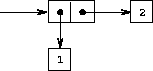
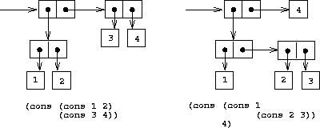
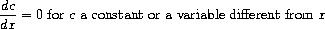

= Structure and interpretation of computer programs Part 2: Building abstractions with data
:toc:

So far we've looked at procedural abstractions operating on numerical data. Usually, we'll need to build more complex abstractions on data types themselves. In particular, _compound data types_. Similarly to procedural abstractions, this will allow us to elevate the conceptual level at which we can design our programs.

Consider rational numbers (i.e. those that can be expressed as x/y, where x and y are integers). We could design a program where we we deal with and track numerators and denominators separately. But it would be better if we could 'glue together' the two numbers, and deal with them as a single thing, and we can separate how we deal with rational numbers from their concrete representation, such separation forming an *abstraction barrier* between different parts of a program.

== Introduction to data abstraction

A data abstraction is when you use compound data objects so that they operate on abstract data. The concrete data representation is defined independently from the programs that use the data. We use *selectors* and *constructors* to interface between the two thing.

Consider an API for a rational numbers abstraction:

[source,clojure]
----
(make-rat <n> <d>)
(numer <x>)
(denom <x>)
----

This is an example of the *wishful thinking* strategy. We haven't talked about how this will be implemented, only the operations we would like to use to interact with rationals. Using these, we can trivially implement higher level operations on rationals:

[source,clojure]
----
(defn add-r [x y] 
  (make-rat (+ (* (numer x1) (denom x2)) (* (numer x2) (denom x1))) 
            (* (denom x1) (denom x2))))
----

We can implement a data structure for rationals with a pair: 

[source,clojure]
----
(defn pair [a b] [a b])
(defn make-rat [n d] (pair n d)) 
(defn numer [x] (first x)) 
(defn denom [x] (second x)) 
----

Note that make-rat doesn't reduce its arguments to the gcd, but can be made to do so trivially.

We can envision this schema as a series of abstraction barriers, where at each level separated by a barrier, the level doesn't need to know how the implementation below it works. This makes programs easier to maintain and modify, since provided we don't change the API, we can change how lower level procedures are implemented without breaking the client.

----
=== Programs that use rational number ===
    Rational numbers in problem domain
========= add-rat, sub-rat etc. =========
    Rational numbers as numer / denom
======= make-rat, numer, denom ==========
       Rational numbers as pairs
========= pair, first, second ===========
    Language implementation of pair
----

It is worth pausing to consider what we mean by data. We implemented rationals with `pair` `first` and `second` above, but we don't know how the language implements them. We assume there is some underlying 'stuff' which allows us to glue together two numbers and then later retrieve them. In fact we can easily implement these without any such underlying data, using only procedures:

[source,clojure]
----
(defn pair [x y]
  (fn [m]
    (cond (= m 0) x
          (= m 1) y
          :else (throw (ex-info "Argument not 0 or 1" [x y m])))))

(defn first [z] (z 0))
(defn second [z] (z 1))
----

== Hierarchical data and the closure property

We've seen pairs are primitive glue we can use to make compound data.

We can extend this to create more complicated things by having pairs of _pairs_. 

This permits the creation of _hierarchical_ data structures: structures made up of parts which are themselves made up of parts.

The two most important structures we can create with nested pairs are *sequences* and *trees*.

=== Sequences

A sequence can be represented as a chain of pairs, where the first element is your data, and the second element is a pair, the first element of which is your data, the second element is a pair...etc.

image::../images/book_sicp/2_4_sequence.gif[]

This would be constructed using like

[source,clojure]
----
(pair 1
      (pair 2
            (pair 3
                  (pair 4 nil))))
;; => [1 [2 [3 [4 nil]]]]
----

Not the use of `nil` (from _nihil_, meaning "nothing") to terminate the list.

This sequence is call a _list_, or linked list. Clojure has a built in primitive `list` to help in constructing lists. The above can be described `(list 1 2 3 4)`

Note that in Clojure, lists are _not_ represented as a chain of pairs. So in SICP `cdr` can be equivalent to `second` or `rest` depending on the data structure.

We can manipulate lists by successively " `rest` ing down" the list. For example, to get the nth element of the list:

[source,clojure]
----
(defn list-ref [items n]
  (if (= n 0) (first items)
      (list-ref (rest items) (- n 1))))

(list-ref (list 1 4 9 16 25) 3) ;;=> 16
----

Sometimes you'll want to traverse the whole list, so you need to know when you're finished - which is signalled by the call to `rest` returning the empty list

[source,clojure]
----
(defn length [items]
  (if (empty? items) 0
      (+ 1 (length (rest items)))))

(length (list 1 3 5 7))
----

Another convention is to " `cons` up" an result list while `rest` ing down another one:

[source,clojure]
----
(defn append [list1 list2]
  (if (empty? list1) list2
      (cons (first list1) (append (rest list1) list2))))

(append (list 1 4 9 16 25) (list 1 3 5 7)) ;; => (1 4 9 16 25 1 3 5 7)
(append (list 1 3 5 7) (list 1 4 9 16 25)) ;; => (1 3 5 7 1 4 9 16 25)
----

(note: in Clojure, `cons` _is_ the right fn to use here, even though it hasn't been up to now. This is due to the differing implementations of lists in Scheme and Clojure).

Often we want to apply a transform to each element in a list. 

[source,clojure]
----
(defn scale-list [items factor]
  (if (empty? items) nil
      (cons (* (first items) factor)
            (scale-list (rest items) factor))))

(scale-list (list 1 2 3 4 5) 10)
----

This idea is useful enough that it can be abstracted into a higher order function called `map`

[source,clojure]
----
(defn map' [f items]
  (if (empty? items) nil
      (cons (f (first items))
            (map' f (rest items)))))

(map' (fn [item] (* item 10)) (list 1 2 3 4 5))

(defn scale-list [items factor]
  (map' (fn [x] (* x factor) items)))
----

(Note: though `map'` is defined here, for future examples, Clojure's built in `map` will be used)

`map` represents an important pattern, because it allows us to deal with lists at a higher level. In the original `scale-list` it was very explicit how we were looping through the sequence. `map` suppresses that detail. We are allowed to _think_ about the operation differently. `map` is a way of erecting an abstraction barrier that isolates implementation of procedures that transform lists from the detail of how lists are created and combined.  

=== Hierarchical structures

We saw that sequences can be thought of as chains of pairs, where the first element is scalar data, and the second is another pair (or nil). We can further generalise this by permitting the _first_ element to be a compound structure too. For example `(pair (list 1 2) (list 3 4))` could be thought of as 

image::../images/book_sicp/2_5_hier.gif[]

Or alternatively, as a _tree_

image::../images/book_sicp/2_6_tree.gif[]

Note that a tree consists of leaves (scalar data) and branches (compound glue). Note also that a tree can be thought of as consisting of sub-trees.

[source,clojure]
----
(defn count-leaves [tree]
  (cond (not (coll? tree)) 1
        (empty? tree) 0
        :else (+ (count-leaves (first tree))
                 (count-leaves (rest tree)))))

(length (list (list 1 2) 3 4)) ;; => 3
(count-leaves (list (list 1 2) 3 4)) ;; => 4
----

We can also use `map` together with recursion to deal with trees.

[source,clojure]
----
(defn scale-tree [tree factor]
  (map (fn [subtree]
         (if (coll? subtree) (scale-tree subtree factor)
             (* subtree factor)))
       tree))

(scale-tree '((1) 2 (3 4)) 3)
;; => ((3) 6 (9 12))
----

=== Sequences as conventional interfaces

Consider the procedures

[source,clojure]
----
(defn sum-odd-squares [tree]
  (cond (not (list? tree)) (if (odd? tree) (square tree) 0)
        (empty? tree) 0
        :else (+ (sum-odd-squares (first tree))
                 (sum-odd-squares (rest tree)))))

(sum-odd-squares '(1 2 3 4 5))
;; => 35

(defn even-fibs [n]
  (letfn [(next [k]
            (if (> k n) nil
                (let [f (fib k)]
                  (if (even? f) (cons f (next (inc k))) (next (+ k 1))))))]
    (next 0)))

(even-fibs 10)
;; => (0 2 8 34)
----

On the surface these would seem to have little in common. The first can be described as:

. enumerates the leaves of a tree as a sequence
. filters them, selecting the odd ones
. computes the square of each of the selected ones
. accumulates the results using +, starting a zero

The second as:

. enumerates the integers from 0 to n as a sequence
. computes the Fibonacci numbers for each integer
. filters them, selecting the even ones
. accumulates the results using cons, starting with the empty list

The first step is to create a sequence of values from our input data structure. These can be analogized as 'signals' flowing through a circuit, with stages implementing which transform those signals/sequences

image::../images/book_sicp/2_7_pipe.gif[]

The procedures defined above don't really reflect this blueprint. In `sum-odd-squares`, the enumeration is spread over the whole function. Everything is mixed together. If we could separate them, we could get the same conceptual clarity as in the flow chart.

Filter can be implemented thus:

[source,clojure]
----
(defn filter' [pred s]
  (cond (empty? s) nil
        (pred (first s)) (cons (first s) (filter' pred (rest s)))
        :else (filter' pred (rest s))))

(filter odd? (list 1 2 3 4 5))
;; => (1 3 5)
----

And accumulations like:

[source,clojure]
----
(defn accumulate [op init s]
  (if (empty? s) init
      (op (first s)
          (accumulate op init (rest s)))))

(accumulate + 0 (list 1 2 3 4 5))
;; => 15
----

Now we need the "enumerate" part - this will be different for different inputs, since this is how we 'transform' whatever we're given into sequences (implemented here as lists).

[source,clojure]
----
(defn enumerate-interval [low high]
  (if (> low high) nil
      (cons low (enumerate-interval (inc low) high))))

(enumerate-interval 4 10)
;; => (4 5 6 7 8 9 10)

(defn enumerate-tree [tree]
  (cond (not (coll? tree)) (list tree)
        (empty? tree) nil
        :else (concat (enumerate-tree (first tree))
                      (enumerate-tree (rest tree)))))

(enumerate-tree '(1 (2 3) 4 5 (6 7)))
;; => (1 2 3 4 5 6 7)
----

Now the functions can be restated as an almost 1:1 match with the signal-flow plans.

[source,clojure]
----
(defn even-fibs [n]
  (->> (enumerate-interval 0 n)
       (map fib)
       (filter even?)
       (accumulate cons '())))

(even-fibs 10)
;; => (0 2 8 34)

(defn even-fibs [n]
  (->> (enumerate-interval 0 n)
       (map fib)
       (filter even?)
       (accumulate cons '())))

(even-fibs 10)
;; => (0 2 8 34)
----

In programming languages with looping constructs it's common to have 'nested loops' to deal with things like 2d matrices. Consider the problem: Given a positive integer n, find all ordered pairs of distinct positive integers i and j, where 1<=j<i<=n, such that i + j is prime.

One way to do this, is to enumerate a sequence of pairs [i j], then test and filter each of these for primality.

We can generate a list of `i` with `(enumerate 1 n) ;;=> [1 2 3 4,,,]`. For each of these `i` (i.e. we want to map over the sequence of i's) we want to generate a sequence of pairs `[i j]`, where `1<=j<i`. We can do this with `(enumerate 1 (dec i))`.

This should lead us down the path of a nested map:

[source,clojure]
----
(map (fn [j] (list 5 j)) (enumerate-interval 1 (- 5 1))) ;; inner map, for i=5
;; => ((5 1) (5 2) (5 3) (5 4))

(map (fn [i] (map (fn [j] (list i j)) (enumerate-interval 1 (- i 1)))) ;; nested map
     (enumerate-interval 1 10))
;; => (()
;;     ((2 1))
;;     ((3 1) (3 2))
;;     ((4 1) (4 2) (4 3))
;;     ((5 1) (5 2) (5 3) (5 4))
;;     ((6 1) (6 2) (6 3) (6 4) (6 5))
;;     ((7 1) (7 2) (7 3) (7 4) (7 5) (7 6))
;;     ((8 1) (8 2) (8 3) (8 4) (8 5) (8 6) (8 7))
;;     ((9 1) (9 2) (9 3) (9 4) (9 5) (9 6) (9 7) (9 8))
;;     ((10 1) (10 2) (10 3) (10 4) (10 5) (10 6) (10 7) (10 8) (10 9)))
----

This isn't exactly what we want - we need to 'unnest' the resultant sequences. We can do by accumulate with `append`, initial `nil`.

[source,clojure]
----
(accumulate append
            nil
            (map (fn [i] (map (fn [j] (list i j)) (enumerate-interval 1 (- i 1))))
                 (enumerate-interval 1 10)))
;; => ((2 1) (3 1) (3 2) (4 1) (4 2) (4 3) (5 1) (5 2)
;;     etc.
----

This pattern, where you end with a sequence of sequences of things but you want to get to just a sequence of things, is common enough that it has it's own convention, called the `flatmap`

[source,clojure]
----
(defn flatmap [f xs]
  (accumulate append nil (map f xs)))

(flatmap (fn [i] (map (fn [j] (list i j)) (enumerate-interval 1 (- i 1))))
         (enumerate-interval 1 10))
----

(Note: Flatmap is called `mapcat` in Clojure)

Now, we can answer the original question

[source,clojure]
----
(defn prime-sum? [pair]
  (prime? (+ (first pair) (second pair))))

(defn make-pair-sum [pair]
  (list (first pair) (second pair) (+ (first pair) (second pair))))

(defn prime-sum-pairs [n]
  (->> (enumerate-interval 1 n)
       (flatmap (fn [i] (map (fn [j] (list i j)) (enumerate-interval 1 (- i 1)))))
       (filter prime-sum?)
       (map make-pair-sum)))

(prime-sum-pairs 6)
;; => ((2 1 3) (3 2 5) (4 1 5) (4 3 7) (5 2 7) (6 1 7) (6 5 11))
----

== Symbolic data

=== Symbolic differentiation example

We will write a program to do automatic differentiation, encoding the following rules:

image::../images/book_sicp/1_2_4_diffs2.gif[]
image::../images/book_sicp/1_2_4_diffs3.gif[]
image::../images/book_sicp/1_2_4_diffs4.gif[]

Our initial evaluator looks like this:

[source,clojure]
----
(defn deriv [exp var]
  (cond (number? exp) 0
        (variable? exp) (if (same-variable? exp var) 1 0)
        (sum? exp) (make-sum (deriv (addend exp) var)
                             (deriv (augend exp) var))
        (product? exp) (make-sum (make-product (multiplier exp)
                                               (deriv (multiplicand exp) var))
                                 (make-product (deriv (multiplier exp) var)
                                               (multiplicand exp)))
        :else (throw (ex-info "unknown expression type -- DERIV" exp))))
----

With one cond branch for each rule. There are a number of procedures we need to create (number? is a built-in in Clojure). To do that, we need to decide on a representation of an expression to be evaluated. Since we have perfectly good list-syntax, with `+` and `*` we can use that. So the exp in the above will look like `'(* (* x y) (+ x 3))`.

[source,clojure]
----

(def variable? symbol?)
(defn same-variable? [a b] (and (every? symbol? [a b]) (= a b)))
(defn sum? [expr] (and (seq expr) (= (first expr) '+)))
(defn product? [expr] (and (seq expr) (= (first expr) '*)))
(defn make-sum [e1 e2] (list '+ e1 e2))
(defn make-product [e1 e2] (list '* e1 e2))
(defn addend [expr] (nth expr 1))
(defn augend [expr] (nth expr 2))
(defn multiplier [expr] (nth expr 1))
(defn multiplicand [expr] (nth expr 2))

(deriv 1 'x)
;; => 0
(deriv '(+ x 3) 'x)
;; => (+ 1 0)
(deriv '(* x y) 'x)
;; => (+ (* x 0) (* 1 y))
(deriv '(* (* x y) (+ x 3)) 'x)
;; => (+ (* (* x y) (+ 1 0)) (* (+ (* x 0) (* 1 y)) (+ x 3)))
----

Unfortunately, the terms aren't being simplified. `(+ (* x 0) (* 1 y))` is obviously just `y`.

We can fix that by iterating our make-sum and make-product so they handle the cases where both values are numbers, the identity cases, and (for multiplication) the null cases.

[source,clojure]
----
(defn make-sum [e1 e2]
  (cond (every? number? [e1 e2]) (+ e1 e2)
        (and (number? e1) (zero? e1)) e2
        (and (number? e2) (zero? e2)) e1
        :else (list '+ e1 e2)))

(defn make-product [e1 e2]
  (cond (every? number? [e1 e2]) (* e1 e2)
        (and (number? e1) (zero? e1)) 0
        (and (number? e1) (= 1 e1)) e2
        (and (number? e2) (zero? e2)) 0
        (and (number? e2) (= 1 e2)) e1
        :else (list '* e1 e2)))

(deriv 1 'x)
;; => 0
(deriv '(+ x 3) 'x)
;; => 1
(deriv '(* x y) 'x)
;; => y
(deriv '(* (* x y) (+ x 3)) 'x)
;; => (+ (* x y) (* y (+ x 3)))
----

=== 2.3.3 Example: Representing Sets

== Multiple Representations for Abstract Data

== Systems with Generic Operations