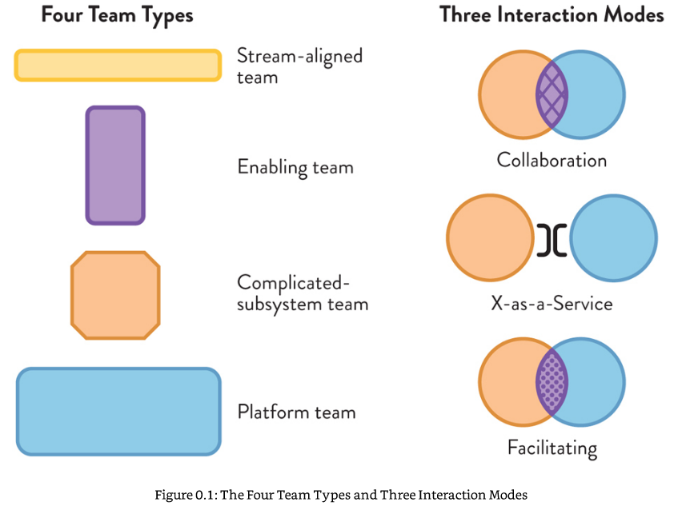

= Team Topologies: Organizing business and technology teams for fast flow
By Matthew Skelton and Manuel Pais

== The Unity

Conway's law tells us that organizations are constrained to produce systems that mirror the organizations communication structure. To make software architecture clear and comprehensible, and make delivery of software sustainable, we must carefully and explicitly design our software delivery team structures, including their interactions, and take care to manage their evolution to meet changing requirements. Some teams should be aligned to streams of business change, and some to building the 'platform' onto which those teams deliver. How these teams should interact should be carefully controlled according to the situation, since poor definition of communication channels is the source of much chaos and inefficiency.    

== Contents / Structure

*Part I* is about Conway's law: how organization interrelationships constrain system design, and how to use this to our advantage. It also defines some terminology used in the rest of the book

*Part II* is about static team patterns. Ignoring for now the fact that topologies need to change over time, this section provides common patterns (the Four Fundamental Topologies) for common organizational contexts.

*Part III* is where we move from static patterns to evolution of organizational structure. The creation of a 'sensing organization' to respond to changing demand.

* Part I: teams as the means of delivery
** 1. The problem with org charts
** 2. Conway's law
** 3. Team-first thinking
* Part II: Team topologies and flow
** 4. Static team topologies
** 5. Four fundamental topologies
*** Stream-aligned team
*** Enabling team
*** Complicated-subsystem team
*** Platform team
** 6. Choose team-first boundaries
* Part III: evolving team interactions for innovation and rapid delivery
** 7. Three modes of interaction between teams
*** Close collaboration
*** X-as-a-service (minimal collaboration)
*** Facilitation (clearing another teams impediments)
** 8. Evolving team structure
* Conclusion

== Key terminology

* *Topology*: Organizational design. How an organization is divided into teams and how those teams interact.
* *Interaction Mode*: A model for how two teams interact with eachother.
* *Conway's Law*: "Organizations which design systems are constrained to produce designs which are copies of the communication structures of these organizations".
* *Team External API*: The points and methods of interaction by which a team communicates outside itself: it's code, documentation, onboarding processes, chat channels, meetings. 
* *Team sized architecture*: No software component should be so large that a team can't keep it in their (collective) heads.

== Two hour summary: what is this book about?

=== The premise and goal of the book

* The goal is to make software architecture clear and its delivery sustainable.
* Teams are at the center of delivery. Ideally they are long-lived, autonomous.
* Teams don't live in isolation: they need to interact with each other.
* Interactions need to evolve over time / product lifecycle as requirements change
* An organization is divided into teams, and those teams interact with each other. That "Topology" needs to be designed. The model is not static: it needs to evolve to meet new requirements. That evolution needs to be planned and controlled. This book talks about how to do that.
* There is no formula, no detailed roadmap that will work in every case. The book provides patterns and anti-patterns, leaving out a lot of the detail.
* Behaviour patterns for teams are rarely specified, leaving teams without clear guidelines, and resulting in over-coupling or unscalable isolationism.
* This book tries to provide a well-defined way for teams to act and interact, by defining the *four topologies* and the *three interaction modes*

=== Four team types, three interactions

==== Team Types

1. *Stream Aligned Team*:
** aligned to the main flow of business change
** cross-functional skill mix
** Able to deliver significant increments without waiting on other teams
2. *Enabling Team*: Assists other teams in adopting and modifying software as part of transitional/learning period
3. *Complicated Subsystem Team*: Has special remit for a highly specialized and complex part of the system. Only used when absolutely necessary.
4. *Platform Team*:
** Works on underlying platform that stream-aligned teams use in delivery
** The platform reduces cognitive load for the stream-aligned teams 

==== Interaction Modes

1. *Collaboration Mode*: 
** Two teams work together on a shared goal
** Good for discovery spikes / new tech experimentation
** Overhead is valuable due to rapid learning (?!? not sure what this means)
2. *X-as-a-service Mode*: Team A consumes something provided by Team B (API, tool, product). Minimal collaboration
3. *Facilitating Mode*: Team A (Enabling Team) facilitates Team B (other type) in learning something. 

=== A summary of the content

* Problems in software delivery: 
** disengaged teams
** constant surprises that change plans
** trying to push back against Conway's law
** software that has outgrown the team
** too many design options and delivery frameworks
** too-frequent team reorgs
** poor flow of change
** Lack of team focus
* Many problems stem from the org not understanding what software delivery is about. It's not about 'feature delivery'. You can't ignore the team/human dynamics in modern software.
* Inter-team problems are valuable signals to be used to steer the organization. 
* Team types other than the 4 described are harmful
* Interaction types other than the 3 described are wasteful and indicative of lack of definition of team purposes / poorly chosen responsibility boundaries.  
* Choose the team type and interaction modes explicitly.
* The team is the fundamental means of delivery
* A team is not just a collection of individuals, but an entity itself
* A team should focus on ensuring it's 'External Team API' is coherent
* Software systems and components should be limited in size to that manageable by a single team to avoid cognitive overloading (The "Team Sized Architecture").
* Take advantage of Conway's law by structuring teams and facilitating and _intentionally limiting_ communication channels between teams to shape the overall system.
* The trend towards Microservices / Cloud architectures accommodate the need for team-sized architectures.
* Your team structure today will not be suitable tomorrow. During discovery, close team collaboration (to the point where the boundaries between the teams fade) is desirable. But if you stick with this pattern after discovery is done you'll get into trouble fast.
* Common patterns, when discovered, should be pushed down into the platform
* Non-team ingredients to success:
** an environment which supports development of individuals and teams, has a continuous learning cycle, and which is open to critical feedback
** Good engineering practices: test-first, CICD, avoid 'root-cause' incident post-mortems
** Good financial practices: Don't split CapEx from OpEx. Avoid project-driven deadlines and large-batch budgeting. Allocate training budgets to teams, not individuals
** Have clarity of business vision: human relevant timescales (3/6/12 months), reasoning behind priorities

=== A step plan for getting started

1: Start with the team. What does it need in order to be effective? What should the Team API be?

2: Identify suitable streams of change. Align your (Stream-aligned) teams to these streams.

3: Identify a "thinnest viable platform" (TVP): identify the services needed to support a reliable flow of change in those streams. These will form "the platform". It can (and should, at first) be small: just big enough but no bigger. A set of documentation that helps teams understand the services. 

4: Identify gaps in coaching, mentoring, service management, documentation. These are the basis of a continuous improvement cycle, which is the basis of increased velocity.

5: Share, explain and practice different interaction modes. Explain Conway's law
