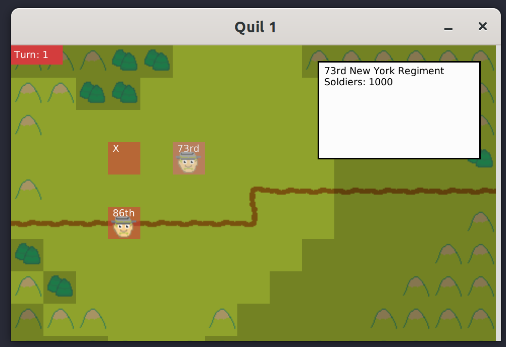

# Pocket general

[Github repo](https://github.com/RedPenguin101/pocket-gettysburg)

## Introduction
Pocket General (**PG**)[^1] is a small US Civil War tactics game using [Quil](https://github.com/quil/quil) as a UI.
PG takes inspiration from the simplicity, accessibility and retro aesthetic of the [Advance Wars](https://en.wikipedia.org/wiki/Advance_Wars) series for the Game Boy Advance and subsequent handhelds.
However, it intends to add several elements more common in war games, such as friendly fog of war, order delay, and morale, though few of these are implemented in this version[^2].

[^1]: You can see from the source it's had a couple of names, but Pocket General is the one I'm currently going with.

I wrote it to explore the different patterns and concepts used in developing a game, and to experience some of the challenges that introduces.
Talking about those will be the main focus of this article.

[^2]:I actually had a much more advanced version of this knocking around, with some of these features, and a pretty interesting real-time dispatch system, but unfortunately it seems to have gotten lost in some migration or other.

## Quick Start
You can launch the game from the REPL using `(ui/go)`.
This will launch the game with a default scenario, with the red team starting.
Or, you can build the project with `./build.sh` and run the resulting uberjar, which will do the same thing.



Darker shaded squares are in 'fog of war', i.e. you can't see in them.
Visibility (or 'viewsheds', see later) are blocked by trees and hills, or extended if a unit is on a hill.

Move the cursor with the arrow keys, and select a unit with the space bar.
This will highlight the movable area for that unit. 
You can issue a move order by moving the cursor, which will trace out a path for the unit. Note that terrain types affect movement, with roads offering quicker transit than fields, and hills and trees less than that.
Confirm the order by hitting the space bar again, and the unit will move.

You can end reds turn by pressing the 'e' key, which will mean it's blues turn.
By selecting the unit in the hills you can the effect of terrain on movement.

There is no combat currently in the game, so moving is all you can do.

## Game concepts
### Game loop
From what I've seen, most game implementations seem to revolve around a 'game loop'.
There is a game state, and a method of transitioning this game to the next 'tick' of that game-state.
Transitioning includes:

1. Getting and processing user input (via 'handlers')
2. Applying various 'systems' to the various game 'entities'[^3]
3. Drawing the resultant game state to the screen.

[^3]: Such as in the [Entity-Component-System](https://en.wikipedia.org/wiki/Entity_component_system) model that is very prevalent, though not used here

This happens frequently, 30 or 60 times per second.
Quil implements this quite literally - here's the slightly modified launch command, where each value is a function. 

```clojure
(q/defsketch game
    ,,,
    :setup setup
    :key-pressed key-handler ;; corresponds to step 1
    :update tick ;; step 2
    :draw draw-state ;; step 3
    ,,,)
```

This provides the basis of the architecture of this game, with the following major name-spaces

* UI: The bindings to the UI library (Quil), implementing how to draw various things like units, terrain. 
* UI-layers: an abstraction between the game-state and the drawing implementation, which makes any adjustments to the game state to pass to the implementations for drawing.
* Game: Contains all the logic for transitioning from one gamestate to the next, including all the handler functions for unit selection.

```
         ui
        /  \
ui layers   game
 | | |      | | |
various game logic: field, 
forces, viewsheds etc.
```

### GameState
I've mentioned game-state a lot.
It's just a map containing all the info about the game at a point in time.
Here's a significantly abbreviated map of what the gamestate looks like during a game.
Most of this is fairly self explanatory on what it's for

```clojure
{:turn-number 1,
 :images ;; snip - a map of all the sprites used
 :cursor [12 8],
 :field {[8 8] {:grid [8 8], :terrain :field},
         [11 9] {:grid [11 9], :terrain :mountains},
         [7 4] {:grid [7 4], :dirs [:dr], :terrain :road},
         ;; snip - this goes on for a while!
         }
 :field-size (15 10),
 :turn :blue,
 :red
 {:units {"c4070352-7cfa-45b7-926a-e99316830da0"
   {:short-name "73rd",
    :move-points 3,
    :max-move-points 3,
    :unit-type :infantry,
    :soldiers 1000,
   :movement-table {:field 1, :road 0.5, :trees 1, :mountains 2},
    :move-over false,
    :viewshed #{[8 8] ;; and other coordinates
                },
    :id "c4070352-7cfa-45b7-926a-e99316830da0",
    :side :red,
    :unit-name "73rd New York Regiment",
    :position [8 4]}}}
  :blue {:units ;; other units 
         }
  :camera [0 0],
  :ticks 27383,
  :order-queue ()}
```

### Bresenham and Rasterization

One concept that I hadn't heard of before I worked on this was the Bresenham Algorithms, and the rasterization concept.
Often when you want to draw something, you find yourself working in a continuous vector space, and nee to transfer this to a _discrete_ vector space - for example, a screen made of pixels.
Let's say you want to draw a line on a pixelated screen.
If the line is perfectly horizontal or vertical, no problem:
You just draw the line. in contiguous pixels.
But if the line is _diagonal_, how do you figure out which pixels you need to shade?
This problem obviously extends to any shape made of straight lines, but also circles, which is relevant to the game.

This is the problem that [Bresenham's algorithm](https://en.wikipedia.org/wiki/Bresenham%27s_line_algorithm) (in line and circle variants) solves.
I won't go into how the algorithm works, but it becomes necessary in the game for calculating how far a unit can see around them ("viewsheds")

A unit can see around them in all directions to 'x' spaces.


