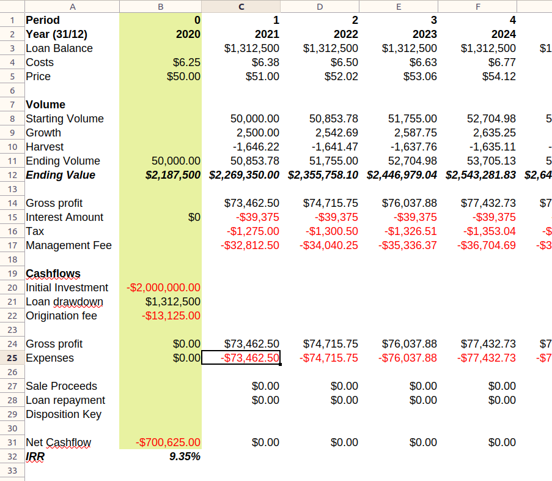

# Financial Modeling in Code
I work in a financial services firm, and obviously one of the core competencies is financial modeling. It is axiomatic that this means financial modeling _in Excel_. There are a few more advanced models, especially probabilistic ones, which use R, but 99% are in Excel. Excel is of course a fantastic program for this. But Excel has its limitations, and particularly at scale and over time Excel models can get unmanageable. Is there a better way to do this? 

This is a problem I've thought about before, and even tried to build something for, with limited success. In this post I'm going to try to go back to first principles, as well as try some practical examples using scenarios from the [Financial Modeling World Cup (FMWC)](https://www.fmworldcup.com/) (yes, that's a real thing) and see if there is some conclusions that can be drawn.

## What is a financial model?
Let's ground ourselves by looking at a sample financial model. The [FMWC Forest Investment Sample](https://www.fmworldcup.com/wp-content/uploads/2021/08/Forest-Investment-Task-Only2.zip) is a _very_ simple model, intended to be solved in 20 minutes. You can read the "Case Materials" pdf for the full details.

The scenario is that someone wants to invest in a forest, hold it for 10-25 years, and then sell it. The task set the analyst is to create a _financial model_ of the annual cash flows from this investment. That is, the analyst is expected to predict the cash flows, were this investment to be made, for the next 25 years. This is the first major characteristic of the financial model: It is presented as a time series of _periods_. These are generally annual, monthly, or quarterly

Next the case materials provide a series of _assumptions_. For example 
> _"Every year the volume of the forest grows by 5% compared to the volume at the beginning of the year"_, and _"The management fee is 1.5% per year from the forest value at the beginning of the year"_. 

These assumptions are the second major characteristic of a financial model. In the FMWC these assumptions are provided as a tab in the Excel workbook provided with the case materials[^2]. The third characteristic is also here, though a little more subtle: A financial period is based on the previous period or periods, and the set of assumptions. For example, the volume of the forest in year X+1 is the volume of the forest in year X, plus the growth in year X, minus the amount harvested in year X.

[^2]: 

The premise of the FMWC is that, once a model is created, a series of questions are asked, either about the "base case" like _"What will be the property management fee for Year 1?"_, or alternate scenarios, like _"What happens if we hold the project for 25 years? What is the project IRR[^3] then?"_. This mirrors the use of financial models in the real world, which is to determine the profitability of investments under a set of conditions (the base case), and to see how that changes when assumptions change.

[^3]: IRR is "Internal Rate of Return", a common metric for measuring and comparing the quality of investments. It is stated as a percentage, e.g. "a 9% IRR", and higher is better.

Another type of question is a "goal seeking" question: _"What is the maximum acquisition price that we can pay for the project and still deliver a 9% IRR rate?"_. This involves setting a goal output, and varying one of the assumptions or inputs[^4].

[^4]: Potentially more than one, though this can get rather complicated.

So to summarize the major characteristics of a financial model:
1. Comprised of a time series of periods
2. Has a set of assumptions
3. The 'next period' is a function of the previous period or periods and the assumption
4. Must be flexible to changes in assumptions
5. Must be able to 'goal seek' specific outputs from changes in assumptions.

## Modeling in Excel
With the caveat that I am _far_ from an expert in financial modeling, this is how I would do this in Excel:

1. create 'named' cells for assumptions for ease of reference
2. Set up a 'model' tab, and in column A, put a bunch of the things I think I need to model, broken down into sections, with period/year at the top and net cashflow at the bottom
3. Put period 0 in column B, mostly linking to assumptions tab
4. Put period 1 in column C, linking to either the assumptions tab, the current period (column C), or the previous period (column B)
5. Extend the model to the required number of periods by copying column C (in this case 25)
6. Go through an fix things that are broken

I would then answer the questions by either looking at the model, varying the assumptions, or goal-seeking under one of the assumptions.
