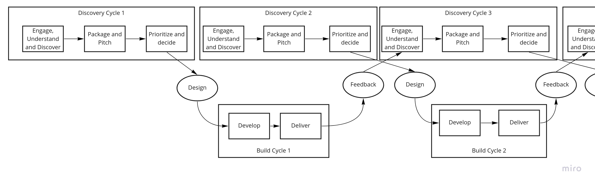

# Product Management in a Nutshell

Product Management is looking more and more like it's my long term job.
Since I'm looking for a role, I'm reading and re-reading a lot of the writing on the topic, and trying to think on the subject more holistically.
Since thinking without writing is barely thinking at all, here is my philosophy.
I don't claim there is anything startlingly original here, though there are a few formulations of ideas which are my own, in that I haven't read or heard them put like that anywhere else.

It is my firm belief that there isn't a formula for doing product management well.
It's so dependent on the situation you are in.
What I'm trying to lay down here is underlying principles that I believe are foundational.
This article is therefore going to be very light on specifics, and any specifics provided are given, not as a recipe to follow, but as examples to illustrate a general point, which probably won't work exactly the same for you.

## A tentative layout, subject to change
I divide the subject into two parts.
First, the Primary Function of Product Management, which is to make sure you're building the right thing at any given point in time.
Next, the various Secondary Functions of Product Management.
These are responsibilities which, though they really belong to the team as a whole, tend to naturally gravitate to the PM because they allow the engineers precious uninterrupted development time[^14]. These include bridging the users and engineers, managing the flow of work to the team and shielding them from noise, maintaining delivery focus, and implementing team feedback loops.

[^14]: Following [Paul Graham's concept](http://www.paulgraham.com/makersschedule.html) PMs tend to be on Manager's Schedule while engineers are on Maker's Schedule.

My thought is to divide this into the following parts, though this will probably change. And I hopefully will come up with snappier titles:

1. Building the right thing: What is the right thing?
2. Building the right thing: How do you find out what it is?
3. Building the right thing: How do you get the thing approved and ready for development?
4. Building the right thing: How do you get feedback on what you built to figure out the _next_ right thing?
5. Building trust and credibility with engineers.
6. Bridging engineers and users.
7. Managing the build cycle and keeping delivery focus.
8. Creating team feedback loops.

## The purpose of Product Management is to ensure the right thing is built

This is number one with a bullet.
The _raison d'etre_ of the Product Manager.
You have a team of engineers standing by.
The scope of what they can do is effectively unlimited.
What do they work on?
This has several sub-parts:

1. The **theoretical** question: What _is_ the right thing to build at any one time?
2. The **practical** question: Assuming there is a right thing to build out there, how do you go about figuring out what it is?
3. The **packaging** question: Once you figure it out, you have to persuade people to build it[^1].

[^1]: The PM is not a role with formal authority. They must lead by influence and persuasion.

All of these cover the 'discovery track' of a 'dual track' product cycle[^2].
They don't cover the _build_ track, though the PM has an important role to play here, which will be discussed later.

[^2]: See Marty Cagan, https://www.svpg.com/continuous-discovery/, and also later in this essay.

### What is the right thing to build?
This questions exists at many levels, right up to the foundational level of the company.
What is our product? 
What is the value that we are selling or renting to customers?
These are C-suite province, and it's really up to them to set that and effectively communicate it to the business.

Unless you're a CPO, or an early stage start-up, these are probably not questions that are a PM's _responsibility_ to wrestle with.
But you (and everyone in the company, really) should certainly be able to talk precisely about what it is the company produces.

#### From Strategy to Product
#### From User to Product

* The funnel - from strategy to work.
* Time for thinking - Bacon on reading, writing, conversing

### How do you go about finding out what to build?

Finding out what you need to build is like looking through a gap in a closed door.
If you put your eye up to the gap, you only see a very narrow slice of the room on the other side, and you risk misinterpreting what you see.
You need to _fling open the door_ and make sure you can see the full picture.
This is done by cultivating enduring, informal relationships with users, talking to them about what they do and why, and synthesizing that knowledge into a domain model.

Users generally have a very good sense of what their _specific_ problems are, but they tend not to introspect enough about their function in the organization to be able to put those problems in proper context.
Partially as a result of that, they have a tendency to bring you _solutions_ that are very context-tied to their current implementation.

**The worst thing you can do here is take the solution the user brings you at face value.**
It _might_ be the right thing to do, but even if it is, if you don't understand _why_ they want to do this, what it is they are trying to accomplish, your implementation will likely be quite poor.
More likely it _won't_ be the right thing to do, in which case the thing you implement will end up making things worse for the user, or they just won't use it.

So you need to 'dig under' the thing they bring you to the underlying problem they are trying to solve.
A big problem a lot of tech departments have is not realizing you need to do this. 
As a result they end up building either building things that don't get used, or building things in such a way that, as new requirements come in, they can't be easily accommodated without making a big mess.

This is easier said than done. 
What you need to build is an instinctive understanding of what the user is doing and why, fitting it into a broader context of a **mental domain model**.
In effect, you need to know their business at a high level better than they do.
You need to be able to effortlessly put yourself in their shoes.

### Cultivating informal relationships with users

You can't do this in a single user interview, or even in a series of interviews.
It takes months to get to that level.
It's also very difficult to get this point through formal means, by setting up very structured user interviews and the like, because formal interviews are very one way: the formality means the answers you get tend to be quite superficial.
You really need to be having _conversations_, not conducting interviews.
To do this, you need to build enduring, informal relationships with a broad range of users who are involved directly and tangentially in the domain you're working in.
Regular calls without specific agendas, coffee chats, as well as talking to people that their function interact with.
You need to have that relationship with various _levels_ of users - not only the people doing the work, but the team manager, and the person that _they_ report to.
You also need to talk to the customers of the function, and the suppliers.

This can be difficult to do if the person on the other side doesn't have an appreciation of the value of doing this, and doesn't have faith that doing things this way will lead to positive outcomes for them.
These are busy people, and they don't have much patience for what they perceive to be a waste of time.
You need a certain amount of credibility with them, to have a track record of delivering value to them.
And it is impossible if they don't _like_ you and don't like talking to you.

### Synthesizing domain knowledge

So you need to be talking to users a _lot_, and in the right way.
But you also need to be taking that knowledge, synthesizing it, and feeding it back to them.

The users mental model of their domain is likely very complex, to the point it can be self-contradicting.
There will be edge-cases all over the place.
Look out for the phrase _"Oh, but in this case, we do it like this instead."_
This is a problem for you, because this type of complex process resists the simplification you need to bring in order to create software.
People are smart, and they can easily deal with complex processes.
Computers are dumb, and they need relatively simple and very consistent models to work with. 

You need to write down[^12]

[^12]: And the writing is important. Writing forces you to be precise, and precision is exactly what you're aiming for here: To pull the fuzzy, complex domain from the users heads onto a page. 

* what the _current process_ is, both technical implementation and business process.
* lists of what the user is doing and _why_ they are doing it.
* what the _goals_ of the function are, how they measure success, and what are the _failures_ they are trying to prevent and why.
* how what they are doing fits into the _wider business context_, 
* what the nature and content of the information exchanges with other teams are.
* the _domain language_, the definitions of the domain specific terms they use are.

Then you need to feed those back to the various users involved and see how they react to them, and iterate on them, until you can speak their language.

### Use holistic domain knowledge to identify, rephrase and decompose problems

Now that you are able to put yourself in the users shoes, and you understand how their function works, you can start thinking about how to decompose their function into processes, and what the problems are with those processes[^5].

[^5]: In reality it won't be so linear, you will do this _while_ you are building your domain knowledge. But this is a [map, not a territory](https://en.wikipedia.org/wiki/Map%E2%80%93territory_relation).

This is where you need to be creative and flexible.
It's very hard to tell you how to do this.
You need to have a developed sense of design, and of course a deep understanding of the domain[^9].

[^9]: Knowledge of [general systems thinking](https://www.amazon.co.uk/Introduction-General-Systems-Thinking-ebook/dp/B004VS9AUS) as well as process frameworks like [TPS](https://www.amazon.co.uk/Toyota-Production-System-Beyond-Large-Scale-ebook/dp/B00SC849YK/ref=tmm_kin_swatch_0?_encoding=UTF8&qid=1664192340&sr=8-1) and [SixSigma](https://www.amazon.co.uk/Six-Sigma-Way-Maximize-Improvement/dp/0071497323/ref=sxts_rp_s_1_0) are also a plus.

Users rarely have enough time to properly think about their domain holistically.
They need to get work done.
The consequence of this is that their processes will often be malformed.
They will often be doing tasks in the wrong place, or sourcing information from a sub-optimal location.

A particularly common thing is that they have a 'review' step towards the end of a process to detect and correct defects, which would be unnecessary if they had engineered a task at the _start_ of the process such that those defects would be impossible.
They detected the problem at the end, and in the interests of getting the job done they did the first thing they thought of, and put in place a new task at the point they detected the problem, and that became the new process.
They didn't take the time to think about the _right_ place, and the right way, to prevent the problem they were having[^10].

[^10]: Defective products, and the early detection of them, is one of the 8 'muda', or wastes, of the Toyota Production System.

Say that this has happened, and the way the user is currently solving the problem is that they go to 3 different screens and compare the data on them,
In this case, the user will probably come to you saying 

> _"I want to see a single screen which aggregates all this information so that I can do the review more quickly"_.

Now that you have a proper map of the domain, you can dig into this a bit and realize that if this task was done earlier, they wouldn't need to do this review at all.

Another common thing you'll see is the user trying to compensate for deficiencies in upstream processes.
They'll say :

> "_I need to record this purchase of equity in System X, based on a trade ticket from System Y, but System Y doesn't have all the attributes I need. Currently I go to System Z to fill that gap and put the results in a spreadsheet and upload it to system X, but that takes me a lot of time. Can you automate the data pull from System Z into this spreadsheet?_"

Again, the solution they propose is too closely tied to the context in which they encounter it, and the current implementation.
If part of the information exchange contract between System Y and System X is that it needs to include some information, you should look at how this information can be made available to System X by System Y, or another way can make the System Z call an integral part of the sourcing of the exchange.
Coming up with the actual solution largely going to part of the build phase, so won't be covered here.
The important thing is that you recognize that the 'problem' the user has brought you is not ready to take to the devs. The work you spec for the development team should **not** be something like 

> The user needs data from System Z to be populated into this spreadsheet.

Instead it should be more like

> When a person on team Y sends a notification of an equity purchase to team X for processing, the equity needs to be classified according to the internal accounting classification so that it is assigned to the correct bucket for reporting.

Notice that the problem statement is tied to the process the user is trying to complete, not the current implementation, and that it includes context on how the problem fits into the broader aims of the function - in this case, to align the trades with downstream reporting.

I'm not saying this is the _right_ formulation.
It might be that this isn't even the right _domain_ to be solving the problem, let alone the right part of the process.
For example, you should seriously be asking _why_, if the consumer is a report, it's necessary to classify the equity here rather than at the point of report creation.
To know the answer to that, you need to have a deep understanding of the domain, and have very good connections on the business side.

### When to stop
Product management is a fractal thing.
You can (and should) ask why a lot[^3].
See, for example, this great tweet from Jason Knight[^4]:

[^3]: Similar to Ohno Taiichi's [Five Whys](https://en.wikipedia.org/wiki/Five_whys)

[^4]: https://twitter.com/onejasonknight/status/1526117155019927552

> "The user wants a good drill that makes a hole." 
> "The user doesn't want a drill, they want a hole."
> "No, they want their picture to stay up."
> "They just want to remember fond memories."
> "They..."
> 
> So much of product management is about working out when to stop

We saw a bit of that above, when we reframed the user 'requirement' into something with less of the current implementation.
But like in the tweet, you can keep playing that game.
When _do_ you stop asking why?
Which of these levels is the right one to focus your pitch on?

The unsatisfying answer is 'it depends.'
Really you want to make sure you at least _think through_ the 'why' all the way to the top, and figure out how what the user wants ultimately contributes to your company strategy.
This will be useful when you come to package and pitch a bit later.
There are some indicators that will be right in many cases. But there are exceptions to all of them.

1. Do you have mentions of specific technology or programs in there? If so, you're keying in too much on implementation.
2. Do you mention a user or group of users? If not, you've gone too far!
3. Is the problem in the scope of your product? In the above tweet, if your product is attaching things to walls, then the second or third is probably the right level. The fourth is a not, but might be if your product is something else.
4. Does your statement involve some kind of motivation?

### A Caution: Customers and Ego
I said above that you need to understand the users business better than they do.
In one sense this is true, but in another you will never know the business as well as they do, and you need to be very careful about confusing the two senses, because if you start to assume you are more of an expert than the user is, you will get in trouble real fast. 

Ego is the number one enemy of effective product management[^11].
I've stressed the need for you to be able to put yourself in the users shoes, to be able to effortlessly empathize with them.
Ego will prevent you from doing this. 
It will lead you to confuse what _you_ think about the domain, what _you_ think the goals and problems of the domain is, with what the users think.

[^11]: Or at least tied for number one place with apathy.

Especially as your experience of the domain grows, you can start to feel like you know the domain better than the user.
The reality is, even if you are a highly customer focused PM, you will be spending only a fraction of the time 'in' the domain as the users will, and nearly no time at the coal-face, actually doing the processes that you are trying to understand.
If you're building a relationship with a function and talking to several people in it, you are probably talking to people who have _decades_ of experience working in the domain.

Your advantage, if you have followed the above advice, is that you will have spent a lot of time introspecting and synthesizing the domain, which your users have probably not.
That definitely gives you an advantage, but don't confuse that with having a better instinctive feel for the requirements and values of the domain than the users who have been doing the work for years.

If you let your ego get in the way, and start thinking you have a better instinctive understanding than any of your interlocutors, you will likely be blinkering yourself, and start building the wrong thing, or building things wrong.

It's really a careful balancing act.
You absolutely _do_ want to be sceptical about what the users tell you, for reasons described about.
But you also can't be disregarding what the user says if it conflicts with your personal view about the domain.
In that case you need to assume that _you_ are wrong until you can prove otherwise.
You need to be able to distinguish the fact that users are not good at solving their own problems from the reality that you are talking to an expert at what they do.

### Package and Pitch

* Vision, scope, business value, success criteria.
* Priority

### Agility and Feedback loops (with the users, on the 'what')

Everything up to this point has been in the 'discovery' phase of the two-phase-process, rather than the 'build' phase, which is discussed later.
However, there are two points of connectivity between the two phases[^13].
The first is at the end of the packaging, when you finish discovery and start building.
The second is at the other end, when you finish _building_.
At this point you need to use feedback from what you have built to start a new cycle of discovery.

[^13]: In reality, the PM and developers are talking _every day_. But we're talking at a higher level of abstraction here.

**The best source of new ideas is the feedback you get from your delivered product**.
Product delivery is like an avalanche.
When you deliver something, that will nearly always open up at least two ideas for future delivery.
If you have a good relationship with your users, you will start getting unprompted ideas.
_"It's great that I can now do this, but I have this other process which is similar, can we bring that into scope?"_ _"I actually have this specific case that doesn't work so well for this, can we change the process for that case?"_, _"Now we're able to do this, I would love to be able to bring in this pre-cursor process, which is currently a headache."_[^7].

[^7]: Note that these ideas from the users will be _better_ than the ones you get when you are in discovery _without_ a triggering delivery, but you still can't take them at face value. Users tend to over-reach when they consider what else can be brought in scope of the thing you've built for them. Happily, if you've done domain discovery properly, you should already have a very good framework for thinking about this.

You _absolutely_ need to be building a loop here.
You can do this through direct user feedback.
Watching them use the product is great, because it gives you a sense of how closely your product implements the mental model the user has of the domain, and therefore how easy it is to use.
You should also be building your product in such a way that any feature you implement can be measured. [talk more about this]

### Notes, to delete

* Cultivating domain knowledge
* Empathy with users
* Methods of Discovery
* Turtles all the way down - when to stop, traversing the tower of turtles

* Users will give you bad solutions which you need to excavate.
* Users know what their problems are, but they are bad at solving their own problems. Th

## Secondary and Shared PM responsibilities

### Working with Engineers, bridging, managing the team.

Product Managers are primarily focused on the users or customers.
However, working with the engineering team is also a key part of the role.
In the first place, the PM acts as a sort of bridge, or translator between the groups.
In the second place, the PM often acts as a coordinator of the actual work the team is doing.
For both of these roles, it's critical that the PM can work effectively with engineers.
That means understanding what they are doing at a technical level, and even more crucially, building credibility and trust with the engineers.

The PM sits between customers with work to do, and engineers who have the means to build things that help them do that work.
To succeed, these two groups need to communicate effectively about what the problems are and how to solve them.
They need to trust and understand each other.
The problem is, these groups speak different, mutually incomprehensible languages.
At the simplest level, the differences are just those of knowledge.
The users speak in the language of the business domain, engineers in the language of technology.
Neither group speaks the language of the other, or at least not well.
This problem has a deceptive element:
Since the groups speak the _same_ language (in the sense that they both speak, for example, English), they probably don't realize that, in the context of talking about their respective domains, there are going to be many differences in what they common words they are using mean.
This is a constant source of miscommunication, frustration, and ultimately a lack of trust between the groups.

A key role the PM plays is to bridge this gap.
They need a proper recognition of the language barrier, and work constantly to overcome it.
They must act as translator, but also teach the critical elements of the respective domains to both sides.
They must make sure that 'noise' between the groups is eliminated.
For example, making sure technical terms that don't add to the understanding of the implementation aren't going over the wire to business users, instead re-phrasing them in abstractions the users will understand.
Don't talk about state machines, API calls, event buses. Talk about jobs and messages.[^8]

[^8]: Oddly, many business users seem totally comfortable with technical relational database terminology, but with very little else.

### Building trust and credibility with engineers
The engineers need to trust and like you.
They need to believe that, when you are bringing them work, it is going to be properly formed and well scoped.
They need to believe you are effectively shielding them from noise.
They need to have confidence that, when it comes time to talk about design and implementation, you have the technical chops to understand what they are proposing, and put the technical trade-offs between implementation options into context of the business requirements.
They need to know that you know that software quality matters, and you aren't going to try an railroad through hacky and unsustainable implementations.
(So that when you do need to do it, it's because it's for a very, very good reason.)

How do you go about building this trust?
The easiest way to relate to an engineer is through a shared enjoyment of technology.
Good developers love programming, love building things.
If you do too, then you will never run out engaging conversations with an engineer.
So you need a deep technical literacy.
If you can't code to the point where you can build a functioning system yourself, learn.

* Don't try to micromanage, let them do their jobs.
* relate to them about technical things.

* Technical literacy
* Communication
* Letting engineers decide the what.
* Bringing together customers and engineers
* Chunking of work.
* Quality and definition of done
* Tension between BV delivery and quality

### Delivery focus

There are some who will say _this_ is the major responsibility of the PM.
I disagree.
This should be the responsibility of the _team_, collectively.
However, that isn't to say that the PM doesn't have a major _role_ to play in this.

### Agility and Feedback loops (with the engineers, on the 'how')
* With the user
* From usage data
* Retrospection
* Did what we build accomplish the goals we had?

### The PM Organization

## Books and works referenced
* Escaping the Build Trap
* Ask Your Developer
* Cracking the PM career 
* Domain Driven Design