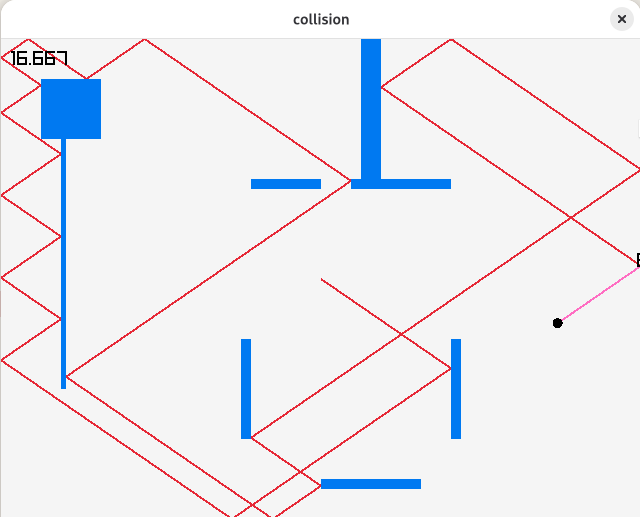

# Collisions

In a physical simulation, how do you handle entities colliding? In
this post I'm going to build a collision system from the ground up.
We're going to cover:

1. point and line collision
2. point and axis aligned rectangles
3. rectangle and rectangle
4. adding a 3rd dimension: cube collision
5. adding gravity

## Motion and Vectors

Collision occur in physical simulations, where you have entities with
positions and velocities. Both position (p) and velocity (v) are
represented as vectors. We're going to start with a 2d space, and
therefore 2d vector system. But as we'll see, the nice thing about
vectors is that you can extend to additional dimensions pretty easily.

I'm not going to go into basic vector math beyond saying that a
vectors are coordinates (x,y) which can be added together 'piecewise',
so (x,y)+(a,b)=(x+a, y+b). They can also be multiplied by a 'scalar'
number: 3*(x,y)=(3x, 3y). These two operations, vector addition and
scalar multiplication, are called _linear combinations_.

The position vector represents a point in your world. The velocity
vector describes how that position will change over a time step
(usually over 1 second). So if you have a position vector of (1,-1),
and a velocity vector of (3,4), you know that in exactly 1 second the
position will be (1+3, -1+4)=(4+3). And more generally, the position
at time t ($p_t$)is the position at time 0 ($p_0$) plus the velocity
multiplied by t.

$$
p_t = p_0 + tv
$$

That's all we need to know for now.

PICTURE

## Setting up the simulation

In order to visualize our collision system, we're going to render our
scene using the programing language Odin and the Raylib rendering
library:

```odin
package collision

import rl "vendor:raylib"

V2 :: [2]f32

Entity :: struct {
    p,v:V2
}

main :: proc() {
    screen_width  :: 640
    screen_height :: 480

    rl.InitWindow(screen_width, screen_height, "collision")
    rl.SetTargetFPS(60)
    frame_time:f32 = 1.0/60.0

    entity:Entity
    entity.p = {screen_width/2, screen_height/2}
    entity.v = {20,20}

    for !rl.WindowShouldClose() {
        rl.BeginDrawing()
        rl.ClearBackground(rl.RAYWHITE)

        rl.DrawCircleV(entity.p, 5, rl.BLACK)

        fps := f32(rl.GetFPS())
        frame_time_ms := 1000/fps
        rl.DrawText(rl.TextFormat("%.3f" ,frame_time_ms), 10, 10, 20, rl.BLACK)
        rl.EndDrawing()
    }

}
```

This will draw a canvas with a circle in the middle representing our
entity's position.

Our entity has a velocity vector, but it doesn't do anything yet. Next
we're going to create a 'game loop' to simulate the motion, and call
it every 'loop' through the simulation.

```odin
update_game :: proc(e:^Entity, seconds:f32) {
    e.p += e.v*seconds
}

main :: proc() {
    // snip
    frame_time:f32 = 1.0/60.0
    //...
    for !rl.WindowShouldClose() {
        //...
        update_game(&entity, frame_time)
        rl.DrawCircleV(entity.p, 5, rl.BLACK)
        //...
    }
}
```

The 'update' command is `e.p += e.v*seconds`. That is, adding the
velocity to the position to get to the new position, like we talked
about above. The reason we multiply by the `seconds` is the game
update loop is called many times a second. 60 times per second,
actually, meaning that every 'update' we make needs to move time
forward, not by 1 second, but by 1/60=0.01666 seconds. Since our
velocity is given as change in position over a second, we need to
multiply it by 0.01666 to apply the change in position over 0.01666 of
a second.

If you run the program now (`odin run .`), you should see your entity
move slowly down and to the right.

Try playing with the velocity vector to see what happens.

GIT LINK Moving point on screen.

## Point and Line collision detection

If we want our entity to collide with things, we need some things to
collide with. We're going to start simple: point-line collision. So
lets set up some lines to collide with.

Before we start, we are only going to be focusing on **axis-aligned**
lines. Horizontal and vertical lines only. Diagonal lines are a little
trickier. But this model extends well to the Axis Aligned Bounding Box
collision detection model which we're ultimately building towards.

We define a Line structure consisting of a start and end coordinate,
and an array of lines to draw. Now is a good time to start putting
things in a neat GameState structure which encapusulates all the state
for our simulation. Then we draw our lines on the screen.

```odin
V2 :: [2]f32
Line :: struct {start, end:V2}

Entity :: struct {
    p,v:V2
}

GameState :: struct {
    entity:Entity,
    lines:[dynamic]Line
}

main :: proc() {
    //...
    gs:GameState
    gs.entity.p = {screen_width/2, screen_height/2}
    gs.entity.v = {20,20}
    append(&gs.lines, Line{{450,300}, {450,400}})

    for !rl.WindowShouldClose() {
        //...
        for line in gs.lines {
            rl.DrawLineEx(line.start, line.end, 3, rl.BLUE)
        }
        //...
    }
```


Now we have a line, but our point goes right through it! We'll write
our first collision routine to fix this.

```odin
test_for_x_collision :: proc(l:Line, p, v:V2) -> (collides:bool, time:f32) {
    assert(l.start.x==l.end.x)
    if v.x == 0 do return false, 0
    test := l.start.x
    bound_min_y := min(l.start.y, l.end.y)
    bound_max_y := max(l.start.y, l.end.y)
    t := (test-p.x)/v.x
    EPSILON :: 0.0000001
    if t < EPSILON do return false, 0
    collide_y := t * v.y + p.y
    if collide_y >= bound_min_y && collide_y <= bound_max_y {
        return true, t
    } else {
        return false, 0
    }
}

// NOTE: update game now takes the game state
update_game :: proc(gs:^GameState, seconds:f32) {
    e := &gs.entity
    collided, t := test_for_x_collision(gs.lines[0], e.p, e.v)
    if collided && t < seconds {
        e.p += e.v*t
        e.v = {0,0}
    } else {
        e.p += e.v*seconds
    }
}
```

When you run your code, the point should now stop when it hits the
line. Let's dig into how this is done:

The update_game function now calls `test_for_x_collision` on our line
and using our entity p and v. The function returns a boolean
'collided' if the point will actually hit the line at some point. And
the time that collision occured if it did.

To check for the collision **for a vertical line** we want to check at
what time the x coordinate of the point will be equal to the
x-coordinate of the line (which is constant for a vertical line). And
once we've found this time of collision, we need to find the
y-coordinate of the point at that time, and check that it's between
the y coordinates of the line.

We know that the x position of the point at any point in time t is
equal to it's current position plus the change in position (velocity)
multiplied by t.

$$
P_x = p_x + tv_x
$$

Since we know all of these things except t, we can rearrange this
equation to solve for t:

$$
t = \frac{P_x-p_x}{v_x}
$$

Then, when we've found this t, we can plug it back into the same
formula, but with y in place of x, to find $P_y$.

$$
P_y = p_y + tv_y
$$

Then simply compare this value to the line y coordinates. This is what
these lines of code do:

```odin
test_for_x_collision :: proc(l:Line, p, v:V2) -> (collides:bool, time:f32) {
    if v.x == 0 do return false, 0
    test := l.start.x
    bound_min_y := min(l.start.y, l.end.y)
    bound_max_y := max(l.start.y, l.end.y)
    t := (test-p.x)/v.x
    EPSILON :: 0.0000001
    if t < EPSILON do return false, 0
    collide_y := t * v.y + p.y
    if collide_y >= bound_min_y && collide_y <= bound_max_y {
        return true, t
    } else {
        return false, 0
    }
}
```

There are a few additional things to note about this code:

It only works for vertical lines - that is, lines where the start and
end x coordinates are the same. I said it before, but it's worth
repeating.

If `v.x` is zero, we immediately return false. This is because, if the
entity has zero horizontal velocity, it will never hit the vertical
line.

If t is less than zero (or actually, less than "EPSILON", which is
nearly zero), we return false. It t is positive, it means the point
will hit the line in t seconds. If it's negative it means it hit the
line -t seconds ago. We're not interested in that, so we return false
if it's negative.

Back to that EPSILON value of 0.0000001: The reason we test against
that instead of just zero is for 2 reasons. First, weird things happen
if the point ever ends up _exactly on_ the line, because the point
then doesn't know which 'side' of the line it's on. Second: we're
using floating point numbers, which are imprecise, so you can
accidentaly find yourself going 'through' the line if you're not
careful. To guard against these we introduce a small 'buffer' into our
test to avoid our point ever getting _really_ close to the line.

Next, look at how our update function has changed:

```odin
update_game :: proc(gs:^GameState, seconds:f32) {
    e := &gs.entity
    collided, t := test_for_x_collision(gs.lines[0], e.p, e.v)
    if collided && t < seconds {
        e.p += e.v*t
        e.v = {0,0}
    } else {
        e.p += e.v*seconds
    }
}
```

Now, instead of just adding the velocity to the position, we first
check for a collision. If there is a collision, we check whether the
collision occurs _before_ our time step (seconds) has elapsed. If it
does, we adjust our position change to be the velocity times the time
of the _collision_. Then we zero out the velocity to stop it moving.

PICTURE
GITHUB LINK

## Bouncing / Reflecting

Stopping is not much good: we want our point to reflect off the line
and continue in the other direction. We can do this by _changing_ our
velocity on collision instead of zeroing it. But change it how? It
depends what outcome you want, but for now we're going to work on the
basis that it's a 'pure' bounce which doesn't lose any momentum.

Just by eyeballing it you can probably figure out what needs to
happen: the y-velocity needs to remain the same, and the x-velocity
needs to be 'flipped'. So the velocity of (20,20) becomes (-20,20).

PICTURE

However this doesn't generalize very well, so we're going to use a
method of reflection using the _normal vector to a line_ and the
_dot-product_ of two vectors.

### Normal vectors

The normal vector of a line is the vector which is at right angles to
the line. There's some math to calculate it, but here's where our "no
diagonal lines" rules helps us: The normal vector of a vertical line
is (-1,0), and of a horizontal line is (0,-1).

PICTURE

Notice that these normal vectors has a length of exactly 1 - what's
referred to as a _unit vector_, and in the context of normal vectors
the _unit normal_. I'll be using the term normal and unit normal
interchangeably.

### Dot Product

The dot product of two vectors is a new operation on vectors in
addition to the ones we've been using of vector addition and scalar
multiplication.

$$
v \cdot w = v_x w_x + v_y w_y
$$

The dot product returns a _scalar value_, a single float, not a
vector.

```odin
dot :: proc(v,w:V2) -> f32 {
    return v.x*w.x + v.y*w.y
}
```

The dot product is useful all over the place, but for our purposes the
interesting thing is what happens when you dot a vector with the
normal, which is to _project_ the vector onto the axis described by
the normal vector. In practice this lets us reflect vectors around an
axis.

### Velocity Reflection

If we want to reflect our velocity vector v off a line with normal n,
we need to use the formula:

$$
v' = v - 2(v \cdot n)n
$$

That is, reduce it by 2 times the dot product time n.

In our example, where v=(20, 20), and n=(-1,0)

$$
v \cdot n = 20 \cdot (-1) + 20 \cdot 0 = -20
$$

$$
v' = v - 2(v \cdot n)n = (20,20) - 2 \cdot (-20) \cdot (-1,0) = (20,20)-(40,0) = (-20,20)
$$

Which matches our intuitive result from before.

This can seem like magic, bit it's pretty simple if you look at it
visually:

PICTURE

For all that, implementing this in our code is very straightforward:
plug that formula in instead of zeroing out the velocity.

```odin
    if collided && t < seconds {
        e.p += e.v*t
        normal := V2{-1, 0}
        e.v = e.v - 2*dot(e.v, normal)*normal
    } else {
        e.p += e.v*seconds
    }
```

Once you've done that, you should see your point 'bounce' off the
wall.

We've hardcoded that normal of (-1,0) for now.

GITHUB LINK

## In search of lost time

One thing you might have noticed now we're bouncing is that we're not
using up all our time: In a collision scenario, when you do
`e.p+=e.v*t`, we finish the update. But there is stil `seconds-t`
seconds left unsimulated. We should be using up this time.

To do this we'll just do a while loop (in odin, a for loop) on
collision until all our time is used up. On a collision we'll reduce
the time remaining by the time of the collision, and when there's no
collision we'll just set it to zero after using it all up.

We also put in a step limit which will exit the loop if we do more
than 5 iterations without using up all the time, just to add a bit of
robustness.

```odin
update_game :: proc(gs:^GameState, seconds:f32) {
    e := &gs.entity
    time_remaining := seconds
    steps_remaining := 5

    for steps_remaining > 0 && time_remaining > 0 {
        collided, t := test_for_x_collision(gs.lines[0], e.p, e.v)
        if collided && t < time_remaining {
            e.p += e.v*t
            normal := V2{-1, 0}
            e.v = e.v - 2*dot(e.v, normal)*normal
            time_remaining -= t
        } else {
            e.p += e.v*time_remaining
            time_remaining = 0
        }
        steps_remaining -= 1
    }
}
```

## More Lines, Horizontal Lines

We know we can only handle vertical lines. So
lets fix that. Add some more lines:

```odin
    gs:GameState
    gs.entity.p = {screen_width/2, screen_height/2}
    gs.entity.v = {80,80}

    append(&gs.lines, Line{{450,300}, {450,400}})
    append(&gs.lines, Line{{320,440}, {420,440}})
    append(&gs.lines, Line{{250,300}, {250,400}})
```

As expected, our ball goes right though the second, horizontal line.


The first reason this doesn't work is obvious: We're not even checking
this line, we're only checking the first one

```odin
        collided, t := test_for_x_collision(gs.lines[0], e.p, e.v)
```

So what we want to do is loop over all the lines we have. But we want
to do it in a particular way: we only care about the _next_ collision.
It might be that we will collide with line a in 2 seconds. But that's
irrelevant if we are going to collide with line b in 1 second. So what
we want is a 'next collision' function, which will loop over the
lines. That will look something like this:

```odin
next_collision :: proc(lines:[]Line, test_entity:Entity, time_left:f32) -> (collides:bool, time:f32, normal:V2) {
    c_ret:bool
    t_ret := time_left
    n_ret:V2

    for l in lines {
        c, t := test_for_x_collision(l, test_entity.p, test_entity.v)
        if c && t <= t_ret {
            c_ret = true
            t_ret = t
            n_ret = {-1,0}
        }
    }

    return c_ret, t_ret, n_ret
}

update_game :: proc(gs:^GameState, seconds:f32) {
    e := &gs.entity
    time_remaining := seconds
    steps_remaining := 5

    for steps_remaining > 0 && time_remaining > 0 {
        collided, t, normal := next_collision(gs.lines[:], e^, time_remaining)
        if collided {
            e.p += e.v*t
            e.v = e.v - 2*dot(e.v, normal)*normal
            time_remaining -= t
        } else { //...
```

But this will fail straight away on the assertion in
`test_for_x_collision` which checks for vertical lines - because we're
passing it a horizontal line.

So let's write a `test_for_y_collision`, as well as a helper function
which determines the axis alignment of a line.

```odin

AxisAlignment :: enum {invalid, vert, horz}

axis_alignment :: proc(l:Line) -> AxisAlignment {
    xs := l.start.x == l.end.x
    ys := l.start.y == l.end.y

    if xs && ys do return .invalid
    if xs do return .vert
    if ys do return .horz
    return .invalid
}

test_for_x_collision :: proc(l:Line, p, v:V2) -> (collides:bool, time:f32) {
    assert(axis_alignment(l)==.vert)
    if v.x == 0 do return false, 0
    test := l.start.x
    bound_min_y := min(l.start.y, l.end.y)
    bound_max_y := max(l.start.y, l.end.y)
    t := (test-p.x)/v.x
    EPSILON :: 0.0000001
    if t < EPSILON do return false, 0
    collide_y := t * v.y + p.y
    if collide_y >= bound_min_y && collide_y <= bound_max_y {
        return true, t
    } else {
        return false, 0
    }
}

test_for_y_collision :: proc(l:Line, p, v:V2) -> (collides:bool, time:f32) {
    assert(axis_alignment(l)==.horz)
    if v.y == 0 do return false, 0
    test := l.start.y
    bound_min_x := min(l.start.x, l.end.x)
    bound_max_x := max(l.start.x, l.end.x)
    t := (test-p.y)/v.y
    EPSILON :: 0.0000001
    if t < EPSILON do return false, 0
    collide_x := t * v.x + p.x
    if collide_x >= bound_min_x && collide_x <= bound_max_x {
        return true, t
    } else {
        return false, 0
    }
}

next_collision :: proc(lines:[]Line, test_entity:Entity, time_left:f32) -> (collides:bool, time:f32, normal:V2) {
    c_ret:bool
    t_ret := time_left
    n_ret:V2

    for l in lines {
        aa := axis_alignment(l)
        c:bool
        t:f32
        if aa == .vert {
            c, t = test_for_x_collision(l, test_entity.p, test_entity.v)
        } else if aa == .horz {
            c, t = test_for_y_collision(l, test_entity.p, test_entity.v)
        } else {
            panic("invalid line")
        }
        if c && t <= t_ret {
            c_ret = true
            t_ret = t
            n_ret = {-1, 0} if aa == .vert else {0, -1}
        }
    }

    return c_ret, t_ret, n_ret
}
```

This works! I added some red lines which shows the path the point
took. You can see the point is correctly bouncing off all 4 lines, one
in each 'direction'.


But the code is a little scrappy. That testx and testy functions are
literally exactly the same, just with the xs and ys reversed. Are we
going to have to have a test z when we add a 3rd dimension?

The reason that they look so similar is that test is the same
whichever axis you're looking at. You are testing a collision in one
dimension, and then checking the bounds of the other (or others, for
higher dimensions). So if you just shuffle (or 'swizzle' in vector
terminology) the dimensions so the dimension you want to test is in
the first slot, it'll work for both:

```odin
    for l in lines {
        aa := axis_alignment(l)
        c:bool
        t:f32
        if aa == .vert {
            c, t = test_for_x_collision(l, test_entity.p, test_entity.v)
        } else if aa == .horz {
            swiz_line := Line{l.start.yx, l.end.yx}
            c, t = test_for_x_collision(swiz_line, test_entity.p.yx, test_entity.v.yx)
        } else {
            panic("invalid line")
        }
        if c && t < t_ret {
            c_ret = true
            t_ret = t
            n_ret = {-1, 0} if aa == .vert else {0, -1}
        }
    }
```

GITHUB LINK

## Point vs Rectangle collision

We've got our basic point vs line collision. Extending it to point vs.
rectangle is pretty simple, because after all a rectangle is just 4
lines.

All we need is the definition of a Rectangle, and a function for
turning those rectangles into to 4 lines. There are lots of ways to
define a rectangle structure, but a convenient one for us is as two
V2s. Among other things, it's the same definition as a line, but
instead of describing the start and end of the line, they describe the
top left and bottom right corners of the rectangle.

```odin

Line :: struct {start, end:V2}
Rect :: struct {start, end:V2}

rect_to_lines :: proc(r:Rect) -> [4]Line {
    return [4]Line{
        Line{{r.start.x, r.start.y}, {r.start.x, r.end.y}}, // LEFT
        Line{{r.end.x, r.start.y}, {r.end.x, r.end.y}},     // RIGHT
        Line{{r.start.x, r.start.y}, {r.end.x, r.start.y}}, // TOP
        Line{{r.start.x, r.end.y}, {r.end.x, r.end.y}},     // BOTTOM
    }
}
```

We replace our lines with rectangles in the game state

```odin
GameState :: struct {
    entity:Entity,
    walls:[dynamic]Rect,
}
```

And our collision finder with rects:

```odin
next_collision :: proc(rects:[]Rect, test_entity:Entity, time_left:f32) -> (collides:bool, time:f32, normal:V2) {
    c_ret:bool
    t_ret := time_left
    n_ret:V2

    ////////////////////////////////////////////////////////////////
    // Wrap in an outer loop that unpack the rect into lines...
    for r in rects {
        lines := rect_to_lines(r)
        for l, i in lines {
            // ...Then everything is the same as before
```

We replace the line appends in main with rects - make sure you add some thickness to
them or two of the sides will be points, which will panic the program!

```odin
    gs:GameState
    gs.entity.p = {screen_width/2, screen_height/2}
    gs.entity.v = {60,60}

    append(&gs.walls, Rect{{450,300}, {460,400}})
    append(&gs.walls, Rect{{320,440}, {420,450}})
    append(&gs.walls, Rect{{240,300}, {250,400}})
    append(&gs.walls, Rect{{350,140}, {450,150}})
```

Finally, we want to swap out our line draw with a rectangle draw.

```odin
rl.DrawRectangleV(wall.start, wall.end-wall.start, rl.BLUE)
```


GITHUB LINK

## More Walls!

That was a bit anticlimactic. Lets add some more walls.

```odin
    gs.entity.v = {160,110}

    gs.debug_last_collision = gs.entity.p

    // Bounding walls of the screen
    append(&gs.walls, Rect{{-1,0}, {0,screen_height}})
    append(&gs.walls, Rect{{screen_width,0}, {screen_width+1,screen_height}})
    append(&gs.walls, Rect{{0,-1}, {screen_width,0}})
    append(&gs.walls, Rect{{0,screen_height}, {screen_width,screen_height+1}})

    // original walls
    append(&gs.walls, Rect{{450,300}, {460,400}})
    append(&gs.walls, Rect{{320,440}, {420,450}})
    append(&gs.walls, Rect{{240,300}, {250,400}})
    append(&gs.walls, Rect{{350,140}, {450,150}})

    // additional walls
    append(&gs.walls, Rect{{40,40}, {100,100}})
    append(&gs.walls, Rect{{60,100}, {65,350}})
    append(&gs.walls, Rect{{360,0}, {380,140}})
    append(&gs.walls, Rect{{250,140}, {320,150}})
```



## Rect vs Rect collision

