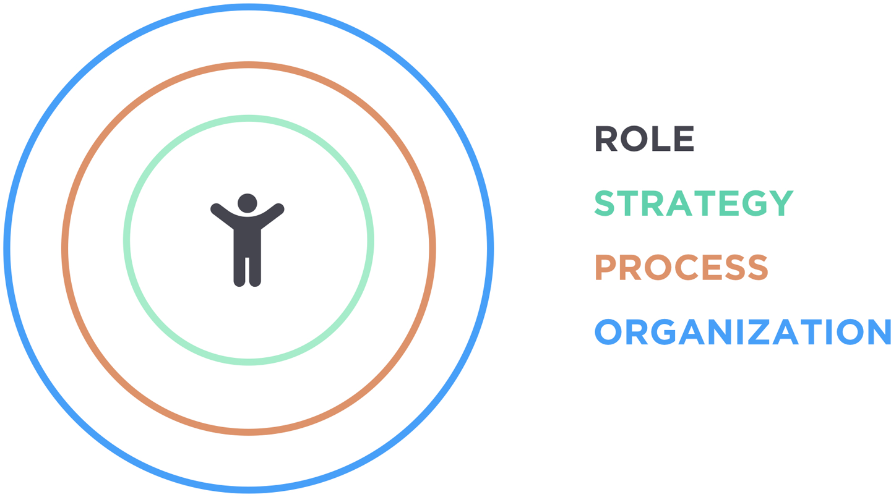
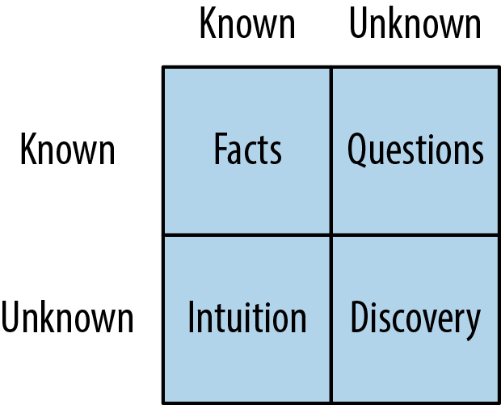
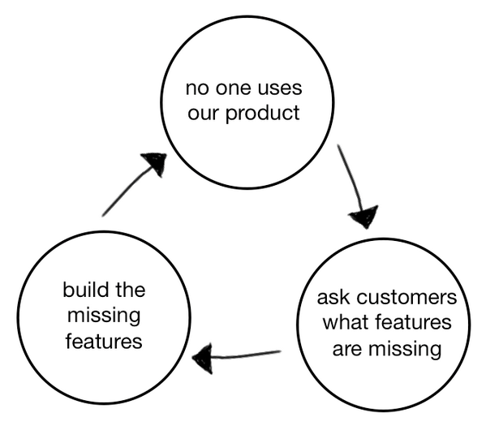
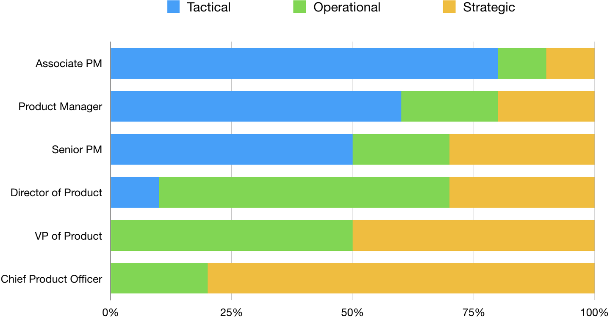
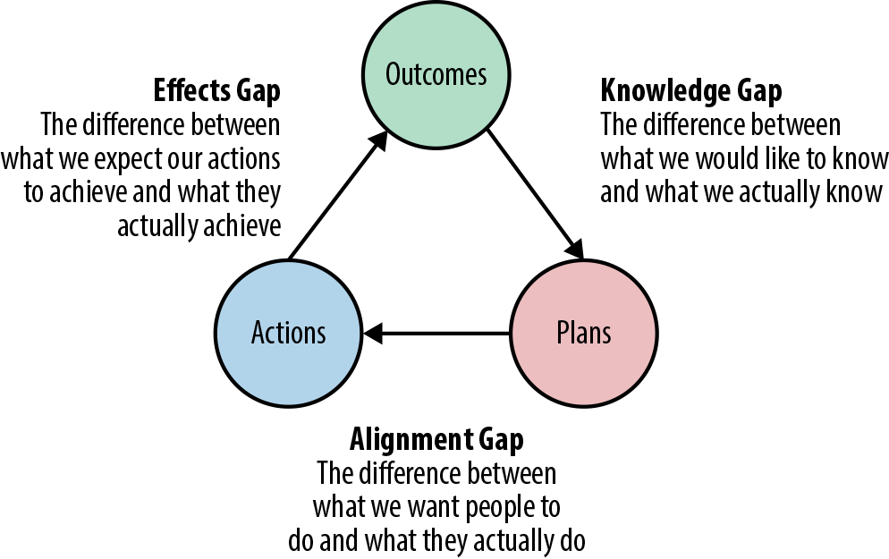
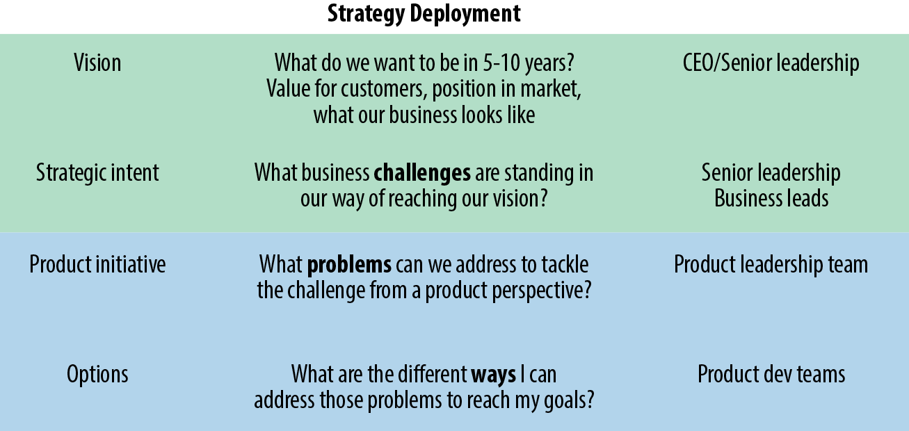
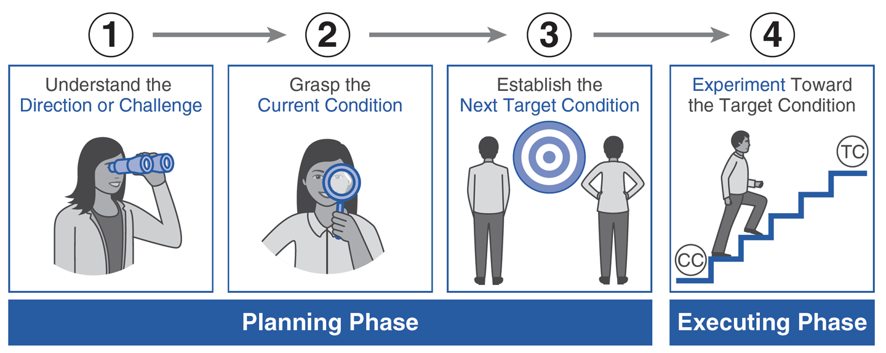
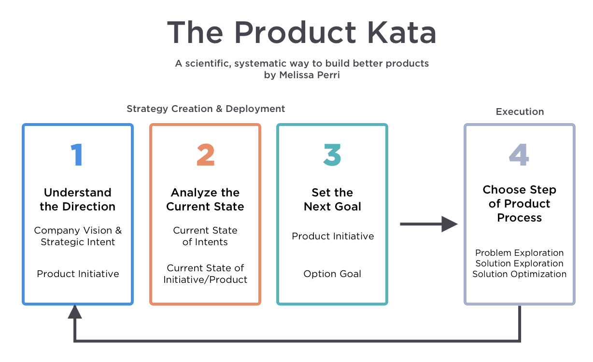
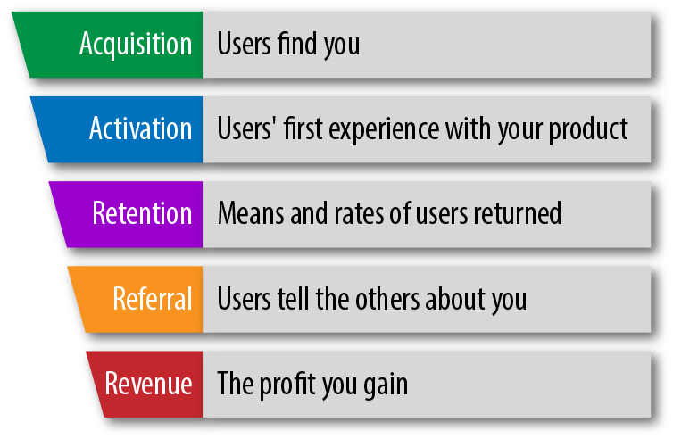

# Escaping the build trap, by Melissa Perri

## Content

* Part 1: The build trap
  * 1. The value exchange system
  * 2. Constraints on the VES 
  * 3. Project vs. Product vs. Service
  * 4. The product-led org (Sales, Visionary, Tech and product led)
  * 5. What we know and what we don't
* Part 2: The role of the PM
  * 6. Anti-patterns: The CEO, the Waiter, The former PM
  * 7. A Great PM
  * 8. The PM career path
  * 9. Organizing teams
* Part 3: Strategy
  * 10. What is it?
  * 11. Gaps: Knowledge, Alignment, Effects
  * 12. A strategic framework: deployment and creation
  * 13. Company level vision and strategic intents
  * 14. Product vision and portfolio
* Part 4: PM Process
  * 15. Product Kata
  * 16. Direction and Success Metrics
  * 17. Problem exploration
  * 18. Solution exploration
  * 19. Solution optimization
* Part 5: The product led organization
  * 20. Outcome focused communication
  * 21. rewards and incentives
  * 22. Safety and learning
  * 23. budgeting
  * 24. Customer centricity
  * 25. Marquetly: the product led company

## Terms

* **output**:
* **outcome**:
* **process-led**:
* **Product Owner**:
* **Build trap**: The temptation to focus on output (e.g. number of features shipped), instead of output (Value delivered to customers.) Products developed in this way will inevitably be bad, containing features that their customers don't want or use.
* **Value exchange System**: What is value? Customers have problems, wants and needs. A product or service will fulfill them, and the customer will pay for them. Products do not have inherent value. What they do for the customer has value.
* **Product**: A vehicle of value. Delivered to customers, they repeatedly deliver value without the producer having to build something new every time. Excel, baby food, Tinder, the iPhone are all products.
* **Service**: Also a vehicle of value, but deliver value based on the servicer putting in continuous human effort. Design firm, accounting firms etc.
* **Project**: A discrete scope of work with a particular aim.
* **Company Strategy**: a deployable decision-making framework, enabling action to achieve desired outcomes, comprised of the _operational framework_ and _strategic framework_
  * **Strategic framework**: How the company realizes the vision through product and service development in the market. It connects company vision with product visions.
  * **Strategy creation**: The process of figuring out which direction the company should go and developing the strategic framework.
  * **Strategy Deployment**: The act of propagating goals and narratives through the layers of the organization, making sure at each layer that they further the goals of the parent node, and scoped in time and space as appropriate to the layer. Examples: OKRs Hoshin Kanri, mission command.
  * **Strategic Intent** What are the challenges that stand in the way of reaching the company vision? 

## Summary of Ideas

### What is the build trap?

The Build Trap is the authors term for the common pattern in technology teams of building the wrong thing, and so ending up with products that no-one wants.

Her hypothesis is that the major cause of the build trap is that the organization is focused on *outputs* - "we released 10 features", "we met our deadlines" - not *outcomes* - measuring the value being given to the customer. The prerequisite for this is putting much more emphasis on thinking in terms of the *product* being offered instead of narrower focuses on projects and services. 

This problem starts at the top: The organization as a whole should be *product-led* - that is, optimizing for business outcomes. Every change to a product should tie back to producing value to the customer.  

She claims this is a problem with the _product management_ function of the technology organization, and the solution is to set up robust product management practices. There are four interconnected areas which comprise these practices. Interconnected because, for example, if the organization is not product-led, the PM function will not be incentivized to create practices that focus on outcomes.

* Strategy
* PM Role
* PM Process
* Organization

### The Company and the strategy

Sorry in advance for corporate bullshit terms - not my fault.

#### Company Vision

Your business has a _vision_[^10]. Why does the company exist? Where is it going based on that mission? You want a vision to act as an anchor point which you can always fall back on when you're thinking about what you should do.

[^10]: I've left out the distinction between vision and mission that's in the text, I don't think it adds much 

The vision should be short and clear. Not _too_ broadly focused. "Being the market leader in X" is too broad. There should be something in there that narrows the scope a bit.

> To offer designer eyewear at a revolutionary price, while leading the way for socially conscious businesses.
> 
> Becoming the best global entertainment distribution service, licensing entertainment content around the world, creating markets that are accessible to film makers, and helping content creators around the world to find a global audience.

#### Strategic Intents

From your company vision, you create *strategic intents*. These are the current areas of focus to move your company towards the vision. The time-scope is usually a year or two. You shouldn't not have too many of them: just a few key things.

The trap that the C-suite fall into, and that strategic intents are trying to avoid, is going into your yearly planning cycle you are just coming up with a laundry list of ideas for goals, features or desires. The problem is not that the ideas are _bad_, it's that they are usually not aligned to any broader strategy, pushing the business in particular direction. It's just sort of aimless.

Strategic intents should be high level and business focused. They should be stated at the level of new markets, new revenue streams, or focusing on a particular area with an associated revenue goal.

Here are the two strategic intents for the example company in the book, with associated goals.

> Expand into the enterprise business: Increase revenue from currently $5 million a year to $60 million a year in three years.

> Double revenue growth from individual users: Increase revenue growth from 15% YoY to 30% YoY from individual users.

Strategic intents can involve the whole business: product development, marketing, content creation etc. Obviously we're only looking at the product development piece here.

So what to do with these strategic intents? This is where we get out of the Company level and into the product level. 

### The product and product management

A product is a vehicle for delivering value.
You sell it (or rent it) to the customer, and you collect the revenue from it.
You also _improve_ the product over time, so it delivers more value[^11].
Product management is this process of determining why, how and when to improve the product[^12].

[^11]: Note this is different from a _service_, which requires you to put in time and effort for every 'unit' of value that's delivered to the customer.

[^12]:If your company has more than one product, then it is said to have a _product portfolio_. This introduces a further layer in the strategy-to-product journey, so we'll ignore it for now and assume that there's a single product.

#### Product initiatives

We left the company strategy process at the point where we'd got to some _strategic intents_. These are business goals about expanding into new markets or growing an existing revenue stream. For example: _Increase revenue growth from 15% YoY to 30% YoY from individual users._

Next we need to turn these into *product initiatives*. These translate the challenge laid down by the strategic intent into *problems* that we will solve with our product. _How_ can we reach the business goals by changing the product.

Notice that this the focus is on _problem_ identification and exploration, not on _solution_ development - that comes later. Premature solution fixation is one of the biggest traps to fall into in this stage.

For example, there are 3 paths to increasing revenue:

* acquire more individual users
* retain existing users better
* create new revenue streams from existing users 

The third is slightly different, but the first two we can dive into exploration.

First we should look to verify and quantify: What is the conversion rate? What is the retention rate? Then we have to figure out _why_ users are not converting, and why they are leaving. This is where user feedback, talking to the users, starts to become critical. This is where we start to find the problems.

### What is product management, and what makes a good product manager?

Part of being a Product Manager (PM) is being the _Product Owner_ - but only in a sense. They are responsible for the _why_: determining and communicating why the product is being built and the outcome it will produce. They are not responsible for the _when_. They do not own (but do work with the team on) the _what_. They don't care much about the _how_ of the technical implementation.

They need to have a very deep understanding of the business and the customer, so they can identify what is valuable, and see opportunities to create value. They should talk to (and otherwise get feedback from) the customer a _lot_. Empathy for the customer is the critical attribute. Tech-literacy is a must, but tech-expertise is not.

They should not be a mini-dictator, lording it over the team; a waiter, mindlessly communicating customer requests to developers; or a pseudo project manager, taking ownership of the _when_.

The _why_ is the *product vision*. The PM needs to have the vision and to effectively communicate it. They need to determine metrics and goals for the product. They need to be given the time and space to do vision and research work.

### Tactical product management

## 2hr read notes

### Preface

* my products were crap, and no one was using them
* I was so focused on shipping features that I didn’t think about the outcome of those features.
* I wasn’t connecting the goals of my company or the needs of my users back to my work.
* Lean agile: Experimentation, talking to customers. 
* Systematic / Organizational problems: Bonus tied to features, managers upset at not shipping
* Focus needs to be on the _org_
* Four layers to PM in the org:
  * Role
  * Strategy
  * Process
  * Organization

### Appendix: Is your org product-led? Questions for a PM

* Who came up with the last feature or product idea you built? Hopefully no-one will know. Or it will be 'the team'
* What was the last product you decided to kill? If no-one can remember, that's a bad sign. Probably:
  * Commitment to customers happens too early
  * Budgeting can't budge
  * No pushback to management 
* When's the last time you talked with your customers? _Worst_ answer is "we're not allowed to talk to customers".  
* What is your goal? First, _have_ one. Second, it should be _outcome_ centric, not _output_ centric. i.e. focused on the value added to the business, not on 'did we ship on deadline'
* What are you currently working on? Passion is the telling sign
* What are your PMs like? Are they well respected? Lack of respect can either be because they're too strong (dictators) or too weak (beaten down by stakeholders and managers).

### Part 1: The build trap

* The build trap is when organizations become stuck measuring their success by _outputs_ rather than _outcomes_. 
* It’s when they focus more on shipping and developing features rather than on the actual value those things produce. 
* get out of the build trap by setting themselves up to develop intentional and robust product management practices.
* Training PMs is not enough. They will slip into old habits if the organization isn't set up right - i.e. is not _product-led_
* Priority not aligned. Likely have too many priorities
* "peanut buttering your strategy". So many strategic initiatives spread over very few people.
* PMs should be pushing back, but org has to be set up for that kind of feedback.
* Wrong people in role - marketers and sales people are not PMs
* This part: How the build trap emerges, signs to look out for
* Misunderstand value. Should be _outcomes they want to create_, not _the amount of stuff you produce_.
* Customers have problems, wants, needs. Value is realized when these are filled
* _Every_ feature and initiative should result in outcome that is tied back to business value.
* Understanding value is hard. But you have to do it.
* Orgs create their own constraints. Overly rigid processes.
* Companies operate on _project_ based dev cycle. Scoping work, deadlines, milestones. Problem is, no way to align these with the strategy. Projects are essential part of product development - but thinking only in terms of projects is damaging
* _products_ are vehicles of value. _Repeated_ value without more work from anyone in the org. 
* _services_ use human labor to deliver value. Value at the cost of work
* Many companies have a mixed value model.
* Products need to be nurtured and grown
* _Product led_ companies optimize for business outcomes, align product strategy to these outcomes, prioritize projects that will best meet them

* Product management is the domain of recognizing and investigating the known unknowns and of reducing the universe around the unknown unknowns. 
* Product managers identify features and products that will solve customer problems while achieving business goals. They optimize the Value Exchange System.

### Part 2: the role of the PM

* The product manager deeply understands both the business and the customer to identify the right opportunities to produce value. 
* responsible for synthesizing multiple pieces of data, (analytics, feedback, market research), determining in which direction the team should move. 
* keep the team focused on the *why*—why are we building this product, and what outcome will it produce? 
* The chief product officer is the cornerstone of the product team in companies, helping to tie together the business outcomes to the roadmap and to represent its impact to the board. 
* Companies need to create a standardized product management career path
* PM anti-Patterns
  * Mini-CEO: PMs don't have authority over people. They are not people managers. They need to _influence_, not command. Mini-CEOs are tiny kings, think they're the next Steve Jobs. They will fail quickly because they don't have the trust of the team.
  * The waiter: takes orders from stakeholders/customers/managers. No goal, no vision. No decision making. This is the majority of PMs. Leads to product death cycle (see below)
  * Former Project Manager: (though you need a little Project Management skill to do the role). Projects Managers are responsible for _when_, PMs are responsible for _why_.

* A great PM works with a team to create the right product that balances meeting business needs with solving user problems. 
* LOTS of understanding of the business, the market, vision and goal of the company. *Empathy for users*
* NOT in charge of the _what_, only the _why_. They work _with_ the team on the what. Really it's the _team_ that owns the product.
* Figuring out what to build: strategic and experimental approach
* Must be humble enough in their approach to learn and take into account that they don’t know all of the answers.
* Lone wolf mentality is death for a PM. The idea that they and they alone are responsible for the success of the product. Breeds arrogance.
* not expert in either tech or marketing. Must be _tech-literate_ though
* Start with _why_ - don't dive into solutioning too early
* Don't skip setting success metrics and goals
* Product _Ownership_ is just one piece of product _management_
* Need time to do vision and research work
* PM career path: Associate PM, PM, Senior PM, Director of PM, VP of Product, Chief Product Officer.

* Organizing product teams: *not* around technical components, features. Around business goals, _value streams_.

### Part 3: Strategy

* A good strategy is not a plan; it’s a framework that helps you make decisions. 
* Product strategy connects the vision and economic outcomes of the company back to product portfolio, individual product initiatives, and solution options for the teams. 
* Strategy creation is the process of determining the direction of the company and developing the framework in which people make decisions. 
* Strategies are created at each level and then deployed across the organization.
* Focus on the whole, them zoom in on the parts
* Too often, people think of their product strategy as a document made up of a stakeholder’s wish list of features and detailed information on how those wishes should be accomplished. And they’re peppered with a ton of buzzwords like platform or innovation.
* Communicating the end state of a product is not a strategy (though it's not a bad thing to do - you need the vision of the end result.)
* Bungay: Strategy is a deployable decision-making framework, enabling action to achieve desired outcomes, constrained by current capabilities, coherently aligned to the existing context.

* Autonomous teams: Have them. Don't lead by authority
* Creating a strategic framework
* "I went to my peers in the leadership team and asked them what was the most important thing we could do as a company. They all gave me different answers. It’s pretty clear we’re not aligned on what our strategy is or what we want to become as a company."
* company strategy, two parts:
  * operational framework, or how to keep the day-to-day activities of a company moving
  * strategic framework, or how the company realizes the vision through product and service development in the market. aligns the company’s strategy and vision with the products that are developed by the teams. 
* Strategies are interconnecting stories told throughout the organization that explain the objective and outcomes, tailored to a specific time frame. We call this act of communicating and aligning those narratives strategy deployment.
* Strategy deployment is about setting the right level of goals and objectives throughout the organization to narrow the playing field so that teams can act.
  * Execs are on 5-year decision making cycle
  * Middle mgmt are on yearly/quarterly cycle
  * Teams are on a monthly/weekly cycle
* Not having the right level of direction lands us in the build trap

* Strategy Creation: the process of figuring out which direction the company should act upon and of developing the framework in which people make decisions. Strategies are created at each level and then deployed across the organization.

 

* Company Vision: A good mission explains why the company exists. A vision, on the other hand, explains where the company is going based on that purpose. I find that the best thing a company can do is to combine both the mission and the vision into one statement to provide the value proposition of the company
* Strategic Intents: how you intend to reach that vision changes as your company matures and develops. Strategic intents communicate the company’s current areas of focus. The horizon is 1-several years. should be at a high level and business focused.
* Product Initiatives translate the business goals into the problems that we will solve with our product. The product initiatives answer how? set the direction for the product teams to explore options. 
* Product Vision: communicates why you are building something and what the value proposition is for the customer. (Amazon Press Release documents for every product vision.)
* Product Portfolio: When you have > 1 product. Need a vision for that too
  * How do all of our products work as a system to provide value to our customers?
  * What unique value does each of the product lines offer that makes this a compelling system?
  * What overall values and guidelines should we consider when deciding on new product solutions?
  * What should we stop doing or building because it does not serve this vision?

### Part 4: PM Process

* The best solutions are linked to real problems that users want solved. 
* Product managers use a process to identify which of those problems the team can solve to further the business and achieve the strategy. 
* Product managers can rely on the Product Kata to help them develop the right experimental mindset to fall in love with the problem rather than the solution. They continue iterating until they reach the outcome.
* This section is all about the process of uncovering the right thing to build. 
* Usually, when we think about processes, we focus more on the act of developing software than we do about building the right software. This is the build trap.
* The Product Kata: The first task is to get to the product initiative. Four sub-parts
  * Understanding the direction: Setting metrics (Pirate metrics, HEART Framework)
  * Problem exploration: Talk to users, all the time
  * Solution exploration: Experimenting to learn. Concept testing
  * Solution optimization: Story mapping

### Part 5: The product led organization

* The product-led organization is characterized by a culture that understands and organizes around outcomes over output
* a company cadence that revolves around evaluating its strategy in accordance to meeting outcomes. 
* people are rewarded for learning and achieving goals. 
* Management encourages product teams to get close to their customers, and product management is seen as a critical function that furthers the business.
* If there is one main reason I have seen companies fail to make a transition, it’s the lack of leadership buy-in to move to an outcome-oriented company.
* Visibility in organizations is absolutely key. The more leaders can understand where teams are, the more they will step back and let the teams execute. We need a cadence of communicating strategy that matches our strategic framework.
** Quarterly business reviews: discussing progress toward the strategic intents and outcomes of a financial nature. 
** Product initiative reviews: for the product development side of the house. review the progress of the options against the product initiatives and adjust our strategy accordingly.
** Monthly Release reviews: provide the opportunity for teams to show off the hard work they have done and to talk about success metrics.
* Roadmaps: *not* a Gantt chart.  you should view them as an explanation of strategy and the current stage of your product. _Living_ roadmaps.
  * The theme
  * Hypothesis
  * Goals and success metrics
  * Stage of development
  * Any important milestones
* Phases: Experiment, Alpha, Beta, Generally Available
* Product operations/ Chief Of Staff: Collect Data; report on goals, outcomes etc.; set up product analytics platform; standardize product processes; organize and run meetings; organize
* Rewards, Incentives.Y ou should be rewarding people for moving the business forward—achieving outcomes, learning about your users, and finding the right business opportunities.
* Safety and learning: Fail small and early, encourage it.
* Budgeting: Think like a VC, not a corporation (antipattern: over-promise to get budget)
* break out of budgeting once a year. Instead, allocate funds to the product portfolio as a whole. use the product initiative reviews to determine what should be funded, based on the amount of certainty toward the outcomes.
* Customer centricity: deeply understand your customers. 

## Quotes

> A lot of it is due to having too many priorities. Everything is number one on your project list. You are peanut-buttering your strategy—meaning that you have so many strategic initiatives spread over very few people. You can’t give one team a large objective and expect them to hit major goals in a month. Those things take time and manpower. You have to build up to them. - Page 5

> Strategy is a deployable decision-making framework, enabling action to achieve desired outcomes, constrained by current capabilities, coherently aligned to the existing context. - Page 62

## Questions

What are the responsibilities of a product manager?

1. a PM is _not_ a UX designer 
1. interface with the business, tech and design depts. to harness their collective knowledge 
1. A PM doesn't have much direct authority
1. A PM is primarily responsible for the _why_ of the product, the direction of it. They are involved in the _what_ (workflows, UX etc.) and _when_, but these are owned by the team as a whole. They are barely at all involved in the _how_ - that's the devs job. 
1. They craft the product vision, communicate it, and champion it.
1. They break down the purpose of the product into known knowns (facts), known unknowns (questions, which they seek to answer), unknown knowns (intuition, which they seek to validate) and unknown unknowns (discovery, which they put processes in place to facilitate)
1. They connect the dots, taking information from various sources and sifting and analyzing it, and turning that into the product vision.
1. It comprises _product ownership_ (in the Scrum definition), of defining th backlog and creating user stories, grooming work in the backlog, and checking completed work. But that doesn't cover the whole thing

What makes a good product manager?

1. talking to users
1. the ability to empathize with users, walk a mile in their shoes.
1. the ability to persuade and influence the team and the company that what is being built is the right thing.
1. not being too attached to your own ideas - your job is creating value, not implementing your ideas. So... 
1. listening to criticism of your ideas and creating a process for iterating them into good ideas 
1. validate your ideas by seeking out data. Evidence, not opinions
1. get problems, wants and needs from customers, not solutions.
1. They push back against managers and stakeholders when they present solutions, asking _why_.
1. Have a deep understanding of the business: what its goals are, what its strategy is, how their product relates to that strategy.
1. They are technically literate, but don't have to be a tech expert
1. They understand the market, but don't have to be a market expert.

What makes a _bad_ product manager?

1. the mini dictator (don't be an asshole to UX and devs)
1. the waiter, taking what stakeholders ask for at face value, allowing the priority to be dictated by the most important person in the room.
1. the reformed project manager, focusing on the _when_, not they _why_.
1. A lone wold mentality - a feeling that they alone are responsible for the success of the product, and that they have to come up with it themselves without input from others.

What makes a good product management function?

Why do companies fall into the build trap? 

1. They don't understand their customers wants, needs or problems, and so they can't measure value. Because some targets are required, they create proxies that they _can_ measure, but don't represent value: features shipped etc. 
1. They face unthinking pressure to fast-follow competitors, superficially copying their features without understanding whether those features are valuable.
1. They over-promise during sales pitches, leading to one-off features that were not worth the investment because they are not widely useful. Where the strategy is driven by the contracts the company can get, the company is a _sales led_ organization.
1. the _product death cycle_ They do not find out what their customers problems are, they just ask them what features are missing and build those features without validating them.

## Misc

* known knowns: Facts
* known unknowns: questions
* unknown knowns: intuition
* unknown unknowns: discovery

Why questions

* Why even do this project?
* What's the desired result that we hope to achieve here?
* What does success look like?
* What are the risks?
* How are we mitigating those risks?

