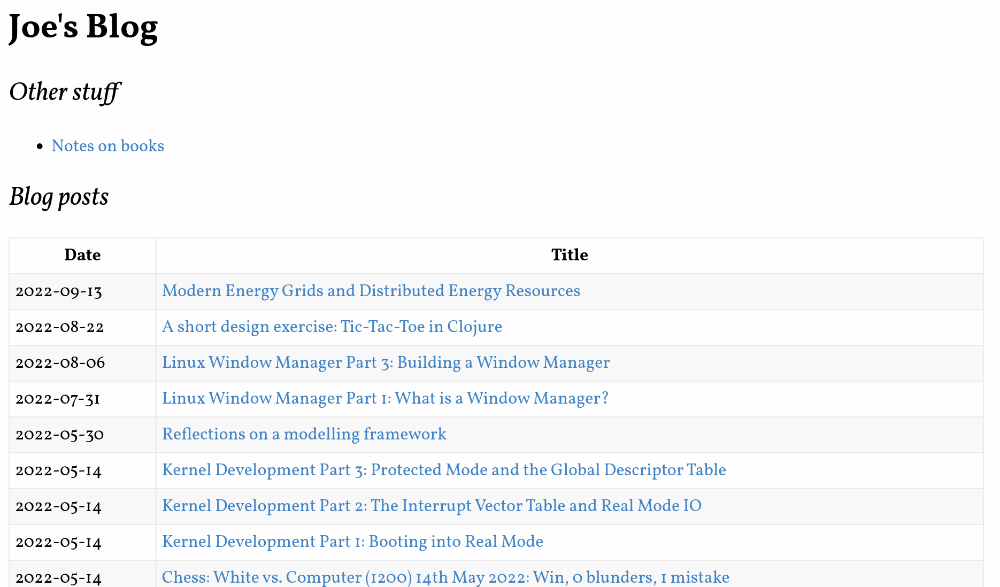
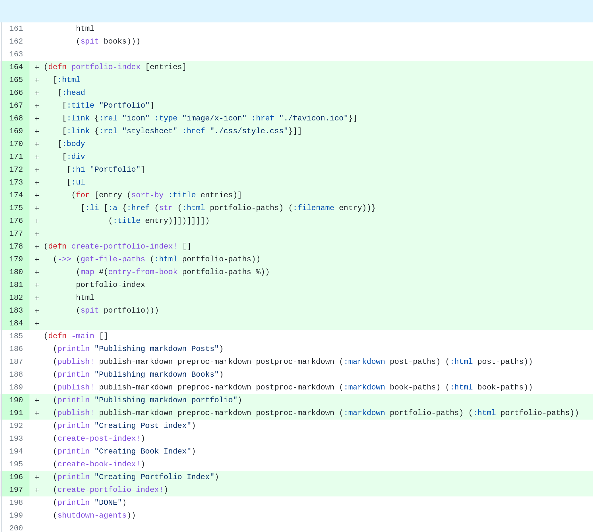

# BlogPublish
BlogPublish is a Clojure application for managing a simple blog.
It takes markdown posts, puts them through pre-processing, replacing certain elements of markdown with HTML, shells out to pandoc to generate the full HTML file, then applies post-processing which re-writes the document tree.
It also builds the index page for your blog.
It does not handle hosting, comments etc.
Aside from posts, the output blog also has a section for maintaining notes on books.[^1]

[^1]: Examples of Blog post  and blog index 

The sourcecode is [here](https://github.com/RedPenguin101/blogpublish).

## Quickstart
### Build it
This is a Clojure project, and you will need the JVM and Clojure itself installed.
See the [Clojure Install Guide](https://clojure.org/guides/install_clojure) for installation details.

Once you have the repo cloned, and the prerequisites installed, you can build the uberJar with:

```bash
chmod +x build.sh
./build.sh
```

This script simply runs Clojure build tool commands `clj -T:build clean`, `clj -T:build uber`, both of which call build commands in the `build.clj` file.

The output of the build is a java executable `blogformat-X.X.XX-standalone.jar`. This can be copied to your blog folder. `css/style.css` should also be copied to your blog folder.

### Run it
The folder format the program expects is as follows:

```
blog_root
 |- css/style.css (the CSS file should be copied from this repo)
 |- images (images referenced in posts)
 |- markdown
 |    |- posts (where finished posts, in markdown format, live)
 |    |- books
 |- html
 |    |- posts, books (where the program outputs html)
 |- index.html, books.html 
 |  (roots for posts and books respectively. Created by the program)
 |- publish.jar (the program)
```

Write a post in _markdown/posts/YYYY-MM-DD_mypost.md_ format[^2].
When ready, run `java -jar publish.jar` from the command line.
This will create the html file in _html/posts/YYYY-MM-DD_mypost.html_ and create an index file with a link to that file.

[^2]: The date format is used in the index creation, but the name following the first underscore isn't important for functionality.

Now you can use a blog-hosting service, or roll your own.
Github Pages is what I use, and it works fine.

## The Post Format
The format of posts in the blog is inspired by the [Tufte Format](https://rstudio.github.io/tufte/).
I won't go into the why's of the format, but some of the notable characteristics of the format are:

1. A focus on longform presentation over "powerpoint" style bullet lists.[^3]
2. 'Footnotes' are presented in a 'gutter' to the right of the main text, as opposed to at the actual foot of the document. This enables the reader to quickly reference the notes without moving from their place in the main text.
3. Tight integration of graphics with text.
4. "Indendent" paragraphs rather than the whitespace separation more common on the web.
5. Limited use of headings, generally 2 levels, excluding the title level which covers the whole document. In HTML terms, this means H2 and H3 levels, but not H4.

[^3]: See Norvig's [Gettysburg Powerpoint Presentation](https://norvig.com/Gettysburg/) for a satire on the practice of using powerpoint for communication, and [Tufte's actual paper](https://www.inf.ed.ac.uk/teaching/courses/pi/2016_2017/phil/tufte-powerpoint.pdf) for both a more indepth look and a complete rationale for the format.

## HTML Structure and CSS implementation

## Code functionality and organization
The code has 3 namespaces:

1. main: Orchestration of the creation, functionality for index creation, configuration.
2. footnote-md: This is in effect the preprocessor for markdown files. It takes markdown strings as input and replaces some features with native html. As the name suggests, it does this for footnotes, implementing some of the custom html the blog format uses.
3. html-post: The post-processor. The primary functions in this ns take html, parse it to hiccup[^4], and rewrite it in a format required by the blog. The only thing it does is 'inline' footnotes so they appear immediately after the references to them.

[^4]: A representation of HTML in native Clojure data structures - [see here](https://github.com/weavejester/hiccup) for more detail.

### Footnote-md
A very simple namespace, it's a regex match - in effect a partial markdown to html compiler.
It finds footnote and footnote-references using regex, and replaces them with an html element.

```clojure
(def reference #"\[\^(\d+)\](?!:)")
(def reference-html "<sup class=fnref><a id=\"note$1\" href=\"#fn$1\" title=\"Footnote $1\">$1</a></sup>")

(def footnote #"(?m)^\[\^(\d+)\]:(.*)$")
(def footnote-html
  "<span id=fn$1 class=\"footnote\">
  <a class=\"fnref\" href=\"#note$1\" title=\"Footnote $1 Reference\">$1</a>
  $2
</span>")

(defn prewrite-markdown [text]
  (-> text
      (str/replace reference reference-html)
      (str/replace footnote footnote-html)))

(comment
  (str/replace "A footnote reference[^1]" reference reference-html)
  ;; => "A footnote reference<sup class=fnref><a id=\"note1\" href=\"#fn1\" title=\"Footnote 1\">1</a></sup>"

  (str/replace "[^1]: this is a footnote" footnote footnote-html)
  ;; => "<span id=fn1 class=\"footnote\">
  ;;       <a class=\"fnref\" href=\"#note1\" title=\"Footnote 1 Reference\">1</a>
  ;;         this is a footnote
  ;;     </span>"
)
```

### html-post
This namespace is rather more involved.
Its purpose is to allow transformations to be applied to html.
The only current transformation is `inline-footnotes`.

The public api of the namespace is `rewrite`, which firstly serves the purpose of wrapping the conversion of html-string to hiccup and back, and also allows additional transformations to be added in the future.

```clojure
(defn rewrite [html]
  (-> html
      html-prep
      inline-footnotes
      ;; future transformations here
      hc/html))
```

The below is a sample (in hiccup format) of a "para-with-footnote-ref" - a data structure where the top level element is a para, and the para contains a footnote reference.
Notice that the footnote (span.footnote) is not next to the thing that references it (sup.fnref) In our output document, we want the footnote to be horizontally situated in the right gutter of the page (which can be accompished with CSS) and vertically situated as closely as possible to the reference to it.
To do this, we need to restructure the html, which is the purpose of this namespace.

```clojure
(def sample
    [:p {}
     "Text"
     [:sup {:class "fnref"} [:a {:id "note2", :href "#fn2", :title "Footnote 2"} "2"]]
     "More text"
     [:span {:id "fn2", :class "footnote"}
      [:a {:class "fnref", :href "#note2", :title "Footnote 2 Reference"} "2"]
      "Footnote text"]])

  ;; The main function of this ns, inline-footnotes, does this.
  ;; Note in the below evaluation how the span.footnote now follows immediately
  ;; after the sup.fnref. This will achieve the desired result.
  (inline-footnotes sample)
  ;; => 
  [:p
   {}
   "Text"
   [:sup {:class "fnref"} [:a {:id "note2", :href "#fn2", :title "Footnote 2"} "2"]]
   [:span
    {:id "fn2", :class "footnote"}
    [:a {:class "fnref", :href "#note2", :title "Footnote 2 Reference"} "2"]
    "Footnote text"]
   "More text"]
```

Looking at the `inline-footnotes` function in detail:

```clojure
(defn- inline-footnotes
  "Given a hic-el containing footnotes, where the fnref
   and footnotes are separated, will reorg the datastructure
   such that the footnote immediately follows the fnref"
  [hic]
  (let [footnotes (into {} (get-footnotes hic))]
    (vec (postwalk (fn [el]
                     (cond (para-with-footnote-ref? el)
                           (vec (restruct-fns el footnotes))

                           (standalone-footnote? el) nil
                           :else el))
                   hic))))
```

We can see it is doing two things:
1. Getting all the footnotes from the document and putting them in a dictionary so they can be looked up.
2. Walking through the document again, identifying all the footnote _references_, inserting the footnote after the reference, and removing the original footnote.

Getting the footnotes is a simple recursive search through the tree:

```clojure
(defn- get-footnotes [hic-el]
  (cond (not (vector? hic-el)) [] ;; sentinel.
        (footnote? hic-el) [[(footnote? hic-el) hic-el]]
        :else (mapcat get-footnotes hic-el)))
```

To rewrite the html itself:

```clojure
(defn- restruct-fns [hic-el footnotes]
  (mapcat #(replace-footnote % footnotes) (split-after footnote-ref? hic-el)))

(defn- replace-footnote [hic-el footnotes]
  (let [x (footnote-ref? (last hic-el))]
    (if x (conj (vec (remove footnote? hic-el)) (get footnotes x))
        (vec (remove footnote? hic-el)))))
```

`restruct-fns` splits the hiccup sequence (expected to be a paragraph containing a footnote) after it encounters a footnote reference.
It then calls `replace-footnote` on the sub-sequences, adding the actual footnote (from the lookup dictionary) onto the end.
Otherwise it just element - though in both branches, it removes any actual footnotes it finds, preventing duplication.

### main - orchestration
The main function of the program looks like this

```clojure
(defn -main []
  (println "Publishing markdown Posts")
  (publish! publish-markdown preproc-markdown postproc-markdown (:markdown post-paths) (:html post-paths))
  (println "Publishing markdown Books")
  (publish! publish-markdown preproc-markdown postproc-markdown (:markdown book-paths) (:html book-paths))
  (println "Creating Post index")
  (create-post-index!)
  (println "Creating Book Index")
  (create-book-index!)
  (println "DONE")
  (shutdown-agents))
```
There are two things happening here: publishing all the posts, and creating the index.

### main - turning markdown to html
The function here is publish!:

```clojure
(defn publish! [pub-fn pre-fn post-fn in-folder out-folder]
  (->> (get-file-paths in-folder)
       (map pre-fn)
       (map pub-fn)
       (map post-fn)
       (map #(move-file % out-folder))
       (map cleanup)
       doall))
```

It takes three functions: publish, a pre-processor and a post-processor, as well as the input folder and output folder.

It gets all the files in the input folder, applies successively the pre-proc, publication and post-proc, moves all the files, and cleans up any temporary files.

Each of the pre, pub and post functions have side-effects, reading a file and outputting another file, and each one returns the name of the file it has written to to be used by the next function. For example:

```clojure
(defn preproc-markdown [file-path]
  (let [out-file-path (str/replace file-path ".md" ".temp")]
    (spit out-file-path (md/prewrite-markdown (slurp file-path)))
    out-file-path))
```

### main - index creation
Creating the index:

```clojure
(defn create-post-index! []
  (->> (get-file-paths (:html post-paths))
       (map #(entry-from-post post-paths %))
       build-index
       html
       (spit index)))
```

The steps are:

1. Get all the html file names
2. from those names, calculate an 'entry': a map with the post date, the filename, and the title (obtained by reading the first line of the markdown file).
3. inserts those entries into a markdown template (see below)
4. converts the template into an html string and spits it to `index.html`

```clojure
[:html
 ;; snip
 [:body
  [:div
   ;;snip
   [:table
    [:tr [:th "Date"] [:th "Title"]]
    (for [entry (reverse (sort-by :date entries))]
      [:tr
       [:td (:date entry)]
       [:td [:a {:href (str (:html post-paths) (:filename entry))}
             (:title entry)]]])]]]]
```

## Critique
I like the deterministic nature of the overall process.
It effectively recreates the entire blog every time you run the program, rather than trying to figure out what changed and run only those.
Trying to do that would've required adding some state management, maybe a database, as well as figuring out when something should be published.
Having the whole thing created from scratch avoids all that complexity.
This might run into some performance problems if the blog gets _really_ large, but I don't foresee that being an issue.

I like the footnote post-processor overall.
Some nice treewalking stuff in there.

It's pretty extensible.
For this write-up (which is part of a blog that I use this software for) I needed to add the ability to publish 'portfolio' posts like this one.
The only things I needed to add (apart from a bit of config) were a couple of trivial functions, basically copy-pasted.



I'm not happy with how removal of footnotes is done.
The program takes two swipes at it: in `replace-foonote` and `inline-footnotes`.
This is a consequence of the 'standalone' footnote, where a footnote sits in its own para rather then being nested under another one.
This case was added afterwards, hence why the same thing is done in two places.
This should be harmonized.

I don't love how `publish!` works.
Firstly it operates at the 'folder' level, pointed at a folder and touching everything in that folder, where it should really work at a _file_ level.
Second, ideally the process would be `mdfile->mdstring->htmlstring->htmlfile`, with the IO happening only at the start and end.
Because I'm shelling out the actual compiliation of MD to HTML I have to have each step do its own IO.
The trade-off, obviously, is that I don't have to write my own markdown compiler.
This is a good tradeoff I think.
I might be able to do something to eliminate the 'temp' file and just have the pandoc output write to std-out and have the program pick it up from there.
But that doesn't solve the problem really.

The way the `get-title` works is wrong.
Given an html file, it should be able to figure out what the title is.
Instead it has to find the related _markdown_ file and get the title from that, which obviously presumes you have the markdown file available.
