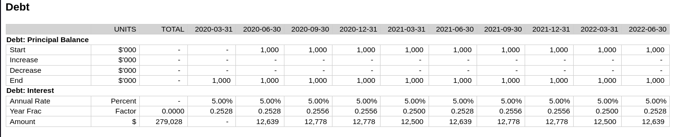
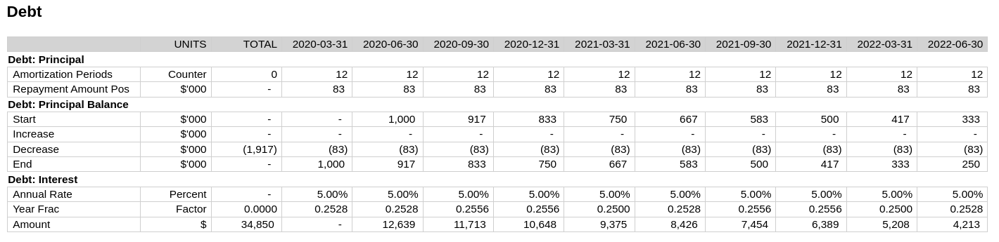
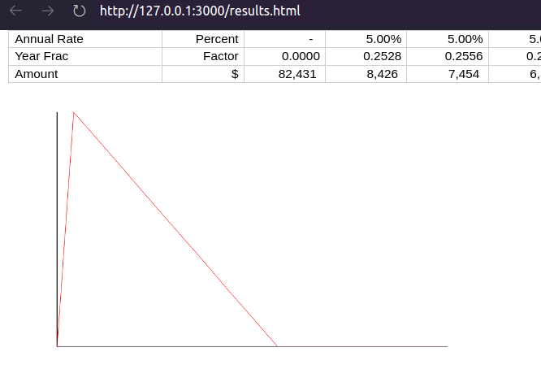

# Financial Modelling Framework

## Introduction
This is a framework to iteratively build and use 'project finance' type financial models. It is an alternative to Excel, the dominant method.

It provides

* An extensible Domain Specific Language (DSL) for building and running models
* Notebook-like build/run pattern from within the editor
* Rich Table display functionality, with formatting, headers and highlighting
* Time series charting.

The full source code is [here](https://github.com/RedPenguin101/modelling-framework)

## What is a financial model?

## Why does this framework exist?
Excel is very good at building project finance type models. Above all, it is very flexible, which is well suited to the diverse project-finance type models.

That being said, there are reasons to look for alternative. These types of models can grow to be extremely complex, with hundreds of inputs, thousands of rows, and incomprehensible dependency graphs. The modelling community has adapted to this complexity by developing standards and conventions to minimize the problems caused. A few examples:

* Formula must be consistent across a time-series
* Formula that are 'calculations' (i.e. have some arithmetic operations) must not have references to things outside of the sheet. Instead you should use dedicated 'import' rows.
* Linkages must be 'star' schemas. That is, you can't link to something which itself is a link to something else.
* The creation of 'template' sheets for common attributes, especially time related measure ("In operating period flag", "period end date") and financial statements.
* Placeholders have a yellow background.
* Rows that are exported to other rows have red text
* User inputs have a particular format

While these conventions are broadly effective, all of these impose structure on the workbook, but rely on the _discipline_ of the modeller to maintain them. This removal of flexibility in exchange for simplicity and safety is typical of the maturity life-cycle of business process as patterns of common use emerge and complexity increases. 

It is often at that stage of the life-cycle that software emerges that implements and enforces those conventions. This has not, to this point, happened for project finance modelling.

This program is an attempt to do that for this domain.

### A Model is A Program
A model is, in effect, a program that creates a set of outputs. Every model is different, though (thanks to the conventions) created from largely homogeneous blocks. In this sense a modeller is more like a programmer than a 'user' of an application.

Following this analogy, a modeller doesn't need a program to help them construct models - such a program would necessarily impose too many restrictions on what a user can and can't do. They need an _environment_ to create programs, in the same way that a software engineer uses an IDE.

### Taking inspiration from Portfolio Modelling
In recent years another type of model - the 'portfolio model' - has shown signs of moving away from Excel as its main modelling tool. 

These are analytical and predictive models of large portfolios of financial assets, for example portfolio of credit cards. The credit card provider will send to a prospective financier 'data tapes' with historical data about the underlying assets. The financier will ingest, clean and analyze that data for things such as default rates, then build a predictive model on top of it based on assumed (or probabilistic) future default rates to determine its likely future cash-flows and assess whether it's a good investment for them.[^1]

[^1]: It is, however, often the case that such an asset level model will provide inputs into another model, much more similar to a project finance type model, which will model the liabilities etc.

The drive away from Excel for these types of models are based partly on increased statistical sophistication, requiring more advanced stochastic tools, but mostly on the size of the data tapes. They can get extremely large, with hundreds of thousands of assets. This firstly has the consequence that Excel just can't _handle_ that amount of data well. Secondly, the challenge of cleaning the data is large, and Excel's tools for this are relatively rudimentary. And finally the amount of data means the value of being able to see all of it, on a line-by-line basis, is much diminished. When you have a million credit cards, the value of looking at a single credit card is minimal. Only aggregates are important. Excel... excels at showing you all the data, all the time. Since this is less necessary, the benefit of Excel is less.

The alternative tools to Excel that have been adopted are less like 'user applications', which would not be sufficiently flexible, and more similar to the tools that software engineers use. Data cleaning and manipulation and model building are done in general(ish) purpose programming languages like R and Python, with specialized libraries like R's Tidyverse and Python's Pandas. The tools are IDEs like R-Studio, or 'Notebooks' like Jupyter, which have the functionality of an IDE with integrated runtimes and better options for display. This solution doesn't reduce flexibility available to the user (arguably it increases it, since you have a full general purpose programming language at your disposal), while solving many of the above problems. 

Crucially, these tools also retain the fast feedback loops (the length of time between making a change and seeing the impact of that change) that is characteristic of Excel, but not of more traditional programming environments.

## Pros and Cons of Excel for Project Finance Modelling
For an alternative to Excel to be successful it must retain the positive attributes of Excel while mitigating its negative elements. Here are those pros and cons.

### Pros
1. Tight feedback loops between making changes and seeing results
2. Looking at any part of the model, or the results of that model is quite easy.
3. Excellent visualization capabilities, especially something like Excel's quickgraph.
4. With the cell-reference model, you can directly back-trace the value of a cell to how that cell was generated, which is very useful for debugging.
5. Rich formatting of both model and results can be highly communicative, if used well.
6. A good library of standard functions, well suited to this use case.
7. Performance: One of the reasons that Excel swept all before it was it's recalculation engine was blazingly fast. This remains the case today, though large models test it.

### Cons
1. Difficulty of version control
2. Lack of tools to trace cause (changes to the model) to effect (changes in the results)
3. Difficulty in handling circular references
4. Lack of comprehensibility on models above a certain size
5. A specific case of the above: Close coupling of model and output.
6. Second class extensibility through VBA macros
7. "Cell Reference" model of calculation has legibility problems at scale.
8. Flexibility to 'do anything' requires a lot of discipline to maintain model quality.

## The target features of the framework
This framework aims to keep as many of these pros as possible, while mitigating some of the cons.

The first and most fundemental difference to the model is the separation of the model and output of the model.
In Excel, these 'boundaries' between these two are very fuzzy, leading to scalability and legibility problems.
Similar to the "Portfolio Models" described about, the framework creates a strong separation between these two things.
The Model is, in effect, a program that is run to generate the Output.

The second major difference is to move away from the overreliance on opaque cell references.
That the content of a cells is some combination of C3, C8, SheetX_B4 and B:B means it's incredibly hard to determine what goes into a calculation.
The framework abstracts a named time-series output into a first-class entity, whose defining calcluation is a function of other named time-series outputs.

Other target features:

* Maintain full flexibility of what's _in_ the model, while providing structure and guardrails for _how_ you model.
* Maintain tight feedback loops between model change and results viewing
* User can quickly look at any part of the results set
* At least some timeseries visualization capabilities
* Rich and configurable formatting of results (colors, formats) to maximize legibility
* Source-code style version control of _model_
* Version control of _results_
* Fully extensible to user for new functions and framework elements.

## Modelling Key Concepts
There are a few concepts that are core to the understanding of this framework:

### The Time-series
All financial models are based on time series: what is the profit over time? what are the dividends over time? what is the balance-sheet over time? 
Almost everything in a financial model can be represented in a time series. 
In Excel, this takes the form of a time series 'sheet', with 'periods' across the top, named measures (_rows_) down the side, and the value of those measures in a time-series period in the intersection of these.

Here is an example from Gridlines' [Essential Financial Modelling](https://academy.gridlines.com/p/essential-financial-modelling) course.


### The Model: Inputs and Model Rows
The model is a description of how to generate each row in the time series. For example, a description of a model for generating period start and end dates might be:

```
Inputs:
  model-start-date: 2020-01-01
  length-of-period: 3 months

Model Rows:
  period-number = previous period-number + 1
  period-start  = if   (period-number = 1) 
                  then model-start-date
                  else previous period-end + 1day
  period-end    = period-start + length-of-period
```

We see here a couple of key elements: There are **inputs**, which are static variables, and **model rows**, which define how to generate the time series for _period-number_, _period-start_ and _period-end_. Model rows are stated in terms of other model rows, and of inputs.

### Results
The results are the outcome of 'running' the model. Running the above model would give the following results:

```
period-number:      1          2          3          4     ...
period-start:  2020-01-01 2020-04-01 2020-07-01 2020-10-01 ...
period-end:    2020-03-31 2020-06-30 2020-09-30 2020-12-31 ...
```

In Excel, the model and results are closely connected. In fact, they are the same thing: the model _is_ the results. In the below screenshot you can see the model implemented in Excel. The 'results' are just the evaluation of the formula in the cells.


Our approach is different: we keep the model and results quite separate.

### Outputs
A model is run for a reason: to see what the outputs are. These outputs are also useful when building the model to see what, in aggregate, has changed. There are typically stated in terms of aggregations of rows in results. Output definitions are part of the model definition, and are produced alongside the results as a outcome of running the model.

```
Outputs:
  blended-equity-irr: irr period-end cashflows-to-equity-holders
  total-dividends:    sum dividends
```

### Calculations and sheets
Theoretically the above gives you everything you need to build and run a model. However in practice building a model with hundreds of rows would quickly get too confusing. In Excel, modellers separate and group the rows in their model, by putting them in different sheets or tabs (e.g. the "equity" tab), and further group them within those sheets into smaller blocks, which I'll call _calculation blocks_ (for example, the 'dividend paid' calculation block).

These abstractions, which are effectively name-spacing the rows, provide some structure to the model which improves comprehensibility to the reader, and the ability to compartmentalize for the writer. We can do the same thing in the framework by name-spacing the rows.

```
INPUTS
  model-start-date = 2020-01-01
  length-of-period = 3 months

TIME.Periods:
  number      = previous number + 1
  start-date  = if   (number = 1) 
                then INPUTS/model-start-date
                else previous end-date + 1day
  end-date    = start-date + INPUTS/length-of-period

DEBT.Interest
  calculation-basis = DEBT.principal/starting-balance
  annual-rate       = INPUTS/interest-rate
  year-frac         = year-frac-act360
                        TIME.periods/start-date - 1
                        TIME.periods/end-date
  amount            = calculation-basis * annual-rate * year-frac
```

Each 'block' is a calculation block. The capitalized prefix (`TIME`) is equivalent to a 'sheet' in Excel, and the suffice (`Periods`) is the equivalent to a calculation block. Notice that now, where rows are referencing other rows they can either be local (`amount` in the `DEBT.Interest` block), or importing (`DEBT.principal.starting-balance`).

## Programming DSL
### Setup
The general purpose language chosen for writing and running the model is [Clojure](https://clojure.org/). Clojure is a mostly-functional Lisp which is hosted on the JVM. It was chosen for the following reasons:

1. REPL driven development, and excellent tooling for it, provides excellent interactive programming capabilities out of the box
2. [Homoiconicity](https://en.wikipedia.org/wiki/Homoiconicity) means that implementing what is effectively a DSL is extremely easy, and allows users to arbitrarily execute code and extend functionality within that DSL.
3. JVM hosting gives an excellent runtime, a lot of useful out of the box functionality, especially for date manipulation, and access to lots of libraries.

LISP syntax might be challenging for those coming from Python or R, but it is quite simple, especially since we use a very limited subset here.

You can use any IDE you like, but my recommendation is VSCode, because with [Calva](https://calva.io/get-started-with-clojure/) it has excellent REPL integration. I recommend setting up Calva to 'Evaluate on Save', which will in effect re-run your model whenever you hit Ctrl+S (which you should do a lot). Lastly, install the Microsoft Live Preview Extension (link below), which will be used to display model outputs.

Clone this repo and set up a new model (clj file) in the Models subfolder. At the top, put

```clojure
(ns models.readme-example
  (:require [fmwk.framework :as f :refer [base-case! calculation! bulk-metadata! metadata! cork-metadata! corkscrew! totalled-calculation! check! outputs!]]
            [fmwk.results-display :refer [print-result-summary!]]
            [fmwk.utils :refer [when-flag when-not-flag round mean]]
            [fmwk.dates :refer [year-frac-act-360 month-of add-days add-months date= date< date<= date> date>=]]
            [fmwk.irr :refer [irr-days]]))

(f/reset-model!)
```

Start the REPL following the Calva instructions. Now you're ready to start building the model.

### Translating the above model definition into the DSL
We're going to translate the model we defined:

```
INPUTS
  model-start-date = 2020-01-01
  length-of-period = 3 months

TIME.Periods:
  number      = previous number + 1
  start-date  = if   (number = 1) 
                then INPUTS/model-start-date
                else previous end-date + 1day
  end-date    = start-date + INPUTS/length-of-period

DEBT.Interest
  calculation-basis = DEBT.principal/starting-balance
  annual-rate       = INPUTS/interest-rate
  year-frac         = year-frac-act360
                        TIME.periods/start-date - 1
                        TIME.periods/end-date
  amount            = calculation-basis * annual-rate * year-frac
```

Into the framework DSL, basically one-for-one[^2].

[^2]: The full source code for this model is at [This link](https://github.com/RedPenguin101/modelling-framework/blob/main/models/models/readme_example.clj). That folder also has several other sample models you can look at.

```clojure
(base-case!
 "base-case"
 :model-start-date "2020-01-01"
 :length-of-period 3
 :interest-rate    0.05)

(calculation!
 "TIME.Periods"
 :number                   '(+ 1 [:number :prev])
 :start-date               '(if (= 1 [:number])
                              [:inputs/model-start-date]
                              (add-days [:end-date :prev] 1))
 :end-date                 '(-> [:start-date]
                                (add-months [:inputs/length-of-period])
                                (add-days -1)))

(calculation!
 "DEBT.Interest"
 :calculation-basis       [:DEBT.Principal/starting-balance]
 :annual-rate             [:inputs/interest-rate]
 :year-frac              '(year-frac-act-360
                           (add-days [:TIME.Periods/start-date] -1)
                           [:TIME.Periods/end-date])
 :amount                 '(* [:calculation-basis]
                             [:annual-rate]
                             [:year-frac]))
```

First we define our inputs - actually a "base-case", since we might want to create alternative sets of inputs later. Then we create two calculations: `TIME.Periods` and `DEBT.Interest`. Inside each calculation we define pairs of row-names, and their associated formula. These can either be direct references (like `calculation-basis`) or functions. A function is a Lisp S-Expression. The format is simply `(function-to-apply arg1 arg2 ...)`. It's entirely equivalent to `function-to-apply(arg1, arg2)` in Python, only the opening bracket comes _before_ the function call.

**Note the 'quote' before each S-Expression!** This is important because it defers the evaluation of the expression until you want to run the model. Every formula that isn't a direct reference needs to have one of these[^3].

[^3]: You can put them on references too if you like, but you don't need to.

The capitalization of the sheet, and the first-letter capitalizations of the calculation are just conventions which don't need to be followed for the model to work. You can also have more than two 'layers' of calculation if you want, though for legibility the output will only show headings for the first two levels.

Next, we can run the model with the following code:

```clojure
(compile-run-display! 20 {:header :TIME.periods/end-date
                          :sheets ["DEBT"]
                          :start 1
                          :charts []})
```

Here we run the model for 20 periods. The second argument provides some specifiers which determine the output we will see. If you actually try to run this model, however, you'll get the following error:

```
References to non-existant rows #:DEBT.Interest{:calculation-basis (:DEBT.Principal/starting-balance)}
```

We've tried to reference the starting balance of the debt, but we haven't defined it in our model. For now, we can just stub out a placeholder:

```clojure
(calculation!
 "DEBT.Principal"
 :starting-balance        [:placeholder 1000000])
```

Now if we run the model, we don't get any errors, but seemingly nothing happens. What has actually happened is that an html file called _results.html_ has been created and saved to your working directory. A good way to view this if your IDE is VSCode is to install a live-preview extension (Microsoft's [Live Preview](https://marketplace.visualstudio.com/items?itemName=ms-vscode.live-server) works fine), and load the html file. Then whenever you run the model, which if you've followed the above setup will be whenever you hit `Ctrl+s`, the results will be displayed in the live preview window.


Notice the correspondence between the options map and results:

```clojure
(compile-run-display! 20 {:header :TIME.periods/end-date
                          :sheets ["DEBT"]
                          :start 1
                          :charts []})
```

We specified the header as the period end date, and said we wanted to see the Debt sheet, and start at period 1 (The default is to display 10 periods). The results have done all that, including showing sub-headings for the two calculation, Principal and Interest.

Note as well that the Placeholder we put in has been highlighted in yellow. This is a visual indicator that you'll need to go back and fill this in. 

### Metadata

However this doesn't look great. The Annual rate and Year Frac are not showing because they're being rounded to zero, there is no total for the interest amount, and the calculation basis is superfluous. We can fix this by adding some metadata:

```clojure
(metadata!
 "DEBT.Interest"
 :calculation-basis {:hidden true}
 :annual-rate       {:units :percent}
 :year-frac         {:units :factor}
 :amount            {:units :currency :total true})
```


### Corkscrew Calculations
We want to replace that placeholder. What we need is the balance of debt at any given time. To do this we need a _corkscrew_ calculation. These are common calculation patterns that have a start balance, an increase, and a decrease, an end balance based on the sum of these three things. The start balance is then based on the previous start balance. This pattern is so common the framework has a helper function for both creating the calculation and adding metadata to it:

```clojure
(corkscrew!
 "DEBT.Principal-Balance"
 :starter         [:inputs/debt-drawdown]
 :start-condition [:TIME.periods/first-flag])

(cork-metadata!
 "DEBT.Principal-Balance"
 :currency-thousands)
```

Running the model we now get this.



### Checks

We need to model the paying off of the debt. Let's say we need to pay it off in equal installments over 3 years. We can model it something like this:

```clojure
(calculation!
 "DEBT.Principal"
 :amortization-periods '(* [:inputs/repayment-term]
                           [:inputs/periods-in-year])
 :repayment-amount-pos '(/ [:inputs/debt-drawdown] 
                           [:amortization-periods]))

(metadata!
 "DEBT.Principal"
 :amortization-periods  {:units :counter}
 :repayment-amount-pos  {:units :currency-thousands})
```

With the following result.



But there are a couple of problems here. From the total column, we can see that the amount we're repaying comes to more that the $1m we've borrowed. By running the model starting at period 6:

```clojure
(f/compile-run-display! 24 {:header :TIME.periods/end-date
                            :sheets ["DEBT"]
                            :start 6
                            :show-imports false
                            :charts []})
```

We can see the problem: From the 2023-03-31 period, we've totally paid off the loan, but in our model we continue to make principal repayments. It should be a hard invariant that our debt balance shouldn't go below zero. We can code this in so the model will warn us if that invariant is violated.

```clojure
(check!
 :debt-balance-gt-zero
 '(>= [:DEBT.Principal-Balance/end] 0))
```

Now running the model, we will see this[^4]

[^4]: This is not very helpful right now. Improving the communicativeness of these checks is on the todo list.


We can now fix our Principal Payment calc:

```clojure

(calculation!
 "DEBT.Principal"
 :amortization-periods '(* [:inputs/repayment-term]
                           [:inputs/periods-in-year])
 :repayment-amount-pos '(when-flag
                         (pos? [:DEBT.Principal-Balance/start])
                         (/ [:inputs/debt-drawdown]
                            [:amortization-periods])))
```

And see the result, with the check passing.


### Charts
A common requirement is to visualize a time-series. You can do this with the chart option. Here we see the debt balance charted over time, where we can verify that the balance smoothly decreases to zero over time.

```clojure
(f/compile-run-display! 24 {:header :TIME.periods/end-date
                            :sheets ["DEBT"]
                            :start 6
                            :show-imports false
                            :charts [:DEBT.Principal-Balance/end])
```




