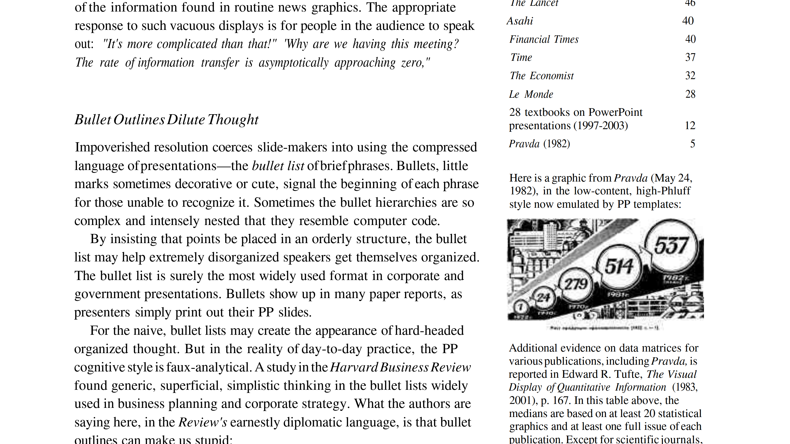
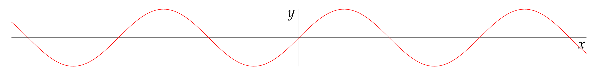

% Tufte-style layouts

## The Tufte style
<div class="section">
<div class="main-text">
The Tufte style is named for Edward Tufte.

The Tufte style (for example, [this](https://www.inf.ed.ac.uk/teaching/courses/pi/2016_2017/phil/tufte-powerpoint.pdf?utm_source=pocket_mylist) or [this](https://www-uxsup.csx.cam.ac.uk/pub/tex-archive/macros/latex/contrib/tufte-latex/sample-handout.pdf)) is known for its 'split' format. One column, on the left hand side, takes up about 60 percent of the page, and contains the main text. The second column is a 'margin' to the main text, and contains sidenotes (as opposed to footnotes), images, and other content supportive of the main text.

The effect of this layout is that the supportive material is in close proximity to the text it supports without disrupting the flow of the main text.

Tufte documents have two levels of headings: A- and B-heads. Further subdivision is not permitted.

In later books, Tufte put more vertical space above the section starts. Section text begins with a non-indented paragraph, and a few words of small-caps.

The Margin is used for citations, footnotes, images, figures and tables. However, figures could be displayed in the main column, or even span both columns as the context suggested.
</div>
<div class="sidenotes">

</div>
</div>

## Adaptation for a blog format
After reading a few things about the format, I like it a lot, and I'd like to see if I can use it on my blog.

The Tufte style is used in handouts and books, which of course have pages, and which are generally fairly narrow.

For screens, there is generally much more horizontal space available. This would suggest that the roughly 60/40 split can be changed to more like 50/50. However, the layout should be reactive, such that it will shrink to a 60/40 layout, before in-lining the marginalia.

The nature of HTML/CSS means that there will probably be rather less control than with full typesetting (or with LaTeX), in particular with regard to the positioning in vertical space of the margin material.

Other than this, I think the format should adapt fairly well.

## Screen Document Layout
I'm going to set the following rules for the sizing:

The main column will be fixed to a maximum number of characters (or actually, em). Tuftes lines seem to be between 65 and 70 characters. We'll start with that and see how it looks. The goal will be for it to take up roughly half the screen, but I want to be careful that this doesn't result in the lines being too long, containing too many characters, so the reader doesn't have to flick so far when going to a new line.

The main column will be set to the left hand side of the screen.

That leaves the rest of the screen available for the margin, but again, too much and it'll bad. 50/50 should be a good starting point.

The reactive behavior should be that the margin shrinks (and the main doesn't), until the ratio between them is about 60/40. At which point the margin 'pivots' and goes inline with the main column. This works fine for images, but not so great with footnotes. In that case it might be better to have footnotes link to modals or something, which would probably be better for mobile users.

### Headers
I like the 2-level sections, which would translate to an H1 for the title, an H2 for A-header and H3 for B-Headers.

For the H2, I like the current format I have for the blog of a underline border. In this document, it would span the page, across both columns, which I also like. I don't think I actually use H3s in my writing much, but Tufte uses Non-bolded, Italisized fonts for both heading levels. Maybe I should do the same for H3s.

## HTML Structure
<div class="section">
<div class="main-text">
I think the way to adapt the format to a HTML hierarchical document is like this

```
BODY
 |-Title
 |-A/B header
 |-Section
 |   |-Main
 |   |-Margin
 |-A/B Header
 |-Section
 |   |-Main
 |   |-Margin
etc.
```

The main risk I see with this is if the sections get too large. That could lead to the vertical alignments of the margin material getting out of whack, which defeats the main purpose of having it. This might solve itself - if the sections are that long, they might be _too_ long in any case.

The problem I have is encoding this into markdown (or quasi-markdown). How do you indicate the distinction between main and margin material?

Ideally I'd like something like this:

```
## My Header
This stuff goes in the main text.

[margin]
this goes in the margin
[/margin]

This again goes in the main text.

As does this

[margin]

[/margin]

This is some more main text, but with a reference[^1]

[margin]
[^1]: With the reference showing up in the margin
[/margin]

## Next header signifies the end of the section
```

The HTML would look like

```html
<h2>My Header</h2>
<section>
  <div class="main">
    <p>This stuff goes in the main text.</p>
    <p>This again goes in the main text.</p>
    <p>As does this<p>
    <p>This is some more main text, but with a reference<a>
      <sup>1</sup></a>
    </p>
  </div>
  <div class="margin">
    <p>this goes in the margin</p>

    <figure>
      
      <figcaption>Image in the Margin</figcaption>
    </figure>
    <p id = "fn1"><sup>1</sup>With the reference showing up in the margin</p>
  </div>
</section>

<h2>Next header signifies the end of the section</h2>
```

Note how the margins are gathered up within the section.

This is going to require some custom markdown parsing.

Actually, on reflection I think I can just inline the html:

```
<div class="section">
<div class="main-text">
This is a paragraphs in the main text block...
```

This works, but is has some pretty significant problems:

1. It makes the markdown in the editor look naff
2. It doesn't work well with the markdown preview
3. You have to manage your own references (and use `<sup>` to boot)
4. It doesn't have the neat 'collecting' margin stuff from the above

Re-writing the Markdown would be better.

</div>
<div class="sidenotes">
</div>
</div>

## Some tests

<div class="section">
<div class="main-text">
This is a paragraphs in the main text block. In corporate and government bureacracies, the standard method for making a presentation is to talk about a list of point organized onto slides projected up on the wall. For many years, overhead projectors lit up transparencies, and slide projectors showed high-resolution 35mm slides. Now "slideware" computer programs for presentations are nearly everywhere. Early in the 21st century, several hundred million copies of Microsoft were turning our trillions of slides each year.<sup>1</sup>

Lorem ipsum dolor sit amet, consectetur adipiscing elit. Nullam vitae tristique lectus. Vestibulum enim lorem, tempor ut rutrum in, lobortis quis augue. Integer auctor dolor sed mi interdum vulputate. Nam ornare turpis sed dui porttitor aliquam. Vivamus placerat tellus sit amet euismod gravida. Proin aliquet faucibus quam nec fermentum. Maecenas iaculis lorem sit amet nunc feugiat, ultricies interdum est molestie. Orci varius natoque penatibus et magnis dis parturient montes, nascetur ridiculus mus.
</div>

<div class="sidenotes">
<sup>1</sup> This is a para in the margin

</div>
</div>

<div class="section">
<div class="main-text">
Phasellus sed orci nibh. Phasellus ultricies euismod bibendum. Integer ut erat condimentum, suscipit felis lacinia, aliquet nunc. Vestibulum ante ipsum primis in faucibus orci luctus et ultrices posuere cubilia curae; Phasellus interdum purus quis quam pharetra, sit amet ultrices eros egestas. Etiam justo dui, maximus in quam ut, pulvinar rhoncus velit. Vestibulum elit arcu, gravida eget nulla a, lobortis gravida nunc. Maecenas ullamcorper tellus sed purus posuere, at lacinia neque suscipit. Etiam elementum turpis vitae egestas vehicula. Nulla ac consequat lorem, eu pharetra augue. Curabitur faucibus lectus eget nisi fermentum, eget sollicitudin ipsum consectetur. Nulla auctor nibh sed massa hendrerit dictum. Pellentesque habitant morbi tristique senectus et netus et malesuada fames ac turpis egestas. Vestibulum consequat tempor eros. Vivamus iaculis, ante ut volutpat semper, sem nisi finibus est, sit amet pellentesque est ligula quis augue.<sup>2</sup>


Curabitur varius in lectus eget vestibulum. Ut a nisi faucibus, vestibulum quam interdum, congue augue. Fusce ut consectetur dolor, sit amet condimentum justo. Praesent gravida tortor fringilla libero placerat, ac mollis lacus auctor. Aenean sit amet hendrerit tortor. Cras tempor ac tellus sed venenatis. Integer tempor volutpat nibh vitae ultricies. Mauris gravida, urna eget accumsan egestas, ligula nunc gravida velit, in maximus sem dui rhoncus tortor. Lorem ipsum dolor sit amet, consectetur adipiscing elit. Aenean id ante malesuada, lacinia nunc eu, lacinia turpis. Nam sed orci est. Integer efficitur sapien eget dignissim mollis.

```python
def inline_fn(a, b, c):
  return a+b+c
```

Mauris vitae arcu dolor. Nullam ullamcorper sollicitudin massa, ac dapibus magna scelerisque non. Proin non sapien vitae eros interdum ornare sed vitae ligula. Nunc commodo lobortis sodales. Nulla placerat posuere lacus, eu egestas erat dignissim et. Fusce tristique, neque non blandit pretium, nulla nisl aliquam eros, ac vestibulum ex magna eget ipsum. Nunc dapibus nibh non orci tristique dictum. Integer varius nunc sit amet venenatis pellentesque. Proin quis velit eget odio pharetra scelerisque vitae nec mauris. 
</div>

<div class="sidenotes">
<sup>2</sup> Embedding code examples in the margin:

```clojure
(defn hello-world [a b c]
  (blah blah blah))
```
</div>
</div>


