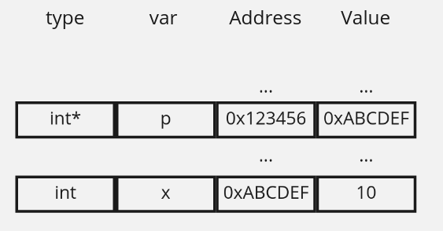
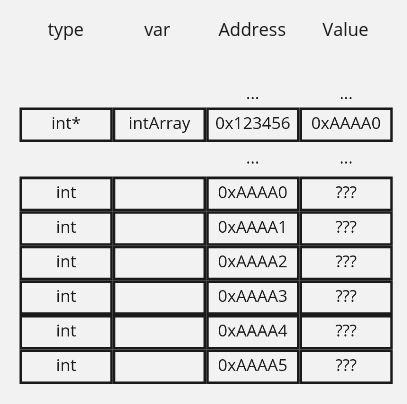

% The memory model in C

## Memory

## Pointers

### What is a pointer?
A _pointer_ in c is a group of types. Each type in c, like `int`, `char`, has a corresponding pointer type. The type name is the original type with an asterisk suffix: `int*`, `char*`. The value of a pointer type is a memory address (a 4 byte/32bit unsigned long). So a pointer of type `T*` records where a value of type `T` lives in memory.



Once declared, there are a few ways you can interact with pointers:

* You can 'dereference' a pointer with `*`. So if `p` is a pointer, `*p` can be thought of as the variable that `p` references.
* You can 'compute' a pointer with `&`. So if you have a variable `i`, you can compute a pointer to that variable with `p = &i`
* You can "dereference and access" a field in a struct from a pointer to that struct. So if you have a pointer `struct_p` to a structure instance `x`, where the structure has an attribute `a`, you can get the value of `a` with `struct_p->a`


```c
void foo() {
  int* p; // declaring a pointer to an integer
  int i;  // declaring an integer

  i = 10; // setting variable i to 10
  p = &i; // set p to point to i, by "computing a pointer"
  *p = 13; // set the thing p points to (i) to 13 
  // Transitive relationship: *p=i=13
  // i IS 13. *p IS i. So *p IS 13.
}
```

### Arrays and pointer gloss

Arrays are declared with `int intArray[6]`, which creates and reserves memory for an array of 6 integers. The object `intArray` is just a pointer to the start of that reserved memory.


