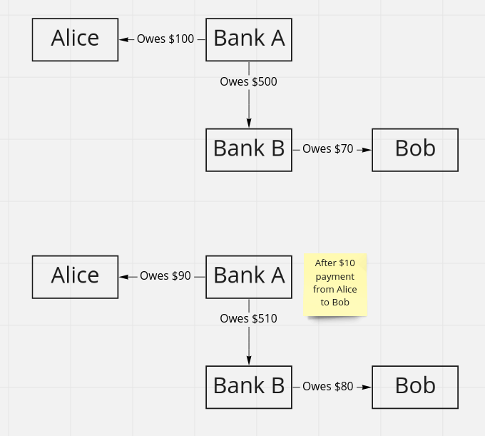

# How Money Moves Around a Banking system
This post is based on the blog post [A simple explanation of how money moves around the banking system](https://gendal.me/2013/11/24/a-simple-explanation-of-how-money-moves-around-the-banking-system/), by Richard Brown. It is mostly a restatement of the content of that post.

## In bullets
1. This article is about how a bank manages a payment between an account with it, and an account with another bank.
2. _Correspondent banking_ is when Bank A maintains an account at Bank B in it's own name, and when its client pays money to an account with Bank B, that account is credited.
3. _Deferred Net Settlement_ (DNS) is when a Bank A communicates its transactions to a central clearing system, which nets everything together at the end of the day and tells Bank A how much it needs to pay to whom. BACS is the UK example of this.
4. _Real Time Gross Settlement_ (RTGS) uses the central bank as an 'in-between' layer between the banks. When Bank A needs to transfer to Bank B, they pay to Bank B's account with the central bank. Examples are CHAPS, Target 2, Fedwire.
5. An elaboration on DNS is the UK _Faster Payment Service_. It works the same way, but clearing happens multiple times per day instead of the end of the day.
6. SWIFT is just a messaging method and protocol, defining types of messages. _Not_ a way to make payments, just a way for banks to communicate with each other.

## How a bank thinks about your deposits
From the perspective of a customer, it's tempting to think of a bank account as a 'safe keeping' place for your money. You give them your money, they put it in a vault (your account), and when you ask for some of it back, they go into the vault, take the money out, and give it to you.

This model is _not_ how the bank thinks of an account, though. From a banks perspective, a more helpful model is that an account is a _liability_. By giving the bank money, you are _lending_ it to them. So for the bank, an 'account' is just a ledger of how much you, the customer, have lent to them. The transactions on the ledger are records of you lending money to the bank (by depositing money), and reducing that lending (by drawing money). The account _balance_ is the sum of those transactions. This is how we're going to think of bank accounts in this post.

### Intra-bank transactions
This means that moving money between two accounts at the same bank is trivial. If Alice instructs a payment of $10 to Bob, and they bank at the same bank, all that the bank does is make an entry on each of Alice and Bob's ledgers. Nothing _happens_ except a bit of bookkeeping.

Notice how this 'nets out': The bank owes $10 less to Alice, but owes $10 _more_ to Bob, and the bank's net liability has not changed.

## Moving money between banks
However, this only works as long as you stay within one bank. Eventually, Alice is going to want to pay Bob $10, but Bob has an account at a _different_ bank. How do the banks handle this?

### Correspondent Banking: Bank A has an account with Bank B and vice versa
The simplest way to deal with this is for every bank to have an account with every other bank they deal with. These are _Correspondent Accounts_[^1]. That is, Barclays bank _itself_ has an account at HSBC, and that account is called Barclays _correspondent_ bank account.

[^1]: I'm not totally sure this is the correct usage, but good enough for now.

Let's say Alice (with Bank A) wants to pay $10 to Bob (with Bank B). Bank A will reduce Alice's ledger by $10, and _increase_ Bank B's correspondent account by $10. At the same time, they will send a note to Bank B saying _"Hi Bank B, we increased your account with us by $10, and this is for Bob."_ When they get this message, Bank B will increase Bob's balance by $10, and will also record that they are now lending an additional $10 to Bank A[^2].
As before, the net liabilities of each bank haven't changed. Bank A now owes $10 less to Alice, but $10 _more_ to Bank B. Bank B owes $10 _more_ to Bob, but is _owed_ $10 more from Bank A.

[^2]:Remember, a bank account represents you _lending_ money to the bank. The same is true for correspondent accounts: A positive balance means Bank B is _lending_ money to Bank A.

However there is a problem with this model which make it impractical for actual use: _Counterparty risk_. If we repeat the above process for many transactions, Bank B will end up with a large balance with Bank A, meaning they are owed a large amount by Bank A. What if Bank A goes bust? Bank B will end up with a large mismatch between the amount they owe to their depositors on the one hand, and the amount the are owed by others. Bank B doesn't like this![^3]

[^3]: Note that there is a way around this: Since Bank A also has an account with Bank B, instead of Bank A crediting Bank B's correspondent account, they could ask Bank B to _reduce their_ correspondent account. This would have the effect of reducing the amount that Bank B owes to Bank A, thus preventing the build up.

A second problem is that it results in a lot of noisy communication between Bank A and Bank B if they are making thousands or millions of transactions per day, which is difficult to manage.

The solution to both of these problems is a _deferred net settlement_ system.

### Deferred Net Settlement: Using a central clearing system to aggregate payments between banks and settle the net amount

In a deferred net settlement system (**DNS**)[^4], the banks don't communicate about inter-bank transfers directly. Instead they send all their transactions to a central clearing system. The clearing system aggregates all of the transactions, and then at the end of the day they tot up all of the results and tell all of the banks involved how much they owe each other, and therefore how much each bank needs to credit or debit their correspondent accounts. 

[^4]: For example, BACS (Banker's Automated Clearing Services) in the UK.

This eliminates the volume problem mentioned before, since each bank needs to make at most one change to the correspondent account of each other bank. It also has the benefit of being _multilateral_, rather than bilateral. So if Bank A needs to pay $10 to Bank B and $10 to Bank C, but Bank B needs to pay $10 to Bank C, then Bank A can make a single payment of $20 to Bank C and nothing to Bank B[^5]. This helps resolve the risk exposure problem by minimizing the balances of correspondent accounts.

[^5]: The article is not explicit that this is what happens, so this might not actually be true.

However, this introduces a _new_ problem relating to counterparty risk, around _timing_ and _final settlement_. If Bank A is _not_ directly communicating with Bank B, but instead with the clearing agent, then Bank B won't _know_ to credit Bob's account with $10 until the end of the day, which is problematic for efficient transfers of funds. 

On the other hand, if Bank A _does_ tell Bank B to credit Bob with $10 straight away, Bank B still won't get the transaction 'cleared' until the end of the day, when the DNS system runs. If Bank A goes bust between these two times, Bank B will have mismatched liabilities again. This means Bank B has 2 options: Not credit Bob's account until the end-of-day settlement, which has the same inefficiency problem, or to _conditionally_ credit Bob's account with $10, on the condition that Bank A doesn't go bust before the end of the day. And if they do, they will reverse the $10 credit to Bob's account. This is also problematic, because it means that Bob might "spend" the $10 that is then taken away when the credit is reversed. This lack of _final settlement_, as it's called, is again a problem for efficiency, because your customers will be unwilling to spend money they don't know is 'final' yet.

### Real-Time Gross Settlement: Using a central bank as a "Banker for banks" to eliminate counterparty risk.

Most of the problems we've seen so far with inter-bank transfers are the result of _counterparty risk_: What if the bank on the other end goes bust?

A natural solution to this problem is to make sure the bank on the other end _can't_ go bust. Such a bank conveniently exists: The Central Bank. The idea behind a **Real-time Gross Settlement** system[^6] is that banks use the Central Bank as their correspondent banker. Given that the Central Bank can never go bust (because it can always just print money), the banks can build up as much liability from it as they want.

[^6]: CHAPS in the UK, Target 2 in the EU, and Fedwire in the US are all examples of RTGS systems.

So when Alice (at Bank A) wants to pay $10 to Bob (at Bank B), Bank A reduces Alice's balance by $10, and tells the _Central Bank_ to credit Bank B's account _with_ the Central Bank by $10. Thus, Bank B is now owed $10, not by Bank A, but by the Central Bank.

This means that the aggregation that was made a part of a DNS system to mitigate counterparty risk is no longer required. Payments are instantaneous, so the timing and final settlement problems are avoided.

### So why does everyone not use RTGS all the time?
You might think that we've solved all the problems, but one remains: cost. RTGS systems are quite expensive. I don't know why exactly, but firstly one can imagine that the real-time nature of system means a lot of communication that isn't necessary with a DNS System, which can be expensive. Secondly I expect it's a function of demand and utility: A real time system with final settlement is a valuable service for customers, and banks are businesses, so they probably charge an amount that is calculated to maximize their profits.

This means that not all payments are made by RTGS. In fact, not even the majority are. For example in the UK the most commonly used payment method is the _Faster Payment Service_, or FPS. This is a DNS System with one critical tweak: Instead of clearing once per day, it clears _several_ times per day. This means the time it takes to clear a transaction is significantly reduced. This is good enough for most customers, hence they don't feel the need to shell out for RTGS unless they _absolutely need_ the real-time settlement.

## A Swift Sidenote
SWIFT's role in payments is often misunderstood. It stands for the _"Society for Worldwide Interbank Financial Telecommunication."_ The "telecommunication" part is the key here. All the SWIFT network is, is a method and protocol for sending messages. It defines several standard message types for various uses.

So SWIFT is _not_ a way to make payments. Rather it is just a way for banks to communicate with each other, and that includes the communications we've been talking about throughout this article.

