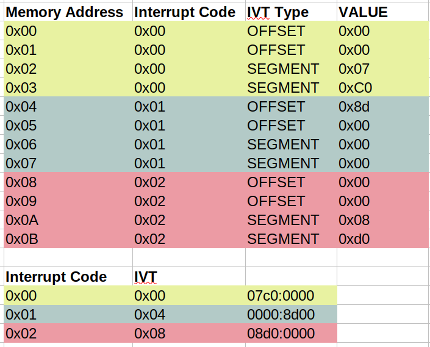

# Kernel Development Part 2: The Interrupt Vector Table and Real Mode IO
Interrupts are like subroutines that you call through 'interrupt numbers' rather than memory addresses. There are interrupts pre-defined in the BIOS - in the previous post we saw `10h 0eh` prints a character to the screen - or they can be set up by the programmer. Interrupts are special because they halt the processor, save the current state (meaning what? the registers?) to the stack, execute the interrupt, then restore the pre-interrupt state.

The code for these interrupts are stored in RAM. The locations of the code are stored in the _interrupt vector table_ (IVT)[^1], which starts _right at the beginning_ of RAM at address `0x00`. There are 256 entries in numerical order, `0x00` to `0xFF`, and each contains a 4 bytes: a 2 byte OFFSET and a 2 byte SEGMENT. This means you can calculate the location in the IVT of any interrupt code with `code * 0x04`. Interrupt `0x13` is at `0x46`.[^2]

[^1]: All of this only applies to Real Mode. In Protected Mode, an "Interrupt Descriptor Table" is used instead. More on this later

[^2]: Layout of the IVT: 

The processor can throw exceptions with interrupts. For example, if you try to divide by zero in an Intel processor, it will call interrupt 0.[^3]

[^3]: wiki.osdev.org/exceptions is a great resource for learning more

In the following code, we _replace_ interrupt 0 with our own subroutine, by replacing the entries in the IVT to point to the subroutine in memory. Running our bootloader in this state will cause the screen to show `AHello World!A` - the first `A` comes from our manual call to the `int 0`, and the second comes from our attempt to divide by zero, which causes the processor to run interrupt 0.

``` asm
start:
    ; snip
    mov word[ss:0x00], handle_zero ; Set offset to handle_word address
    mov word[ss:0x02], 0x07C0      ; set segment to 0x07c0 

    int 0 ; call interupt 0

    mov si, message
    call print

    mov ax, 0x00
    div ax ; try to divide by 0

    jmp $

handle_zero:
    mov ah, 0eh
    mov al, 'A'
    mov bx, 0x00
    int 0x10
    iret

; snip
```

## Reading from disk
Next we will see how we can read data from a hard disk. Note that we're not talking about accessing _files_. Files and the file system are implemented in the Kernel. Or to be more specific, the disk is 'formatted' with a particular file system data structure (FAT, EXT4 etc.), and the kernel has drivers which are able to interpret that data structure as files. As far as we are concerned, the disk consists of blocks of data called _sectors_[^4]. A sector consists of 512 contiguous bytes. These sectors are read and written in sector blocks, not by accessing individual bytes.[^5]

[^4]: We already encountered sectors when talking about how the bootloader is loaded.


The old way of addressing disk sectors is the _Cylinder Head Sector_ (CHS) system. This is from when disks were spinning magnetic plates arranged in cylinders. You need to specify the cylinder, head, sector and track you want to read from. This was pretty complicated, and it is no longer really used. The modern way is called _Logical Block Address_ (LBA). In LBA you just specify the sector number you want to get. LBA 0 is the first sector on the disk, etc.[^5]

[^5]: Since you can only read in sectors, to calculate a specific place on the disk using LBA you need to calculate the sector and the offset. This is simply a matter of getting the quotient and the modulus. So to get to byte 58376 you calculate the LBA sector by `58376/512=114`, and the offset as `58376%512=8`

### Some housekeeping before we actually read from the disk
First create a text file and put in it whatever you want. This is going to be the thing that gets read from the disk. Create a _Makefile_[^6].

[^6]: Make is a language unto itself, intended to simplify the compilation of project with multiple files.


```make
all:
	nasm -f bin ./boot.asm -o ./boot.bin
	dd if=./message.txt >> ./boot.bin
	dd if=/dev/zero bs=512 count=1 >> ./boot.bin
```

The first line is same assemble command we've already been using. The second line puts the content of _message.txt_ onto the end of our binary, and the third pads the binary out with null characters until it's 512 bytes, and therefore a valid sector. You can type `make` at the command line to compile the project. You can see the content of the binary with `hexdump -C ./boot.bin > hex.txt`, and opening the text file.

### Time to actually read from the disk

We'll be using interrupt `13h/02h`: "Disk - Read Sectors into Memory". Looking at the expected register values that [Ralph Brown](http://www.ctyme.com/intr/rb-0607.htm) provides[^7] we can get to the follow code:

[^7]: `AH` = 02h, `AL` = number of sectors to read, `CH` = cylinder number, `CL` = sector number, `DH` = head number, `ES:BX` -> data buffer. Return: `CF` set on error


```asm
    mov ah, 02h
    mov al, 1
    mov ch, 0
    mov dh, 0
    mov cl, 2
    mov bx, buffer
    int 0x13
    jc error ; if carry flag is set, meaning load failed

    mov si, buffer
    call print

; snip to end of file

error_message: db 'Failed to load sector', 0

times 510-($ - $$) db 0 ; Pad to 510th byte
dw 0xAA55 ; dw=define word. Puts bootloader signal

buffer:
```

Here we set up the registers as they need to be to read our message from the 2nd sector (`cl`) of the disk into the `buffer` label in memory[^8]. Then we call the interrupt `0x13`. `jc` handles the error condition.

[^8]: Note that the data is put into `ES:BX`, the Extra Segment. We have set this to `0x7c0`, which is the right place.
