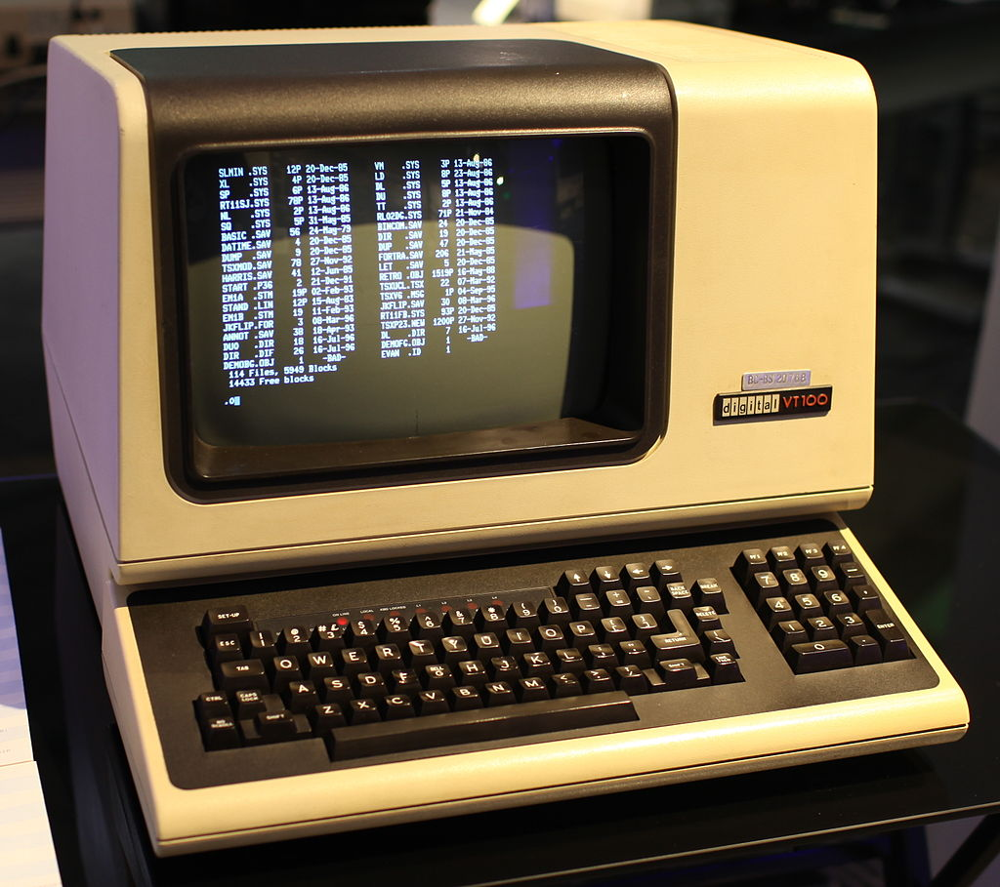

# Linux Window Manager Part 1: What is a Window Manager?
This is the first part in a series on Window Managers (or "WMs") on Linux.
I'm a long-time Linux user, and that includes dabbling in different distributions and desktop environments.
I most use Ubuntu and Gnome 3, which I love for its simplicity.
But _tiled window managers_ are always something that have appealed to me, due to their simplicity, use of space, and keyboard-driven usage.
Browsing [/r/unixporn](https://old.reddit.com/r/unixporn/) highlights some of the elegant, clean and simple desktops that can be created wit this model[^1].

[^1]: If there was a /r/unixporn-without-anime-girls, that would be even better.

The intent of this series is to delve into the details of what exactly Linux WMs _are_ and how they _work_. 
In doing so I'll talk about the X graphical protocol, X11 and XOrg, and I'll look at the source code of one WM: the [Suckless Dynamic Window Manager, DWM](https://dwm.suckless.org/tutorial/).

## Computer Graphics and the Window System
To start right at the beginning, you need to understand how your computer draws things on the screen.
In the old days, operating systems ran on computers, and users interacted with them by text-only physical terminals, such as the [DEC VT100](https://en.wikipedia.org/wiki/VT100)[^2].
These systems needed to know how to draw _characters_ on the screen, but that was it.

[^2]: By Jason Scott - Flickr: IMG_9976, CC BY 2.0, https://commons.wikimedia.org/w/index.php?curid=29457452

Later, graphical user interfaces, GUI, environments started to appear.
These were premised on a _window system_ model, in which rectangles (windows) are drawn on the computer display to show the output of different applications, and allow users to interact with them via the mouse and keyboard.
The big benefits of a GUI over a terminal is that you can see multiple applications at once, and the display options for each application are much richer.
A clock application, for example, can display a analogue clock complete with moving hands, as opposed to a digital representation.

In a window system, there is a _root_ window, which covers the whole screen[^3], and within that window there can be other, 'child' windows.
Most windows will be assigned to applications, which decide how to fill those windows.
But other windows can be determined by the window manager itself.
For example, what you are looking at an application, what you will typically see is a narrow sub-window at the top spanning the whole parent, which contains a bar with menus, and window controls like minimize and maximize.
This content is determined by the Window Manager, and are sometimes called _window decorations_.
Then below that you will have the main application window, the contents of which is determined by the application itself.

[^3]: For now we will ignore multiple screen systems and multiple _desktop_ systems.

## Elements of a Windowing System
In a windowing system you typically have a _display server_ and _clients_.
A client is any application that is running on the machine (and has a graphical element.)
The job of the display server is to receive input from the clients and the OS Kernel, including all input devices like mouse and keyboard, and translate that into changes in the pixels you see on the monitor.

Another key element involved is the _protocol_. This is, in effect, the common language that clients use to interact with the display server, telling it what they want to draw to the screen.

For this series, the display server is _XOrg_, and the protocol is is the _X Window System_ (Specifically the _X11_ implementation of the protocol).
There are others, and the models for these will be often quite different, but X11/XOrg are ubiquitous on Linux.

We've seen that each application is communicating with the Display server, telling it what shapes it wants drawn.
The display server needs something to keep track of all of these applications: whether they are minimized, what their position on the screen is.
This is _window management_ and is the job of the _window manager_. The WM tracks the state of all the 'top level' (that is, children of the root window).
The WM also manages things like borders, title bars, and resizability.

The final piece of the puzzle is _composition_.
The Display Server and window manager have information about the pixels of each individual window, but these need to be combined into one set of pixels that cover the whole screen.
This involves making the judgment that one window x is partially 'behind' window y, and so the pixels of x that overlap with y shouldn't be included in the resulting composite.
This is the job of the _compositor_.
Often the jobs of window management and composition are combined in a single program for efficiency, called a _compositing window manager_.

```
                     ┌────────┐    ┌────────┐
                     │Firefox │    │Kitty   │
                     │(client)│    │(client)│
                     └────▲───┘    └────▲───┘
                          │             │
                          │             │
                     ┌────▼─────────────▼───┐         ┌────────────────┐
                     │ Xorg Display Server  │         │ Compositor/    │
                     │                      ◄─────────► Window Manager │
                     └──────┬───────▲───────┘         └────────────────┘
                            │       │
   ┌──────┐               ┌─▼───────┴─┐
   │Screen◄───────────────┤ OS Kernel │
   └──────┘               └──▲──────▲─┘
                             │      │
                             │      │
                             │      │
                     ┌───────┴┐    ┌┴────┐
                     │Keyboard│    │Mouse│
                     └────────┘    └─────┘
```

## The process, simplified and summarized
So in short, and quite simplified, when Linux is booted the following things happen:

1. An XOrg display server is started and the root window created.
2. The Window Manager program is loaded, and it communicates with XOrg via X11 to create the initial windows such as the status bar.
3. The user, either by keyboard or mouse, commands that an application be launched.
4. The launched application registers itself with XOrg, using X11, and tells it what shapes and text it wants to be drawn on the screen.
5. Xorg passes this information to the Window Manager, which tracks the application in its state, along with the xpos, ypos, width and height of the window, and whether the window is minimized or not.
6. The WM passes this information to the compositor, which composites all of this information into a single image comprised of pixels.
7. The compositor passes this back to the display server, which sends it on the Kernel.
8. The Kernel handles the drawing of the image to the screen.

## What about a Desktop Environment?
How do desktop environments (DEs) like Gnome and KDE fit into this?
DEs are _complete graphical interfaces_. They package a compositor and window manager, but also many other things, like lock screens, notification managers, login managers ('display manager'), application launchers and default applications.

For example, Gnome uses the Mutter Compositing WM, and the GDM display manager.

## Flavors of Window Manager
The first WM flavor is stacking, or floating. 
This will be familiar to every PC user, since it's the standard on Windows, Mac, and all popular Linux desktops.
In a stacking WM the windows are like sheets of paper on a desk, which can be moved around, including partially overlapping.

In a tiling WM, the windows _can't_ overlap.
Instead, when a new window is opened, the old windows will be moved so as to accommodate the new one.
The method for deciding how to allocate different sections of the screen between the applications is usually called a _layout_.

A Dynamic Window Manager is one which offers both floating and tiling flavors.

## Up Next: 

The X Protocol and X11

## Resources
* https://dev.to/l04db4l4nc3r/compositors-in-linux-1hhb
* https://wiki.archlinux.org/title/Window_manager
* https://wiki.archlinux.org/title/Xorg
* https://wiki.archlinux.org/title/Desktop_environment
* https://en.wikipedia.org/wiki/X_Window_System
* https://en.wikipedia.org/wiki/Windowing_system
* https://stackoverflow.com/questions/42982963/what-is-the-difference-between-display-server-a-window-manager-and-a-composito
* https://www.reddit.com/r/linux/comments/7509sm/what_is_the_technical_difference_between_a/
* https://www.reddit.com/r/linux4noobs/comments/jbnd17/what_is_a_compositor_and_what_is_a_window_manager/
* https://www.reddit.com/r/linux/comments/7509sm/comment/do2qfx1/?utm_source=share&utm_medium=web2x&context=3
