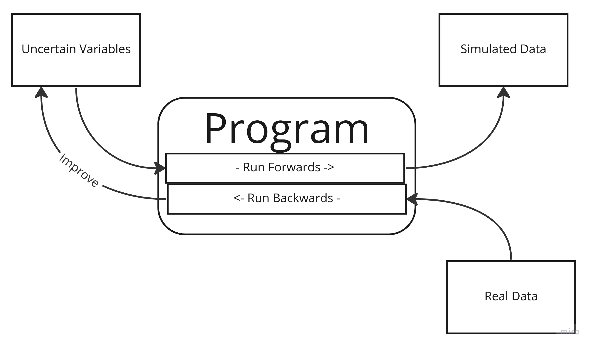
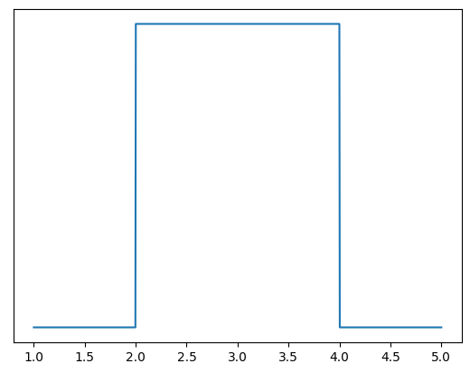
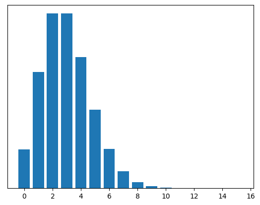

# Probabilistic Programming and Distributions

## Deterministic and Probabilistic Programs

A traditional computer program is a set of procedures which run roughly sequentially to produce a result.
The inputs to those procedures are known at the time they are run.
For example, at the time the function `add(1,2)` is run, there is no doubt that the inputs to the function are 1 and 2.

In probabilistic programming this is different.
A function might `add(X,Y)`, but at the time it executes, the exact values of x and y are _not_ known by you.
Call them **uncertain variables**.
There are two consequences to this:
First there can be no single outcome from running the program.
At best, you can run it for every possible value of every variable, producing a _set_ of results.
The second consequence is that you can run your program _backwards_, taking a set of results and using them to get a better idea of what values your unknown variables can take.

Traditional programs are often _models_ of some real world activity, with objects and concepts in reality being represented in code by classes, types and functions.
A shipping management program will have electronic representations of different ships moving between electronic ports.
A chess program has analogues in code to the wooden boards and pieces.
Actions taken in the real world will have mirrors in the program, like `pizza.addTopping(mushroom)`.
"Running" a program of this type _simulates_ activity in the real world, with the assumption that the outcome of the simulation will be useful - for example, I will be able to figure out `pizza.price()`

In a probabilistic program, running the program _forward_ has this same quality of simulation.
The difference is that, for a traditional program, the outcome should be the same every time - `pizza.price()` is not useful if it gives you different answers - whereas for a probabilistic program the outcome will usually be different - like the function `six_sided_die.roll()`.

Consider the above 'pizza' program, only in this scenario we're not the person running the pizza shop, and we _don't know_ what the topping prices are.
However, we have a bunch of receipts from the pizza shop which show the total price, and the toppings.
By running the program _backwards_, we can come up with, or improve, our guesses about what the prices of individual toppings cost, by figuring out how likely we would be to see that data given different inputs.



Before we dive into probabilistic programming, a note on nomenclature.
In probabilistic programming, the languages of statistics and programming - each confusing, inconsistent and poorly defined - have collided many times over, producing many incompatible languages largely incomprehensible to everyone.
Here are some rough equivalences between the two domains, but for the rest of this article I'll try to avoid most of the more statistical terms.

1. A 'Program' and a 'Model' are synonymous terms. (I'll usually use program).
2. 'Simulation', 'Generation' and 'Sampling' are all names for the process of running your program forwards to produce data. (I'll use simulation)
3. 'Training' or 'Updating' your model, or 'Inference' is the process of running your program _backwards_, using data, to improve your guesses about your uncertain variables. (I'll use inference, in the sense of _"I infer things about the uncertain variables from the data."_) 
4. The 'prior' is the name for your guesses before the training, and the 'posterior' is the name for them afterwards. (I'll not use these at all.)

## Specifying Uncertainty

I've said that the inputs to our program are uncertain, or that we provide 'best guesses' as to what the inputs are when we are running the program.
What this means is that, instead of knowing that a mushroom topping is $3, we have to indicate a range of possible values we think it can take.
Something like "I think the mushroom topping is $3 or $4."
But this isn't really sophisticated enough.
Do we think it's equally likely to be $3 or $4, or do we think it's a bit more likely to be $3 than $4?
Do we think it's _exactly_ $3 or $4, or just some value inbetween those two?
We need a language to be able to specify this precisely.

```python
## Deterministic Program
mushroom = 3

pizza = Pizza(size=12)
pizza.add_topping(mushroom)
pizza.price()
#=> 15

## Probabilitic Program
Mushroom = ??

pizza = Pizza(size=12)
pizza.add_topping(Mushroom)
pizza.price()
#=> ??
```

This is where uncertainty curves, or "Distributions" come in.
An uncertainty curve is a 2d-graph which, for each potential value we think a variable can have (on the x-axis), shows how likely we think that value will be (on the y-axis).
The curve can be _continuous_ - the variable can take any value in a range - or _discrete_ - the variable can take on only particular values.
The shape of the curve can be a completely arbitrary squiggle on a page.
However there are some shapes that are so common they have been given names.
Here are a few. Remember the x-axis is the possible values the an uncertain variable can be, and the y-axis is the relative likelihood of the variable taking that value.
Note that I've taken off the Y-axis label.
That's because it's not really important - the _shape_, and the x-axis values are what counts. 



This shape says: _"the variable is equally likely to be any value between 2 and 4, but nothing else."_ It's called the **uniform** distribution.


This shape says: _"the variable is something around 4.25, but can vary a bit around that."_ It's called the **normal** distribution.



This shape says: _"the variable is most likely around 2 or 3, but it could be as low as zero, and could also plausible be 0, 1, 4, 5 or 6. There's also a slight possibility it's more than 6, but not much."_
This is called the **Poisson** distribution.

There are a lot of these named distributions. One of the reasons they are named is because they happen to come up a lot.
For example, the Poisson distribution looks like the shape you see when you're counting events that occur in a set period of time. 
Like the number of people that leave a tube station exit in an hour.
It could be zero, but it can never be _less_ than zero. 
It has a peak somewhere, after which it falls off.
_Theoretically_ there is no upper limit to the number of people that could exit the station in an hour, but in practice it's very unlikely it will be a large number.

The Normal distribution is probably the most famous.
The distinctive bell pattern - "something around x, but could be a bit more or a bit less" - comes up all the time in nature for various reasons.

I call these distributions, but really they are more like _families_ of distributions.
For example the following are both Normal distributions, but they have different graphs, with different peaks and different 'spreads'.
A Normal distribution is described with two parameters which give the 'peak' x and how spread out it is.
So you might say a variable with a peak at 5, and a spread of 4 has a `Normal(4,5)` distribution[^1].


[^1]: The naming conventions for parameters are confusing. For normal distributions they are variously called mean, mu, sd, sigma, tau, variance. Worse, every distribution has different parameters, different names for those parameters, and sometimes different _meanings_ for them. It's a bit of a mess, but it's not much of problem in practice.

Here's some proposed pseudocode for specifying uncertain parameters using distributions.

```python
a = 10          # assignment of deterministic parameters
X = Normal(3,4) # convention: uncertain variables are capitalized
Y = Poisson(4)
```

The only critical attribute of a distribution is that there is some way to determine the probability of a potential value `x`.
That is, for a value x, you need to be able to get to the `y=p(x)`.
The easiest way to do this is with a function.
Each of the named distributions have a mathematically defined **probability function**[^2] which, for every possible x value, will give you the y value on the curve.
The details of the functions themselves are not especially important, the computer knows them.

[^2]: in different cases called a 'pdf' or 'pmf' for tedious reasons

```python
X = Normal(5,4)
# Finding the probability that uncertain variable X has the value 3
y = X.probability(3)
```

Having these functions is nice because you can plug in any x value you want and get an answer.
A downside is that the named distributions can be quite limiting, because the shapes they draw are very simple, so they might not be a good reflection of the real world.
Another downside is that combining curves means composing functions together, which is not always easy (and sometimes basically impossible).

There are other ways to represent distributions.
A very simple way is just by enumeration:
For every value of x, you specify the value of y.

```python
X = Distribution([[0,0.078],[1,0.259],[2,0.345],[3,0.231],[4,0.077],[5,0.010]])
```

Note that we haven't specified a _type_ of distribution, like Normal, because we don't need to.
That gets around the problem above of being limited to named distributions, and means we can represent arbitrary curves. 
This method is OK, but it scales very poorly.
Most distributions (and all continuous ones) can take infinite values.
Nonetheless, you can roughly specify the curve by having an appropriate large number of x values, and saying that beyond a certain point y is pretty much zero.
_Combining_ distributions is theoretically easy (you're just multiplying matrix values together) but again, that quickly becomes unscaleable, because the number of calculations you need to do grows exponentially with the number of uncertain variables.

A third way to represent a curve is to provide a bunch of data taking values that are in proportion to the curve you want to draw.
When the data is plotted on a normalized histogram, the shape of the resulting bars will approximate the curve of the distribution, provided you have enough data.
The downside is that you need a _lot_ of data to get a good approximation.

```python
X = Distribution(data=csv.reader("data.csv") )
histogram(X)
```


## Simulation: running the program forwards

So we have a way to specify uncertain variables.
Now what?
I said that we can run our program forwards, to simulate, and backwards, to infer.
Let's start with running our program forwards.

We know that our probabilistic program doesn't output single possible results like a deterministic one.
So what does it output?
One way or another, it outputs the relative likelihood of the different possible outcomes we expect to see.
The first way to think about this is that our program can output a range of possible outcomes, with the likelihood of seeing each of those outcomes.
The second way to think about this is to 'pick' a value from the uncertain variables, and see what the outcome is.
Do this hundreds or thousands of times, and look at the relative counts of the outcomes are.
These are, in effect, the same thing.
In practice, the second approach tends to be used.

To simulate we need to generate random values for our variables.
That is, produce a value randomly such that the likelihood of getting any give x value is proportional to the y value on the curve.
Doing this is pretty easy:
All you need is the probability function (i.e. a mapping of x to y) and something that can generate a random number between 0 and 1.
Turn the probability function into a _cumulative_ probability function by summing all the values, so you get a curve like this (probability function in blue, cumulative function in irange):


Then take a random number between 0 and 1, find the x value that corresponds to that y value.
For example, using the above graph, if your random number is 0.5, read across from 0.5 on the y-axis until it intercepts the orange curve, the read down to the x value to get about 4.5.

## Certainty about Uncertainty

So far we have looked at uncertain variables, and you can use these to make programs.
For example, you could have a program that assumes height in a group of people is normally distributed, with an average of 189 and a spread of 5.

```python
Height = Normal(189, 5)
Height.simulate(1000) # running forwards
```

Here we said that our initial guess of the mean and sd of the uncertain variable `Height` was 189 and 5.
But this misses a crucial point:
In this supposedly uncertain program, we are in effect saying the mean and sd are a _single value_. How sure are we about that?
That is, we are not allowing for any uncertainty in those values, when really we _should_ be acknowledging that we don't really know what they are, we're just guessing.
This is easy to do with the syntax we've created so far:
We just say the arguments passed to our `Height` function are themselves uncertain variables, instead of just fixed numbers.

```python
X = Normal(189, 10)
Y = Uniform(0, 10)
Height = Normal(X,Y)
Height.simulate(10000)
```

What we're saying here is _"I don't know exactly what the average of the height is, but I think it's somewhere around 189cm, give or take 10cm"_.
And likewise with the standard deviation, something between 0 and 10cm.
Simulating from this program is a now a matter of simulating a value for X, simulating a value for Y, then plugging those into Height and simulating _that_.
Here are the histograms of running the first program (in _blue_ with fixed arguments 189 and 5) and the second program (in _orange_).


Notice that the orange plot is shorter and more spread out.
This makes sense intuitively:
We are saying our program is _more uncertain_ about the average and spread of height.
So the outcomes we might tentatively expect to see are more spread out.
If we specify our estimates of X and Y more tightly, we would results that are less spread out, because our guesses are in effect more confident. 

```python
X = Normal(189, 5) # reducing the 'spread' of our mean estimate by 5
Y = Uniform(2, 7)  # making the window of standard deviation smaller  
Height = Normal(X,Y)
Height.simulate(10000)
```

The orange plot is as before, the green is using the below new distributions for X and Y.
Not that the green is tighter and higher than the orange, but less so than the blue.


To this, you might object that we've only moved the problem:
We've said with certainty that the arguments to X and Y are single values.
Aren't we uncertain about them too?
Well, yes, and you can make _those_ uncertain as well.
But you have to stop somewhere.
And in practice the 'further down' you go, the less it matters.
In any case, all of these numbers are just our initial guess.
The next part of probabilistic program - _inference_ - is about using data to _improve_ those guesses.
