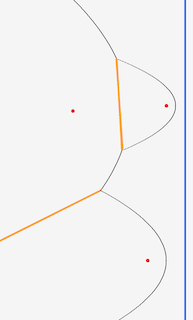
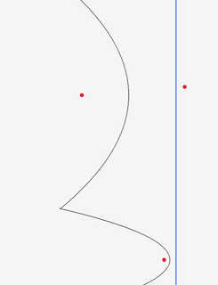
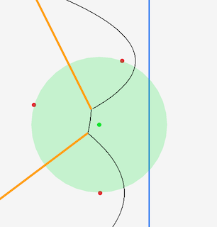

# Voronoi Diagrams

A Voronoi diagram is method of partitioning a plane into regions. It
is often used to procedurally generate maps, which is why I'm
interested in it. Happily, the general method for this (in 2d) is also the simplest. Though as we will see, that's a relative term.


You pick a bunch of points on a plane called 'sites', and the
region, or 'cell', corresponding to that site is the area enclosing
every point which is closer to that site than to any other site.

Put another way, the edge of each cell is where it is equidistant to
multiple sites (top drawing). The 'corners' of the cells, where three 3 or more
edges meet, are called 'Voronoi Vertices'. These are the points which
are equidistant from 3 or more sites (bottom drawing).


There are a few methods for generating the diagrams. A popular one is
the Fortune method, and that's the one I'll describe here.

## Data structure for describing Voronoi Diagrams

Voronois are usually stored in a doubly-connected-edge-list (DCEL).
This data structure describes a 'web' of vertices and edges between
those vertices (called a cell-complex, which is what a Voronoi
technically is) in a way that's easy to manipulate and transform.

DCEL is a primarily edge-based representation, but it also stores the
vertex and face information. Edges in a cell-complex are undirected,
but in a DCEL each edge is stored as two directed edges, one in each
direction. (These are technically called half-edges, but that's not
really important.)

In the case of the Voronoi diagram, the stored vertices are _not_ the
sites, but the Voronoi vertices.

The basic structure is like this:

```
DCEL:
 Edge[]:
    twin, next, previous:^Edge, 
    origin:^Vertex 
    left:^Face
 Vertex[]: 
    ID, Coord, incident:^Edge
 Face[]:
    incident:^Edge
```

The 'twin' of the edge going from vertex A to B is the vertex going
from B to A. If we store the origin of the edge, we can get to the
destination by `E.twin.origin`. And similarly, we store the left face,
but to get to the right face we do `E.twin.left`. The edge pointer on the vertex can be to any edge which has this
vertex as its origin.


We're going to park this for now, and get back to it way later.

## The Fortune Algorithm

Seen visually, this method creates a line which 'sweeps' from the left
edge of the plane to the right, pixel by pixel - called the
**sweep-line**. When the line encounters a site it creates what looks
like a 'bubble' around it (actually, a parabolic arc). The bubble
grows as the sweep line gets further away. The magic happens when two
bubbles from two different sites collide: the point of collision
(called the 'breakpoints') becomes the boundary of the cells, it being
equidistant between the two points. The 'frontier' of all the active
bubbles is called the 'beachline', I guess because it sort of looks
like a coast?

(Put an in progress diagram here)

In reality you don't actually go pixel by pixel. Interesting things happen at certain points which can be calculated - irritatingly called events - and we just look at those. There's a lot to unpack here, and we need to do some groundwork before really getting into it. Starting with the parabola.

### Parabola

In the above I talked about the beachline being represented as a
'sequence of parabola'. So we need to be able to represent parabola.[^1]

[^1]:https://en.wikipedia.org/wiki/Parabola

Parabola are usually taught as being defined using an equation
`y=ax^2+bx+c` or some slight variation on that. But the structure used here is combination of a
_focus-point_ and a _line_ (called the directrix - this is what the sweep line actually is). The points of the
parabola are every point for which the distance to the focal point is
the same as the distance to the line.


Since our line will always be a vertical line, the directrix can be a single point representing the x value of the line.

This how you can calculate the points of the parabola. Derivation is
not going to be covered here, and it's not actually  important for the algorithm. But it's useful for drawing it:

```python
def parabola_x(focus:Vector2, y: int, d: int):
  x = y - focus.y
  x *= x
  x /= focus.x - d
  x += focus.x + d
  x *= 0.5
  return x

def draw_parabola(f:V2, d:int, y0:=0, yn:=HEIGHT, color:=BLACK)
  for y in y0..<yn:
    DrawPixel(parabola_x(f, y, d), y, color)

focus_point = [200,300]
directrix = 300
# The focus point
DrawCircleV(focus_point, 5, RED)
# The directrix/sweep line
DrawLineEx([directrix, 0], [directrix, H]  5, BLUE)
draw_parabola(focus_point, directrix)
```


Let's tie all this back to the problem: Remember the goal here is to find the set of points that are equidistant
between two sites. The benefit of defining a parabola like this is
that, if we set the focus points to be our sites and the directix to be our sweep line, then:

- every point on the parabola is distance p from the sweep line
- every point on the parabola is _also_ distance p from the site.
- if you have two parabola from different sites, and use the same
  sweep line, the point of intersection of the parabola is equidistant from both sites.


So by finding the interections between two parabola at various you find the 'boundary' edge between the two cells.[^1]

```python
# Coordinates of two sites
site1 = [200, 300]
site2 = [400, 700]

# X coord of sweeplines at progressive points
sweep_lines = [450, 500, 600, 700, 800, 900]
# Intersection fn takes 2 sites and a sweep line, returns
# intersections.
start, _ = intersection(site1, site2, sweep_lines[0])
end, _ = intersection(site1, site2, sweep_lines[len(sweep_lines)-1])

DrawCircle(site1, 5, RED)
DrawCircle(site2, 5, RED)

for s in sweep_lines:
  draw_parabola(site1, s, color=GREEN)
  draw_parabola(site2, s, color=BLUE)

DrawLineEx(start, end, 5, rl.ORANGE)
```


This is math magic, I love it.

[^1]: the Intersection function I use here is just some not very difficult math which you can get by using the quadratic formula for the two parabola

### Back to the Beachline

The beachline is like the 'frontier' of all the arcs at a given point in the sweep line. The first takeaway from this is that, since the sweep line is going to be the same for all arcs, we can represent an arc just by its focus point (i.e. the site). The second takeaway is that we can represent the frontier line as a simple sequence of points[^2]. So in the following, the beachline is arc1 and arc2. Or, `[arc1, arc2]`

[^2]: For now - we will refine this later


And here it's `[arc1, arc2, arc3]`


There are a few nuances though. Look at this one, where there are three arcs: 1, 2 and 3. But a full description of the frontier needs to reflect that 2 separate parts of arc1 are on the frontier, with the middle bit being covered by arc 3.


It's actually easy to handle this: just put it twice: 
`[arc1, arc3, arc1, arc2]`

For each pair of arcs in the sequence (arc1/arc3, arc3/arc1, arc1/arc2), we can calculate the boundary points[^3], and by drawing the arcs between the boundary points, we sketch the beachline.

[^3]: Boundary point is just another term for intersection between the arcs.

```python
def draw_beachline(beachline:[V2], d:int)
  y = 0
  for i in 0..<len(beachline)-1
    p1, _ = intersection(beachline[i], beachline[i+1], d)
    draw_parabola(beachline[i], d, y, p1.y)
    y = p1.y
  draw_parabola(beachline[len(beachline)-1], d, y, H)

site1 = [200, 300]
site2 = [400, 700]
site3 = [450, H/3]

sweep = 500
beach_line = [site1, site3, site1, site2]

DrawCircleV(site1, 5, RED)
DrawCircleV(site2, 5, RED)
DrawCircleV(site3, 5, RED)
DrawLineEx([sweep, 0], [sweep, H],  5, BLUE)
draw_beachline(beach_line, sweep)
```


### Incomplete edges

To this, we need to add the edges - the halfway line between the sites. This is just the line between intersections between two arcs:


```python
def draw_beachline(beachline:[V2], d:int)
  y = 0
  for i in 0..<len(beachline)-1
    p1, _ = intersection(beachline[i], beachline[i+1], d)
    draw_parabola(beachline[i], d, y, p1.y)
    # Same as before, except now draw line between the 2 
    # intersection points
    DrawLineEx(p1, p2, 5, ORANGE)
    y = p1.y
  draw_parabola(beachline[len(beachline)-1], d, y, H)
```



(One of the boundary points is way off the screen, but it still works fine)

I'm calling these _incomplete_ edges, because they don't start and end with a fixed vertex. We'll see how incomplete edges become complete ones later.

### New arcs are created when the sweep line hits a new site

I mentioned at the beginning that interesting stuff happens at some special points on the sweep line. The first of these points is when the sweep line hits a new site. This creates a new arc, and inserts it into the sequence, 'splitting' the old arc.

Inserts where? You need to find the arc which, if you draw a line left from the new site, you hit. That's the arc that gets split.


```python
def add_site(beachline:[V2], site:V2) {
  if len(beachline) == 0:
    append(beachline, site)
    return

  sweep := site.x
  insert_after := 0
  for i in 0..<len(beachline)-1:
    b, _ := intersection(beachline[i], beachline[i+1], sweep)
    if b.y > site.y:
      insert_after = i
      break
  inject_at(beachline, insert_after+1, site)
  inject_at(beachline, insert_after+2, beachline[insert_after])

site1 = [200, 300]
site2 = [400, 700]
site3 = [450, 280]

beach_line : []
add_site(beach_line, site1)
add_site(beach_line, site2)
add_site(beach_line, site3)

print(beach_line)
## =>
[[200, 300], [450, 280], [200, 300], [400, 700], [200, 300]]
#  site1       site3        site1       site2       site1
```

(Note: that last site1 is off the bottom of the diagram. We'll tidy this up later)

As you can see from this, we add sites to the beach line from left to right. Since we know the sites from the beginning, we can put them in a queue and 'pop' them off off one at a time. That's why in the literature they're called 'site events', though I don't like that much.

If we sequentially process the sites and redraw the beachline (A bit after each site, to give the parabola a change to spread out), we see something like this:


All good. If we carry on though, and draw the beachline with the sweep line a bit further on, we run into a problem.



We went too far! If I dial that line back a bit, you can see what is happening - or about to happen - more clearly:


Depending on how you look at it, 3 things are happening:

1. The lines are intersecting
2. The middle arc is being squeezed out of existance
3. Two intersection / boundary points are colliding

So when we get to that point we need to remove the arc from the beachline. This is the second type of point we need to deal with, but its a bit more complicated than the sites. So lets look at what's happening in more detail.

### Intersecting edges and Circumcircles

Way back at the start I said the edges of the Voronoi were where 2 points were equidistant, and the 'corners' of the cells where the edges meet are the points which are equidistant from 3 or more sites. If you eyeball it, you might be able to see that it looks like the where the lines intersect is about in the middle of the three points.

We can be a bit more precise than that. What we're saying mathematically is that, if we draw a circle where the 3 sites all sit on the radius, the center of the circle will be equidistant from all 3 points, and by the above definition will be where the edges of the Voronoi intersect.

A circle which puts a set of given points on its radius is called a _circumcircle_ (and it's center is a circumcenter)[^4]. If we plug the numbers in and draw the circle we get this:

[^4]: https://en.wikipedia.org/wiki/Circumcircle. The math for calculating the center and radius of the circle can be taken straight from here.



Which is pretty obviously spot on. And this is the really important point, because this is where we finally _have a Voronoi vertices_. But we're not out of the woods yet. We know we we need to process each site (i.e. add a new arc) in order from left to right. And that when we find an intersection, we need to process that intersection (remove the arc from the beachline, record a Voronoi vertex.) But when in the sequence of points can we do that? You might think, as soon as we know those 3 points, we can calculate the circle and therefore the intersection. But that won't work. To see why, condsider the following scenario. The first picture is the same scenario we saw before, and you might think you can go ahead and assume that the edges will converge. But wait! There is _another site_, and the sweep line hits it before the edges converge, breaking up the arc before it reaches the intersection point.


The important thing is that the new site is _inside the circle_. And that is the answer to the question: You process the edge intersection when the sweepline leaves the circle:


So until now we've been sequentially processing sites. Now we need to add this second type of point, usually called a circle point:

```
# Before processing 3rd site
queue = [
  {Site, 200, 300}, 
  {Site, 400, 700},
                   <-sweepline here
  {Site, 450, 280},
  {Site, 700, 530}
]

queue = [
  {Site, 200, 300}, 
  {Site, 400, 700},
  {Site, 450, 280},
                   <-sweepline here
  {Circle, 568, 479}
  {Site, 700, 530}
]
```


OK, so we have everything we need to do the algorithm now. To summarize the whole thing:

```
Given a set of sites:
Put all the site point in a queue, as type 'site', ordered by the x-value.
WHILE the queue is not empty, pop the next point off the queue.
  IF the point is a site
    Go through all circle events that are ahead of it in the queue, and determine if this site in inside the circle. If so, cancel that circle event.

    insert the arc defined by that point into the beachline by finding which arc is directly across from it and 'splitting' it.

    Find the circle event (if any) formed by this arc and the two arcs to the left, and insert it in the queue as a circle event
    Do the same for the two to the right.

  IF the point is a circle.
    Find the center of the circle, and add it as a vertex to the Voronoi diagram.
    Find the arc that is across from the circle point, and delete it from the beachline. 
```

### Fortunes Algorithm Datastructure

The diagram is stored as a DCEL as described above.

The site and circle events are stored in a priority queue with the
x-value as the coordinate (lower x-value is higher priority). The site
events are known and can be inserted ahead of time, the circle events
are added during the algorithm run.

The beachline is represented as a binary tree of arcs. Each site
event splits one arc into two, meaning a new arc is inserted into the
tree. Each circle event causes one arc to be deleted from the binary
tree. (maybe just do this as an array?)

### Back to the Algorithm

The (very) high level algorithm is like this:

```
While the event queue isn't empty pop the next item
If it's a site event:
    Find the arc A opposite the site
    add a new arc to the beachline, bisecting A
    Check for new edge intersection events and add them to the event queue
    Check for false alarm edge intersection events and remove them
If it's a edge-intersection event:
    Find the arc and remove it from the beachline
    add the completed edges and vertex to 
```

## Sources

- https://en.wikipedia.org/wiki/Voronoi_diagram
- https://mathworld.wolfram.com/VoronoiDiagram.html
- http://www-cs-students.stanford.edu/~amitp/game-programming/polygon-map-generation/
- https://en.wikipedia.org/wiki/Fortune's_algorithm
- https://en.wikipedia.org/wiki/Lloyd's_algorithm
- https://www.cs.tufts.edu/comp/163/demos/fortune/
- https://www.cs.umd.edu/class/spring2020/cmsc754/Lects/lect10-dcel.pdf
- https://en.wikipedia.org/wiki/Doubly_connected_edge_list
- https://pvigier.github.io/2018/11/18/fortune-algorithm-details.html
- https://jacquesheunis.com/post/fortunes-algorithm/
- https://jacquesheunis.com/post/fortunes-algorithm-implementation/
