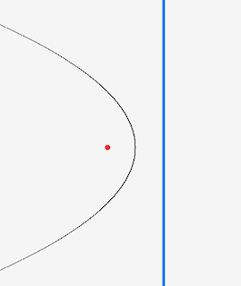

# Generating Voronoi Diagrams using Fortune's Algorithm

## Health warning

This article is about using Fortune's Algorithm to generate Voronoi
Diagrams in O(nlogn) time. If I'd known how hard it would be I
wouldn't have started it. If you are intending to implement it with
the intent to actually use it, rather than as an exercise, I would
recommend not using Fortune's. Unless you are doing a _lot_ of large
diagrams - like multiple large diagrams every second - I'd suggest
looking at an O(n^2) implementation, which I've heard is much easier.
Or even better, using a library. While it was very frustrating at
times, it is a cool looking algorithm when you get it working.

## What is a Voronoi diagram?

A Voronoi diagram is method of partitioning a plane into regions. It
is often used to procedurally generate maps.


You pick a bunch of points on a plane called 'sites', and the
region, or 'cell', corresponding to that site is the area enclosing
every point which is closer to that site than to any other site.

Put another way, the edge of each cell is where it is equidistant to
two sites (top drawing). The 'corners' of the cells, where edges meet, 
are called 'Voronoi Vertices'. These are the points which are 
equidistant from three sites (bottom drawing).


There are a few methods for generating the diagrams. A popular one is
Fortune's Algorithm, and that's the one I'll describe here.

## Fortune's Algorithm

Seen visually, this method creates a line which 'sweeps' from the left
edge of the plane to the right, pixel by pixel - called the
**sweep-line**. When the line encounters a site it creates what looks
like a 'bubble' around it (actually, a parabolic arc). The bubble
grows as the sweep line gets further away. The magic happens when two
arcs from two different sites collide: the point of collision becomes
the edge of the cells, it being equidistant between the two points.
And when two of those _edges_ collide, it creates a corner in the
diagram. The 'frontier' of all the active bubbles is called the
**beachline**, I guess because it sort of looks like a coast?


In reality you don't actually go pixel by pixel. Interesting things
happen at certain points which can be calculated - irritatingly called
**events** - and we just look at those. There's a lot to unpack here,
and we need to do some groundwork before really getting into it.

## Glossary of Terms

There are a few terms that are core to understanding the process. I'll
define them briefly here, but most of them won't make sense until you
understand how they relate to the algorithm. they're just here for
reference so you can come back to them later.

A **site**, sometimes called a seed, is a 2d point. The sites are what
determine the shape of the resulting Voronoi diagram, because the
edges of the cells are equidistant from two sites.

The **sweep line** is the vertical line that sweeps across the region.
As the sweep line passes each event in the event queue, that event is
processed.

The **beach line** is a line comprised of a series of arcs. When an
event is processed, the beach line is affected by either adding or
removing arcs. Each arc corresponds to a site, though each site can
have multiple, or no, arcs on the beachline at any given point in
time.

An **intersection** is a point where two arcs on the beachline meet
eachother. These intersections are also equidistant between the sites
to which the arcs relate.

The **event queue** is where the site and circle events are stored,
ordered by ascending x-coordinate. The algorithm progresses by popping
the next event off the queue, and processing it, until there are none
left. This is a conceptually a priority queue, though isn't implemented
as one here.

A **site event** is one of the two types of event on the event queue,
and the simpler one. It is defined by the coordinates of a
corresponding site. Processing a site event results in a new arc being
added to the beach line. Since the sites are known when you begin the
algorithm, they are added to the queue before the algorithm starts
processing events.

A **circle event** is the other type of event on the queue. It is
defined by the three arcs which sit on the perimeter of the circle.
Apart from the center and radius of the circle, another important
attribute of the circle is the **circle point**, which is the
right-most point of the circle. It's the x-coordinate of this circle
point which determines where it sits in the event queue. Circle points
are not known ahead of time, but are generated as arcs are added to or
removed from the beach line. Processing a circle event results in an
arc being removed from the beach line, and a Voronoi Vertex and two
half edges being created.

A **Voronoi Vertex** is a point equidistant between 3 sites, where
three equiedges meet. They are the corners of the cells of the Voronoi
diagram. They are also the center of the circles of circle events.

An **equiedge** is an line which is equidistant between two sites in
the Voronoi diagram.

An **incomplete edge** is a line which has a fixed point on one side,
but the other side is defined as the intersection of two parabola
focus points. Since the parabola intersections change with the sweep
line, this end of the edge is not fixed. Incomplete edges become
'complete' when the two incomplete edges meet eachother (at a circle
event), and in doing so generate Voronoi Vertices and half edges.

A **half edge** is a part of the Voronoi data structure. It has a
origin point (a Voronoi Vertex) and a 'twin' half edge. Half edges are
generated from the 'completion' of an incomplete edge.

## A Parabolic Tangent

The concept and properties of a parabola are really important to this
algorithm. So we need to be able to represent parabola.[^1] Parabola
are usually defined using an equation `y=ax^2+bx+c` or some slight
variation on that. We use a different, but equivalent formulation
called the 'locus definition'. You can define a parabola using two
things: A 2d coordinate called the **focus point**, and a line called
the **directrix**[^2]. The parabola consists of all points which are
equally distant from the focus point and the directrix. If we restrict
ourselves to a vertical directrix, then the directrix becomes a single
number representing the x-coordinate of the line.


[^1]:<https://en.wikipedia.org/wiki/Parabola>

[^2]:You'll often see this formulated as a 'vertex' and 'focal _length_. I'm not going to go into detail here, but they are almost completely the same. The focus point/directrix method is just a bit more convenient for our purposes.

This how you can calculate the points of the parabola. Derivation is
not going to be covered here, and it's not actually important for the
algorithm. But it's useful for drawing it[^3].

[^3]:This is pseudocode, though a very pythony one

```python
def parabola_x(focus:Vector2, y: int, d: int):
  x = y - focus.y
  x *= x
  x /= focus.x - d
  x += focus.x + d
  x *= 0.5
  return x

def draw_parabola(f:V2, d:int, y0:=0, yn:=HEIGHT, color:=BLACK)
  for y in y0..<yn:
    DrawPixel(parabola_x(f, y, d), y, color)

focus_point = [200,300]
directrix = 300
# The focus point
draw_circle(focus_point, 5, RED)
# The directrix/sweep line
draw_line([directrix, 0], [directrix, H]  5, BLUE)
draw_parabola(focus_point, directrix)
```




Let's tie all this back to the problem: Remember the goal here is to
find the equiedge between two sites - the line that has all points
that are the same distance from both sites. The benefit of defining a
parabola like this is that, if we set the focus points to be our sites
and the directrix to be our sweep line, then:

- every point on the parabola is distance p from the sweep line
- every point on the parabola is _also_ distance p from the site.
- if you have two parabola from different sites, and use the same
  sweep line, the point of intersection of the parabola is equidistant
  from both sites.

So by finding the interections between two parabola you find the
'boundary' edge which is equidistance from both sites[^4].
  
[^4]: the Intersection function I use here is just some not very difficult math which you can get by using the quadratic formula for the two parabola, after converting from the locus definition to the algebraic one


```python
# Coordinates of two sites
site1 = [200, 300]
site2 = [400, 700]

# X coord of sweeplines at progressive points
sweep_lines = [450, 500, 600, 700, 800, 900]
# Intersection fn takes 2 sites and a sweep line, returns
# intersections.
start, _ = intersection(site1, site2, sweep_lines[0])
end, _ = intersection(site1, site2, sweep_lines[len(sweep_lines)-1])

draw_circle(site1, 5, RED)
draw_circle(site2, 5, RED)

for s in sweep_lines:
  draw_parabola(site1, s, color=GREEN)
  draw_parabola(site2, s, color=BLUE)

draw_line(start, end, 5, ORANGE)
```


This is math magic, I love it.

## Back to the Beachline

The beachline is like the 'frontier' of all the arcs at a given point
in the sweep line. The first takeaway from this is that, since the
sweep line is going to be the same for all arcs, we can represent an
arc just by its focus point (i.e. the site). And since the focus
points are our sites, every 'arc' on the beachline is just the 2d
coordinate of one of our sites. The second takeaway is that we can
represent the frontier line as a simple sequence of points[^5]. So in
the following, the beachline is arc 1 and arc 2. Or, `[arc1,arc2]`

[^5]: I'm just going to represent it as a vector, which does make a few things inefficient. A binary tree would be better. But this is fine for small implementations
    


And here it's `[arc1, arc2, arc3]`


There are a few nuances though. Look at this one, where there are
three arcs: 1, 2, and 3. A full description of the frontier needs to
reflect that 2 separate parts of arc1 are on the frontier, with the
middle bit being covered by 3.


It's actually easy to handle this: just put it in the beachline twice: 
`[arc1, arc3, arc1, arc2]`

A final scenario I'll mention, because it turns out to be important,
is that it's totally possible to have a beachline where the same three
arcs appear together but in a _different order_. Like you might have
the sequence `[i,j,k]`, and then later `[k,j,i]`. Triples of arcs on
the beachline are important for reasons that will become clear. Each
_ordered triple_ will be unique in the beachline. So you can't have
`[i,j,k]` twice.


For each pair of arcs in the beachline we calculate the intersection,
and by drawing the arcs between the intersection, we sketch the
beachline.

```python
def draw_beachline(beachline:[V2], d:int)
  y = 0
  for i in 0..<len(beachline)-1
    p1, _ = intersection(beachline[i], beachline[i+1], d)
    draw_parabola(beachline[i], d, y, p1.y)
    y = p1.y
  draw_parabola(beachline[len(beachline)-1], d, y, H)

site1 = [200, 300]
site2 = [400, 700]
site3 = [450, H/3]

sweep = 500
beach_line = [site1, site3, site1, site2]

draw_circle(site1, 5, RED)
draw_circle(site2, 5, RED)
draw_circle(site3, 5, RED)
draw_line([sweep, 0], [sweep, H],  5, BLUE)
draw_beachline(beach_line, sweep)
```


## New arcs are created when the sweep line hits a new site

So that's the beachline: just a sequence of points, where each point 
represents both a site and an arc.  Next we should talk about how 
things get
added to and removed from the beachline. I mentioned at the beginning
that interesting stuff happens at some special points on the sweep
line. The first of these is when the sweep line hits a new site. This
creates a new arc, and inserts it into the sequence, 'splitting' the
old arc in two. Inserts where? You need to find the arc which, if you
draw a line left from the new site, you hit. That's the arc that gets
split. It's easier to see it in a picture.


```python
def add_site(beachline:[V2], site:V2):
  if len(beachline) == 0:
    append(beachline, site)
    return

  sweep = site.x
  insert_after = 0
  for i in 0..<len(beachline)-1:
    b, _ := intersection(beachline[i], beachline[i+1], sweep)
    if b.y > site.y:
      insert_after = i
      break
  inject_at(beachline, insert_after+1, site)
  inject_at(beachline, insert_after+2, beachline[insert_after])

site1 = [200, 300]
site2 = [400, 700]
site3 = [450, 280]

beach_line : []
add_site(beach_line, site1)
add_site(beach_line, site2)
add_site(beach_line, site3)

print(beach_line)
## =>
[[200, 300], [450, 280], [200, 300], [400, 700], [200, 300]]
#  site1       site3        site1       site2       site1
```

As you can see from this, we add sites to the beach line from left to
right by the x-coordinate. Since we know the sites from the beginning,
we can put them in a queue and 'pop' them off off one at a time.
That's why in the literature they're called **site events**, though I
don't like that much.

Here's what the beachline looks like after processing these three
sites events in order:


## Intersecting edges and Circumcircles

After we've processed the sites and draw the the beachline we see
something like this[^6].

[^6]: I added an orange line which shows the equiedge between the respective sites


All good. If we carry on though, and draw the beachline with the sweep
line a bit further on, we run into a problem.


We went too far! If I dial that line back a bit, you can see what is
happening - or about to happen - more clearly:


Depending on how you look at it, 3 things are happening:

1. The orange lines are intersecting
2. The middle arc is being squeezed out of existance
3. The intersection points of two pairs of arcs on the beachline are
   colliding

So when we get to that point we need to remove the middle arc from the
beachline. This 'arc squeezing' point is the second type of point we
need to deal with, but its a bit more complicated than the sites. So
lets look at what's happening in more detail.

Way back at the start I said the edges of the Voronoi were where two
points were equidistant, and the 'corners' of the cells where the
edges meet are the points which are equidistant from 3 or more sites.
If you eyeball it in the above picture, you can see that it looks like
the where the lines intersect is about in the middle of the three
points.

We can be a bit more precise than that. What we're saying
mathematically is that, if we draw a circle where the 3 sites all sit
on the radius, the center of the circle will be equidistant from all 3
points, and by the above definition will be where the edges of the
Voronoi intersect. A circle which puts a set of given points on its
circumference is called a _circumcircle_ (and it's center is a
circumcenter)[^7]. If we plug the numbers in and draw the circle we
get this:

[^7]: <https://en.wikipedia.org/wiki/Circumcircle>. The math for calculating the center and radius of the circle can be taken straight from here.


Which is spot on. And this is the really important point, because this
is where we finally _have a Voronoi Vertex_, which is the whole point
of this exercise. When we reach the Voronoi Vertex, defined by the
three arcs on the beachline `[..,i,j,k,..]`, the center arc _j_ gets
_removed_ from the beachline, so the beachline looks like
`[..,i,k,..]`. So now we have a new boundary between arcs _i_ and _k_,
where none existed before. You can see how this looks in the diagram:
there's a new equiedge coming out of the Voronoi Vertex we created,
which is between sites _i_ and _k_


But we're not out of the woods yet. We know we we need to process each
site (i.e. add a new arc) in order from left to right. And that when
we find an intersection, we need to process that intersection (remove
the arc from the beachline, record a Voronoi vertex.) But when in the
sequence of points can we do that? You might think, as soon as we know
those 3 points, we can calculate the circle and therefore the
intersection. But that won't work. To see why, consider the following
scenario. The first picture is the same scenario we saw before, and
you might think you can go ahead and assume that the edges will
converge. But wait! There is _another site_, and the sweep line hits
it before the edges converge, breaking up the arc before it reaches
the intersection point.


The important thing is that the new site is _inside the circle_. And
that is the answer to the question: You process the edge intersection
when the sweepline leaves the circle without having encountered any
sites inside the circle. The point where the sweepline leaves the
circle is the right-most point of the circle - called the **circle point**.


Until now we've been sequentially processing _site events_. Now we
need to add this second type of event, called a **circle event** for
obvious reasons. Every time we change the beachline, we need to check
for new circle events, and check existing circle events to see if they
are still valid. This is probably the hardest concept in the algorithm
to grok, so I'm going to spend some time on it, before talking about
what happens when our sweepline passes a circle point.

Say you have a beachline containing the three arcs `[..,i,j,k,..]`.
Because arcs are references to sites (remember, an 'arc' in our
datamodel is just a 2d point, with each 2d point being a site.) _i,j_
and _k_ in addition to being arcs are also sites. The significance of
them being next to eachother in the beachline is that the equiedges
between i and j, and j and k, _could_ intercept at the center of the
circumcircle they describe, becoming a Voronoi Vertex. This is what a
circle event really is: A reference to a triple of arcs on the
beachline (not _every_ triple on the beachline, but we'll park that
for now).

If there is a change to the beachline affecting that triple before
those lines intersect, then there is no intersection. When I say
'change', I mean either a new arc added to the beachline by a site
parameter or one has been removed. In the case of an addition, the
beachline becomes `[..,i,j,L,j,k,..]`. The triple _i,j,k_ has gone -
and so has any circle event associated with it. And there are two new
triples _i,j,L_ and _L,j,k_. So we need to check both of those to see
if they create generate circle events. That's what happened in the
following picture: the arc which is being 'squeezed' is actually being
split by the arc created by the new site before the squeeze happens.


## Incomplete edges

A couple of sections ago I started adding those orange lines to the
diagram to indicate the equiedges, but I didn't talk about what they
were exactly. They ultimately become the (half) edges of the Voronoi.
But they start out as **incomplete edges**. These are edges where one
end is a fixed point, but the other is the intersection of two arcs.
That intersection isn't a fixed point, but changes depending on
where the sweep line is. Hence why it's incomplete: because one of the
ends isn't fixed yet.

We create two new incomplete edges whenever we put a new arc on the
beachline. The fixed point of both is the coordinate where the new arc
intersected the old one. And the arc-intersection are the two
intersections between the new arc and the one that it splits. If the
new arc is _j_ and the old one is _i_, the arc-intersections are
`[i,j]` and `[j,i]`.

```python
## From the process_site_event function
new_arc = # the new site event we're processing
old_arc = # the old arc which is being split

fix = [calc_x(old_arc, new_arc.y, new_arc.x), new_arc.y]
incomplete_edges[PointPair{old_arc, new_arc}] = fix
incomplete_edges[PointPair{new_arc, old_arc}] = fix
```

In these pictures, I've put one of the incomplete edges in orange, and
the other in blue, to make it clear there are two. You can see how the
'center' stays in the same place, but the other side changes with the
sweep line.


When two incomplete edges collide (during a circle event), the point
of collision becomes a Voronoi Vertex, and the incomplete edges turn
into half edges. Also a new incomplete edge is created where the fixed
point is the Voronoi Vertex.

```python
## From the process_circle_event function
mid_arc = # the arc that is getting squeezed
up_arc  = # the arc that above it in the beachline
down_arc  = # the arc that below it in the beachline
add_vertex(vd, center_of_circle)

fix1 = incomplete_edges[PointPair{up_arc, mid_arc}]
add_half_edge(vd, center, fix1)

fix2 = incomplete_edges[PointPair{mid_arc, down_arc}]
add_half_edge(vd, center, fix2)

# The new incomplete represents the new intersection
ft.incomplete_edges[PointPair{up_arc, down_arc}] = center
```

In these pictures, you can see the incomplete edges 'completing' into
half edges (colored black), and the new incomplete edges coming out of
the intersection point.


## Only counterclockwise circles create circle events

Look at this example. We've just processed the site k, and we have a
beachline `[i,j,k,j,i]`. We have the new potential circle events `ijk`
and `kji`. One of them is a circle event. One of them is _not_ a
circle event. Scanning it visually, it's pretty obvious: The arcs at
the top half of the picture, `ijk`, will never have the middle arc
squeezed, because the lines are diverging. The arcs at the bottom half
of the picture, `kji`, clearly are going to converge, at the center of
the circle. So `kji` does create a circle event, but `ijk` will not.


While it's easy to see this visually, determining it programatically
is less intuitive. The trick is to realise that, when you read off the
points of the circle as `ijk`, they are going _clockwise_ around the
circle. And if you read them as `kji`, they are going
counterclockwise. And this is test you need to apply. You can do this
by finding the determinant of the points[^8]. A negative determinant
means a counterclockwise orientation (and so a circle event). A
positive one means a clockwise one (and so no circle event). A
determinant of zero means the points are in a straight line (no
circle!)

[^8]:<https://en.wikipedia.org/wiki/Curve_orientation>


## Summary

OK, so we have everything we need to do the algorithm now. To
summarize the whole thing:

- Given a set of sites put all the site point in a queue, as 'site'
  events, ordered by the x-value.
- While the queue is not empty, pop the next event off the queue.
- If the popped event is a site-type, do the following:
  - Go through all circle events that are ahead of it in the queue,
    and determine if this site is inside the circle. If so, remove
    that circle event from the queue.
  - Find the arc directly across from the site. Let that be _j_ in the
    beachline `[..,i,j,k,..]`
  - insert the arc defined by that point (_L_) into the beachline
    'splitting' j, so it becomes `[..,i,j,L,j,k,..]`.
  - add two imcomplete edges, both with the fixed point at the point
    the new arc intersected the beachline, and the arc-intersections
    of the split arc vs. new arc, and new arc vs. split arc.
  - Check the new triples _i,j,L_ and _L,j,k_ to see if they form new
    circle events, and if so insert them in the event queue.
- If the popped event is a circle-type do the following
  - Find the center of the circle, and add it as a vertex to the
    Voronoi diagram.
  - Find the arc that is being squeezed out of existance, let it be
    _j_ in `[..,h,i,j,k,l,..]`
  - Go through all circle events that are ahead of it, and check if
    the removed arc invalidates the event.
  - remove it from the beachline, leaving `[..,h,i,k,l,..]`.
  - Check the new triples _h,i,k_ and _i,k,l_ to see if they form new
    circle events, and if so insert them in the event queue.
- When the queue is empty, go through all remaining incomplete edges,
  and if they are within the bounds of the diagram, extend them to the
  diagram side, creating Voronoi Vertices at the point the hit the side

## Implementing Fortune's Algorithm

### Datastructure

A bit of housekeeping: a `V2` is a `[2]int`. A `PointPair` is a pair
of `V2`s, i.e. a `[2][2]int`.

An Event is a struct of `{site:bool, a,b,c:V2}`. The boolean indicates
what type of event it is: a site (true) or circle (false). The three
`V2`s have different semantics depending on the event. If it's a site,
then `a` is just the coordinates of the site, and the other two are
unused. If it's a circle, then the three V2's are the arcs in the
beachline that generated the event. Or put another way, the three
sites that site on the perimeter of the the circle.

For the algorithm itself, we need to store the following things:

- The `queue` is an array of Events. Technically it's better to have
  this as a priority queue, but it's not
  really important to the implementation of the algorithm.
- The `beachline` is an array of `V2`s. Again, for efficiency you 
  this implement this as a binary tree.
- `incomplete_edges` is a dictionary/map of `PointPair->V2`

### The algorithm

This is the code, written in the wonderful C alternative
[Odin](https://odin-lang.org). The comments should hopefully explain
what is being done and why where it's not clear from the code[^9].

[^9]:There are a couple of other namespaces, mainly the detail of the math. These are in the code repo at <https://github.com/RedPenguin101/voronoi>

```odin
package voronoi
import "core:math"
import "core:log"

/* Events can be site or circle events. site events are defined by a
   single point, stored in a circle event are defined as the three
   site points which define them. They are stored in a,b and c
   respectively */

Event :: struct {site:bool, a,b,c:V2}

event_x_coord :: proc(e:Event) -> int {
    if e.site do return e.a.x
    else {
        _,_,cp := circle_point(e.a,e.b,e.c)
        return cp.x
    }
}

event_y_coord :: proc(e:Event) -> int {
    if e.site do return e.a.y
    else {
        _,_,cp := circle_point(e.a,e.b,e.c)
        return cp.y
    }
}

PointPair :: [2]V2

/* An "Incomplete Edge" is an edge between a point (which doesn't
   change) and the intersection of two parabola defined by two focus
   points (which does change, with the directrix). These will
   ultimately become the half-edges of the DCEL, when two such
   intersections meet.

   The meaning of the fixed point - which I'll call the reference - is
   different depending on what created it. The pair of incomplete
   edges created by a site event start at the point at which the site
   arc intersected the beachline. So it's sort of like the midpoint of
   the edge (though not literally in the middle). If it's created by a
   circle event, the fixed point is the vertex in the VD which was
   created by that circle event. */

Fortune :: struct {
    beachline:[dynamic]V2,
    queue:[dynamic]Event,
    incomplete_edges:map[PointPair]V2,
    vd:DCEL,
}

add_site_event :: proc(q:^[dynamic]Event, v:V2) -> int {
    return add_event_ordered(q, Event{true, v, {},{}})
}

add_circle_event :: proc(q:^[dynamic]Event, a,b,c:V2) -> int {
    return add_event_ordered(q, Event{false, a,b,c})
}

add_event_ordered :: proc(queue:^[dynamic]Event, ev:Event) -> int {
    // inserts an event into the queue by it's x value
    if len(queue) == 0 {
        append(queue, ev)
        return 0
    }

    this_x := event_x_coord(ev)

    for i in 0..<len(queue) {
        other := queue[i]
        other_x := event_x_coord(other)
        if this_x == other_x {
            this_y := event_y_coord(ev)
            other_y := event_y_coord(other)
            if this_y == other_y {
                // We just ignore this duplicated event
                return i
            } else if this_y < other_y {
                inject_at(queue, i, ev)
                return i
            }
        }
        else if this_x < other_x {
            inject_at(queue, i, ev)
            return i
        }
    }
    append(queue, ev)
    return len(queue)-1
}

initialise_fortune :: proc(f:^Fortune, sites:[]V2) {
    clear(&f.beachline)
    clear(&f.queue)
    clear(&f.incomplete_edges)
    clear_vd(&f.vd)
    for site in sites do add_site_event(&f.queue, site)
}

process_site_event :: proc(ft:^Fortune, e:Event) -> int {
    site := e.a
    /* We need to check if this site is within the radius of any
    upcoming circle events, because this will cause them to be
    cancelled (a 'false alarm'). */

    i:=0
    for i < len(ft.queue) {
        cev := ft.queue[i]
        if !cev.site {
            ctr, r, cp := circle_point(cev.a, cev.b, cev.c)
            /* Adding 1 makes it a bit more conservative */
            test := f32(r)+1.1
            ed := euclid_distance(ctr, site)
            if ed < test {
                ordered_remove(&ft.queue, i)
                i -= 1
            }
        }
        i += 1
    }

    /* Trivial case of an empty beachline - just add it  */

    if len(ft.beachline) == 0 {
        append(&ft.beachline, site)
        return 0
    }

    /* Walk the beachline from top to bottom, for each arc checking
    the y coordinate of the intersection with the following arc to see
    if it's greater than our site y. The first arc that meets this
    condition is the one which our new site will split. I set
    insert_after as len-1, so it'll insert at the end if there is
    none.*/

    d := site.x
    insert_after := len(ft.beachline)-1
    for i in 0..<len(ft.beachline)-1 {
        b, _, _ := intersection(ft.beachline[i], ft.beachline[i+1], d)
        if b.y > site.y {
            insert_after = i
            break
        }
    }

    /* The site is inserted into the beachline, and a copy of the arc
    is inserted after that. This has the effect of 'splitting' the
    arc, so if the beachline is abCde, where C is intersected arc,
    after this operation it will be acCSCde, where S is the new site
    we're adding. This creates two new intersections: Between CS and
    SC */

    arc := ft.beachline[insert_after]
    inject_at(&ft.beachline, insert_after+1, site)

    /* We have to handle the special case where the arc and site have
    the same x coordindate, and therefore have only one intersection*/

    same_x := arc.x == site.x

    if !same_x do inject_at(&ft.beachline, insert_after+2, arc)

    /* Calculate the point at which a horizontal line from the new
    site intersects the arc. This becomes the reference point for two
    incomplete edges, one for each of the new intersections we
    created. by inserting the new arc into the beachline.*/

    ref := V2{calc_x(arc, site.y, site.x), site.y}

    /* Once more, we need to handle the special case of equal xs. We
    create the reference point off-map so it will be properly cleaned up*/

    if same_x do ref = {-1, (site.y+arc.y)/2}

    if !same_x {
        ft.incomplete_edges[PointPair{site, arc}] = ref
    }
    ft.incomplete_edges[PointPair{arc, site}] = ref

    /* Check the new arc against the two arcs above it and below it in
    the beachline to see if there are any new circle events we need to
    add to the queue */

    new_arc_idx := insert_after+1
    if new_arc_idx >=2 do new_circle_event(ft, new_arc_idx-2)
    if new_arc_idx <= len(ft.beachline)-3 do new_circle_event(ft, new_arc_idx)


    return new_arc_idx
}

circle_point :: proc(a,b,c:V2) -> (center:V2, radius:int, circle_point:V2) {
    /* Given three points, calculate the circumcircle which passes
    through all three points. It returns the center and radius of the
    circle, as well as the circle-point, that being the right-most
    point of the circle.

    https://en.wikipedia.org/wiki/Circumcircle
    */

    /* normalize on a */
    b := b-a
    c := c-a
    D := f32(2*(b.x*c.y-b.y*c.x))

    u:V2f
    u.x = f32(c.y*(b.x*b.x+b.y*b.y)-b.y*(c.x*c.x+c.y*c.y))
    u.x /= D
    u.y = f32(b.x*(c.x*c.x+c.y*c.y)-c.x*(b.x*b.x+b.y*b.y))
    u.y /= D

    r := math.sqrt(u.x*u.x + u.y*u.y)
    ui := V2f_to_i(u)+a
    return ui, int(r), ui+V2{int(r), 0}
}

new_circle_event :: proc(ft:^Fortune, start_at:int) -> int {
    assert(start_at >= 0)
    assert(len(ft.beachline) > start_at+2)

    /* A circle event is created if three sites in a beachline sit on
    counterclockwise circle, which is what taking the determinant
    checks. Basically, if the points i,j,k are counterclockwise, the
    lines defined by equipoints of i,j and j,k will converge, and if
    they are clockwise (or they sit on a straight line, with a
    determinant of zero), they won't.

    It's important to check this, because consider the beachline
    ijkji. Both ijk and kji will form a circle, but only one will be
    valid.*/

    h:=ft.beachline[start_at]
    j:=ft.beachline[start_at+1]
    k:=ft.beachline[start_at+2]
    det := (j.x-h.x)*(k.y-h.y)-(j.y-h.y)*(k.x-h.x)
    if det < 0 {
        return add_circle_event(&ft.queue, h,j,k)
    }
    return -1
}

process_circle_event :: proc(ft:^Fortune, e:Event) -> int {
    assert(!e.site)
    center, r, cp := circle_point(e.a, e.b, e.c)

    /* As with the site event, we iterate through the beachline to
    find the appropriate arc to select for removal. In this case, the
    arc to remove is the middle one of the three points which describe
    the circle event. So we can just iterate through the beachline
    checking for that sequence.*/

    rmv := len(ft.beachline)-1
    for i in 0..<len(ft.beachline)-2 {
        h := ft.beachline[i]
        j := ft.beachline[i+1]
        k := ft.beachline[i+2]

        if h == e.a && j == e.b && k == e.c {
            rmv = i+1
            break
        }
    }

    if rmv < 1 || rmv >= len(ft.beachline)-1 {
        return rmv
    }

    mid_arc  := ft.beachline[rmv]
    up_arc   := ft.beachline[rmv-1]
    down_arc := ft.beachline[rmv+1]

    /* When two arcs (the up and down arcs) squeeze a third arc (the
    middle arc), the point at which they meet becomes a vertex in the
    VD.

    It also causes the incomplete edge which we are tracking between
    up and mid, and mid and center, to crystalize into the half edges.
    */

    add_vertex(&ft.vd, center)

    ref1 := ft.incomplete_edges[PointPair{up_arc, mid_arc}]
    delete_key(&ft.incomplete_edges, PointPair{up_arc, mid_arc})
    add_half_edge(&ft.vd, center, ref1)
    delete_key(&ft.incomplete_edges, PointPair{up_arc, mid_arc})

    ref2 := ft.incomplete_edges[PointPair{mid_arc, down_arc}]
    add_half_edge(&ft.vd, center, ref2)
    delete_key(&ft.incomplete_edges, PointPair{mid_arc, down_arc})

    /* A new incomplete edge is created between the up and down arcs,
    with the reference point being the center of the circle (i.e.
    where the three arcs intersected)

    We need to handle the special case that the site IS the circle
    point. This indicates that point the site hits the beachline is at
    the exact meeting point of two arcs */

    ref3 := center
    midpoint := (up_arc+down_arc)/2
    if center == ref1 || center == ref2 {
        ref3 = midpoint
    }
    if midpoint == ref1 || midpoint == ref2 {
        // Very unlucky
        ref3 += {1,1}
    }
    add_half_edge(&ft.vd, center, ref3)
    ft.incomplete_edges[PointPair{up_arc, down_arc}] = ref3

    /* we remove the arc from the beachline */

    /* Collapsing the arc can invalidate future events which have that
    arc as part of it. Here we check every future event to see if it's
    now invalid. This is very inefficient, there should be faster way
    to do this */
    // TODO Find a more efficient way to do this

    i := 0
    r0 := ft.beachline[rmv-1]
    r1 := ft.beachline[rmv]
    r2 := ft.beachline[rmv+1]
    for i < len(ft.queue) {
        ev := ft.queue[i]
        if !ev.site {
            if ev.b == r0 && ev.c == r1 || ev.a == r1 && ev.b == r2 {
                ordered_remove(&ft.queue, i)
                i -= 1
            }
        }
        i += 1
    }

    ordered_remove(&ft.beachline, rmv)

    /* Collapsing the arc has possibly created a new circle event. If
    the beachline as abCde before, and we removed C, we need to check
    abd, and bde for new circle events. Since we removed C, the
    'to_remove' index (i) is now pointed at d, so that means checking
    i-2, i-1, i for the up direction, and i-1, i, i+1 in the down
    direction. */

    if rmv >=2 do new_circle_event(ft, rmv-2)
    if rmv >= 1 && rmv <= len(ft.beachline)-2 do new_circle_event(ft, rmv-1)

    return rmv
}

clean_beachline_edges :: proc(ft:^Fortune, d:int) {
    /* As the sweepline advances, the arcs on each end of the can
    become overtaken by those further toward the middle. If the bottom
    of the beachline ends with arcs ijk, if the midpoint of jk is no
    longer in bounds of the digram, it's pruned off.*/

    l := len(ft.beachline)
    /* A beachline of length 0 or 1 has nothing to prune */
    if l < 2 do return

    mp : V2
    mp = (ft.beachline[0]+ft.beachline[1])/2
    b, _, sols := intersection(ft.beachline[0], ft.beachline[1], d)
    if b.y < 0 {
        _,vv,_ := line_rectangle_intersection(mp, b)
        ordered_remove(&ft.beachline, 0)
        l -= 1
    }

    if l < 2 do return
    mp = (ft.beachline[l-1]+ft.beachline[l-2])/2
    _, b, sols = intersection(ft.beachline[l-1], ft.beachline[l-2], d)
    if sols == 2 && b.y > H {
        _,vv,_ := line_rectangle_intersection(mp, b)
        ordered_remove(&ft.beachline, l-1)
    }
}

calc_vd :: proc(sites:[]V2, ft:^Fortune, max_x:=W) {
    initialise_fortune(ft, sites)

    /* While there are events in the queue, process them. */

    final_x := 0
    for len(ft.queue) > 0 {
        ev := ft.queue[0]
        final_x = event_x_coord(ev)
        if max_x != -1 && event_x_coord(ev) > max_x do return
        ordered_remove(&ft.queue, 0)
        clean_beachline_edges(ft, event_x_coord(ev))
        if ev.site do process_site_event(ft, ev)
        else do process_circle_event(ft, ev)
    }

    clear(&ft.beachline)

    /* For any incomplete edges that remain, calculate where they
    intersect the diagram side and create edges at those points. */

    for is, ref in ft.incomplete_edges {
        if inbounds(ref) {
            p , _,_ := intersection(is.x, is.y, max(W*2, final_x*2))
            _,le,_ := line_rectangle_intersection(ref,p)
            add_half_edge(&ft.vd, le, ref)
            add_vertex(&ft.vd, le)
        }
        delete_key(&ft.incomplete_edges, is)
    }

    complete_vd(&ft.vd)
}
```

## Thing I haven't talked about

One of the difficulties implementing this algorithm is that there's lots
of fiddly edge cases to consider. I'm not going to go into all the ones I 
found, because they are quite tedious. And there are probably many that I 
missed.

Another topic I haven't covered is the datastructure for a Voronoi: The 
Doubly Connected Edge List or **DCEL**. There's a bit at the end about them, but they
are neither very interesting nor core to the algorithm.

There is one procedure I didn't talk about in the algorithm called 'cleaning the 
beachline', which just looks at two ends of the beachline and prunes off any uneccessary 
arcs.

Finally, that last step - what to do after the queue is empty - I haven't
gone into detail about. It involves a bit of simple math to go through all 
the incomplete edges, untwinned half edges, and vertices and just tidy them
up a bit. Again, not very interesting. 

## Sources

- <https://en.wikipedia.org/wiki/Voronoi_diagram>
- <https://mathworld.wolfram.com/VoronoiDiagram.html>
- <http://www-cs-students.stanford.edu/~amitp/game-programming/polygon-map-generation/>
- <https://en.wikipedia.org/wiki/Fortune's_algorithm>
- <https://en.wikipedia.org/wiki/Lloyd's_algorithm>
- <https://www.cs.tufts.edu/comp/163/demos/fortune/>
- <https://www.cs.umd.edu/class/spring2020/cmsc754/Lects/lect10-dcel.pdf>
- <https://en.wikipedia.org/wiki/Doubly_connected_edge_list>
- <https://pvigier.github.io/2018/11/18/fortune-algorithm-details.html>
- <https://jacquesheunis.com/post/fortunes-algorithm/>
- <https://jacquesheunis.com/post/fortunes-algorithm-implementation/>
- <http://amsi.org.au/ESA_Senior_Years/SeniorTopic2/2a/2a_2content_10.html>

## Data structure for describing Voronoi Diagrams

Voronois are usually stored in a doubly-connected-edge-list (DCEL).
This data structure describes a 'web' of vertices and edges between
those vertices (called a cell-complex, which is what a Voronoi
technically is) in a way that's easy to manipulate and transform.

DCEL is a primarily edge-based representation, but it also stores the
vertex and face information. Edges in a cell-complex are undirected,
but in a DCEL each edge is stored as two directed 'half edges', one in
each direction. In the case of the Voronoi diagram, the stored
vertices are _not_ the sites, but the Voronoi vertices. The structure
is like this:

```
DCEL:
 Edge[]:
    twin, next, previous:^Edge, 
    origin:^Vertex 
    left:^Face
 Vertex[]: 
    ID:int, 
    Coord:V2, 
    incident:^Edge
 Face[]:
    incident:^Edge
```

The 'twin' of the edge going from vertex A to B is the vertex going
from B to A. If we store the origin of the edge, we can get to the
destination by `E.twin.origin`. And similarly, we store the left face,
but to get to the right face we do `E.twin.left`. The edge pointer on
the vertex can be to any edge which has this vertex as its origin.


