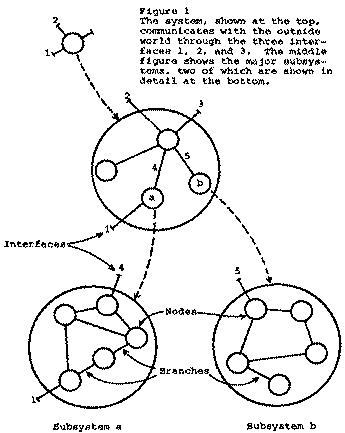

% A page to test CSS Styles

# The first section
Some writing

> With a block quote

## A subheading
Some more writing

* an unordered
* bullet
* list

Some more writing [^1]

[^1]: With a footnote

> Another Block Quote[^2]

[^2]: With a footnote from the blockquote

1. An ordered
2. Bullet
3. List

```clojure
(defn my-fn [a b c]
  (other-fn a b c))

(my-fn 1 2 3) => "it worked"

0 <= 2
```


